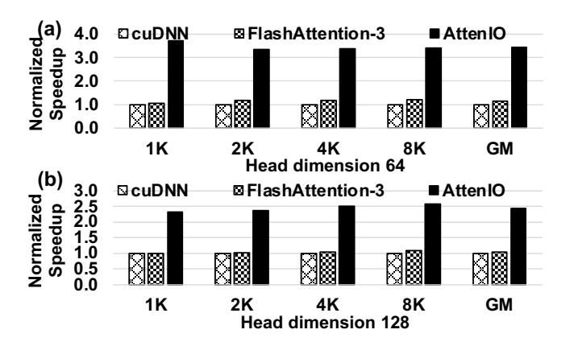

# 6.7 Area and Power

In AttenIO, the area and power breakdown is summarized in Table [3.](#page-12-1) The total area of AttenIO is 3.72 mm2 , with the PE array occupying the dominant fraction of the chip area.

**Figure 17.** Performance comparison of AttenIO against SOTA GPU implementations.

Table 3. Area and Power of AttenIO.

| Components    | Area (mm²) | Power (mW) |
|---------------|------------|------------|
| PE Array      | 2.44       | 2583.92    |
| EXP Unit      | 0.48       | 485.84     |
| KV Buffer     | 0.01       | 0.65       |
| On-Chip Cache | 0.79       | 162.52     |
| Total         | 3.72       | 3232.93    |

Specifically, the PE array accounts for 65.6% of the total area. In terms of power consumption, AttenIO consumes a total of 3232.93 mW under the evaluated configuration.

### 7 Related Works

During the prefilling phase of LLM inference, the computational complexity of attention scales quadratically with input sequence length. To accelerate attention, several hardware accelerators [23, 24, 39, 44, 57, 63, 64, 64, 71, 78, 80] accelerate attention by exploiting dynamic sparsity. A3 [23] applies coarse-grained structured sparsity using a ranking mechanism to identify important tokens. SpAtten [71] dynamically prunes attention heads and tokens during execution based on cumulative token and head importance scores, introducing a structured sparsity pattern. ELSA [24] avoids unnecessary computations by approximating the angular similarity between key and query vectors through low-bit quantization and similarity prediction. Sanger [44] quantizes key and query vectors, mapping the score matrix into a sparse representation by zeroing out insignificant scores. DOTA [57] introduces a lightweight detector based on low-rank transformations to identify weak attention connections. These works exploit approximate sparsity to reduce computation and data movement, making them suitable for scenarios tolerant to approximate results. AttenIO, in contrast, targets exact attention acceleration, explicitly addressing the I/O bottleneck without sacrificing quality during LLM serving.

A complementary line of work focuses on accelerating exact attention through improved mapping of computations to

compute resources. FuseMax [50] reinterprets FlashAttention-2 using the *einsum* abstraction and maps it onto spatial arrays to improve computational efficiency. While FuseMax enhances computation utilization, its tiling and scheduling follow those of FlashAttention-2, and thus its I/O behavior remains unchanged. In contrast, AttenIO derives a new I/O-optimal dataflow through systematic I/O analysis, reducing data movement beyond FlashAttention-2. Moreover, the I/O analysis and I/O-driven optimizations in AttenIO complement GPUs [53] and PIM architectures [26, 28, 51, 79].

### 8 Discussion

Throughout this work, our I/O analysis is grounded in the Red-Blue Pebble Game model [31], which captures data movement between a two-level memory hierarchy consisting of a small-and-fast memory and a large-and-slow memory. In this setting, the I/O cost corresponds to load and store operations between these two memory levels, commonly referred to as *vertical I/O*. This abstraction directly aligns with modern accelerator and GPU systems, where a limited-capacity on-chip SRAM serves as the fast memory, and off-chip HBM or DRAM serves as the slow memory. For example, an NVIDIA A100 GPU integrates 40-80 GB of HBM and 192 KB of on-chip SRAM per streaming multiprocessor across 108 SMs [30]. Data movement across this boundary is widely recognized as the primary performance bottleneck in data-intensive and AI workloads, including long-sequence attention [14].

While our analysis focuses on a two-level memory hierarchy, the underlying I/O analysis can be extended to deeper memory hierarchies. In principle, multi-level memory systems can be analyzed recursively in a manner analogous to performance models such as Average Memory Access Time (AMAT) [27] and Concurrent-AMAT (C-AMAT) [66], by applying the I/O analysis layer by layer and treating each adjacent pair of memory levels as a small-and-fast versus large-and-slow hierarchy. Exploring such multi-level extensions in detail is beyond the scope of this paper and is left for future work.

Moreover, the Red-Blue Pebble Game model can also be applied to *horizontal I/O*. In distributed machines with limited memory per node, such transfers correspond to communication operations between nodes [35]. Our analysis can be naturally extended to incorporate horizontal I/O, which represents an important direction for future work as attention workloads increasingly scale across multiple accelerators.

### 9 Conclusions

Given that I/O is a key performance bottleneck in modern accelerators and that long-sequence self-attention incurs particularly high I/O overhead, we propose AttenIO, an accelerator for long-sequence self-attention based on a systematic I/O analysis. AttenIO minimizes I/O operations through

an I/O-optimal dataflow, reduces stalls via communicationcomputation overlapping, and executes softmax using parallel patterns. Comprehensive evaluations show that AttenIO outperforms existing solutions, underscoring that systematic I/O analysis provides a powerful foundation for accelerating long-sequence attention. We believe AttenIO serves as a compelling case study of how hardware-aware I/O analysis can guide the optimization of high-performance systems. Moreover, the I/O analysis-driven optimizations introduced in this study are generalizable and can be extended to other data-intensive applications.

