# Mugi: Value Level Parallelism For Efficient LLMs

#### Daniel Price

daniel.price@ucf.edu University of Central Florida Carnegie Mellon University Department of ECE Orlando, FL, USA

### Prabhu Vellaisamy

pvellais@andrew.cmu.edu Department of ECE Pittsburgh, PA, USA

### John P. Shen

jpshen@cmu.edu Carnegie Mellon University Department of ECE Pittsburgh, PA, USA

#### Di Wu

di.wu@ucf.edu University of Central Florida Department of ECE Orlando, FL, USA

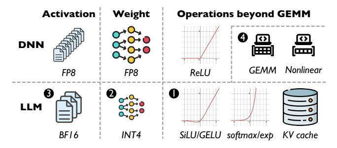

**Figure 1.** Challenges for LLM inference using VLP.

'26), March 22-26, 2026, Pittsburgh, PA, USA. ACM, New York, NY,

USA, 19 pages. https://doi.org/10.1145/3779212.3790189

### Introduction

Modern artificial intelligence (AI) has been betting on deep neural networks (DNNs) for over a decade [35]. A great deal of software and hardware research has been dedicated to improving the efficiency of GEMM, as it accounts for over 90% of the total runtime [31]. A key insight from this body of work is that low numerical precision gives good efficiency and accuracy. Previous research has proposed and applied narrower data formats symmetrically to the activations and weights of GEMM, e.g. BF16 [32], DLFloat16 [2], CBFloat [51], FP8 [41]. For offline workloads that process large-batch, lowprecision data, value level parallelism (VLP) can potentially improve performance and efficiency by avoiding redundant computations, as shown by a Carat design [46], with details given in Section 2.1.

**Challenges.** Recent AI advancements have given rise to generative AI workloads, e.g., transformer-based large language models (LLMs) [64]. LLMs exhibit complicated operations beyond activation-weight GEMM, for which VLP is designed. Naturally, a research question is raised: can VLP address diverse LLM operations? Figure 1 highlights the challenges.

• First, prior VLP architectures do not support LLM nonlinear operations, such as such as SiLU [17], Swish [56], GELU [25], and softmax. These operations are far more complicated than the ReLU predecessor [20] and account for significant runtime if not optimized [9, 34, 55, 61, 72], despite various software [45, 68] and hardware [27, 42, 66, 67, 72] solutions being proposed.

### Abstract

Value level parallelism (VLP) has been proposed to improve the efficiency of large-batch, low-precision general matrix multiply (GEMM) between symmetric activations and weights. In transformer based large language models (LLMs), there exist more sophisticated operations beyond activation-weight GEMM. In this paper, we explore how VLP benefits LLMs. First, we generalize VLP for nonlinear approximations, outperforming existing nonlinear approximations in end-toend LLM accuracy, performance, and efficiency. Our VLP approximation follows a value-centric approach, where important values are assigned with greater accuracy. Second, we optimize VLP for small-batch GEMMs with asymmetric inputs efficiently, which leverages timely LLM optimizations, including weight-only quantization, key-value (KV) cache quantization, and group query attention. Finally, we design a new VLP architecture, Mugi, to encapsulate the innovations above and support full LLM workloads, while providing better performance, efficiency and sustainability. Our experimental results show that Mugi can offer significant improvements on throughput and energy efficiency, up to 45× and 668× for nonlinear softmax operations, and 2.07× and 3.11× for LLMs, and also decrease operational carbon for LLM operation by 1.45× and embodied carbon by 1.48×.

CCS Concepts: • Hardware → Application-specific VLSI designs; Emerging architectures; Arithmetic and datapath *circuits*; • Computer systems organization → Parallel architectures.

Keywords: value-level parallelism, value reuse, data reuse, computation reuse, unary computing, temporal coding, quantization, general matrix multiplication, nonlinear approximation, large language model, KV cache, group query attention

#### **ACM Reference Format:**

Daniel Price, Prabhu Vellaisamy, John P. Shen, and Di Wu. 2026. Mugi: Value Level Parallelism For Efficient LLMs. In Proceedings of the 31st ACM International Conference on Architectural Support for Programming Languages and Operating Systems, Volume 2 (ASPLOS

This work is licensed under a Creative Commons Attribution 4.0 International License.

ASPLOS '26, Pittsburgh, PA, USA © 2026 Copyright held by the owner/author(s). ACM ISBN 979-8-4007-2359-9/2026/03 https://doi.org/10.1145/3779212.3790189

- ② Second, prior VLP architectures misalign the trending asymmetric quantization in LLM inference, offering suboptimal efficiency. Memory-intensive LLMs outgrow the memory capacity in mobile devices easily [16, 43, 49]. BF16-INT4 quantization has been exploited on both weight [19] and KV cache [26] to combat the large memory footprint while preserving accuracy. But prior Carat only supports FP8 [46].
- Third, prior VLP architectures are not optimized to for small-batch inputs, leading to suboptimal efficiency. LLMs usually use a small batch size, such as 8, ensure real-time inference, since large batch sizes linearly worsen the inference latency [1, 81] and violate the system-level objectives (around 200 ms) [10, 59],
- Fourth, existing AI architectures dedicate separate matrix and vector units for nonlinear operations and GEMM, increasing the carbon emission and lowering sustainability. The nonlinear hardware increases on-chip area and embodied carbon during manufacture, which could outweigh the operational carbon during LLM execution, especially for more advanced technologies [22].

**Proposal.** To overcome the challenges above, we craft Mugi, a new VLP architecture that support nonlinear approximation for the first time and asymmetric, small-batch GEMM, as well as reusing the array for both nonlinear operations and GEMM for efficient LLMs. First, Mugi orchestrates the first-to-date VLP support for nonlinear approximation. Mugi approximates critical nonlinear operations in LLMs, such as softmax, SiLU, and GELU. Mugi adopts *input approximation* and generates a precise output for an approximate input, in contrast to common output approximation with precise input [27, 42, 66, 67, 72]. VLP approximation is *value centric* and assign greater accuracy to more important inputs.

Moreover, Mugi is optimized for asymmetrically quantized, small-batch GEMMs, that are not compatible in prior VLP designs [46]. LLMs leverages weight-only quantization (WOQ) [8, 13, 19, 28, 38, 39] for activation-weight GEMM and KV cache quantization (KVQ) [26, 33, 60, 82, 83] for activation-activation GEMM, introducing BF16-INT4 GEMM. Mugi supports such asymmetric quantization by *customizing the data format* and *optimized mapping*. This optimization ensures high utilization for both WOQ with small-batch input and KVQ with grouped query attention (GQA) [3]. We additionally *minimize the buffer cost* in Mugi over Carat via broadcasting and output buffer leaning.

Last but not least, Mugi synergizes the nonlinear approximation and GEMM optimizations and maximally reuse the chip budget for LLMs. This allows Mugi to execute full LLM workloads efficiently and decrease area overhead, both of which directly correlate to a decrease in operational and embodied carbon.

The contributions of this paper are summarized as follows:

- We formulate value level parallelism for nonlinear approximation, which adopts input approximation in a value-centric manner.
- We optimize value level parallelism asymmetric, smallbatch GEMM, using timely LLM optimizations, such as quantization and group query attention.
- We synergize the nonlinear approximation and GEMM optimization above in one Mugi architecture to run full LLM workloads.
- We conduct experiments on multiple LLMs using Mugi and demonstrate good improvements in performance, efficiency and sustainability.

This paper is organized as follows. Section 2 reviews the background. Section 3 articulates VLP approximation. Section 4 describes our Mugi architecture, with evaluations in Section 5 and Section 6. Section 7 and Section 8 discuss and conclude this paper.

### 2 Background

#### 2.1 Value Level Parallelism

Value level parallelism (VLP) was first proposed for GEMM operations on large-batch, low-precision data [46], with an example for vector-scalar multiplication and vector-vector outer product given in Figure 2. (a) shows the temporal coding of a variable i, done by a temporal converter (TC) in green, which is essentially an equivalence logic. When input i, of value 3, equals the number in counting-up sequence (i.e., when the counter *c* reaches 3 in the rectangle), the TC asserts a temporal spike in red at the 3rd cycle; otherwise, no spikes is generated, indicated by the bold segments in black. (b) and (c) depicts transforming a multiplication between i = 3 and w = 1 into the accumulation of w over time. At cycle i, the accumulation outputs the correct product iw, equivalent to 1 + 1 + 1 = 3. (d) exemplifies temporal subscription. Saving the correct product (Val) into the register in yellow is enabled by the temporal spike (Sub), essentially selecting its corresponding iw product of  $3 \times 1 = 3$  in red. (e) extends to scalar-vector multiplication between a scalar w and a vector  $\vec{i}$ . The accumulation results of w are shared by all vector elements. Each vector element subscribes to its own product in parallel, based on it own input (red and blue). We call such parallel, value-dependent sharing across multiple inputs as value reuse. Value reuse and temporal subscription together formulate VLP. (f) shows that a vector-vector outer product can be obtained by organizing multiple columns of scalarvector multiplication into a 2D array. Carat maps batched input activations to rows and weights to columns, with the number of columns matching the temporal spike latency to avoid resource overprovision and maximize the resource utilization. Since the temporal spike latency increases exponentially,  $2^n$  cycles for an *n*-bit input, it is more beneficial to keep VLP at smaller bitwidths [74, 80]. Therefore, Carat opts

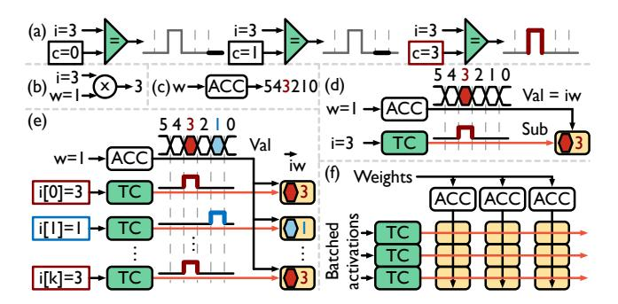

Figure 2. Illustration of VLP, detailed in Section 2.1.

for mapping the batch dimension to rows to achieve scalable performance with large batch sizes.

### 2.2 Nonlinear Implementations

**2.2.1 Software Implementation.** We take nonlinear operations in LLMs such as softmax, SiLU [17], and GELU [25] as examples, formulated in Equations 1, 2, and 3 [47], where erf means error function. To ensure numerical stability by avoiding overflow in exp, softmax inputs are usually subtracted by the maximum of all inputs. Without KV cache, softmax can take more than 40% of the total runtime in transformer models [9, 34, 55, 61]. The GELU function is commonly approximated as shown in Equation 4 or Equation 5 [47]. The functions easily take tens even hundreds of cycles to finished [45, 68].

$$\operatorname{softmax} = \frac{e^{(x_i - max)}}{\sum e^{(x_i - max)}} \quad (1) \quad \operatorname{SiLU} = \frac{x}{1 + e^{-x}} \quad (2) \quad \operatorname{GELU} = \frac{x}{2} \left[ 1 + \operatorname{erf} \left( \frac{x}{\sqrt{2}} \right) \right] \quad (3)$$

$$\operatorname{GELU} = \frac{x}{2} \left( 1 + \operatorname{Tanh} \left( \sqrt{\frac{2}{\pi}} \cdot \left( x + 0.044715 \cdot x^3 \right) \right) \right) \quad (4)$$

GELU = 
$$\frac{x}{2} \left( 1 + \text{Tanh} \left( 0.7978845608x \cdot \left( 1.0 + 0.004715 \cdot x^2 \right) \right) \right)$$
 (5)

**2.2.2 Piecewise Linear Hardware Approximation.** To ensure high efficiency, hardware approximations are proposed. Piecewise linear (PWL) approximation [27, 67] separates the function curve into multiple linear segments based on the input range and computes the result based on which segment an input falls into. PWL approximations need to buffer the segment coefficients and identify the corresponding segment of an input via comparison. For an input vector, a dedicated set of buffers, comparators, and arithmetic units is needed for each element, increasing hardware overheads.

2.2.3 Taylor Series Hardware Approximation. Another popular hardware approximation is a Taylor series [42, 66, 71, 72, 77]. The coefficient of each Taylor term is precomputed. With Horner's rule, the computation can be transformed in to concatenated multiply-accumulate (MAC) operations [72]. This transformation allows for vectorized implementation, where coefficients can be shared by all inputs efficiently. However, Taylor approximation exhibits poor accuracy when

inputs are far from the Taylor expansion point. Allowing more points introduces addition hardware overheads.

**Summary.** Different implementations offer distinct accuracy and efficiency tradeoffs, and this work introduces a novel VLP approximation for nonlinear operations.

### 2.3 Large Language Model Inference

Modern LLMs are mainly built on attention-based transformers [64]. During prefilling, multiple tokens are processed in parallel, resulting in GEMM operations. During decoding, one token is processed, resulting in GEMV operations, unless input tokens are batched. However, even with batched input, normal attention still performs GEMV for KV cache [50].

**2.3.1** Grouped Query Attention. GEMV in normal attention severely lowers the hardware utilization [83]. To mitigate the problem, grouped query attention (GQA) is proposed, where multiple Q tokens share the same KV cache [3], creating small-batch GEMM. In this paper, Mugi benefits from GQA to improve the hardware utilization.

2.3.2 Weight-Only Quantization. Low-bit quantization is now the de facto technique to reduce the memory footprint [36]. Most prior works adopt symmetric quantization, e.g., INT8 or FP8 for both inputs and weights [12, 16, 36, 44], which are still too memory inefficient for LLMs. Developers resort to sub-byte quantization for weights, while keeping the inputs in floating point format, e.g, BF16-INT4 weight only quantization (WOQ) [8, 13, 19, 28, 38, 39].

**2.3.3 KV Cache Quantization.** KV cache introduces additional memory footprint on top of weights, leading to potential out-of-memory errors [83]. BF16-INT4 KV cache quantization (KVQ) has been leveraged to compress KV cache with minimum accuracy drop [26, 33, 60, 82, 83]. Moreover, WOQ and KVQ can be combined together, reporting just a 0.02 increase in perplexity [26].

**Summary.** These LLM optimizations are timely and allow optimizing asymmetric, small-batch GEMM efficiently.

### 2.4 Sustainable Computing

Carbon emissions have become a growing concern in the AI world [29] and AI inference reportedly contributes up to 90% of datacenter costs [6]. To quantify carbon emissions, carbon modeling focuses on *operational* carbon for workload deployment and *embodied* carbon for infrastructure manufacture over the full lifetime [18, 48, 70]. The equivalent emissions (CO2eq) are formulated in Equation 6, where E, CI, CPA are short for energy and carbon intensity, carbon emitted per unit area. Embodied carbon is taking over operational carbon as the majority of contributed emissions [18, 70].

Operational 
$$CO_{2eq} = E \cdot CI$$
 (6) Embodied  $CO_{2eq} = Area \cdot CPA$  (7)

**Summary.** Our Mugi shares the hardware for both nonlinear operation and GEMM, and contributes to reduction of both operational and embodied carbon.

### 3 VLP Nonlinear Approximation

#### 3.1 Formulation

We formulate VLP approximation as in Figure 3. (a) depicts a conventional lookup table (LUT) for exp, indexing with an address and receiving its corresponding value. (b) indicates that such a conventional LUT can only sequentially process different inputs, limiting the scalability. To alleviate this restriction, (c) splits the lookup processes into two steps. First, a row of exp values with consecutive input values are retrieved from the LUT, then the correct value can be selected from that row. Such a split inspires VLP approximation. (d)-(e) illustrates this split within VLP. (d) uses an input sign and mantissa (i: S-M) to index the LUT row, and (e) then uses the exponent (i: E) to select the final result from the row.

(f) details VLP approximation within a single row. 1-4 denotes four phases, i.e., input field split, value reuse, mantissa temporal subscription, and exponent temporal subscription. • the input field split phase splits the input S-M-E (0-3-2) into S-M (0-3) and E (2), as in (d)-(e). 2 the value reuse phase organizes the LUT the same as that in (d), where each LUT row contains all values for the same S-M. At each cycle, an ascending address is sent to the LUT, and generates an output LUT row, marked by bold lines. Overtime, LUT rows are reused by different S-M values. 3 the mantissa temporal subscription phase further splits the S-M to reuse LUT rows. S-M (0-3) generates a temporal signal via the temporal converter in green, subscribing to the row at the 3rd cycle with a red fill. The LUT row will be stored into the yellow blocks when a temporal spike arrives. 4 the exponent temporal subscription leverages the temporal spike of the exponent (E=2) to subscribe the final exp results from the LUT row, selecting the value at the 2nd cycle with a blue outline. Starting from the moment when the correct LUT row is subscribed in 3, the exponent also starts generating its own temporal spikes. Therefore, the full VLP approximation requires the total duration of both mantissa and exponent temporal spike timing to finish.

(g) zooms into the single row for mantissa and exponent temporal subscription. The LUT row subscription is indicated by S-M. '-x' here denotes all exponents. The corresponding rows will be sent to the proper inputs, indicated by the bold lines. The exponent subscription is indicated by the blue outlined blocks. Following (f), this example selects the row corresponding to an S-M of (0-3), subscribing at the 3rd cycle, then subscribing where E=2, or at the 2nd cycle of ♠ in (f). This full process takes a total of 6 cycles, which is the sum of two subscription.

(h-i) expands approximation to a full array, enabling approximation of vector  $\vec{i}$ . By leveraging VLP, selected rows

can be shared across the array in parallel, individually subscribing to their final result.

#### 3.2 Input Approximation

VLP approximation favors lower-precision inputs to reduce the duration of temporal spikes. However, popular data formats have a wide mantissa field, e.g., BF16 mantissa has 7 bits. Therefore, in the input field split phase, we round the input mantissa to fewer bits for softmax, SiLU and GELU. Profiling shows that rounding introduces uniform errors to the input mantissa values, as the mantissa are uniformly distributed in softmax, SiLU and GELU, and this pattern is consistent across models and modalities. We exclude these results for simplicity.

#### 3.3 Value-Centric Approximation

The approximation efficiency also suffers from wide exponents, since both the temporal signal length and the LUT row size grows exponentially with exponent bitwidth. Our formulation leverages the insights that input exponents are often clustered at a small range. We focus on these important values, following a value-centric approach. We profile the input distribution of softmax, SiLU and GELU in Figure 4. For softmax, exponent values are concentrated around [-3, 4], despite input values being widely spread. Similar observations also exist in SiLU and GELU. We define these model-specific, important exponents as the LUT window, and we only store the results for these exponents in the LUT. However, a single mapping, with a set of inputs for value reuse, might not cover the full range of important exponents. Therefore, we opt for a sliding window for each mapping and choose an optimal range, as shown in Figure 5.

#### 3.4 Accuracy Impact

We explore the accuracy of different window sizes and boundaries as in Figure 6. We compare VLP approximation against prior approximations, like Taylor series [42, 66], piecewise linear (PWL) approximation [67], and partial approximation (PA) [27]. For most models with full VLP approximation (combined softmax/activation), Mugi shows better accuracy, except for Llama 2, whose softmax distribution varies significantly across layers, as shown in Figure 4. To address this, Figure 7 demonstrates per-layer tuning of Llama 2, selecting the optimal LUT range for each layer. This mitigates accuracy loss, yielding perplexity values approaching those in line with other approximation techniques.

Figure 8 further shows the accuracy of the nonlinear approximation. While VLP approximation does not exhibit the best error, it has the best accuracy where inputs are important, in term of magnitude and quantity. For softmax in layer 0, high exp accuracy for majority of the inputs (Figure 4) propagates less errors to deeper layers. In deeper layers, more inputs center around -10. Their output magnitudes are smaller, e.g, adding  $22k\ e^{-10}$  equals  $e^0$ . Therefore, even

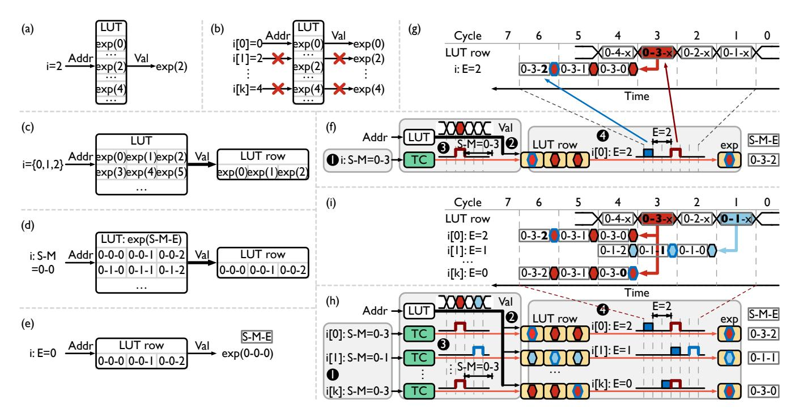

**Figure 3.** VLP approximation for nonlinear operations, exp here, with a floating-point input *i*, represented as S-M-E, denoting the sign, mantissa and exponent. More details are in Section 3.1.

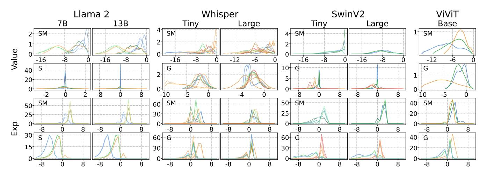

**Figure 4.** Distribution of input values and exponents of nonlinear operations in transformer models. Profiled layers, stages, and sequence lengths are detailed in Table 1. Cooler colors represent early layers, while warmer colors represent later layers. Within each color, lighter lines represent shorter sequence lengths, while darker lines represent longer sequence lengths. Softmax, SiLU, and GELU are abbreviated as SM, S, and G, denoting the nonlinear function within each window.

though VLP approximation is less accurate, it has negligible impacts compared to inputs closer to 0. Another contributor to overall accuracy is that uniform input errors from input approximation can cancel out each other's output errors during summation. For SiLU/GELU, inputs consistently cluster around 0, where VLP approximation is more accurate.

### 4 Mugi Architecture

We introduce Mugi, a novel VLP architecture to support nonlinear approximation and asymmetric, small-batch GEMM, as well as reusing the array for both nonlinear operations and GEMM for efficient LLMs. Mugi supports nonlinear softmax, SiLU and GELU operations. Mugi supports BF16-INT GEMM, leveraging timely GQA, WOQ and KVQ optimizations. The support for both nonlinear operations and GEMM

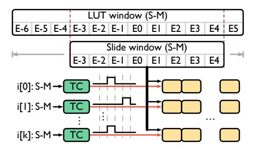

Figure 5. An example sliding window for input mapping. This example chooses the exponent range of [−3, 4] for the current set of inputs, from the full LUT window with the exponent range of [−6, 5]. The sliding window size of 8 is chosen to match the VLP array width in prior VLP works [\[46\]](#page-17-5). This sliding window can slide left and right for each mapping, aiming to minimize the accuracy loss.

above are mixed in one singular architecture with maximized resource reuse. Figure [9](#page-8-0) outlines our Mugi architecture. It double buffers all memory hierarchies to hide access latency. We follow prior VLP designs and set the number of columns to 8 (matching 3-bit mantissa) for optimal performance and efficiency tradeoffs [\[46\]](#page-17-5).

1 is for the input field split phase. M-proc splits the sign (S) and mantissa (M) fields for BF16 input and approximates the mantissa to 3-bit via rounding (R). For a given mapping, E-proc processes the exponent (E) values to determine the maximum or minimum exponent, which determines the LUT sliding window in the SW block. The sliding window size is fixed to 8 to match array width. It also clamps the exponent, underflowing to 0, and overflowing depending on the nonlinear operation. In softmax, overflow values are set to the maximum value of the LUT, while SiLU/GELU passes values through directly. The exponent is sent to post processing (PP) block for the final result.

2 is for the value reuse phase. The iSRAM acts as the LUT, and the pre-computed, output LUT window is sent to the SW block to generate the sliding window. The sliding window is sent to iFIFO to stagger the input by one cycle to adjacent columns. This staggering ensures fully pipelined execution in our VLP approximation.

3 is for the mantissa temporal subscription phase. The temporal converter (TC) converts the approximate mantissa (M) to a temporal signal using the counter (CNT) and leaves the sign (S) to PP. The temporal signal is then pipelined in a row via the T register in the processing element (PE). Temporal subscription is done using the AND gate in each PE. Within a PE column (Figure [9](#page-8-0) (d)), both the counter value and sliding window are broadcast. Within a PE row (Figure [9](#page-8-0) (e)), the subscribed results will be sent out via OR gates, since only one column will be activated by the pipelined temporal spike. Two sets of OR gates, together with a small FIFO, double buffer the results from two spikes. Sign conversion (SC) XORs all signs to generate the final result.

4 is for the exponent temporal subscription phase. The PP block takes the exponent from the E-proc and generates a MUX selection signal. If no special values exist, this selection signal is the temporal spike from the exponent, subscribing the correct element in the sliding window. If there are special values, the multiplexer outputs the proper special values among Zero, infinity (INF) and Not-a-Number (NaN).

### 4.1 Nonlinear Approximation

To better understand how Mugi works, we give a walkthrough example in Figure [10.](#page-8-1) Here, rows apply broadcasting, while columns adopt pipelining. The LUT (iSRAM) stores pre-computed nonlinear results, and each LUT row contains a vector of results for one mantissa. The LUT size will double if the nonlinear operation has both positive and negative inputs. In 0 – 7 , TC or PP is red if a temporal signal (yellow) arrives. In 8 – 9 , a new mapping is marked with blue.

In the first input field split phase, the 8-bit BF16 mantissa is rounded to INT4 with a 3-bit mantissa magnitude to generate an 8-cycle temporal signal. In the second value reuse phase, LUT row vectors are read out per cycle in a mantissaascending order, and reused in the next subscription phase. Note that vectors from different LUT columns are sent to the array in a staggered manner, as the temporal signal is pipelined across columns. In the third mantissa temporal subscription phase, temporal signals are generated from approximated mantissa. For each mantissa, the TC turns red upon the coincidence of the input value and equivalent clock cycle. The fourth exponent temporal subscription phase subscribes to the correct result from the LUT vector, indicated by the red exponent (e). The sign (s) is omitted here as it is always negative. The cycle index to get the final result is the sum of mantissa and exponent values. After 8 cycles of red input, at cycle 8, new blue inputs enter the array.

The above VLP approximation works for element-wise nonlinear operations, e.g., exp and SiLU/GELU. Additional summation and division are needed for softmax. We first compute the exp for all inputs (maximum subtracted). To perform the summation, when we compute exp, the output accumulator (oAcc) simultaneously accumulates the exp results. Once all exp operations finish, we store the sum to the oSRAM from the oFifo. Next, we divide all exp results by the sum using the vector multiplication array (Vec) in Figure [9.](#page-8-0) This array multiplies the exp by the reciprocal of the sum in one cycle. To ensure high utilization, we map both attention head and batch across rows for softmax.

### 4.2 GEMM Optimization

Mugi optimizes GEMM over prior VLP designs in two ways. Format Customization. Asymmetric BF16-INT4 GEMM imposes challenges to Carat. As Carat maps FP8 input across

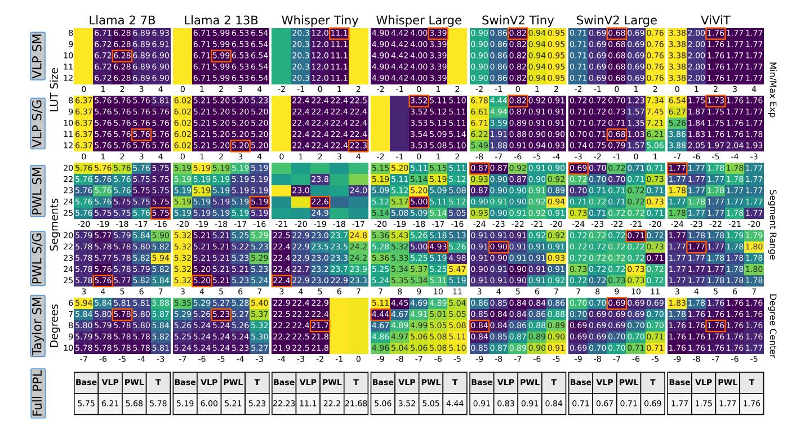

**Figure 6.** Perplexity and loss heatmaps of transformer models, showing the best for each nonlinear operation separately highlighted in orange (lower is better). Llama 2 and Whisper show perplexity, while Swin and Vivit show Loss. Combined softmax/activation metrics are short right of the title, with VLP being on top and PWL on bottom. Boxes on the left denote the approximation method, with softmax, SiLU and GELU abbreviated as SM, S, and G. The labels next to the boxes denote y axis value and *the labels on the right side denote x axis*. LUT size refers to the number of exponents stored in the LUT, and Min/Max exp denotes the maximum or minimum value used to create the LUT. For PWL, segment range (sr) denotes the approximation range, with SM going from [sr, 0] and S/G going from [-sr, sr]. For taylor series, degrees denotes the number of polynomial expansions used, while degree center is the center of the expansion. Empty boxes represent masked large values. Each column's table lists full end-to-end perplexity values (SM and S/G). The Taylor-series values, denoted T, include only SM.

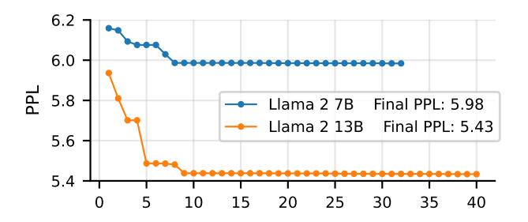

**Figure 7.** Per-layer perplexity tuning of Llama 2 (7B, 13B), with final achieved perplexity noted in the legend. Tuning is done progressively across layers.

rows, changing input to BF16 will prolong the temporal signal from 8 (3-bit mantissa magnitude) to 128 cycles (7-bit), prohibitively lowering the throughput. If INT4 weights were mapped to rows, the FP8 datapath is wasted. To overcome these, Mugi transposes the mapping, i.e., INT4 weight/KV cache to rows with a slim INT4 datapath, and BF16 input/Q token to columns. This mapping offers high utilization, since

LLM tokens are large enough to fill in all rows, and 8 Q tokens in a group for GQA can fill in all columns. The customization timely synergizes with the trends of LLMs, small batch sizes, large token sizes, WOQ, KVQ and GQA, none of which are compatible in Carat. WOQ and KVQ require dequantization after GEMM, which is done by the vector array.

**Buffer Minimization.** Buffers (FIFOs) occupy significant area in Carat, due to pipelining the inputs across rows and double buffering in the output OR tree. The relevant cost scales quadratically with the array size. Mugi solves this problem via broadcasting and output buffer leaning (optimizing two FIFOs into one without functional changes), successfully lowering the total buffer area by 4.5×.

With the optimizations above, GEMM can be exectued efficiently, following the flow in Figure 2. To ensure scalability, we can further use a 2D mesh Network-on-Chip (NoC) to connect multiple nodes. We consider output stationary dataflow and inter-node accumulation, and GEMMs are evenly tiled across nodes to enhance efficiency and utilization.

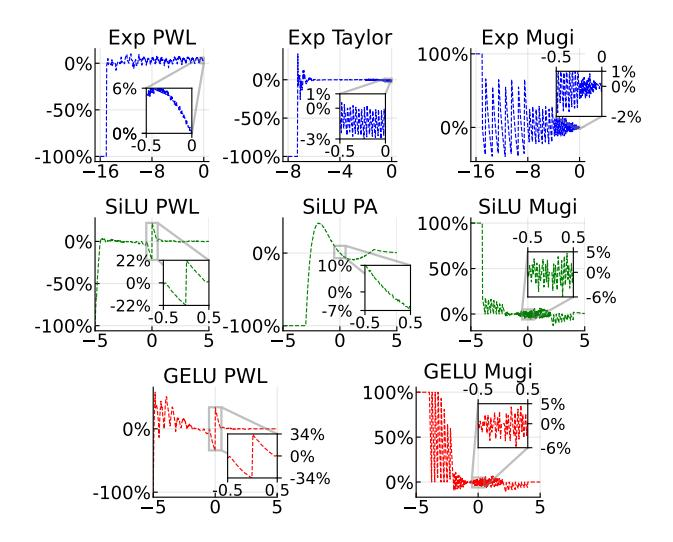

**Figure 8.** Relative errors against software implementation. The most accurate configurations from Figure 6 are compared. x and y axes are input values and relative error. 100% error indicates flushing output to 0.

**Table 1.** Studied LLMs in this paper.

| Model         | Llama2 [63]  |         |         | Whisper [54] |         | SwinV2   |          | ViViT  |
|---------------|--------------|---------|---------|--------------|---------|----------|----------|--------|
|               | 7 <b>B</b>   | 13B     | 70B     | tiny         | large   | tiny     | large    | base   |
| Batch size    | 1 - 32       |         |         |              |         |          |          |        |
| # layers      | 32           | 40      | 80      | 4            | 32      | 12       | 24       | 12     |
| # stages      |              |         |         |              |         | 4        | 4        |        |
| # attn heads  | 32           | 40      | 64      | 6            | 20      | 3 - 24   | 6 - 48   | 12     |
| # KV heads    | 32           | 40      | 8       | 6            | 20      | 3 - 24   | 6 - 48   | 12     |
| Attn h dim    | 4096         | 5120    | 8192    | 384          | 1280    | 96-768   | 192-1536 | 768    |
| FFN h dim     | 11008        | 13824   | 28672   | 1536         | 5120    | 384-3072 | 768-6144 | 3072   |
| Seq len       | 4096         |         | 1500    |              | 64-4096 |          | 3136     |        |
| Prof. layers  | 1/16/32      | 1/20/40 | 1/32/64 | 1/3/6        | 1/10/20 | 1/12     | 1/24     | 1/6/12 |
|               |              | 1024    |         | 112          | 2/224   | 16       | /32      | 784    |
| Prof. seq len | seq len 2048 |         |         | 375/750      |         | 64/1024  |          | 1568   |
|               |              | 4096    |         | 1            | 500     | 2048     | /4096    | 3136   |

\* h = hidden, Prof. = Profiled

### 5 Experimental Setup

#### 5.1 Large Language Model

The evaluated LLMs are summarized in Table 1, with LLaMA2-70B supporting GQA using a group size of 8. We implement all models using the HuggingFace Transformers Package [69], profiling and computing loss or perplexity for each model over 100 inferences. During profiling, we extract the runtime input nonlinear tensors across all tokens and record the value and exponent distributions, which is documented in Figure 4. To obtain the perplexity and loss values shown in Figure 6, we sweep various configurations for each nonlinear implementation, and show windows containing the best performing configuration. For both figures, we show the smallest and largest model of each model family, with the only exception of Llama 2 13B replacing Llama 2 70B due to memory and runtime limitations.

**Table 2.** Comparison of Mugi and baselines: SA refers to systolic array, SD to SIMD array, Tensor to Tensor Core, with off-chip bandwidth at 256 GB/s. Input (i), weight (w), and output (o) refer to respective components, with ranges (e.g., a-b) covering all powers of 2 between a and b. Input word config applies to the query word, and weight word to key and value words with kvcache quantization. -S denotes scaled-up configurations. All designs use 4x4 and 8x8 NoC layouts except Tensor and -S configurations, which use a 2x1 and 2x2 and no NoC, respectively.

| Configuration    | Mugi   Carat | SA   SD | SA-S   SD-S | Tensor   |  |  |
|------------------|--------------|---------|-------------|----------|--|--|
| i/w/o SRAM       | 64KB         |         | 1MB         |          |  |  |
| Array height (H) | 32 - 256     | 4 - 16  | 32 - 64     | 16       |  |  |
| Array width (W)  | 8            |         | Н           | 8        |  |  |
| Array Depth (D)  |              | 16      |             |          |  |  |
| Input word       | 16           |         |             |          |  |  |
| Weight word      | 4            |         |             |          |  |  |
| NoC shape        | 4x4, 8x      | 8       | N/A         | 2x1, 2x2 |  |  |

#### 5.2 Hardware

**5.2.1 Mugi.** As shown in Table 2, we set the oSRAM width to enable wFIFO loading of nonlinear operations in 8 cycles, ensuring sufficient bandwidth. The wSRAM width is similarly configured to allow loading in 8 cycles for GEMM operations. Mugi's vector array is configured to scale array outputs after exiting the oFIFO, hiding latency. Mugi is optimized for output stationary outer-product computation.

**5.2.2 Baseline.** We build baselines with components for both nonlinear operations and GEMM.

Nonlinear approximation hardware uses alternative vector arrays with added components to implement the Taylor series and PWL approximation methods [42, 67]. The Taylor series is implemented with Horner's method up to 9 degrees, and requires additional registers to store coefficients. PWL implementation adopts 22 segments, requiring additional registers and comparators to store and select proper segments. Both methods are configured to achieve their best perplexity as shown in Figure 6. We also consider a vector array of MAC units to precisely compute nonlinear operations, which require 44 cycles [45, 68].

For GEMM, we compare Mugi with Carat [46], systolic arrays, SIMD arrays, FIGNA [30], and tensor cores from Nvidia Hopper GPUs [43], as well as a Mugi-L design. Given Carat only supports FP8 GEMM with inputs mapped across rows, we modify its accumulators at the top to BF16 and map inputs across columns, while using its FP8 data path for INT4 weights. The systolic and SIMD arrays are similar, with the systolic array needing additional control hardware and a column of output accumulators, compared to SIMD's adder trees. Like Mugi, Carat implements output stationary, while the systolic and SIMD arrays use weight stationary configurations. The FIGNA configurations extend both systolic

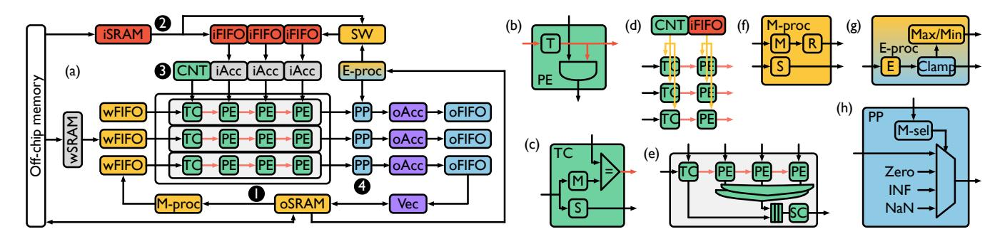

Figure 9. Overview of Mugi architecture. 1 – 4 (yellow, red, green, and blue) correspond to 1 – 4 phases of VLP approximation in Figure [3.](#page-4-1) Purple is for mapping softmax, and gray marks the additional hardware for GEMM.

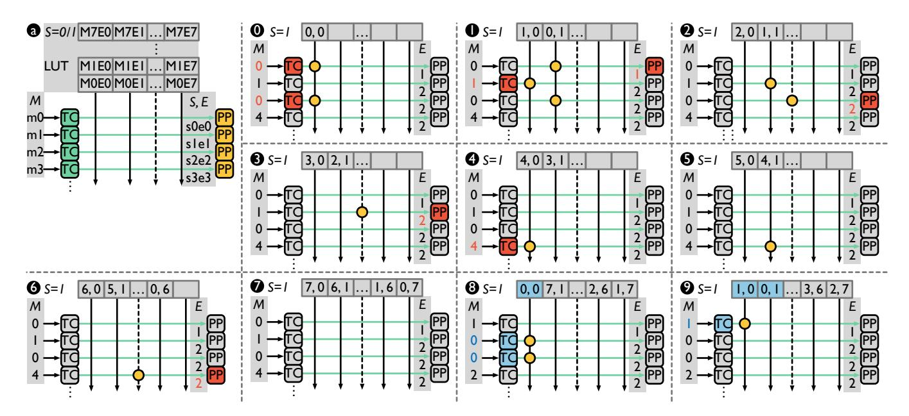

Figure 10. Mapping element-wise nonlinear operations to Mugi. a abstracts the VLP array for nonlinear operations. M, S and E are for mantissa, sign and exponent. 0 – 9 are examples for exp, and the numbers denotes the clock cycles.

and SIMD arrays with the FIGNA PE, which is customized for FP-INT multiplication. Additionally, scale-up versions of both systolic and SIMD arrays with MAC and FIGNA configurations are evaluated. The tensor core has GEMM shaped as 8x16x16, and is a fully pipelined design to perform 8x16x16 MAC operations per cycle. We only compare tensor core in NoC settings. The Mugi-L uses a dedicated LUT to approximate nonlinear operations, rather than temporal coding based approximation. We ensure 8 inputs share one LUT to match the throughput of Mugi. Similar to Mugi, all design's wSRAM and oSRAM widths are selected to load the array without introducing additional latency.

### 5.2.3 Network on Chip and Off-Chip Memory. The NoC incorporates three channels for input, weight, and output. An output-stationary approach is employed across all implementations. Each design operates with a NoC frequency of 400 MHz and a HBM bandwidth of 256 GB/s from off-chip

memory. Both the NoC and off-chip memory are configured such that they always supply the minimum bandwidth required to not bottleneck computation.

### 5.3 Carbon Modeling

To model both Mugi and baselines operational and embodied carbon, we follow a consistent approach by previous works [\[18,](#page-16-19) [48,](#page-17-23) [70\]](#page-18-13). Operational carbon is computed as the product of E and CI, while embodied carbon is the product of Area and CPA, both outlined in Section [2.4.](#page-2-7) For CI, we use world carbon intensity outlined in ACT [\[23\]](#page-16-20). We compute CPA with /2 detailed in Dark Silicon [\[7\]](#page-16-21), and convert it to CPA with the previously stated CI.

### 5.4 Simulation

We developed an in-house architecture simulator based on a publicly available artifact for Carat [\[46\]](#page-17-5). We extend the

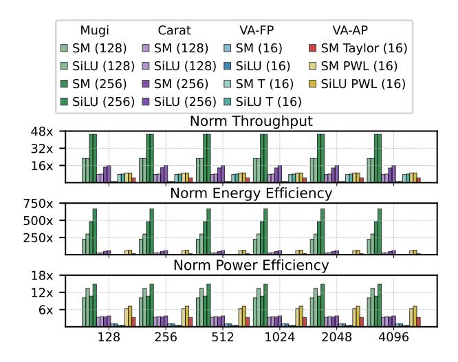

Figure 11. Iso-area comparison between Mugi and baselines for nonlinear operations, across sequence lengths (128–4096) with a batch size of 8, geometric meaned across all Llama 2 models (7B, 13B, 70B). SM, and VA-FP, and VA-AP abbreviate softmax, precise vector array, and approximate vector arrays. Titles in the legend indicate the array type of each column. All results are normalized to VA (16) with array heights indicated in "()".

artifact and build an event-based simulator that can hierarchically solve the mapping of nonlinear operations and GEMM on our customized Mugi architecture and report area, leakage power, dynamic energy, cycle count, and runtime. The basic hardware modules are implemented in RTL and synthesized under 400MHz with 45nm technology to retrieve metric values. The memory access power are obtained from CACTI7 [5].

We also place and route the full RTL of a single node 8x8 Mugi at  $400 \mathrm{MHz}$ , and obtain area  $0.056 \mathrm{mm}^2$  and frequency of  $408.5 \mathrm{MHz}$  with critical path on VLP broadcast. We further increase the synthesis frequency of Mugi, and reach 975 MHz without timing violations. We stick to  $400 \mathrm{MHz}$  to isolate of the impact of the implementation during the evaluation.

### 6 Evaluation

#### 6.1 Nonlinear Approximation

**6.1.1 Accuracy.** As shown in Figure 6, Mugi softmax, SiLU, and GELU implementations achieve highly accurate results, outperforming other methods on most models. Even in cases where Mugi is not the most accurate, Llama 2, it remains comparable to prior implementations. Conversely, when value distributions are concentrated, Mugi yields substantial improvements in performance, as evident by the perplexity gains observed in Whisper Tiny and highlighted in Figure 8. In contrast, prior approximation methods [27, 42, 67] do not consider the value distribution of workloads prior to approximation, introducing additional error.

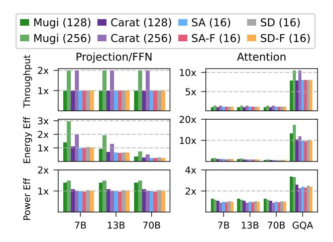

**Figure 12.** Iso-area comparison for projection (proj), attention (attn), and feed-forward network (ffn) GEMM operations in Llama 2 (7B, 13B, 70B, and 70B with GQA). All results are normalized to that of 16×16 systolic array (SA). -F denotes FIGNA. Batch size is set to 8, and sequence length is set to 4096, with array heights indicated in parenthesis ().

**6.1.2 Throughput and Efficiency.** Figure 11 compares the throughput and efficiency. Since all designs map the head dimension across rows, sequence length does not impact the normalized performance gains. Mugi achieves a shared normalized throughput of 45×, and energy and power efficiency improvements of 481.07× and 10.69× for softmax, and 667.85× and 14.84× for SiLU compared to precise vector arrays. Mugi outperforms PWL approximation in softmax by 5× (throughput), 8.53× (energy efficiency), and 1.71× (power efficiency), and in SiLU by 5×, 10.36×, and 2.37×, respectively. Against Taylor series softmax, Mugi achieves 10.02×, 32.93×, and 3.28× improvements in the same metrics.

Mugi contributes these gains in performance to its ability to scale to larger array sizes, sharing the compute array with GEMM. However, other designs require standalone vector arrays for nonlinear operations, where the scale is bounded by the SRAM bandwidth. Additionally, Mugi does not have to compute costly exp [68], thus multiplier free. These improvements allow Mugi to increase throughput and efficiency compared to vector arrays for both precise and approximation configurations.

**Takeaway.** Mugi enables accurate nonlinear approximation by applying input approximation and value-centric approach to VLP, greatly enhancing both throughput and efficiency.

#### **6.2 GEMM**

We show the GEMM execution results in Figure 12. The GEMM operations include the projection, attention, and FFN layers from the studied LLM models. We observe that in terms of throughput and efficiency, Mugi consistently outperforms both systolic and SIMD arrays. Mugi is optimized

**Table 3.** Comparison of Mugi and baselines throughput, area, energy and power efficiency on LLaMa 2 70B (with GQA). Batch size is set to 8, and sequence length is set to 4096. Hardware details are outlined in Table 2.

| Design |                   | Throughput (Tokens/s) | OC Area (mm 2 ) | Energy Efficiency (Tokens/s/μJ) | Power Efficiency (Tokens/s/W) |  |
|--------|-------------------|--------------------------|-------------------------------|------------------------------------|----------------------------------|--|
| SN     | Mugi (128)        | 0.71                     | 2.16                          | 68.64                              | 3.18                             |  |
|        | Mugi (256)        | 1.39                     | 3.10                          | 142.82                             | 3.37                             |  |
|        | Carat (128)       | 0.70                     | 2.42                          | 53.00                              | 2.47                             |  |
|        | Carat (256)       | 1.38                     | 3.84                          | 95.78                              | 2.27                             |  |
|        | SA (16)           | 0.67                     | 2.58                          | 45.97                              | 2.24                             |  |
|        | SA-F (16)         | 0.67                     | 2.81                          | 44.34                              | 2.16                             |  |
|        | SD (16)           | 0.67                     | 2.54                          | 47.83                              | 2.34                             |  |
|        | SD-F (16)         | 0.67                     | 2.77                          | 46.06                              | 2.25                             |  |
| SN-S   | SA (64)           | 2.70                     | 25.84                         | 138.59                             | 1.68                             |  |
|        | SA-F (64)         | 2.70                     | 29.56                         | 131.66                             | 1.60                             |  |
|        | SD (64)           | 2.70                     | 25.14                         | 143.18                             | 1.74                             |  |
|        | SD-F (64)         | 2.70                     | 28.86                         | 135.79                             | 1.65                             |  |
|        | Tensor            | 10.06                    | 38.75                         | 488.31                             | 1.59                             |  |
| NoC    | 4 x 4 Mugi (256)  | 22.19                    | 50.12                         | 2314.23                            | 3.42                             |  |
|        | 4 x 4 Carat (256) | 22.08                    | 61.92                         | 1551.09                            | 2.30                             |  |
|        | 4 x 4 SA (16)     | 10.74                    | 41.77                         | 770.31                             | 2.35                             |  |
|        | 4 x 4 SA-F (16)   | 10.74                    | 45.48                         | 741.68                             | 2.26                             |  |
|        | 4 x 4 SD (16)     | 10.74                    | 41.18                         | 803.82                             | 2.45                             |  |
|        | 4 x 4 SD-F (16)   | 10.74                    | 44.89                         | 772.70                             | 2.36                             |  |
|        | 2 x 1 Tensor (8)  | 20.12                    | 77.56                         | 989.02                             | 1.61                             |  |

for 8 columns, which aligns with and benefits from a batch size and GQA group size of 8, allowing it to leverage GQA for better throughput. This capability ensures that Mugi maintains excellent utilization even as the array size scales. On the contrary, systolic and SIMD arrays face under-utilization with array sizes larger than 8x8. Additionally, VLP eliminates multiplication in Mugi, increasing efficiency compared to baselines. Compared with Carat [46], Mugi shows better efficiency as Carat needs additional hardware to execute nonlinear operations.

**Takeaway** Mugi achieves good throughput and efficiency gains through timely LLM optimizations in emerging asymmetric data formats, small-batch GEMM, and GOA.

### 6.3 LLM workload

**6.3.1 Single Node.** Single-node evaluations show that Mugi exceeds baseline implementations in both throughput and efficiency, while also reducing overhead and area costs. An end-to-end comparison is provided in Table 3. Compared to a baseline systolic array 16, the Mugi 256 architecture achieves an increase of 2.07×, 3.11×, and 1.50× in throughput, energy efficiency, and power efficiency respectively. These improvements stem from Mugi 's effective reuse of the compute array for both nonlinear operations and GEMM, and efficient handling of asymmetric, small-batch GEMM using WOQ, KVQ, and GQA.

Figure 13 highlights these advantages, which are further amplified by the elimination of specialized vector arrays and costly MAC units, resulting in a more compact compute array and lower power consumption. Mugi additionally scales more efficiently to larger array sizes, growing linearly. On the contrary, the area of systolic and SIMD arrays scales up

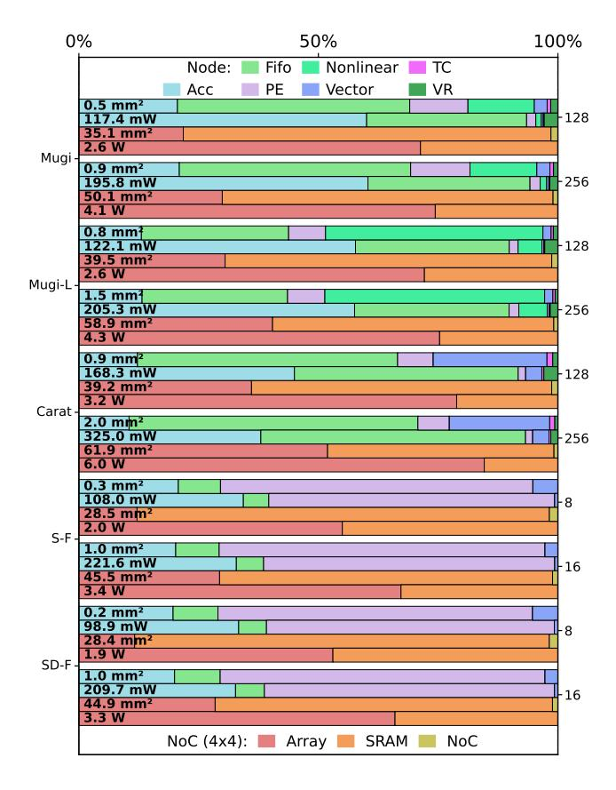

**Figure 13.** Array and NoC level area and power breakdown. Total area and power is shown in each bar. Cool colored bars represent array level while warm colored bars represent NoC level. *Acc* refers to output accumulators, and *nonlinear* refers to nonlinear hardware. For the power breakdown, batch size is set to 8 and the sequence length is set to 4096.

quadratically as the array scales in both row and column dimensions. Though also based on VLP, Carat area scales up super-linearly, due to the excessive cost of FIFO. Despite the large area, the temporal coding in VLP still minimizes the switching activities and ensures a low power-to-area ratio. Comparing to Mugi, Mugi-L with LUT for nonlinear operations and VLP for GEMM, spends way more hardware on on-chip LUT, implemented using FIFOs to ensure programmability.

We further show an extended throughput and energy comparison of different designs when sweeping the batch size, as shown in Figure 14, offering higher throughput and lower energy per token. The best throughput of Mugi is attainable at a smaller batch size of 8 than other baselines, as Mugi maps the batch across columns and peaks the utilization at a batch size of 8.

We additionally considered off-chip memory accesses, and we see that Mugi handles DRAM traffic similarly to other

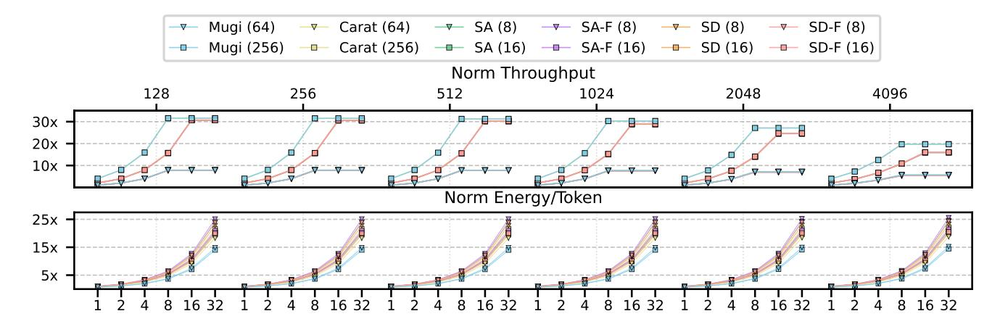

Figure 14. ISO-throughput LLMs study, geometric mean over all Llama models. The x-axis represents batch size at the bottom and each plot represents sequence lengths (128-4096) at the top. The y-axis represents the improvements of throughput and energy per token. All designs are normalized to an 8×8 systolic array with batch a size of 1. -F denotes FIGNA, and array heights are indicated in "()". SA and SD base and -F array's throughput closely overlap, as do Mugi and Carat.

dataflow architectures, almost identical operational intensity, but offers higher compute utilization, therefore more compute bounded.

Figure [16](#page-11-1) shows a latency breakdown of different LLMs. It is observed that Mugi have slightly better latency for attention GEMMs than other designs, but almost halves the latency for projection and FFN GEMMs. Regarding the nonlinear operations, Mugi shows almost invisible latency, exhibiting tremendous improvements over other designs. Though not obvious, Carat triples the nonlinear latency of Mugi, due to relying on non-VLP approximations.

6.3.2 Carbon Emission. When comparing Mugi's carbon impact to baselines, we see that Mugi improves in both operational and embodied emissions by 1.45× and 1.48× respectively. While Figure [15](#page-11-2) shows operational carbon as the major contributor to emissions, this follows previous trends consitent with 45nm technologies. Through Mugi's efficient, shared compute array, Mugi is able to simultaneously decrease both operational and embodied carbon while delivering an increase to throughput for LLM workloads.

6.3.3 Multi Node. Mugi scales efficiently to multi-node designs using a NoC architecture. We compare Mugi 's multinode implementations against baseline designs with the same NoC configuration and scaled-out versions of single node baseline architectures. As with single node setups, Mugi 's multi node configurations show comparable gains in throughput, energy efficiency, and power efficiency when comparing Mugi 4x4 256 and systolic array 4x4 16. Figure [17](#page-12-1) details these improvements, emphasizing the benefits of multi-node architectures. Moreover, NoC-based implementations clearly outperform scaled-up systolic arrays, due to severe under-utilization at a small batch size, as shown in Table [3.](#page-10-0) Figure [13](#page-10-1) shows the breakdown of NoC level area,

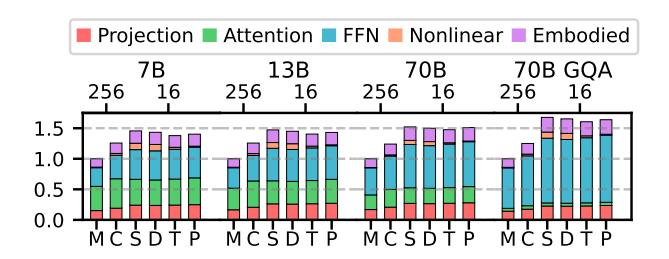

Figure 15. Normalized onchip operational and embodied carbon across model sizes (Llama 2-7B, 13B, 70B, 70B GQA) of Mugi and baseline configurations. Batch size is set to 8, and sequence length is set to 4096. Top x-axis represents array height, while y axis is normalized latency. M, C, S, D, T, P represents Mugi, Carat, Systolic, SIMD, Taylor Series, and Piecewise linear approximate respectively.

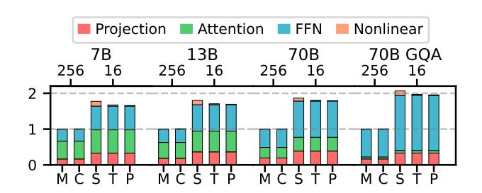

Figure 16. Normalized end-to-end latency breakdown across model sizes. All notations are identical to those in Figure [15,](#page-11-2) except that S here is for Systolic/SIMD.

and the array is occupying varying ratios of the on-chip resource, given an identical on-chip SRAM size.

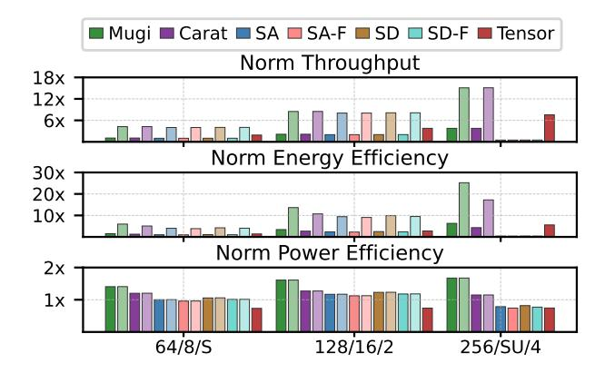

Figure 17. Normalized NoC-level throughput, energy efficiency, and power efficiency for Mugi and baseline 4x4 and 8x8 NoC architectures. Data represents the geometric mean across model sizes (Llama 2–7B, 13B, 70B) with a batch size of 8 and sequence length set to 4096. The x-axis represents array height for each group, in order of VLP, SA/SD, and tensor core. Tensor core configurations represent -S (single node), 2 (2x1 NoC), 4 (2x2 NoC). All models are normalized to an 8×8 systolic array (NoC dim: 4x4).

Takeaway By enabling VLP for both nonlinear operations and GEMM, Mugi effectively accelerates all aspects of LLM workloads, which also scales to multi nodes.

### 7 Discussion

### 7.1 Limitations

While we showcase the benefits of VLP, there are a few workloads or techniques not addressed in this paper.

Additional Operations. While Mugi unlocks nonlinear approximation, there are still some nonlinear LLM operations not supported, such as layer normalization and rotary positional embeddings (RoPE). Layer normalization are vector multiplication, and can be supported in Mugi's vector unit. For RoPE, Mugi can either approximate the required sine and cosine functions, though the utilization might be low due to its sparse nature, or offload them to external hardware as in existing GEMM accelerators.

MoE and Multi-Modal Models. Mixture-of-Experts (MoE) extend standard attention-based LLMs with selective FFN experts, selected by a softmax-based gating network [\[11,](#page-16-23) [15,](#page-16-24) [37\]](#page-17-26). Multi-modal models support multiple modalities beyond just text (i.e., language, vision, video, etc), by either tokenizing non-language inputs [\[14\]](#page-16-25), or combining multiple modalityspecific layers [\[4,](#page-16-26) [62\]](#page-17-27). There additionally exist models that leverage MoE architecture on multiple modalities [\[40\]](#page-17-28). All these additional operations have been supported in Mugi, and different modality has been studied in this work to prove the efficacy of VLP. We conjecture Mugi should generalize

to both MoE and multi-modal variants, though we leave full validation to future work.

Online Approximation. Currently, Mugi pre-computes the results offline for accurate nonlinear approximation via LUT. However, the value distribution could exhibit a slight drift at runtime. Such drifts in both KV cache and FFN have been well tackled via quantization, using as few as 4 bits. As for softmax, since all softmax inputs are subtracted by the maximum for numerical stability, the drift minimally impacts accuracy. Moreover, Mugi 's sliding window mechanism helps adapt to the current workload and further reduces the impact of drift. That said, we argue optimal accuracy would benefit from an online mechanism to adjust LUT values at runtime, and we leave this to future work.

### 7.2 Related Works

Nonlinear Approximation. Prior works have explored approximating nonlinear operations. Some approaches use piece-wise linear (PWL) approximations, partitioning the function into segments and selecting coefficients based on input range, while others approximate the entire function with a single simplified equation [\[27,](#page-16-5) [67,](#page-18-5) [76,](#page-18-16) [79\]](#page-18-17). Other works use Taylor-series expansions, which can provide high accuracy but degrade as values drift from the expansion point [\[42,](#page-17-11) [66\]](#page-18-4). While all approximation techniques, including Mugi, introduce some levels of approximation error, others underperform Mugi in most models while increasing area and efficiency costs, as detailed in Figure [6](#page-6-0) and Table [3.](#page-10-0)

GEMM Acceleration.A number of prior works target GEMM acceleration. Carat first introduced VLP, enabling low-precision, large-batch value reuse for CNNs [\[46\]](#page-17-5). While large batch sizes compliment CNN workloads, LLMs operate with smaller batch sizes and larger matrices, making Carat unsuited for such workloads. Other accelerators exploit unary computing [\[73](#page-18-18)[–75,](#page-18-19) [78\]](#page-18-20) to reduce buffer overhead using ternary RIM arrays and unary half-adders [\[21\]](#page-16-27), improving accumulation efficiency. However, each PE still requires multipliers and accumulators, whereas Mugi eliminates costly PE MAC units altogether via VLP. Additional works identify the ability to exploit data reuse to reduce data movement. Multi-chip module designs share inputs across weight-stationary chiplets to exploit cross-chiplet reuse [\[58\]](#page-17-29). Matrix-scaling approaches reduce large matrices into sub-matrices and scaling vectors, reducing memory transfers sharing sub-matrix computation during rescaling [\[53\]](#page-17-30). Lastly, another work identifies that quantization reduces the number of possible inputs, enabling computation to be shared between layers where outputs do not change [\[57\]](#page-17-31). Like Mugi, these works similarly identify data reuse techniques but largely overlook value reuse, missing further opportunities for optimization.

KV Cache Compatibility. Some works employ detailed hardware–software co-design to improve LLM performance. These works aim to reduce computation through top-k speculative prediction, removing computation predicted to be negligible to the attention output and reducing KV cache accesses [\[24,](#page-16-28) [52,](#page-17-32) [65,](#page-18-21) [66\]](#page-18-4). In contrast, other accelerators focus purely on GEMM computation and do not address attention or KV-cache related bottlenecks [\[21,](#page-16-27) [46,](#page-17-5) [53,](#page-17-30) [57,](#page-17-31) [58\]](#page-17-29). Mugi occupies a middle ground by incorporating lightweight KVcache optimizations natively in its architecture, avoiding workload-specific optimizations via co-design. This allows Mugi to generalize across models while still capturing key reuse opportunities in modern LLM workloads.

### 8 Conclusion

In this paper, we orchestrate value-level parallelism (VLP) for efficient transformer-based LLMs. We formulate VLP for nonlinear approximation in a value-centric approach where important values are assigned with greater accuracy. We design a Mugi architecture for our VLP approximation. Additionally, we optimize Mugi to accelerate asymmetric, small-batch GEMM, which leverages the trending LLM optimizations. To this end, Mugi effectively supports full LLM workloads via VLP. Our experimental results demonstrate significant performance and efficiency gains in Mugi, highlighting the potential of VLP for AI workloads.

## A Artifact Appendix

### A.1 Abstract

The artifact evaluation is separated into two scopes, workload evaluation and architecture evaluation. The workload evaluation contains nearly all figures within section [3,](#page-3-0) namely Figure [4,](#page-4-2) Figure [6,](#page-6-0) and Figure [8.](#page-7-1) The architecture evaluation includes all figures within section [6.](#page-9-0) Both artifacts can be run on an x86\_64 machine with python and conda installed. The workload evaluation requires access to a GPU cluster. We have tested the architecture evaluation on ubuntu 24.04, and the workload evaluation on an NSF GPU cluster running Red Hat 9.4. To run each artifact, download the artifacts from the zenodo links detailed in Section [A.3](#page-14-0) and follow steps outlined in Section [A.4.](#page-14-1) To see the results generated from running the artifact, see Section [A.6](#page-15-0) for detail.

### A.2 Artifact check-list (meta-information)

- Workload evaluation:
  - Model: AI profiling
  - Data set: Models outlined in Table [1.](#page-7-2) Note that Llama 70B results are excluded in the provided artifact, due to the excessive profiling time.
  - Run-time environment: Conda
  - Hardware: NSF GPU cluster
  - Metrics: Perplexity, value distribution, theoretical error
  - Output: Figure [6,](#page-6-0) Figure [4,](#page-4-2) Figure [8,](#page-7-1)
  - Experiments: Approximate perplexity comparison, model value distribution, approximation theoretical error
  - Disk space required (approximate): 70GB
  - Time needed to complete experiments (approximate): 12-24 hours
  - Publicly available: Yes
  - Code licenses (if publicly available): MIT License
  - Workflow framework used: Pytorch
- Architecture evaluation:
  - Model: Cycle-level performance model, event-based cost model
  - Data set: Llama configurations outlined in Table [1](#page-7-2)
  - Run-time environment: Conda
  - Hardware: x86\_64 machine
  - Metrics: Throughput, latency, energy efficiency, power efficiency, area, carbon equivalent emissions.
  - Output: Figure [11,](#page-9-1) Figure [12,](#page-9-2) Table [3,](#page-10-0) Figure [13,](#page-10-1) Figure [14,](#page-11-0) Figure [15,](#page-11-2) Figure [16,](#page-11-1) Figure [17.](#page-12-1)
  - Experiments: Iso-area nonlinear comparison, isoarea GEMM comparison, comprehensive design comparison, array and noc-level area and power breakdown, batch size comparison, operational and embodied carbon comparison, end-to-end latency comparison, iso-area noc comparison.
  - Disk space required (approximate): 8GB

- Time needed to complete experiments (approximate): 0.5 - 1 hours
- Publicly available: Yes
- Code licenses (if publicly available): MIT License
- Workflow framework used: In-house simulation framework

### A.3 Description

A.3.1 How to access. Both artifacts can be downloaded at <https://zenodo.org/records/18063514>. Follow the instructions detailed in the zenodo or Section [A.4](#page-14-1) and [A.5](#page-15-1) to evaluate each artifact.

A.3.2 Hardware dependencies. For the workload evaluation, a GPU capable of loading all models at half precision is required.

A.3.3 Software dependencies. Conda is required to build the environment.[1](#page-14-2)

A.3.4 Datasets. Both evaluations use the models outlined in Table [1,](#page-7-2) with the architecture evaluation only including Llama models, and the workload evaluation ignoring Llama 2 70b. Access to the ML models is provided in the artifact during the artifact evaluation, but will be deprecated after evaluation, and access to the models will have to be obtained.[2](#page-14-3)

A.3.5 Models. The models used in our simulation framework include a cycle-level performance model and an eventbased cost model, as well as profiling and end-to-end perplexity results.

### A.4 Installation

One may follow the steps below to run the artifact, also available at the zenodo link in Section [A.3.1.](#page-14-4) For the artifact evaluation, we will provide access to the NSF GPU cluster. Both evaluations detail the steps assuming a Linux environment, and require the command-line tool unzip to be installed prior to evaluation. If you are evaluating either artifact on a local machine, follow the commands below to install unzip. Otherwise, ensure that unzip or and equivalent command-line tool is available.

sudo apt update sudo apt install unzip

### Workload evaluation.

- 1. Download the zip file from the zenodo link. mugi\_profiling-asplos\_2026\_ae.zip <https://zenodo.org/records/18063514>
- 2. Unzip the artifact and cd into the new directory. unzip mugi\_profiling-asplos\_2026\_ae.zip cd mugi\_profiling-asplos\_2026\_ae

1Available at https://www.anaconda.com/download.

2Available at https://huggingface.co/meta-llama.

- 3. Create a conda environment with the included environment.yaml and activate the environment. conda env create -f environment.yaml conda activate mugi\_profiling
- 4. Run the included script to launch all slurm scripts. bash mugi\_profiling.sh If slurm access is not available (NSF access fails), an additional script is provided, but tuning may be required. bash mugi\_profiling\_local.sh
- 5. Finally, retrieve the figures in the figures/output directory.

### Architecture evaluation.

- 1. Download the zip file from the zenodo link. archx-asplos\_2026\_ae.zip <https://zenodo.org/records/18063514>
- 2. Unzip the artifact and cd into the new directory. unzip archx-asplos\_2026\_ae.zip cd archx-asplos\_2026\_ae
- 3. Create a conda environment with the included environment.yaml and activate the environment. conda env create -f environment.yaml conda activate archx
- 4. Run the included script to generate and simulate the architecture descriptions. bash run\_mugi.sh
- 5. Finally, retrieve the figures in the zoo/llm/results/figs/ and zoo/llm/results/tables/ directories.

### A.5 Experiment workflow

Workload evaluation. We use slurm scripts to automate profiling and end-to-end perplexity results. To produce each figure, the scripts load the model onto an allocated node and run the target dataset. Profiling is done on the base halfprecision models, while perplexity is retrieved for base models at both half precision and for nonlinear approximation. After all models run, the scripts process both the profiling and perplexity results and report them within each figure.

Architecture evaluation. We use scripts to automatically run the workflow for the result production. To produce a figure, the evaluation scripts first generate all the hardware configurations based on the provided architecture descriptions. Then, the simulation is run on each architecture description with a target workload (e.g., llama). More specifically, both the performance model and cost model are run. Note that the automated workflow launches these simulations in parallel. Finally, the scripts parse the generated result and aggregate results across runs from all the configurations to generate figures.

### A.6 Evaluation and expected results

After running the steps in Section [A.4,](#page-14-1) the generated figures can be found locally in figures/output directory for workload evaluation and zoo/llm/results/figs and zoo/llm/results/tables for the architecture evaluation. Each figure is labeled as figX-Y.pdf that corresponds to what is included in Section [3](#page-3-0) and Section [6.](#page-9-0) The expected profiling distribution in the workload evaluation may exhibit slight deviations from the values reported in the paper due to device-specific computational variation.

### A.7 Methodology

Submission, reviewing and badging methodology:

- [https://www.acm.org/publications/policies/artifact-rev](https://www.acm.org/publications/policies/artifact-review-badging)iew[badging](https://www.acm.org/publications/policies/artifact-review-badging)
- <http://cTuning.org/ae/submission-20201122.html>
- <http://cTuning.org/ae/reviewing-20201122.html>

### References

- [1] Amey Agrawal, Nitin Kedia, Ashish Panwar, Jayashree Mohan, Nipun Kwatra, Bhargav S Gulavani, Alexey Tumanov, and Ramachandran Ramjee. 2024. Taming Throughput-Latency Tradeoff in LLM Inference with Sarathi-Serve. USENIX Symposium on Operating Systems Design and Implementation (2024).
- [2] Ankur Agrawal, Silvia M. Mueller, Bruce M. Fleischer, Xiao Sun, Naigang Wang, Jungwook Choi, and Kailash Gopalakrishnan. 2019. DLFloat: A 16-b Floating Point Format Designed for Deep Learning Training and Inference. In 2019 IEEE 26th Symposium on Computer Arithmetic (ARITH).
- [3] Joshua Ainslie, James Lee-Thorp, Michiel de Jong, Yury Zemlyanskiy, Federico Lebron, and Sumit Sanghai. 2023. GQA: Training Generalized Multi-Query Transformer Models from Multi-Head Checkpoints. Empirical Methods in Natural Language Processing.
- [4] Shuai Bai, Yuxuan Cai, Ruizhe Chen, Keqin Chen, Xionghui Chen, Zesen Cheng, Lianghao Deng, Wei Ding, Chang Gao, Chunjiang Ge, Wenbin Ge, Zhifang Guo, Qidong Huang, Jie Huang, Fei Huang, Binyuan Hui, Shutong Jiang, Zhaohai Li, Mingsheng Li, Mei Li, Kaixin Li, Zicheng Lin, Junyang Lin, Xuejing Liu, Jiawei Liu, Chenglong Liu, Yang Liu, Dayiheng Liu, Shixuan Liu, Dunjie Lu, Ruilin Luo, Chenxu Lv, Rui Men, Lingchen Meng, Xuancheng Ren, Xingzhang Ren, Sibo Song, Yuchong Sun, Jun Tang, Jianhong Tu, Jianqiang Wan, Peng Wang, Pengfei Wang, Qiuyue Wang, Yuxuan Wang, Tianbao Xie, Yiheng Xu, Haiyang Xu, Jin Xu, Zhibo Yang, Mingkun Yang, Jianxin Yang, An Yang, Bowen Yu, Fei Zhang, Hang Zhang, Xi Zhang, Bo Zheng, Humen Zhong, Jingren Zhou, Fan Zhou, Jing Zhou, Yuanzhi Zhu, and Ke Zhu. 2025. Qwen3-VL Technical Report. arXiv (2025).
- [5] Rajeev Balasubramonian, Andrew B. Kahng, Naveen Muralimanohar, Ali Shafiee, and Vaishnav Srinivas. 2017. CACTI 7: New Tools for Interconnect Exploration in Innovative Off-Chip Memories. Transactions on Architecture and Code Optimization (2017).
- [6] Jeff Barr. 2019. Amazon EC2 Update – Inf1 Instances with AWS Inferentia Chips for High Performance Cost-Effective Inferencing. [https://aws.amazon.com/blogs/aws/amazon-ec2-update-inf1](https://aws.amazon.com/blogs/aws/amazon-ec2-update-inf1-instances-with-aws-inferentia-chips-for-high-performance-cost-effective-inferencing/) [instances-with-aws-inferentia-chips-for-high-performance-cost](https://aws.amazon.com/blogs/aws/amazon-ec2-update-inf1-instances-with-aws-inferentia-chips-for-high-performance-cost-effective-inferencing/)[effective-inferencing/](https://aws.amazon.com/blogs/aws/amazon-ec2-update-inf1-instances-with-aws-inferentia-chips-for-high-performance-cost-effective-inferencing/)
- [7] Erik Brunvand, Donald Kline, and Alex K. Jones. 2018. Dark Silicon Considered Harmful: A Case for Truly Green Computing. In nternational Green and Sustainable Computing Conference (IGSC).
- [8] Yuji Chai, John Gkountouras, Glenn G. Ko, David Brooks, and Gu-Yeon Wei. 2023. INT2.1: Towards Fine-Tunable Quantized Large Language Models with Error Correction through Low-Rank Adaptation. arXiv (2023).
- [9] Jaewan Choi, Hailong Li, Byeongho Kim, Seunghwan Hwang, and Jung Ho Ahn. 2022. Accelerating Transformer Networks through Recomposing Softmax Layers. In International Symposium on Workload Characterization.
- [10] Yujeong Choi, Yunseong Kim, and Minsoo Rhu. 2021. Lazy Batching: An SLA-aware Batching System for Cloud Machine Learning Inference. In International Symposium on High-Performance Computer Architecture.
- [11] Damai Dai, Chengqi Deng, Chenggang Zhao, R. X. Xu, Huazuo Gao, Deli Chen, Jiashi Li, Wangding Zeng, Xingkai Yu, Y. Wu, Zhenda Xie, Y. K. Li, Panpan Huang, Fuli Luo, Chong Ruan, Zhifang Sui, and Wenfeng Liang. 2024. DeepSeekMoE: Towards Ultimate Expert Specialization in Mixture-of-Experts Language Models. arXiv (2024).
- [12] DeepSeek-AI, Aixin Liu, Bei Feng, Bing Xue, Bingxuan Wang, Bochao Wu, et al. 2025. Deepseek-V3 Technical Report. arXiv (2025).
- [13] Tim Dettmers, Mike Lewis, Younes Belkada, and Luke Zettlemoyer. 2022. LLM.int8(): 8-bit Matrix Multiplication for Transformers at Scale. In Advances in Neural Information Processing Systems.
- [14] Danny Driess, Fei Xia, Mehdi S. M. Sajjadi, Corey Lynch, Aakanksha Chowdhery, Brian Ichter, Ayzaan Wahid, Jonathan Tompson, Quan

- Vuong, Tianhe Yu, Wenlong Huang, Yevgen Chebotar, Pierre Sermanet, Daniel Duckworth, Sergey Levine, Vincent Vanhoucke, Karol Hausman, Marc Toussaint, Klaus Greff, Andy Zeng, Igor Mordatch, and Pete Florence. 2023. PaLM-E: an embodied multimodal language model. In Proceedings of the 40th International Conference on Machine Learning. JMLR.org.
- [15] Nan Du, Yanping Huang, Andrew M Dai, Simon Tong, Dmitry Lepikhin, Yuanzhong Xu, Maxim Krikun, Yanqi Zhou, Adams Wei Yu, Orhan Firat, Barret Zoph, Liam Fedus, Maarten P Bosma, Zongwei Zhou, Tao Wang, Emma Wang, Kellie Webster, Marie Pellat, Kevin Robinson, Kathleen Meier-Hellstern, Toju Duke, Lucas Dixon, Kun Zhang, Quoc Le, Yonghui Wu, Zhifeng Chen, and Claire Cui. 2022. GLaM: Efficient Scaling of Language Models with Mixture-of-Experts. In Proceedings of the 39th International Conference on Machine Learning.
- [16] Abhimanyu Dubey, Abhinav Jauhri, Abhinav Pandey, Abhishek Kadian, Ahmad Al-Dahle, et al. 2024. The Llama 3 Herd of Models. arXiv (2024).
- [17] Stefan Elfwing, Eiji Uchibe, and Kenji Doya. 2018. Sigmoid-Weighted Linear Units for Neural Network Function Approximation in Reinforcement Learning. Neural Networks (2018).
- [18] Ahmad Faiz, Sotaro Kaneda, Ruhan Wang, Rita Osi, Prateek Sharma, Fan Chen, and Lei Jiang. 2024. LLMCarbon: Modeling the end-to-end Carbon Footprint of Large Language Models. arXiv (2024).
- [19] Elias Frantar, Saleh Ashkboos, Torsten Hoefler, and Dan Alistarh. 2023. GPTQ: Accurate Post-Training Quantization for Generative Pre-Trained Transformers. arXiv (2023).
- [20] Kunihiko Fukushima. 1969. Visual Feature Extraction by A Multilayered Network of Analog Threshold Elements. IEEE Transactions on Systems Science and Cybernetics (1969).
- [21] Hongrui Guo, Yongwei Zhao, Zhangmai Li, Yifan Hao, Chang Liu, Xinkai Song, Xiaqing Li, Zidong Du, Rui Zhang, Qi Guo, Tianshi Chen, and Zhiwei Xu. 2023. Cambricon-U: A Systolic Random Increment Memory Architecture for Unary Computing. In International Symposium on Microarchitecture.
- [22] Udit Gupta, Mariam Elgamal, Gage Hills, Gu-Yeon Wei, Hsien-Hsin S. Lee, David Brooks, and Carole-Jean Wu. 2022. ACT: designing sustainable computer systems with an architectural carbon modeling tool. In International Symposium on Computer Architecture.
- [23] Udit Gupta, Mariam Elgamal, Gage Hills, Gu-Yeon Wei, Hsien-Hsin S. Lee, David Brooks, and Carole-Jean Wu. 2022. ACT: designing sustainable computer systems with an architectural carbon modeling tool.
- [24] Tae Jun Ham, Yejin Lee, Seong Hoon Seo, Soosung Kim, Hyunji Choi, Sung Jun Jung, and Jae W. Lee. 2021. ELSA: hardware-software codesign for efficient, lightweight self-attention mechanism in neural networks. In International Symposium on Computer Architecture.
- [25] Dan Hendrycks and Kevin Gimpel. 2016. Gaussian Error Linear Units (GELUs). arXiv (2016).
- [26] Coleman Hooper, Sehoon Kim, Hiva Mohammadzadeh, Michael W. Mahoney, Yakun Sophia Shao, Kurt Keutzer, and Amir Gholami. 2024. KVQuant: Towards 10 Million Context Length LLM Inference with KV Cache Quantization. arXiv (2024).
- [27] Andrew Howard, Mark Sandler, Grace Chu, Liang-Chieh Chen, Bo Chen, Mingxing Tan, Weijun Wang, Yukun Zhu, Ruoming Pang, Vijay Vasudevan, Quoc V. Le, and Hartwig Adam. 2019. Searching for MobileNetV3. International Conference on Computer Vision (2019).
- [28] Wei Huang, Yangdong Liu, Haotong Qin, Ying Li, Shiming Zhang, Xianglong Liu, Michele Magno, and Xiaojuan Qi. 2024. BiLLM: Pushing the Limit of Post-Training Quantization for LLMs. arXiv (2024).
- [29] International Telecommunication Union (ITU) and World Benchmarking Alliance (WBA). 2025. Tech sector emissions, energy use grow with rise of AI. [https://www.itu.int/en/mediacentre/Pages/PR-2025-](https://www.itu.int/en/mediacentre/Pages/PR-2025-06-05-greening-digital-companies-report.aspx) [06-05-greening-digital-companies-report.aspx](https://www.itu.int/en/mediacentre/Pages/PR-2025-06-05-greening-digital-companies-report.aspx) Accessed: 2025-08-12.

- [30] Jaeyong Jang, Yulhwa Kim, Juheun Lee, and Jae-Joon Kim. 2024. FIGNA: Integer Unit-Based Accelerator Design for FP-INT GEMM Preserving Numerical Accuracy. In 2024 IEEE International Symposium on High-Performance Computer Architecture (HPCA).
- [31] Yangqing Jia. 2014. Learning Semantic Image Representations at a Large Scale. Ph. D. Dissertation. EECS Department, University of California, Berkeley. [http://www2.eecs.berkeley.edu/Pubs/TechRpts/2014/EECS-](http://www2.eecs.berkeley.edu/Pubs/TechRpts/2014/EECS-2014-93.html)[2014-93.html](http://www2.eecs.berkeley.edu/Pubs/TechRpts/2014/EECS-2014-93.html)
- [32] Dhiraj Kalamkar, Dheevatsa Mudigere, Naveen Mellempudi, Dipankar Das, Kunal Banerjee, Sasikanth Avancha, Dharma Teja Vooturi, Nataraj Jammalamadaka, Jianyu Huang, Hector Yuen, Jiyan Yang, Jongsoo Park, Alexander Heinecke, Evangelos Georganas, Sudarshan Srinivasan, Abhisek Kundu, Misha Smelyanskiy, Bharat Kaul, and Pradeep Dubey. 2019. A Study of BFLOAT16 For Deep Learning Training. arXiv (2019).
- [33] Tushar and Qingru Zhang Kang, Hao, Souvik Kundu, Geonhwa Jeong, Zaoxing Liu, Tushar Krishna, and Tuo Zhao. 2024. GEAR: An Efficient KV Cache Compression Recipe for Near-Lossless Generative Inference of LLM. arXiv (2024).
- [34] Rachid Karami, Sheng-Chun Kao, and Hyoukjun Kwon. 2025. NonGEMM Bench: Understanding the Performance Horizon of the Latest ML Workloads with NonGEMM Workloads. In International Symposium on Performance Analysis of Systems and Software.
- [35] Alex Krizhevsky, Ilya Sutskever, and Geoffrey E Hinton. 2012. ImageNet Classification with Deep Convolutional Neural Networks. In Advances in Neural Information Processing Systems, F. Pereira, C.J. Burges, L. Bottou, and K.Q. Weinberger (Eds.).
- [36] Andrey Kuzmin, Mart Van Baalen, Yuwei Ren, Markus Nagel, Jorn Peters, and Tijmen Blankevoort. 2022. FP8 Quantization: The Power of the Exponent. In Advances in Neural Information Processing Systems.
- [37] Dmitry Lepikhin, HyoukJoong Lee, Yuanzhong Xu, Dehao Chen, Orhan Firat, Yanping Huang, Maxim Krikun, Noam Shazeer, and Zhifeng Chen. 2020. GShard: Scaling Giant Models with Conditional Computation and Automatic Sharding. arXiv (2020).
- [38] Ji Lin, Jiaming Tang, Haotian Tang, Shang Yang, Guangxuan Xiao, and Song Han. 2025. AWQ: Activation-aware Weight Quantization for On-Device LLM Compression and Acceleration. GetMobile: Mobile Comp. and Comm. (2025).
- [39] Shuming Ma, Hongyu Wang, Lingxiao Ma, Lei Wang, Wenhui Wang, Shaohan Huang, Li Dong, Ruiping Wang, Jilong Xue, and Furu Wei. 2024. The Era of 1-bit LLMs: All Large Language Models are in 1.58 Bits. arXiv (2024).
- [40] Meta AI. 2025. Llama 4: Multimodal Intelligence. [https://ai.meta.com/](https://ai.meta.com/blog/llama-4-multimodal-intelligence/) [blog/llama-4-multimodal-intelligence/](https://ai.meta.com/blog/llama-4-multimodal-intelligence/). Accessed: 2025-12-05.
- [41] Paulius Micikevicius, Dusan Stosic, Neil Burgess, Marius Cornea, Pradeep Dubey, Richard Grisenthwaite, Sangwon Ha, Alexander Heinecke, Patrick Judd, John Kamalu, Naveen Mellempudi, Stuart Oberman, Mohammad Shoeybi, Michael Siu, and Hao Wu. 2022. FP8 Formats for Deep Learning. arXiv (2022).
- [42] Peter Nilsson, Ateeq Ur Rahman Shaik, Rakesh Gangarajaiah, and title = Hardware Implementation of the Exponential Function Using Taylor Series journal = Nordic Circuits and Systems Conference year = 2014 Hertz, Er. [n. d.]. ([n. d.]).
- [43] NVIDIA. 2024. NVIDIA H100 Tensor Core GPU Architecture. Retrieved 2024-11-14 from [https://resources.nvidia.com/en-us-hopper](https://resources.nvidia.com/en-us-hopper-architecture/nvidia-h100-tensor-c)[architecture/nvidia-h100-tensor-c](https://resources.nvidia.com/en-us-hopper-architecture/nvidia-h100-tensor-c)
- [44] NVIDIA. 2024. TensorRT-LLM. Retrieved 2024-11-14 from [https:](https://github.com/NVIDIA/TensorRT-LLM) [//github.com/NVIDIA/TensorRT-LLM](https://github.com/NVIDIA/TensorRT-LLM)
- [45] Stuart F. Oberman and Michael J. Flynn. 1997. Division Algorithms and Implementations. IEEEXplore (1997).
- [46] Zhewen Pan, Joshua San Miguel, and Di Wu. 2024. Carat: Unlocking Value-Level Parallelism for Multiplier-Free GEMMs. In International Conference on Architectural Support for Programming Languages and Operating Systems.

- [47] Adam Paszke, Sam Gross, Francisco Massa, Adam Lerer, James Bradbury, Gregory Chanan, Trevor Killeen, Zeming Lin, Natalia Gimelshein, Luca Antiga, Alban Desmaison, Andreass Köpf, Edward Yang, Zach DeVito, Martin Raison, Alykhan Tejani, Sasank Chilamkurthy, Benoit Steiner, Lu Fang, Junjie Bai, and Soumith Chintala. 2019. PyTorch: An Imperative Style, High-Performance Deep Learning Library. arXiv (2019).
- [48] David Patterson, Joseph Gonzalez, Quoc Le, Chen Liang, Lluis-Miquel Munguia, Daniel Rothchild, David So, Maud Texier, and Jeff Dean. 2021. Carbon Emissions and Large Neural Network Training. arXiv (2021).
- [49] Raspberry Pi. 2024. Raspberry Pi 5. Retrieved 2024-11-14 from [https:](https://www.raspberrypi.com/products/raspberry-pi-5/) [//www.raspberrypi.com/products/raspberry-pi-5/](https://www.raspberrypi.com/products/raspberry-pi-5/)
- [50] Reiner Pope, Sholto Douglas, Aakanksha Chowdhery, Jacob Devlin, James Bradbury, Jonathan Heek, Kefan Xiao, Shivani Agrawal, and Jeff Dean. 2023. Efficiently Scaling Transformer Inference. In Proceedings of Machine Learning and Systems.
- [51] Valentina Popescu, Abhinav Venigalla, Di Wu, and Robert Schreiber. 2021. Representation Range Needs for 16-Bit Neural Network Training. arXiv (2021).
- [52] Yubin Qin, Yang Wang, Dazheng Deng, Zhiren Zhao, Xiaolong Yang, Leibo Liu, Shaojun Wei, Yang Hu, and Shouyi Yin. 2023. FACT: FFN-Attention Co-optimized Transformer Architecture with Eager Correlation Prediction. In International Symposium on Computer Architecture.
- [53] Yubin Qin, Yang Wang, Zhiren Zhao, Xiaolong Yang, Yang Zhou, Shaojun Wei, Yang Hu, and Shouyi Yin. 2025. MECLA: Memory-Compute-Efficient LLM Accelerator with Scaling Sub-matrix Partition. In International Symposium on Computer Architecture.
- [54] Alec Radford, Jong Wook Kim, Tao Xu, Greg Brockman, Christine McLeavey, and Ilya Sutskever. 2023. Robust Speech Recognition via Large-Scale Weak Supervision . In International Conference on Machine Learning.
- [55] Mariam Rakka, Jinhao Li, Guohao Dai, Ahmed Eltawil, Mohammed E Fouda, and Fadi Kurdahi. 2025. SoftmAP: Software-Hardware Codesign for Integer-Only Softmax on Associative Processors. In Design Automation and Test in Europe.
- [56] Prajit Ramachandran, Barret Zoph, and Quoc V. Le. 2017. Searching for Activation Functions. arXiv (2017).
- [57] Marc Riera, Jose-Maria Arnau, and Antonio Gonzalez. 2018. Computation Reuse in DNNs by Exploiting Input Similarity. In International Symposium on Computer Architecture.
- [58] Yakun Sophia Shao, Jason Clemons, Rangharajan Venkatesan, Brian Zimmer, Matthew Fojtik, Nan Jiang, Ben Keller, Alicia Klinefelter, Nathaniel Pinckney, Priyanka Raina, Stephen G. Tell, Yanqing Zhang, William J. Dally, Joel Emer, C. Thomas Gray, Brucek Khailany, and Stephen W. Keckler. 2019. Simba: Scaling Deep-Learning Inference with Multi-Chip-Module-Based Architecture. In International Symposium on Microarchitecture. 14–27.
- [59] Haichen Shen, Lequn Chen, Yuchen Jin, Liangyu Zhao, Bingyu Kong, Matthai Philipose, Arvind Krishnamurthy, and Ravi Sundaram. 2019. Nexus: A GPU Cluster Engine for Accelerating DNN-Based Video Analysis. In Symposium on Operating Systems Principles.
- [60] Ying Sheng, Lianmin Zheng, Binhang Yuan, Zhuohan Li, Max Ryabinin, Beidi Chen, Percy Liang, Christopher Ré, Ion Stoica, and Ce Zhang. 2023. FlexGen: High-Throughput Generative Inference of Large Language Models with a Single GPU. In International Conference on Machine Learning.
- [61] Jacob R. Stevens, Rangharajan Venkatesan, Steve Dai, Brucek Khailany, and Anand Raghunathan. 2021. Softermax: Hardware/Software Co-Design of an Efficient Softmax for Transformers. In Design Automation Conference.
- [62] Gemini Team, Rohan Anil, Sebastian Borgeaud, Jean-Baptiste Alayrac, Jiahui Yu, Radu Soricut, et al. 2025. Gemini: A Family of Highly Capable Multimodal Models.

- [63] Hugo Touvron, Louis Martin, Kevin Stone, Peter Albert, Amjad Almahairi, Yasmine Babaei, Nikolay Bashlykov, Soumya Batra, Prajjwal Bhargava, Shruti Bhosale, Dan Bikel, Lukas Blecher, Cristian Canton Ferrer, Moya Chen, Guillem Cucurull, David Esiobu, Jude Fernandes, Jeremy Fu, Wenyin Fu, Brian Fuller, Cynthia Gao, Vedanuj Goswamim, Naman Goyal, Anthony Hartshorn, Saghar Hosseini, Rui Hou, Hakan Inan, Marcin Kardas, Viktor Kerkez, Madian Khabsa, Isabel Kloumann, Artem Korenev, Punit Singh Koura, Marie-Anne Lachaux, Thibaut Lavril, Jenya Lee, Diana Liskovich, Yinghai Lu, Yuning Mao, Xavier Martinet, Todor Mihaylov, Pushkar Mishra, Igor Molybog, Yixin Nie, Andrew Poulton, Jeremy Reizenstein, Rashi Rungta, Kalyan Saladi, Alan Schelten, Ruan Silva, Eric Michael Smith, Ranjan Subramanian, Xiaoqing Ellen Tan, Binh Tang, Ross Taylor, Adina Williams, Jian Xiang Kuan, Puxin Xu, Zheng Yan, Iliyan Zarov, Yuchen Zhang, Angela Fan, Melanie Kambadur, Sharan Narang, Aurelien Rodriguez, Robert Stojnic, Sergey Edunov, and Thomas Scialom. 2023. LLAMA 2: Open Foundation and Fine-Tuned Chat Models. arXiv (2023).
- [64] Ashish Vaswani, Noam Shazeer, Niki Parmar, Jakob Uszkoreit, Llion Jones, Aidan N Gomez, Ł ukasz Kaiser, and Illia Polosukhin. 2017. Attention is All You Need. In Advances in Neural Information Processing Systems.
- [65] Huizheng Wang, Zichuan Wang, Zhiheng Yue, Yousheng Long, Taiquan Wei, Jianxun Yang, Yang Wang, Chao Li, Shaojun Wei, Yang Hu, and Shouyi Yin. 2025. MCBP: A Memory-Compute Efficient LLM Inference Accelerator Leveraging Bit-Slice-enabled Sparsity and Repetitiveness. In International Symposium on Microarchitecture.
- [66] Hanrui Wang, Zhekai Zhang, and Song Han. 2021. SpAtten: Efficient Sparse Attention Architecture with Cascade Token and Head Pruning. International Symposium on High-Performance Computer Architecture (2021).
- [67] Shuo Wang, Zhe Li, Caiwen Ding, Bo Yuan, Qinru Qiu, Yanzhi Wang, and Yun Liang. 2018. C-LSTM: Enabling Efficient LSTM using Structured Compression Techniques on FPGAs. International Symposium on Field-Programmable Gate Arrays (2018).
- [68] Maciej Wielgosz and Ernest Jamro. 2009. Highly Efficient Twin Module Structure of 64-Bit Exponential Function Implemented on SGI RASC Platform. ResearchGate (2009).
- [69] Thomas Wolf, Lysandre Debut, Victor Sanh, Julien Chaumond, Clement Delangue, Anthony Moi, Pierric Cistac, Tim Rault, Rémi Louf, Morgan Funtowicz, and Jamie Brew. 2020. HuggingFace's Transformers: State-of-the-art Natural Language Processing. arXiv (2020).
- [70] Carole-Jean Wu, Ramya Raghavendra, Udit Gupta, Bilge Acun, Newsha Ardalani, Kiwan Maeng, Gloria Chang, Fiona Aga Behram, James Huang, Charles Bai, Michael Gschwind, Anurag Gupta, Myle Ott, Anastasia Melnikov, Salvatore Candido, David Brooks, Geeta Chauhan, Benjamin Lee, Hsien-Hsin S. Lee, Bugra Akyildiz, Maximilian Balandat, Joe Spisak, Ravi Jain, Mike Rabbat, and Kim Hazelwood. 2022. Sustainable AI: Environmental Implications, Challenges and Opportunities. arXiv (2022).
- [71] Di Wu, Tianen Chen, Chienfu Chen, Oghenefego Ahia, Joshua San Miguel, Mikko Lipasti, and Younghyun Kim. 2019. SECO: A Scalable Accuracy Approximate Exponential Function Via Cross-Layer Optimization. In International Symposium on Low Power Electronics and Design. doi:[10.1109/ISLPED.2019.8824959](https://doi.org/10.1109/ISLPED.2019.8824959)
- [72] Di Wu, Jingjie Li, Setareh Behrooz, Younghyun Kim, and Joshua San Miguel. 2021. UNO: Virtualizing and Unifying Nonlinear Operations for Emerging Neural Networks. In International Symposium on Low Power Electronics and Design.
- [73] Di Wu, Jingjie Li, Zhewen Pan, Younghyun Kim, and Joshua San Miguel. 2022. uBrain: A Unary Brain Computer Interface. In International Symposium on Computer Architecture.
- [74] Di Wu, Jingjie Li, Ruokai Yin, Hsuan Hsiao, Younghyun Kim, and Joshua San Miguel. 2020. uGEMM: Unary Computing Architecture for GEMM Applications. In International Symposium on Computer

- Architecture.
- [75] Di Wu, Jingjie Li, Ruokai Yin, Hsuan Hsiao, Younghyun Kim, and Joshua San Miguel. 2021. uGEMM: Unary Computing for GEMM Applications. IEEE Micro (2021).
- [76] Di Wu and Joshua San Miguel. 2019. In-Stream Stochastic Division and Square Root via Correlation. In Design Automation Conference. doi:[10.1145/3316781.3317844](https://doi.org/10.1145/3316781.3317844)
- [77] Di Wu and Joshua San Miguel. 2021. When Dataflows Converge: Reconfigurable and Approximate Computing for Emerging Neural Networks. In International Conference on Computer Design. [doi:](https://doi.org/10.1109/ICCD53106.2021.00014)10. [1109/ICCD53106.2021.00014](https://doi.org/10.1109/ICCD53106.2021.00014)
- [78] Di Wu and Joshua San Miguel. 2022. uSystolic: Byte-Crawling Unary Systolic Array. In International Symposium on High-Performance Computer Architecture.
- [79] Di Wu, Ruokai Yin, and Joshua San Miguel. 2021. In-Stream Correlation-Based Division and Bit-Inserting Square Root in Stochastic Computing. IEEE Design & Test (2021). doi:[10.1109/MDAT.2021.3050716](https://doi.org/10.1109/MDAT.2021.3050716)
- [80] Di Wu, Ruokai Yin, and Joshua San Miguel. 2021. Normalized Stability: A Cross-Level Design Metric for Early Termination in Stochastic Computing. In Asia and South Pacific Design Automation Conference.
- [81] Gyeong-In Yu, Joo Seong Jeong, Geon-Woo Kim, Soojeong Kim, and Byung-Gon Chun. 2022. Orca: A Distributed Serving System for Transformer-Based Generative Models. In USENIX Symposium on Operating Systems Design and Implementation.
- [82] Tianyi Zhang, Jonah Yi, Zhaozhuo Xu, and Anshumali Shrivastava. 2024. KV Cache is 1 Bit Per Channel: Efficient Large Language Model Inference with Coupled Quantization. arXiv (2024).
- [83] Youpeng Zhao, Di Wu, and Jun Wang. 2024. ALISA: Accelerating Large Language Model Inference via Sparsity-Aware KV Caching. In International Symposium on Computer Architecture.