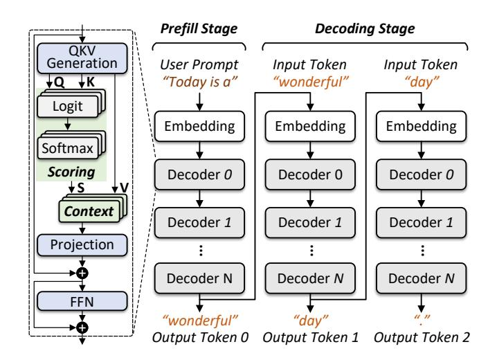

# 1 Introduction

Transformer-based large language models (LLMs) emerge as powerful tools for natural language processing [\[5,](#page-12-0) [9,](#page-12-1) [10,](#page-13-0) [12,](#page-13-1) [71\]](#page-16-0). As fundamental building blocks, they empower complex AI applications such as conversational systems, image generation, and embodied intelligence [\[6,](#page-12-2) [37,](#page-14-0) [42,](#page-14-1) [45,](#page-15-0) [52,](#page-15-1) [60\]](#page-16-1). The key to the extraordinary performance of LLMs is multihead attention [\[66\]](#page-16-2), a structure predicting output tokens by key-value based context matching and retrieval. Collectively termed the "KV cache", the keys (K) and values (V) are preserved and reused throughout the entire inference process [\[48,](#page-15-2) [57\]](#page-15-3). This space-for-time trade-off eliminates repetitive computation, which is the very reason making transformer a practical LLM solution. Yet on the other hand, the use of KV cache issues two problems in GPU-based systems:

Problem #1: memory footprint and offloading overhead. KV cache accounts for 30%–80% of the overall GPU memory usage in LLM inference [\[72,](#page-16-3) [74,](#page-16-4) [78\]](#page-17-1). Scaled with the sequence length, it becomes one of the major causes of the gap between memory requirement and provisioning. Offloading is now a de-facto solution to overcome this challenge [\[34,](#page-14-2) [51,](#page-15-4) [59,](#page-15-5) [61\]](#page-16-5). However, it incurs significant overhead, especially when the KV cache needs to be persisted to support advanced features like long conversation preservation and fault tolerance [\[31,](#page-14-3) [49,](#page-15-6) [67\]](#page-16-6). In our early-stage evaluation, we observe a 0.3–2.0× slowdown when 1–4 evictions are triggered in an SSD-based offloading system (see Section [2\)](#page-1-0).

Problem #2: sub-optimal performance in decoding. In the decoding stage of inference, output tokens are generated auto-regressively. GPUs are typically not maximally used in this stage, as KV cache processing has very low arithmetic intensity [\[15,](#page-13-2) [19,](#page-13-3) [53,](#page-15-7) [55,](#page-15-8) [79\]](#page-17-2). Considering the size of the KV cache, GPUs have to frequently move its slices into and out of streaming multiprocessors, resulting in significant data transfer overhead. Moreover, the KV cache cannot be shared across different requests, which means we cannot simply improve the utilization of GPU by batching [\[53\]](#page-15-7).

Existing studies address the above problems separately. Offloading systems approach problem #1 by finding better eviction and reloading timings [\[13,](#page-13-4) [14,](#page-13-5) [51,](#page-15-4) [59,](#page-15-5) [61\]](#page-16-5). However, for most of these systems, the offloaded KV cache will not be processed until the task is rescheduled. Stage-split inference systems approach problem #2 by executing prefill and decoding on GPUs with different computation capabilities [\[20,](#page-13-6) [21,](#page-13-7) [27,](#page-14-4) [55\]](#page-15-8). Although this design improves the utilization of high-performance GPUs, the performance pit in decoding is basically unsolved, but just left to wimpy GPUs.

We observe possibilities of addressing these problems jointly by PIM techniques. From the perspective of hardware characteristics, PIM is both the data storage and acceleration hardware. From the perspective of task features, we notice that all non-batchable operations in decoding are included in KV cache processing. Offloading KV cache to PIM, as a result, leads to both the acceleration of these non-batchable operations, and the possibility of higher GPU utilization. In this paper, we propose REPA, a GPU-PIM hybrid system to prototype this idea. In order to achieve non-volatility, and balance performance and capacity, we choose resistive memory (ReRAM) and reconfigurable computing [\[2,](#page-12-3) [4,](#page-12-4) [23,](#page-14-5) [32,](#page-14-6) [68\]](#page-16-7) for our PIM device, REPA-PIM. To justify this decision, we include a detailed feature and applicability analysis, comparing the chosen technique with other popular PIM techniques in Section [3.](#page-2-0) We also perform comprehensive tests against these solutions in Section [8](#page-8-0) to further justify our decision from the perspective of empirical results.

Parallelism is both an opportunity and challenge to our system. On one hand, our PIM technique naturally supports higher parallelism: First, ReRAM cell arrays allow parallel operations on multiple wordlines; second, reconfigurable PIM performs most computation within cell arrays, eliminating the dependence on per-bank CMOS logic. While on the other hand, these features are not fully explored for KV cache processing, which calls for the development of more targeted optimizations, especially in micro-architecture and data mapping. Moreover, parallelization is also a must for REPA, as we need to maximally leverage parallelism to overcome the relatively slower per-operation speed of reconfigurable PIM. In this paper, we propose optimizations in (1) micro-architecture, (2) data mapping and (3) pipelining to better parallelize REPA:

(1) Micro-architecture (Section [5\)](#page-4-0). We propose bulk-wise memory setting instructions to support wordline parallelism, and reduce the number of instructions issued in computing.

Figure 1. LLM model structure and inference procedure.

We also propose multi-level controllers. By placing controllers deeper into the PIM hierarchy, REPA is open for more flexible and finer-grained parallelization control.

- (2) Data mapping (Section [6\)](#page-5-0). Locality is the key to fully leverage the optimization in micro-architecture. We propose the locality-aware mapping strategy slicing KV matrices into larger chunks, and mapping them to nearby cell arrays. This design maximally uses the bulk-wise instructions, and reduces the long-range data transfer in our system.
- (3) Pipelining (Section [7\)](#page-7-0). We improve hardware utilization by the pipelining of GPU and REPA-PIM. We use sub-batch pipelining to interleave GPU and PIM operations, and reduce the idleness inside a batch. We also propose transfer overlapping to further shadow the KV transfer by computation.

REPA is the first leveraging reconfigurable PIM for the acceleration of KV cache offloading and processing. It is 1.5–6.5× faster and 8–10× more efficient than the GPU-only (NVIDIA A100) system. REPA is at the same time highly integratable. It boosts the offloading in FlexGen by 0.4–1.0×, and leads to 1.2–1.4× and 0.3–0.5× improvement in end-to-end latency and throughput, respectively. This result suggests that our work can be used as a patch to enhance existing systems, which may also envision a large-scale disaggregated system with high-performance interconnect like CXL.

