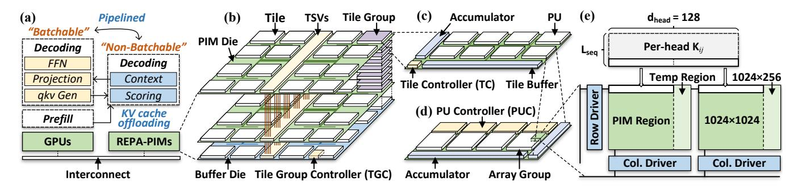

# **System Overview**

REPA is a GPU-PIM hybrid system. As illustrated in Figure 8a, the system has two types of devices: GPU and REPA-PIM. GPU performs the entire prefill stage, and all batchable tasks

**Figure 8.** (a) REPA System. (b) REPA-PIM architecture. (c)(d)(e) Layout of the tile, processing unit (PU) and cell array.  $d_{head}$  and  $L_{seq}$  in (e) denotes the per-head feature dimension and sequence length.  $\mathbf{K}_{ij}$  in (e) denotes the K matrix of the i-th head of decoder j.

in decoding (including qkv generation, projection and feedforward). REPA-PIM performs all non-batchable tasks (i.e., scoring and context in decoding).

REPA-PIM has a heterogeneous 3D-stacked architecture, and supports fine-grained parallelization (Section 5). We achieve high parallelism by bulk-wise memory setting instructions and the multi-level-controller design. The former enables wordline parallelism inside a cell array, reducing the instructions to be processed. The latter enables more flexible control of such a finer-grained parallelization, trading 5.76mm2 per-die area overhead for 3.91× speedup.

The fine-grained parallelization ability of REPA-PIM motivates the locality-aware data mapping (Section 6). We do not interleave per-head KV matrices into far apart "banks" or "channels" like many studies. Instead, we partition them into larger slices, and place these slices onto nearby cell arrays to fully leverage the locality of reconfigurable computing. This fulfills the parallelization potential of bulk-wise instructions, and reduces the on-chip data traffic significantly.

We also develop pipelining techniques to maximally utilize GPU and REPA-PIM (Section 7). Since parallelism in REPA is fine-grained, we do not use the deep head- or decoder-level pipelines. Instead, we use sub-batch pipelining to ensure neither GPU nor REPA-PIM are idle inside a batch. We also propose transfer overlapping, which shadows the transfer of KV matrices and qkv vectors with GPU or PIM computation.

## 5 REPA-PIM Architecture

## 5.1 Memory Layout

As illustrated in Figure 8b, REPA-PIM takes a 3D-stacked architecture design. The device comprises a buffer die and eight PIM dies connected by through-silicon vias (TSVs).

Memories in REPA-PIM are hierarchically organized, which is similar to the HBM. REPA-PIM has 16 *tiles* on each PIM die. Analogous to the HBM channel, tiles are vertically organized into *tile groups* enabling full parallelization. The tile performs PIM operations by 8 *processing units* (PUs). Analogous to the memory bank, a PU comprises 128 1024×2560 *cell arrays* divided into 4 *array groups*. In order to prevent the sneak

**Table 2.** #MemOps/cell of 16-bit fixed-/floating-point (FX/FP) reconfigurable and DRAM PIM. We refer to FloatPIM [24] (reconfigurable) and TransPIM [79] (DRAM) for PIM procedures.

| <b>Computation Type</b> | Reconf. PIM | DRAM PIM | ×MemOps |
|-------------------------|-------------|----------|---------|
| FX addition             | 12          | 3        | 4.0     |
| FP addition             | 20          | 3        | 6.7     |
| FX multiplication       | 96          | 3        | 32.0    |
| FP multiplication       | 23          | 3        | 7.7     |

current affect [30], we implement the cell array by cascading two 1024×1280 sub-arrays. As shown in Figure 8e, bitlines of these sub-arrays can be independently selected by their own column drivers. This design facilitates the addressing, and improves the parallelism of PIM computation. Each subarray has a 1024×1024 PIM region for KV storage and PIM computation, and a 1024×256 temp region for intermediate data. The reason why we cascade two, rather than more sub-arrays is that the 2048-column PIM region is perfectly suitable for the storage of the per-head KV matrices within a decoder block. As illustrated in Figure 8e, such matrices have an invariant column size, which is the per-head feature dimension,  $d_{head}$ . We notice that  $d_{head} = 128$  for most LLMs. This implies that the storage of a per-head k or v vector needs 2048 memory cells under 16-bit data format, which is precisely twice the bitline width of the PIM region.

## 5.2 PIM Control

Since most computation in reconfigurable PIM can be performed by pure memory instructions, we extend the DRAM instruction interface for REPA-PIM. A major challenge here is the massive number of instructions required in computation. As illustrated in Table 2, reconfigurable PIM needs 4–32× more operations per cell than DRAM PIM, which becomes a potential source of performance loss. The key idea to address this challenge is parallelism, which we achieve by a joint optimization on instructions and micro-architectures.

**Bulk-wise memory setting.** We propose the bulk-wise memory setting instruction (BLK\_SET) to parallelize NOR-based addition and multiplication on multiple wordlines. As

discussed in previous research, reconfigurable PIM performs addition and multiplication by a sequence of in-situ NORs [\[1,](#page-12-6) [24\]](#page-14-7). Recall Figure [4](#page-2-4) in Section [3.1,](#page-2-3) such NORs are conceptually memory settings activating two input cells, and setting the output cell with the current generated from the inputs. Therefore, to perform a specific bulk setting, we need to specify: (1) wordlines to be parallelized, (2) two bitlines for input, and (3) the bitline for output.

Table 3. Format of the BLK\_SET instruction.

#### (a) Overview of BLK\_SET.

| Field | Opcode | Block Addr. | Input1 | Input2 |  |
|-------|--------|-------------|--------|--------|--|
| #Bits | 8      | 24          | 16     | 16     |  |

(b) Format of the block address in BLK\_SET.

| Field | Rsv. | TG | Tile | PU | AG | Arr. | Block |
|-------|------|----|------|----|----|------|-------|
| #Bits | 3    | 4  | 3    | 3  | 2  | 5    | 4     |

Since types of sub-NORs inside an addition or multiplication are fixed, REPA-PIM can infer the bitline of the output cell with the NOR type. Taking fixed-point multiplication as an example, the computation contains 3 types of NORs for partial product and 11 types of NORs for addition, each of which has fixed output offset relative to the input [\[1\]](#page-12-6). We also notice that for a specific multiplication or addition, the output cells of previous NORs/memsets are not reused as the outputs of their successors. This means we can acquire the offset by the NOR type, and infer the output bitline by offsetting from the beginning of the temp region. Through this design, the instruction length is constrained to 64 bits, and we only need to specify three operands listed as follows:

- (1) Block address. BLK\_SET specifies a group of 64 adjacent wordlines for parallel memory settings. Named "memory block" in REPA-PIM, such a memory region is identified by a 24-bit address illustrated in Table [3b.](#page-5-1) The higher 3 bits are reserved bits, and the remaining bits help identify the block location through the tile group (TG), tile, PU, array group (AG) and block hierarchy. A question is that why we do not specify the memset range by specific wordlines. The reason for this design decision is two-fold. First, it eliminates variable-length parameters resulted from the per-wordline range specification, which lowers the complexity of instruction decoding. Second, by using memory block addresses, our strategy simplifies the addressing mechanism, reducing both address storage and translation overhead.
- (2) Two input bitlines. The Input1 and Input2 operands specify the input bitlines for an in-memory NOR. Each of them have 16 bits, supporting up to 2 16 columns of a cell array. REPA-PIM has 2560 columns per array, thus 13 out of 16 bits are used to address each input bitline.

Multi-level controllers. As shown in Figure [8,](#page-4-2) we use tile group, tile and PU controllers to enable fine-grained parallelism in REPA-PIM. The tile group controller (TGC) is

Table 4. Speedup and per-die area overhead w.r.t. #controllers/PU. We test the logit (q × K T ) operation, with the area overhead estimated at the 14nm technode.

| #Controllers/PU        | 1    | 2    | 4    | 8     | 16    | 32    |
|------------------------|------|------|------|-------|-------|-------|
| ×Speedup               | 1    | 1.95 | 3.91 | 5.20  | 7.17  | 9.83  |
| Per-die Area (mm2 ) | 1.92 | 3.84 | 7.68 | 15.36 | 30.72 | 61.44 |
| ΔSpeedup/ΔArea         | -    | 0.49 | 0.51 | 0.16  | 0.13  | 0.09  |

analogous to the per-channel HBM controller. The difference is that tile group controllers do not directly manipulate ReRAM arrays. Instead, they dispatch PIM operations to designated tile controllers, which parallelizes all their tiles. The tile controller (TC) parallelizes its PUs by forwarding the dispatched operations. It also controls the accumulation of partial results produced by each PU. The PU controller (PUC) is an extension of cell array drivers, which is responsible for the manipulation of ReRAM cells. We place four such controllers in one PU, each parallelizing a specific group of cell arrays. We do not arrange more controllers in PU, as the four-controller setting is already sufficient for good parallelism. A per-head K/V matrix requires 1MiB memory space under the maximum 4096 sequence length, which is the PIM region capacity of four arrays. This means computation on these arrays can be parallelized if we evenly distribute them to four array groups, and manage their computation by dedicated controllers. As to inner-array parallelism, we leave it to bulk-wise instructions and the independent column drivers of sub-arrays (see Figure [8e](#page-4-2)).

Another notable fact is that the 4 controllers/PU setting is cost-effective. As illustrated in Table [4,](#page-5-2) the speedup of q×K T scales with #controllers/PU when it is ≤ 4, and the trend significantly slows down when we attempt to arrange more controllers. Compare to the 1 controller/PU setting, we trade a 5.76mm2 per-die area overhead for a 3.91× speedup. In comparison, increasing #controllers/PU to 32 only attributes to another 2.51× speedup. This is because when we arrange more than 4 controllers for a PU, per-head KV matrices are scattered across many array groups, which increases the data gathering overhead. Moreover, the per-die area overhead of 8, 16 and 32 controllers are too costly for our system, which prevents us from using these settings.

