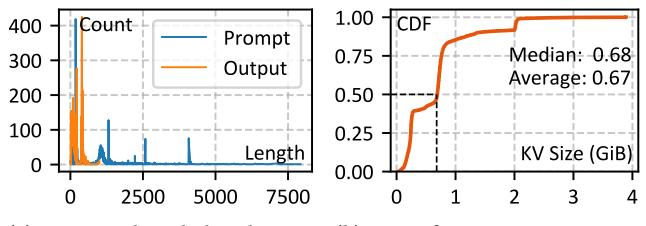
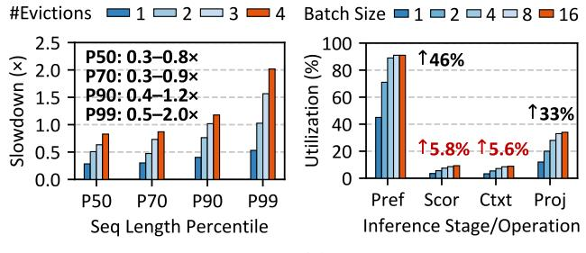

# 2 Background and Motivation

As illustrated in Figure [1,](#page-1-1) LLM inference comprises two stages. The first is prefill summarizing user prompt and generating the first output token. The second is decoding, during which output tokens are generated auto-regressively.

Multi-head attention is the core of LLM. It functions by query-based context matching and retrieval. The model firstly encodes the user prompt into the query matrix Q, and matches it with the key matrix K by logit (Q×K T ) and softmax. Termed as "scoring", this process generates a score matrix S. Each of its row, s , represents a probabilistic mixture of context

(a) Sequence length distribution. (b) CDF of per-request KV size.

Figure 2. The sequence length and per-request KV cache size of Azure23 dataset. We use Llama2-7B for this test.

- SSD-based KV cache offloading. stages under different batch size.
- (a) Inference slowdown due to (b) GPU utilization of inference

**Figure 3.** Overhead of KV cache offloading and processing. "Pref" denotes prefill. "Scor", "Ctxt" and "Proj" denotes the scoring, context and projection operation in decoding, respectively.

information matching input token  $q_i$ . Then, the model uses this score matrix to retrieve and blend the context from the the value matrix V for each input token. This process is performed by  $S \times V$ , and we call it "context". Once a new output token is generated, we append a new row to Q, K and V, respectively. When the previous K and V matrices are preserved, we only need to use the new query token q to perform scoring and context, which prevents repeated computation. Here, the K and V matrices function as a cache, and thus we collectively call them the "KV cache".

KV cache is characterized by high memory footprint and low arithmetic intensity. As shown in Figure 2, real-world inference requests have long sequences, and consequently, large KV cache. In the Azure23 dataset [55], the average KV cache size is 670MiB for a 7B model. To quantitatively study how KV cache offloading affects the inference performance, we test the incurred inference slowdown with respect to the sequence length and number of evictions. As shown in Figure 3a, we observe 0.3-0.8× and 0.5-2.0× slowdown for median-length and P99-percentile requests respectively. This suggests that the inference serving system suffers about 30% performance loss offloading KV cache to the SSD.

In addition, the scoring and context operation in decoding has low arithmetic intensity, which causes low GPU utilization. To quantitatively illustrate this, we test the GPU utilization of different inference stages and operations under various batch size settings. As shown in Figure 3b, GPU cannot be fully utilized for scoring and context, even under large

batch sizes. The utilization increases by 5.8% and 5.6% respectively when we increase the batch size to 16. In comparison, we observe a 33% increase for projection. This difference is due to the fact that scoring and context are non-batchable, which is also inevitable when they are processed by the GPU.

