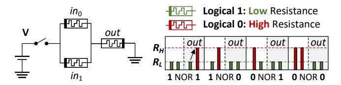
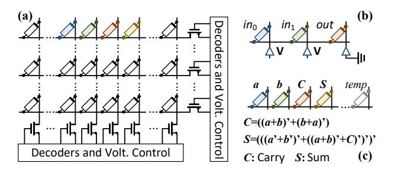
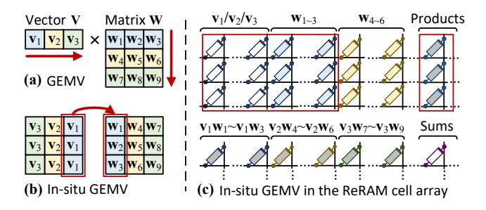
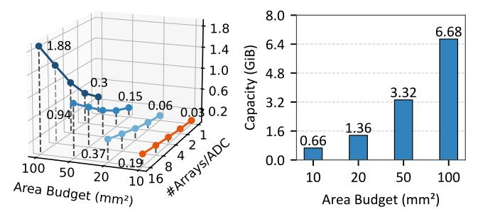

# PIM Technique Decision

We choose reconfigurable ReRAM PIM as the PIM technique for REPA. In this section, we introduce how it works (Section 3.1), and justify this design decision by a comparison against three widely-adopted PIM solutions (Section 3.2).

## 3.1 Reconfigurable PIM with ReRAM

ReRAM is one of the fastest non-volatile memory mediums [63], which is reported to be  $100-1000 \times$  faster than flash [46]. ReRAM is fast in reading, which is comparable to DRAM [8, 69]. Its write performance is relatively lower ( $\sim 5 \times$  slower than DRAM with no optimization), but has been successfully improved to 91%-94% of the DRAM performance in recent research [69]. Density is another highlight of ReRAM. It supports the 4F2 density (F is the technode), which enables a denser layout and a potentially higher capacity than DRAM.

**Figure 4.** NOR gate built from ReRAM cells.

As illustrated in Figure 4, ReRAM cells use the high and low resistance state to represent logical 0 and 1, respectively. State flip requires a strong enough voltage to initiate. When the positive pole (the left side of  $in_0$  and  $in_1$ ) has higher electric potential, the resistance decreases. Similarly, the resistance increases when the potential at the negative pole is higher. Prior work uses this feature to build logic gates out of ReRAM cells [2, 4, 23, 32, 68]. Figure 4 illustrates the implementation of the NOR gate and its truth table.

As shown in Figure 5a and 5b, we can layout such logic gates in the cell array, and construct our desired computational logic. Figure 5c shows the 1-bit addition using ReRAM NOR gates. More complex logic, such as multiplication and floating-point computation has also been explored by prior work [24, 77]. Reconfigurable PIM enables massive parallelizations in memory, which can be used to accelerate tensor operations such as general matrix-vector multiplications (GEMVs). Figure 6 illustrates the computation of GEMV by reconfigurable PIM. Here, the matrix is stored in its transposed form in memory (see Figure 6b and 6c). Since ReRAM does not need pre-charging, we can activate multiple wordlines simultaneously. To perform  $V \times W$ , we parallel  $v_1 \times w_1$ ,  $\mathbf{v}_1 \times \mathbf{w}_2$  and  $\mathbf{v}_1 \times \mathbf{w}_3$  on each wordline, and store the partial

Figure 5. (a) ReRAM cell array. (b) NOR gate layout in the cell array. (c) In-situ 1-bit addition using NOR.

Figure 6. Reconfigurable ReRAM PIM for GEMV.

products. Then, we repeat this process for  $\mathbf{v}_2 \times \mathbf{w}_4 \sim \mathbf{w}_6$ , and  $\mathbf{v}_3 \times \mathbf{w}_7 \sim \mathbf{w}_9$ . After that, we accumulate the partial products on each row in parallel and produce the output vector.

Reconfigurable PIM performs most computation inside memory cell arrays. This offers two benefits echoing our requirement for fast KV cache offloading and processing. First, it enables massive in-memory parallelization. Computation will no longer be bounded by the near-bank CMOS logic, leading to a higher theoretical parallelization ability. Second, reconfigurable PIM supports higher memory capacity. The minimized requirement for the peripheral logic significantly reduces the area overhead. Combined with the excellent density of ReRAM cells, it achieves very high capacity, meeting the key requirement of a KV cache offloading system.

**Table 1.** Design choices for REPA-PIM. The speed is measured by the time required for completing a single operation.

| Architecture  | Speed  | Scalibility | Capacity | Non-volatile |
|---------------|--------|-------------|----------|--------------|
| DRAM PIM      | High   | Medium      | High     | ×            |
| Reconf. DRAM  | Low    | High        | High     | ×            |
| Analog ReRAM  | High   | High        | Low      | ✓            |
| Reconf. ReRAM | Medium | High        | High     | 1            |

## 3.2 Comparison Against Other PIM Solutions

To further justify our design choice, we compare it with three representative DRAM/ReRAM PIM architectures. We summarize their characteristics in Table 1, and discuss their features in detail in the remainder of this section.

- area budget and ADC density.
- (a) Analog PIM capacity w.r.t. (b) Reconfigurable ReRAM PIM capacity w.r.t. area budget.

Figure 7. Capacity of analog vs. reconfigurable ReRAM PIM within 10–100mm2 area constraints at the 14nm technode.

DRAM PIM [15, 18, 19, 53] is a widely-adopted PIM solution based on the high-bandwidth memory architecture [29], using on-die CMOS logic to perform computations. Though faster than reconfigurable PIM in single operations, DRAM PIM has limited potential in massive parallelization, as its computational logic is typically shared across multiple cell arrays or banks [18, 53]. In section 8.3, we show that our solution outperforms state-of-the-art DRAM PIM systems.

Reconfigurable DRAM PIM [16, 41, 79] uses DRAM to build logic gates. However, most existing solutions cannot fully unleash the parallelization potential of reconfigurable computing, which is due to two reasons. First, DRAM cells are volatile and need pre-charging before reading. This makes it difficult to achieve wordline parallelism like ReRAM. Second, many solutions are based on traditional DRAM architectures, where the per-channel memory controller can lower the parallelization degree of the system. In this paper, we overcome these drawbacks by bulk-wise memory instructions and multi-level PIM controllers (Section 5.2).

Analog ReRAM PIM [8, 26, 44, 64, 70] is an architecture with high speed but low memory capacity. It is highly specialized for GEMV acceleration, where computations are performed by the integration of currents. Its bottleneck is the requirement of high-precision ADCs in result decoding. As reported by previous studies, ADCs account for more than 50% of the chip area [50, 70], which consequently reduces the area for memory cell arrays. As illustrated by our quantitative evaluation in Figure 7, analog PIM has 3.6-22× less memory capacity than the reconfigurable solution under the same area budget. This makes it inadequate for the offloading of the memory-hungry KV cache data.

