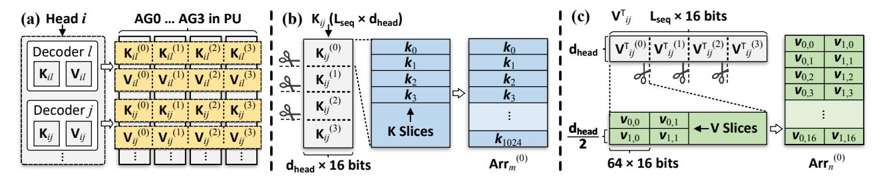
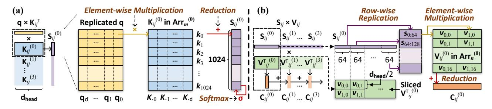
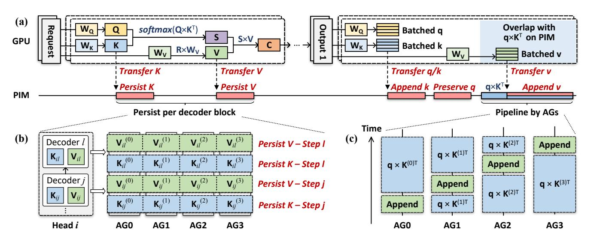

# 6 Locality-aware Data Mapping

## 6.1 Mapping of New Requests

The KV cache of a specific inference request is split into groups by attention head, each of which contains the perhead KV matrices from all decoders. An example of such a KV cache group is shown in Figure [9a](#page-6-0), in which we depict the per-head KV matrices of decoder and . To map the KV cache groups, we sort them by head IDs and place them one after another onto dedicated tile groups with the largest free space. When encountering insufficient resources, we perform

**Figure 9.** (a) Mapping of the per-head KV matrix group. (b)(c) Slicing and mapping of the per-head K and V matrices. "AG" denotes the array group. "Arr $_m^{(g)}$ " denotes the cell array m in array group g.  $\mathbf{k}_0, \ldots, \mathbf{k}_{1024}$  are row vectors in  $\mathbf{K}_{ij}^{(0)}$ .  $\mathbf{v}_{r,c}$  are slices of  $\mathbf{V}_{ii}^{T(0)}$ , where r and c represents the row and column index, respectively. Each  $\mathbf{v}_{r,c}$  has  $\frac{d_{head}}{2} \times 64$  16-bit values.

**Figure 10.** Reconfigurable PIM implementation of the partial (a) scoring and (b) context operation.  $\mathbf{q}_0, \dots, \mathbf{q}_d$  are components of the  $\mathbf{q}$  vector.  $\mathbf{s}_{u:v}$  denotes replicated [u,v) slices of  $\mathbf{S}_{ij}$ , each of which has  $\frac{d_{head}}{2}$  rows (replicas).

scale-out, and leave the unused space for the decode-time KV appending of those already-mapped heads. This strategy maximally parallelizes all tile group controllers, which speeds up the persistence of KV cache. Moreover, splitting the KV cache by attention head incurs very limited overhead. This is because REPA-PIM only needs to gather  $N_{head}$  vector slices (with the size  $1 \times d_{head}$ ) at the end of each decoder block, and broadcast the concatenated  $1 \times (d_{head} \cdot N_{head})$  vector to all tile groups. The fragmentation overhead incurred by scale-out is also moderate, which we show in Section 8.6.

For the per-head matrices in a specific KV cache group (e.g.,  $\mathbf{K}_{ij}$ ,  $\mathbf{V}_{ij}$ ,  $\mathbf{K}_{il}$  and  $\mathbf{V}_{il}$  in Figure 9a), the strategy prioritizes free PUs for their placement, enforcing three policies:

- (1) Each per-head matrix is split and placed onto four free cell arrays, each of which belongs to a dedicated array group. This is because any per-head matrix is 1MiB at most, which is precisely the data capacity of four cell arrays. This split-and-placement strategy offers significant benefits: First, it quadruples the speed of logit and context operations by fully parallelizing all four array groups of the PU. Second, by filling the cell array with data from the same per-head matrix, this strategy fully utilizes the bulk-wise instruction in the upcoming scoring and context computation. Third, it facilitates the gathering of partial results by echoing the high locality of reconfigurable PIM.
- (2) The per-head K and V matrix slices of a specific decoder block (e.g.,  $\mathbf{K}_{ij}^{(0)}$ ,  $\mathbf{V}_{ij}^{(0)}$  and  $\mathbf{K}_{ij}^{(1)}$ ,  $\mathbf{V}_{ij}^{(1)}$ ) must be mapped to the

same array group. This is another design echoing the locality of reconfigurable computing. We notice that the partial result of the  $\mathbf{q} \times \mathbf{K}_{ij}^{(0)}$  is used by  $\mathbf{V}_{ij}^{(0)}$ . When placing these slices nearby, we restrict the frequent partial result propagation inside the PU, which significantly reduces the data transfer on external interconnects.

(3) Per-head KV slices from different decoders are placed sequentially in the array group. This design eliminates the performance bottleneck in array groups. The array group may become a bottleneck, as the 32 cell arrays in it are managed by a single PU controller. By sequentially mapping KV slices from different decoders to these arrays, we eliminate the need to parallelize the per-group arrays, because at any moment, there will be only one decoder being processed.

#### 6.2 Mapping of the Per-head Matrix

Now, we detail how REPA-PIM slices a specific per-head K/V matrix, how it maps the slices to cell arrays, and how computation is parallelized on these arrays.

**Per-head K mapping**. As illustrated in Figure 9b, we split the per-head K matrix in rows into four slices, and map each slice to a free cell array. For a specific slice (e.g.,  $\mathbf{K}_{ij}^{(0)}$  in Figure 9b), we further split it into row vectors, and map each of these vectors sequentially to a row of the cell array.

To perform the  $\mathbf{q} \times \mathbf{K}_{ij}^{\mathrm{T}}$  operation, we replicate the  $\mathbf{q}$  vectors, and parallelize the dot-product on each row of the cell array. As illustrated in Figure 10a, the dot-product is performed by

**Figure 11.** (a) Overlapping of computation and KV transfer. (b) Persistence of prefill KV matrices. (c) Pipelining of v vector transfer and  $\mathbf{q} \times \mathbf{K}^{\mathrm{T}}$  computation. *Matrix*  $\mathbf{R}$  *in* (a) *denotes the input requests*.

element-wise multiplications (i.e.,  $\mathbf{q}_0 \times \mathbf{k}_{.0}$ ,  $\mathbf{q}_1 \times \mathbf{k}_{.1}$ ,...) and reductions. The result on row r is the r-th component of the partial result. The final activation  $\mathbf{S}_{ij}$  can be computed by applying concatenation and softmax on the partial results (i.e.,  $\mathbf{S}_{ij}^{(0)} \sim \mathbf{S}_{ij}^{(3)}$ ). In this procedure, most computation is performed locally inside array groups, and only the construction of the final result needs inter-group data transfer.

**Per-head V mapping**. As illustrated in Figure 9c, we map the per-head V matrix by vertically partitioning its transposed form. For a specific partition (e.g.,  $\mathbf{V}_{ij}^{T(0)}$  in Figure 9c), we firstly cut it into two by rows, and then split each of them vertically into slices with  $d_{head}/2 \times 64$  elements. Since the PIM region of each cell array has 2048 columns, we can fit these slices into the array with the layout in Figure 9c.

As illustrated in Figure 10b, the  $S_{ij} \times V_{ij}$  operation is decomposed into four parts. Taking the first part,  $S_{ij}^{(0)} \times V_{ij}^{(0)}$  as an example, it comprises dot-products between several S and V slices. In specific, the  $S_{ij}^{(0)}$  vector is split into several 64-element slices. Each slice is then replicated in rows, enabling the parallelism of the dot-products. For example, we can parallelize dot-products between slice  $\mathbf{s}_{0:64}$ ,  $\mathbf{v}_{0,0}$  and  $\mathbf{s}_{0:64}$ ,  $\mathbf{v}_{1,0}$ . The partial dot-products will be reduced to construct the partial context  $C_{ij}^{(0)}$ . The final per-head context,  $C_{ij}$ , can be constructed by reducing all partial context vectors.

