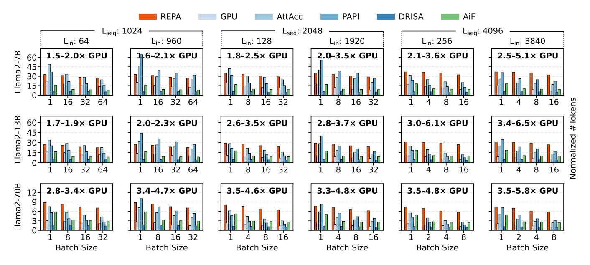
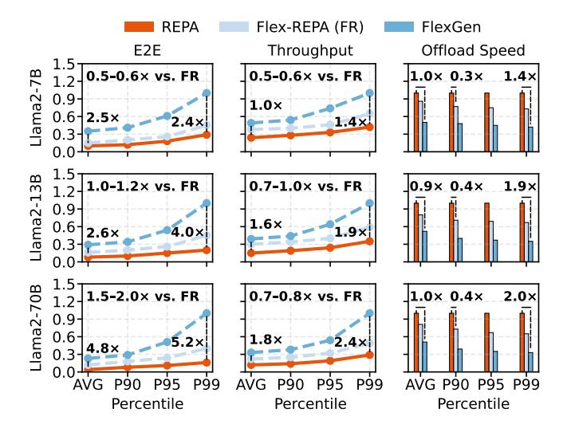
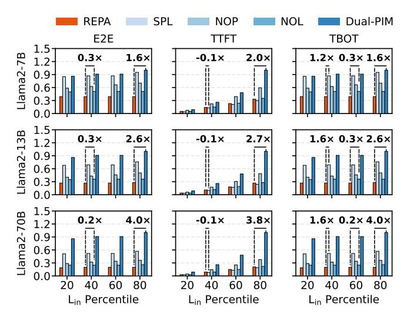
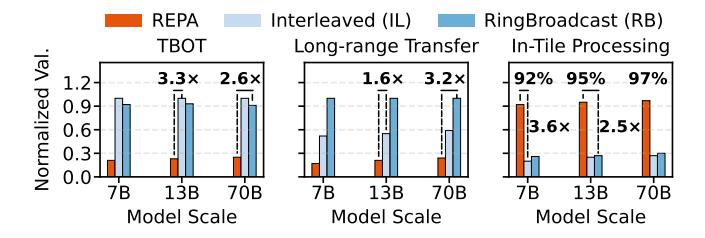
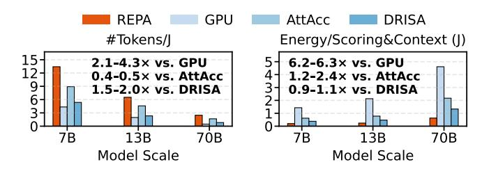
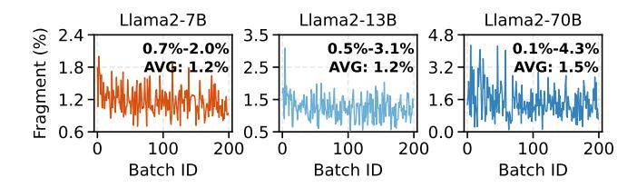

# 7 Pipelining GPU and REPA-PIM

The stage-split inference pattern of REPA has made device utilization a key concern. To maximally utilize GPU and REPA-PIM, we pipeline them by two techniques.

**Sub-batch Pipelining**. Sub-batch Pipelining is an effective idea maximizing device utilization within a hybrid system [19, 53]. In this paper, we interleave requests to GPU and REPA-PIM by their execution stage. Here, a batch is split

into two sub-batches. REPA executes them alternately on GPU and REPA-PIM to keep both of them busy. The size of sub-batches are adaptively decided by the computation capability of the device, which we define by the per-workload performance within a recent time period. Given that most operations in inference are matrix-vector or matrix-matrix multiplications, REPA uses the scale of such operations (i.e., number of scalar multiplication and addition) to estimate the workload scale. We also incorporate the idea of iteration-level scheduling [76] to allow new and terminated requests to be continuously appended into or removed from the batch.

**Transfer Overlapping**. The size of the KV cache makes its transfer a performance concern. In this paper, we alleviate this overhead by taking the opportunity of overlapping.

Transfer overlapping in prefill. As illustrated in Figure 11a, we overlap the transfer of KV matrices with GPU computation. Specifically, we overlap the transfer of K matrices with scoring and V generation. After V matrices are generated, we overlap its transfer with the context operation. As shown in Figure 11b, the prefill KV matrices are transferred and persisted per decoder block. Matrices from different attention heads are persisted in parallel by designated tile groups. During the transfer of per-decoder KV matrices, the computation on other PUs and tiles will not be affected. This high parallelism is attributed to the locality-aware mapping strategy—if we interleaved and mapped per-decoder KV matrices across multiple PUs and tiles, their transfer and persistence would impact the computation of many other requests.

Transfer overlapping in decoding. We also overlap the transfer of batched q, k and v vectors in decoding. As illustrated in Figure 11a, we overlap the transfer of batched q and k vectors with the generation of v vectors, and overlap the transfer of v vectors with the  $\mathbf{q} \times \mathbf{K}^T$  operation on REPA-PIM.

As illustrated in Figure 11c, v vectors are appended to V matrices in pipeline. The reason for this design is that v vectors must be transferred to the PU via the external interconnect. Pipelining v vector storage by array groups reduces chances of conjunction. For a specific PU, there will be only one array group performing v vector persisence, and the  $\mathbf{q} \times \mathbf{K}^T$  computation of other array groups will not be blocked.

#### 8 Evaluation

## 8.1 Prototype Implementation

We implement a prototype of REPA in 1.3K and 7.0K LoC respectively in Python and C++.

Device access and management. We extend PyTorch [54], and provide a Python wrapper for inference tasks to use REPA-PIM. We also build a runtime system for the management of task status and PIM memory. The PIM memory is addressed in bytes and allocated in 64×2560 blocks. As discussed in Section 5, 2560 is the column size of the REPA-PIM cell array, which includes 2048 cells for KV cache preservation and PIM computation, and 512 cells for the temporary storage of intermediate data. We let the number of rows per allocation be 64, as it is a balanced option for efficiency and memory space utilization. Considering the size of the KV cache, the block size per allocation can be larger, which prevents frequent allocation, and reduces the size of the network-memory mapping structure. On the other hand, eschewing an over-sized memory block (e.g., 128×2560 or 256×2560) helps improve memory utilization, as we have more chances of waste when provisioning larger blocks.

**Reconfigurable computation.** We use FP16 as the data format of REPA, and the solution proposed by FloatPIM [24] for reconfigurable addition and multiplication. For the maximum operation in softmax, we use the fast in-situ maximum solution proposed by ReSQM [38]. REPA needs only 16 cycles to retrieve the maximal from N FP16 values when they are stored in the same cell array. To calculate the  $e^x$  in softmax, we rewrite it by  $2^{x \log_2 e}$ , and decompose it to a  $2^x$  and a multiplication. The multiplication is introduced earlier in this paragraph, and the  $2^x$  is performed by left-shifting.

#### 8.2 Evaluation Setup

**Experimental environment.** We test REPA on an Ubuntu 22.04 server with 40 CPU cores and 8 NVIDIA A100 GPUs. We faithfully implement the design of REPA-PIM into an in-house simulator. The simulator is built over NeuroSim-3D [56], the 3D-stacked version of the time-tested cycle accurate NeuroSim simulator [7]. REPA-PIM operates under 1GHz. It uses a 14nm bipolar resistive technology node, with its parameters set following the VTEAM model [33]. To align with existing work and practical devices [24, 32], we set the switching delay of ReRAM cells to 1ns, and the voltage pulse of SET and RESET to 1V and 2V, respectively. We estimate instruction dispatch latencies by the time-to-flight latency

in controllers and the on-wire transfer latency. The time-to-flight latency is  $\sim$ 20ns. The on-wire latency for TGC $\rightarrow$ TC, TC $\rightarrow$ PUC and PUC $\rightarrow$ DRV is set to 4ns, 2ns and 2ns, respectively. The per-TG/Tile/PU bandwidth is set to 256GB/s, 32GB/s and 4GB/s, respectively.

Experiment design. We use the 7B, 13B and 70B version of Llama2 [65] as our benchmark, and evaluate REPA by five groups of tests. The first test group focuses on the performance of REPA (Section 8.3): (1) We evaluate the token generation performance of REPA in different sequence length settings to show its potential in inference acceleration. (2) We test how REPA-PIM works well with existing offloading systems (FlexGen [61] in this paper) to show its integrability and end-to-end offloading acceleration ability. The second test group focuses on the justification of key design decisions we made (Section 8.4): (1) We evaluate our architectural design, and answer questions such as why we do not use pure PIM for inference and why the traditional prefill-decoding separation technique [20, 21, 27, 55, 59] is not used. (2) We evaluate the data mapping strategy, and show why locality is important for REPA-PIM. The third test group evaluates the efficiency of REPA-PIM, and shows its superior speed from the aspect of per-energy performance (Section 8.5). The fourth test group evaluates the memory fragmentation during inference across models of different scales (Section 8.6). The fifth test group reports the power consumption and area overhead of REPA-PIM (Section 8.7).

## 8.3 REPA Performance

**Token Generation Ability.** We compare the token generation performance of REPA against five baselines:

- **GPU**, the hardware baseline using NVIDIA A100.
- AttAcc [53], a state-of-the-art DRAM PIM solution using near-bank logic for attention acceleration.
- PAPI [18], a state-of-the-art DRAM PIM solution considering the dynamic dispatching of compute- and memory-bound tasks to suitable devices.
- **DRISA** [41], a reconfigurable DRAM PIM solution using DRAM cells for in-situ computing.
- AiF [35], a state-of-the-art in-flash processing system for LLM inference acceleration.

As shown in Figure 12, REPA exhibits superior performance for long sequence, batched requests and larger models. It generates 1.8–4.8× and 2.1–6.5× more tokens than GPU for the 2048 and 4096 sequence length, respectively. In comparison, the improvement is 1.5–4.7× for the 1024 sequence length. Similar results can also be observed when we compare the performance of REPA with AttAcc. For the 4096 sequence length, REPA generates 0.4–1.4× more tokens than AttAcc, while the improvement shrinks to -0.3–0.8× when the sequence length is 1024. The reason for this result is that REPA has slower per-operation speed but higher

**Figure 12.** Token generation performance of REPA and its baselines. We conduct the test with three sequence length settings (namely 1024, 2048 and 4096), each of which contains two sub-settings representing the short and long input, respectively. For each setting, we collect the number of generated tokens under four batch sizes, and normalize the results per second and request.

parallelization ability. As mentioned in Section 3.2 and 5.2, reconfigurable PIM requires more cycles for a single operation and is thus slower when inadequately parallelized. Given the high single-operation speed of the traditional DRAM PIM, it is not surprising that REPA has inferior performance for one-shot inferences. Once we increase the batch size, it regains its edge as the device is fully parallelized. REPA has better performance than PAPI under larger batch sizes and long sequences. It generates 0.5-1.2× more tokens for the 4096 sequence length and the largest batch size settings. However, the performance result varies under different input lengths. For PAPI, the number of generated tokens drops when the sequence is dominant by the output (see results when  $L_{in} = 64,128$  and 256). This is because PAPI uses the Attn-PIM to process the GEMVs in scoring and context, where each processing unit is shared by two memory banks. This works for short output sequences. However, when the Lout, model size and batch size are all large, these processing units can be overwhelmed, leading to a performance loss.

REPA consistently outperforms DRISA (4.1–6.2×) and AiF (0.5–2.6×) under all test settings. The result against DRISA highlights the value of the bulk-wise memory setting instruction. Though slower than DRAM in single-cell update, ReRAM is open for multi-wordline activation, and is thus faster when memory cells are bulk-wisely updated for in-situ NORs. The bulk-wise memory setting instruction makes the best of this feature, which attributes to higher parallelism and superior token generation ability. The result against AiF proves the potential of ReRAM PIM as a solution with both non-volatility and high token generation ability.

**Figure 13.** Normalized end-to-end inference latency, throughput and offloading speed of REPA, vanilla FlexGen and REPA-PIM enhanced FlexGen.

**End-to-end Offloading Ability.** In this test, we evaluate how REPA works well with existing offloading systems. We use FlexGen [61] as the testbed, and show how REPA improves its performance by offloading weights and the KV cache to REPA-PIM (Flex-REPA). We let the offloaded weights and KV cache be processed by REPA-PIM, and leave the offloading strategy unchanged. Since 4-bit quantization is used in FlexGen, we use this setting in REPA and Flex-REPA.

We test the end-to-end latency (E2E), throughput and offloading speed of the three systems using traces from the

**Figure 14.** Normalized E2E, TTFT and TBOT of REPA and its variants. The  $L_{in}$  percentile denotes the proportion of the input length relative to the overall 4096 sequence length.

Azure23 dataset [55]. As shown in Figure 13, REPA and Flex-REPA outperform the vanilla FlexGen systems on all metrics and model scales. We observe 2.4–5.2×, 1.0–2.4× and 0.9–2.0× improvement on E2E, throughput and offloading speed, respectively. Compared to the throughput performance, the improvement on E2E is more significant, as FlexGen is specialized for achieving good throughput, and incorporating REPA-PIM helps it dealing with its weakness in latency.

## 8.4 Design Decision Exploration

**Evaluation on Architectural Designs.** We include four REPA variants to test the efficacy of our architectural designs:

- REPA-SPL, a stage-split variant performing prefill by the GPU, and decoding by REPA-PIM.
- **REPA-NOP**, a variant that does not use sub-batch pipelining for inference.
- **REPA-NOL**, a variant that does not overlap the transfer of KV matrices and vectors with computation.
- **Dual-PIM**, a variant using REPA-PIM for compute-intensive operations.

As illustrated in Figure 14, REPA outperforms all these variants on the E2E latency and time-between-output-tokens (TBOT) metric. The 1.2–1.6× improvement over REPA-SPL suggests the effectiveness of performing batched decoding-time projection and FFN by GPU. The 0.5–0.8× improvement over REPA-NOP suggests the necessity of performing sub-batch pipelining. The 0.2–0.3× improvement over REPA-NOL showcases the effectiveness of transfer overlapping. The 1.6–4.0× improvement over Dual-PIM justifies the hybrid architecture taken by REPA. We also notice that REPA is 0.1× slower than REPA-SPL on time-to-first-token (TTFT). This is because REPA-SPL does not process the projection and FFN in decoding, which leads to higher prefill performance.

**Figure 15.** Normalized TBOT, long-range data transfer and percentage of in-tile processing of three mapping strategies. "Long-range data transfer" refers to that across different tiles.

**Figure 16.** Energy efficiency on two metrics. *The first is the number of output tokens normalized per joule. The second is the energy normalized per scoring and context operation.* 

Given that the E2E latency is dominated by the decoding performance, this minor overhead in prefill is negligible.

**Evaluation on Data Mapping.** The data mapping strategy we propose in REPA highlights locality to fully parallelize the computation. To illustrate its performance, we compare it against two widely-adopted ideas in DRAM PIM. The first is interleaved mapping (IL). Data is delicately sliced and scattered across channels, banks and even cell arrays to fully leverage the near-bank computational logic. In this test, we construct the IL mapping strategy by generalizing the idea in AttAcc [53]. The second baseline we take is RingBroadcast (RB) generalized from TransPIM [79]. This strategy reduces the data gathering overhead by propagating partial results across memory banks. As illustrated in Figure 15, REPA has superior performance on all metrics and model scales. Compared to the IL and RB strategy, it has 3.3× and 2.6× better TBOT, and has 1.6× and 3.2× less long-range data transfer. Due to the REPA-PIM architecture, more than 92% of computation is conducted within a single tile, which is 3.6× and 2.5× better than IL and RB respectively.

## 8.5 Energy Efficiency

We test the energy efficiency of REPA and three baselines on the 7B, 13B and 70B version of Llama2. As illustrated in Figure 16, REPA generates 2.1–4.3×, 0.4–0.5× and 1.5–2.0× more tokens per joule than GPU, AttAcc and DRISA, respectively. For the efficiency of scoring and context operations, its improvement over GPU and AttAcc expands to 6.2–6.3× and 1.2–2.4×, respectively. In contrast, its lead over DRISA drops to 0.9–1.1×. This is because DRISA uses reconfigurable

**Figure 17.** Memory fragmentation on Llama2-7B, 13B and 70B. We use the Azure23 dataset, and set the batch size to 16.

**Table 5.** Area and power overhead by chip components.

| Comp.             | Area (mm 2 ) | Power (mW)  | Params. | Spec.     |  |  |  |  |
|-------------------|-------------------------|-------------|---------|-----------|--|--|--|--|
| Array Overhead    |                         |             |         |           |  |  |  |  |
| Cells             | 0.0016                  | 1.14        | Size    | 1024×2560 |  |  |  |  |
| SA                | 0.0005                  | 1.65        | -       | -         |  |  |  |  |
| DRV               | 0.0011                  | 0.53        | -       | -         |  |  |  |  |
| Total             | 0.0037                  | 3.32        | Size    | 256KiB    |  |  |  |  |
|                   |                         | PU Overhead |         |           |  |  |  |  |
| Array             | 0.4136                  | 51.12       | Total   | 128       |  |  |  |  |
| Acc.              | 0.0001                  | 0.04        | -       | -         |  |  |  |  |
| Buffer            | 0.0034                  | 2.89        | -       | -         |  |  |  |  |
| Bus               | 0.0009                  | 2.70        | -       | -         |  |  |  |  |
| Ctrl.             | 0.0600                  | 4.80        | Total   | 4         |  |  |  |  |
| Total             | 0.4779                  | 61.55       | Size    | 32MiB     |  |  |  |  |
| Tile Overhead     |                         |             |         |           |  |  |  |  |
| PU                | 3.8232                  | 492.41      | Total   | 8         |  |  |  |  |
| Acc.              | 0.0001                  | 0.04        | -       | -         |  |  |  |  |
| Buffer            | 0.0270                  | 14.17       | -       | -         |  |  |  |  |
| HTree             | 0.6590                  | 14.77       | -       | -         |  |  |  |  |
| Ctrl.             | 0.0150                  | 1.20        | -       | -         |  |  |  |  |
| Total             | 4.5243                  | 522.59      | Size    | 256MiB    |  |  |  |  |
| REPA-PIM Overhead |                         |             |         |           |  |  |  |  |
| Total             | 73.2631                 | 68.92K      | Size    | 32GiB     |  |  |  |  |

computing throughout the entire inference process, which is slower and less efficient for batchable operations. While for non-batchable scoring and context, both REPA and DRISA use reconfigurable computing. REPA's improvement in this part is mainly attributed to the energy efficiency of ReRAM.

#### 8.6 Memory Fragmentation

We evaluate the dynamic memory fragmentation of REPA using the real-world Azure23 dataset [55]. We use batch size 16 for all tested models, and record the dynamic fragmentation in Figure 17. REPA incurs limited fragmentation ranging from 0.1%–4.3%. This is attributed to the 64×2560 block we use, which prevents over-provisioning of the resource. We also notice that larger models (e.g., Llama2-70B) exhibit higher fragmentation ratio (up to 4.3%). This is because scale-out occurs more frequently as new requests arrive. While the unused memory will be gradually consumed during decoding, fragmentation may still persist, especially when the appended KV vectors cannot fully occupy the available space.

#### 8.7 Overhead Evaluation

We summarize the area and power overhead of REPA-PIM in Table 2. The device has a 73.3mm² per-die area, in which 26.2mm² is arranged for ReRAM cells. The area for the peripheral computational logic is minimized. It is 0.0001mm² for each PU and tile, which accounts for less than 0.02% of the overall area overhead. The PU and tile controller also incurs limited area overhead. It is 7.92mm² for each die, which is 10.8% of the overall area overhead. As discussed in Section 5.2, we trade this 10.8% additional area for 3.91× speedup. REPA-PIM requires 68.92W power to achieve full parallelism, which is significantly lower than server GPUs.

#### 9 Discussion

Endurance is a potential issue of ReRAM that has been recognized and discussed for long [3, 28, 62]. REPA does not suffer this pitfall when high-endurance ReRAMs are used. To prove this, we estimate the number of memsets performed on each ReRAM cell per year. Since REPA offloads the scoring and context computations in attention, which are conceptually GEMVs, we can than estimate using Equation (1). Here,  $N_{\rm memsets}$  denotes the overall memsets on one ReRAM cell.  $N_{\rm memsets/GEMV}$  and  $N_{\rm secs/year}$  is the number of memsets per GEMV, and the number of GEMVs per second, respectively.  $N_{\rm secs/year}$  is the seconds per year.

$$N_{\text{memsets}} = N_{\text{memsets/GEMV}} \times N_{\text{GEMVs/sec}} \times N_{\text{secs/year}}$$
 (1)

Each **K** and **V** matrix participates in one GEMV in each forward pass during decoding. For matrix **K**, it is the scoring computation. While for matrix **V**, it is the context computation. In GEMV, each matrix element participates in one multiplication and one addition, respectively. According to Table 2, this is 43 memsets for  $N_{\text{memsets/GEMV}}$ . For the estimation of  $N_{\text{GEMVs/sec}}$ , we assume a continuous 20 tokens/s decoding speed. According to these settings, the number of memsets on each cell is less than  $2.8 \times 10^{10}$  per year. It is noticeable that existing work has manufactured ReRAM with an endurance >1012 [36]. This means REPA will not suffer the endurance issue when using high-endurance ReRAM.

## 10 Related Work

PIM for LLM acceleration. PIM on the DRAM and emerging ReRAM memories are both popular research topics. Most DRAM PIM research places CMOS logic near memory banks to reduce data transfer overhead [15, 17–19, 53, 79]. Some of these solutions are GPU-free systems, which perform all operations by PIM [15, 17, 79]. Others are xPU-hybrid solutions overcoming the drawback of PIM by leveraging xPUs for computation-intensive tasks [18, 19, 53]. We also notice systems using reconfigurable computing [16, 41]. These solutions have minimized area overhead but lower performance, as wordlines within a DRAM cell array cannot be parallelized, which causes losses in parallelization. ReRAM PIM

research is mostly based on analog or reconfigurable computing. Analog ReRAM PIM is fast, but constrained by power and memory capacity. Existing studies use this paradigm for the fast process of sparse attention [\[26,](#page-14-10) [39,](#page-14-17) [44,](#page-15-10) [70\]](#page-16-12). However, their low capacity have prevented us from using them for KV cache offloading. Reconfigurable ReRAM PIM supports high capacity, with good performance in memory-intensive operations [\[24,](#page-14-7) [40,](#page-14-18) [73,](#page-16-16) [77\]](#page-16-10). Their edge over DRAM reconfigurable PIM is their compatibility to wordline parallelism, which exhibits a higher potential in parallelization.

KV cache management and offloading. The gap between the LLM size and GPU memory capacity has motivated research for the management and offloading of KV cache. Existing studies primarily focus on enhanced mechanisms and policies in this topic. From the perspective of mechanisms, they answer questions such as how GPU memory should be arranged [\[34,](#page-14-2) [58,](#page-15-14) [75\]](#page-16-17), and how the offloading hierarchy is structured [\[13,](#page-13-4) [14,](#page-13-5) [59\]](#page-15-5). From the perspective of policies, existing studies endeavor to find better offloading timings [\[14,](#page-13-5) [22,](#page-14-19) [61,](#page-16-5) [78\]](#page-17-1), and explore possibilities of sharing the offloaded KV cache in certain cases [\[13,](#page-13-4) [74\]](#page-16-4). KV cache compression and recomputation techniques are also discussed to further reduce the data size [\[11,](#page-13-11) [25,](#page-14-20) [43,](#page-14-21) [47,](#page-15-15) [72\]](#page-16-3). It is noticeable that our work is orthogonal to most of these studies. The REPA-PIM device can be integrated into the offloading system to provide offload-time KV cache processing, leaving both the original mechanisms and policies unchanged.

