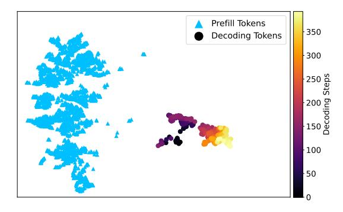

# 18: // KV retrieval for current step

19: Compute scores  $s_j = q_t^{\mathsf{T}} \mu_j$  for all centroids  $\mu_j \in C$ 

20: Sort clusters by  $s_i$  in descending order

Select top clusters until total token count reaches B

22: Truncate final cluster if needed to fit budget *B* 

23: Include all non-clustered tokens in  $\mathcal{K}_{new}$ ,  $\mathcal{V}_{new}$ 

24: end for

where the byte count corresponds to writing updated centroids back to memory.

**Total per-iteration AI.** The per-iteration arithmetic intensity is therefore

$$\mathrm{AI} = \frac{\mathrm{FLOPs_{assign}} + \mathrm{FLOPs_{update}}}{\mathrm{Bytes_{assign}} + \mathrm{Bytes_{update}}} = \frac{2DNK + ND + KD}{(N+K)DS + KDS}.$$

For  $N \gg K$ , this simplifies to

AI 
$$\approx \frac{2K+1}{S} \xrightarrow{S=2 \text{ B}} K \text{ FLOPs/byte.}$$

Thus, under ideal centroid reuse and negligible host overhead, the algorithm-level AI scales linearly with K for FP16 data. On the hardware side, Section 4.1 established the peak throughput and compute-to-memory tipping point  $I^*$ , yielding Peak FLOPs  $\approx 873$  TFLOPs/s and  $I^* \approx 4$  FLOPs/Byte. Comparing the two results gives a clear co-design rule: choose K so that AI  $\approx I^*$ . Since AI  $\approx K$  under FP16, we set K=4 to ensure the clustering workload operates near the hardware-defined balance point.

Based on this principle, we design a hardware-aware online clustering method that reorganizes the KV cache into contiguous, row-aligned clusters and keeps the clusters fixed after their initial formation, so that each vector is clustered only once. As shown in Figure 7, at the start of decoding, the prefill tokens are divided into non-overlapping blocks of size N  $\bullet$ . We apply cosine K-means with K=4 and random initialization to each block, limiting the number of iterations I to 16 to control runtime **2**. Clustering is applied to keys only, and the corresponding values inherit the same labels. The resulting clusters are stored in contiguous physical locations that match the PIM bank layout. With a PIM row size of  $blk_{row} = 16$  and K=4, we set  $N = K \times blk_{row} = 64$  so that each cluster contains about 16 tokens, aligning the access granularity with the row size and reducing row overfetch and internal data movement. Once these prefill clusters are formed, they remain unchanged to avoid costly reshuffling under row-level access.

During decoding, newly generated tokens are kept in full for attention computation until their number reaches the size N, as they strongly influence the immediate attention distribution. The same as the processing of tokens generated in the prefill stage, every N = 64 decoding steps, we cluster only the most recent 64-token block using the same configuration (K=4, up to 16 iterations), append the resulting clusters, and store them contiguously **4**. Once formed, clusters remain fixed and are never updated. As a result, STARC does not require re-clustering throughout inference, thereby avoiding the costly remapping of clustered KV vectors already stored in memory. This incremental, append-only design not only reduces the clustering overhead but also draws on two observations. First, the distribution of decoding keys gradually diverges from that of the prefill keys (Figure 8), which justifies clustering the two stages separately. Second, key vectors exhibit locality, meaning that adjacent tokens tend to have high cosine similarity. Clustering only the most recent contiguous segment takes advantage of this property, improving clustering quality while keeping the approach suitable for online inference.

**Figure 8.** The distributions of key vectors differ significantly between the prefill and decoding stages.

|                 |        | Single-Document QA |       | Multi-Document QA |          |         |           | Summarization |           | Few-Shot Learning |          |        | Synthetic |       | Code  |       |       |  |
|-----------------|--------|--------------------|-------|-------------------|----------|---------|-----------|---------------|-----------|-------------------|----------|--------|-----------|-------|-------|-------|-------|--|
| KV Budget: 1024 | NrtvQA | Qasper             | MF-en | HotpotQA          | 2WikiMQA | Musique | GovReport | QMSum         | MultiNews | TREC              | TriviaQA | SAMSum | PCount    | PRe   | Lcc   | RB-P  | Avg.  |  |
| LongChat        |        |                    |       |                   |          |         |           |               |           |                   |          |        |           |       |       |       |       |  |
| Full KV         | 19.51  | 25.98              | 43.80 | 31.94             | 23.20    | 11.38   | 31.77     | 21.66         | 26.06     | 66.00             | 82.00    | 20.79  | 2.00      | 30.00 | 53.86 | 48.68 | 33.66 |  |
| STARC           | 17.55  | 29.44              | 40.92 | 32.32             | 19.29    | 9.73    | 31.22     | 22.08         | 25.01     | 64.00             | 80.80    | 21.82  | 2.00      | 32.00 | 57.16 | 48.82 | 33.38 |  |
| SparQ           | 19.56  | 29.90              | 40.90 | 31.05             | 22.84    | 12.92   | 30.98     | 23.19         | 26.49     | 64.00             | 84.53    | 25.89  | 0.00      | 30.50 | 54.34 | 55.72 | 34.55 |  |
| InfiniGen       | 15.41  | 29.56              | 41.92 | 36.20             | 20.35    | 8.89    | 29.36     | 22.22         | 24.73     | 64.00             | 84.38    | 29.75  | 2.00      | 32.00 | 51.84 | 51.06 | 33.98 |  |
| Quest           | 14.58  | 29.23              | 43.67 | 28.37             | 18.62    | 10.51   | 29.12     | 22.29         | 24.91     | 66.00             | 79.31    | 20.88  | 2.00      | 34.00 | 52.60 | 49.00 | 32.82 |  |
| Mistral         |        |                    |       |                   |          |         |           |               |           |                   |          |        |           |       |       |       |       |  |
| Full KV         | 23.94  | 40.07              | 57.58 | 49.10             | 36.71    | 22.27   | 35.66     | 25.77         | 26.80     | 80.00             | 87.67    | 47.35  | 4.00      | 98.00 | 58.98 | 56.36 | 46.89 |  |
| STARC           | 19.97  | 34.93              | 57.70 | 51.49             | 35.48    | 23.39   | 35.67     | 24.72         | 26.72     | 76.00             | 88.87    | 48.16  | 2.00      | 98.00 | 61.74 | 55.76 | 46.29 |  |
| SparQ           | 29.36  | 40.93              | 53.68 | 51.33             | 37.36    | 27.22   | 34.49     | 25.67         | 27.66     | 74.00             | 88.86    | 47.17  | 5.00      | 99.00 | 60.43 | 62.14 | 47.77 |  |
| InfiniGen       | 23.34  | 37.73              | 57.90 | 51.41             | 39.45    | 19.69   | 35.06     | 24.89         | 26.29     | 76.00             | 85.67    | 47.60  | 2.00      | 98.00 | 59.82 | 59.58 | 46.53 |  |
| Quest           | 22.79  | 30.88              | 52.39 | 47.12             | 38.63    | 18.73   | 33.45     | 24.23         | 27.26     | 66.00             | 88.42    | 44.73  | 8.18      | 92.00 | 60.86 | 57.52 | 44.57 |  |
| Llama-3.1       |        |                    |       |                   |          |         |           |               |           |                   |          |        |           |       |       |       |       |  |
| Full KV         | 27.02  | 13.98              | 28.04 | 18.30             | 17.45    | 13.01   | 35.83     | 23.66         | 25.91     | 74.00             | 89.77    | 44.56  | 3.92      | 97.50 | 63.30 | 55.06 | 39.46 |  |
| STARC           | 31.73  | 13.57              | 28.14 | 20.40             | 18.08    | 11.54   | 35.26     | 23.53         | 25.62     | 72.00             | 88.57    | 44.25  | 5.67      | 98.33 | 64.30 | 54.42 | 39.71 |  |
| SparQ           | 29.53  | 13.83              | 26.97 | 17.64             | 16.85    | 10.27   | 33.95     | 23.79         | 26.73     | 71.00             | 91.47    | 44.20  | 7.12      | 98.21 | 64.19 | 60.44 | 39.76 |  |
| InfiniGen       | 28.80  | 14.15              | 27.88 | 24.27             | 17.79    | 9.75    | 34.15     | 23.31         | 26.59     | 70.00             | 89.81    | 44.05  | 4.67      | 96.00 | 61.98 | 59.02 | 39.51 |  |
| Quest           | 18.66  | 11.75              | 22.96 | 16.90             | 13.52    | 5.46    | 34.22     | 22.12         | 25.87     | 70.00             | 85.60    | 42.94  | 0.80      | 96.27 | 58.90 | 56.08 | 36.38 |  |

Table 2. LongBench results for STARC and baseline sparsity methods (KV cache budget: 1024 tokens).

At inference time, KV retrieval operates at the cluster level. At each decoding step, the current query is compared against all cluster centroids using dot products ➌. Clusters are ranked by the resulting scores, and the top-ranked clusters are retrieved until the KV budget is reached. Because clusters may contain different numbers of KV entries, the last retrieved cluster may be partially truncated to stay within the budget.

