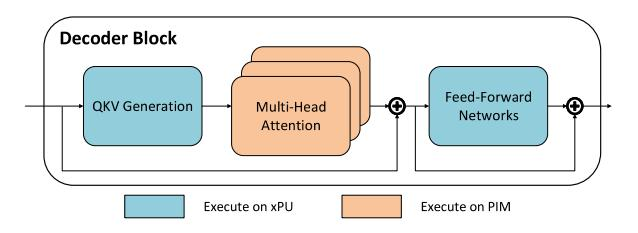

# 2 Background

In this section, we first introduce PIM architectures as a solution to the memory bandwidth bottlenecks that arise during decoding. We then describe sparse attention techniques, which alleviate the growing computational and memory access costs associated with long-context sequences, providing basic understandings of our proposed design.

#### 2.1 PIM for LLM Attention

Transformer-based LLMs [1, 6, 21, 31, 50] perform inference in two stages: **prefill** and **decoding**. In prefill, the entire input sequence (i.e., the user prompt) is processed in parallel to produce the first output token. In decoding, tokens are generated autoregressively, with each new token appended to the sequence and used as input for the next step. This iterative process requires the model to repeatedly read from the KV cache, which stores the key and value vectors projected from all previously generated tokens.

Although modern GPUs offer high FLOPs, attention computation during decoding is typically memory-bound, given its low arithmetic intensity and frequent memory accesses to tokens stored in the KV cache. As context lengths grow to hundreds of thousands of tokens, data transfers between GPU and external memory become a bottleneck. This results in suboptimal resource utilization, as much of computational capacity remains idle while waiting for memory transactions to complete.

**Figure 2.** Typical xPU–PIM hybrid system: QKV Generation and Feed-Forward Networks are executed on xPU such as GPU and NPU, while Attention is executed on PIM.

A more detailed examination of the decoder block architecture provides insight into the source of this memory bottleneck. Each decoder block consists of three fundamental components: (1) Query-Key-Value (QKV) generation, which projects the input hidden states into separate query, key, and value vectors; (2) Multi-Head Attention (MHA), where attention weights are computed and applied across multiple heads in parallel; and (3) Feed-Forward Networks (FFNs), which apply independent linear transformations and nonlinear activations to each token embedding. Among these components, the MHA module, particularly during the decoding phase, incurs the highest memory bandwidth demand due to its frequent token access to KV cache.

PIM architectures have emerged as a promising solution to mitigate such memory bandwidth bottlenecks by integrating computation directly within memory systems. Figure 2 illustrates the typical execution partitioning adopted by recent PIM-enabled heterogeneous systems, where memory-bound MHA is offloaded to PIM units, while QKV generation and FFNs remain on xPU compute cores. Attention layers are especially well-suited for PIM acceleration, primarily for two reasons. First, once the KV matrices for a decoding step are

written to the memory arrays, they can be reused repeatedly for subsequent query vectors in the same or following decoding iterations. This reuse pattern allows PIM systems to take full advantage of the high internal bandwidth. Second, MHA operations rely heavily on general matrix-vector multiplication (GEMV) to compute attention scores and outputs. Distributing these computations across parallel memory banks allows the PIM architecture to exploit abundant internal bandwidth while offloading repeated GEMV operations.

#### 2.2 Selective Token Access with Attention Sparsity

Recent studies on attention distributions in LLMs have revealed that attention scores during inference are often highly sparse. In many cases, only a small subset of tokens significantly contributes to the output, while the majority of tokens receive negligible weights. This observation has motivated a range of **sparse attention** techniques that aim to reduce the number of KV pairs accessed during decoding by performing selective retrieval or compression of the KV cache.

To be more specific, in the Transformer architecture, each attention head operates on projected query, key, and value vectors. Let  $q \in \mathbb{R}^{1 \times d_h}$  denote the query vector corresponding to the most recent token in a single head, and let  $K, V \in$  $\mathbb{R}^{L \times d_h}$  represent the cached key and value matrices for the L previous tokens. Here,  $d_h$  denotes the hidden dimension of a single attention head. Sparse attention methods select a subset of  $B \ll L$  KV pairs, typically based on similarity metrics such as dot-product or cosine similarity, yielding the reduced matrices  $K_S$ ,  $V_S \in \mathbb{R}^{B \times d_h}$ . The attention output is then computed as softmax $(qK_S^{\top}/\sqrt{d_h})V_S$ , where  $q \in \mathbb{R}^{1 \times d_h}$ is the query vector. This selective computation significantly reduces both the memory access and the per-step computational cost, while maintaining model quality in many scenarios. Crucially, it also decouples the per-token decoding complexity from the total context length.

**Figure 3.** Common attention sparsity patterns.

In practice, sparse attention mechanisms can be broadly categorized into three representative classes, illustrated in Figure 3: Firstly, **static sparsity** restricts each query to attend only to fixed historical token positions or to a fixed-size window of past tokens (e.g., the most recent *B* tokens), independent of content. This type of sparsity typically evicts other tokens and is hardware-friendly, but fails to capture

long-range dependencies. Secondly, token-wise dynamic **sparsity** selects the top-B most relevant tokens for each query dynamically based on similarity scores. It provides finer control over which tokens are attended but introduces irregular access patterns. Lastly, page-wise dynamic sparsity groups the context into fixed-size pages and selects relevant pages rather than individual tokens. Compared with token-wise, this method maintains hardware-friendly access patterns but compromises the effectiveness of per-iteration token access due to the retrieval of irrelevant tokens within a page. In this work, we mainly discuss the latter two sparsity methods. Both are KV cache retrieval methods that preserve the full KV cache without eviction. This focus aligns with our emphasis on model accuracy rather than reducing the KV cache storage footprint, since in our system the KV cache resides in HBM-PIM and does not pressure GPU memory capacity.

#### 3 Motivation

This section motivates our proposed design by analyzing the limitations of existing attention mechanisms on PIM architectures. We first highlight the inefficiencies of dense and token-wise sparsity under PIM's row-level access granularity. We then consider page-wise sparsity, which aligns better with hardware constraints but suffers from low relevance density and reduced attention quality. Finally, we motivate a clustering-based remapping strategy that groups semantically similar tokens into contiguous memory rows, aiming to improve execution efficiency without sacrificing the accuracy of token retrieval.

#### 3.1 Challenges of Attention on Existing PIM Architectures

Prior PIM architectures for attention are designed to work with a fully dense KV cache [14, 15, 24, 40, 59], where all past tokens are retained throughout decoding. However, with the long contexts used by modern LLMs, dense attention places heavy demands not only on internal bandwidth but also on the limited computational capacity of PIM architectures. Specifically, the near-memory logic embedded close to the memory arrays is typically lightweight and optimized for simple row-wise operations. These resources lack the deep pipelining and wide parallelism of traditional GPU compute units, and are constrained by area and energy budgets within the memory die. Moreover, each attention query must access a large number of stored key-value vectors, which are laid out across many memory rows. In PIM architectures, processing even a single token requires activating entire memory rows, since the logic operates at row granularity. When dense attention forces many such activations per query, the system suffers from frequent row switching and high energy costs due to repeated bitline toggling and row precharging.

**Figure 4.** Comparison of row activation patterns under different sparse attention methods.

This behavior severely reduces the efficiency of row-parallel execution across memory banks.

Applying sparse attention can potentially alleviate this overhead by accessing only a subset of past tokens. However, applying these methods in current PIM architectures introduces new challenges. A main issue is that token importance changes dynamically during decoding. A token that is unimportant at one step may become crucial later, limiting the effectiveness of static data placement or scheduling strategies in PIM.

These limitations become especially severe under tokenwise sparsity, which requires fine-grained retrieval of tokens. As illustrated in Figure 4, such fine-grained access patterns are poorly aligned with the row-level access granularity of PIM architectures. Each PIM array operates at row granularity: the near-memory logic must activate an entire row, bring all entries onto the bit-lines, and perform computation there. When relevant tokens are scattered across multiple rows, the memory controller is forced to read and process every row individually, leading to substantial over-fetching of irrelevant data and redundant computation.

Figure 5. Page-wise retrieval with less important tokens.

#### 3.2 Hardware Efficiency vs. Attention Quality

To reduce the overhead of selecting important tokens during decoding, several recent attention sparsity methods, such as Quest [\[49\]](#page-16-11), adopt a page-wise retrieval strategy. In this approach, tokens are grouped into fixed-size pages, and attention is computed over selected pages rather than individual tokens. Quest estimates the importance of each page by comparing the query vector with the minimal and maximal key vectors of that page, and retrieves only the most relevant ones. This simplifies the sparsity decision process and reduces the complexity of token scoring.

As shown in Figure [4,](#page-3-0) page-wise token access also aligns well with the memory organization of a PIM accelerator. When the page size is a multiple of the physical memory row size, PIM can fetch and process entire rows efficiently. This allows the accelerator to fully utilize internal memory bandwidth and avoid partial-row access overhead. In HBM-PIM architectures, where computation occurs near DRAM banks, this alignment improves data locality and reduces unnecessary data movement.

However, this hardware compatibility comes at the cost of attention quality and model accuracy. Page boundaries are defined purely based on token position, not on token relevance. As a result, selected pages often include many irrelevant tokens. These tokens are still accessed and processed, wasting bank-level bandwidth and compute resources.

We illustrate this issue using attention heatmaps with a context length of 4K in Figure [5,](#page-3-1) where the model used is LLaMA3.1-8B. The example uses Quest's page-wise method with a page size of 16 tokens. In the heatmaps, lighter cells represent tokens with higher attention weights. As shown, most pages contain only one or two important tokens. This inefficiency limits the usefulness of page-wise sparsity, despite its compatibility with PIM architectures.

#### 3.3 Motivation for Remapping and Clustering

To address the limitations of sparse attention on PIM, we propose a remapping strategy that clusters semantically similar key–value vectors and places each cluster in contiguous memory rows. By aligning row-level layout with attention relevance, activating a single row retrieves multiple relevant tokens, reducing redundant row activations and unnecessary computation, as illustrated in Figure [4.](#page-3-0) Compared with conventional sequential mapping, this design increases the usefulness of each row access and enables coarse-grained execution skipping. The approach thus balances hardware and algorithmic needs: PIM architectures benefit from regular row-granular access patterns, while clustering ensures that each accessed row contains semantically important tokens.

