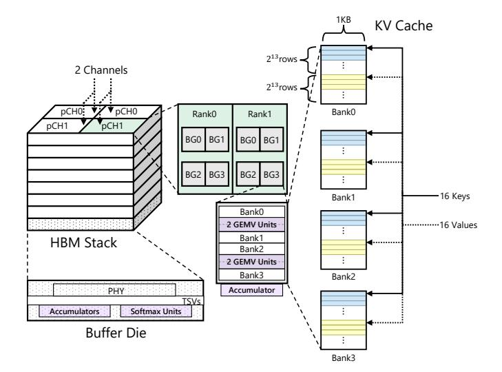

# 4 STARC System Architecture

This section details the hardware-algorithm co-design principles of STARC. We begin by introducing the underlying PIM

architecture, which provides massive near-bank parallelism but imposes rigid row-level access constraints. We then describe how STARC leverages this architecture to perform efficient KV clustering directly inside HBM-PIM, thereby eliminating costly GPU offloading and reusing existing PIM primitives and hardware without introducing additional area overhead.

#### <span id="page-4-1"></span>4.1 PIM Architecture Overview

To enable high-throughput execution of attention mechanisms in Transformer-based models, we adopt AttAcc [\[40\]](#page-16-10) as our PIM architecture—a PIM system specifically designed to accelerate the attention layer. As illustrated in Figure [6,](#page-4-0) AttAcc places compute units near each bank within an HBM stack. Specifically, a single HBM channel contains 2 pseudochannels (pCHs), each pCH is divided into 2 ranks, and every rank further breaks down into 4 bank groups, with 4 banks in each group. This results in a total of 64 banks per channel, which can be activated simultaneously to collectively utilize the full channel bandwidth and drive the near-bank compute fabric efficiently.

<span id="page-4-0"></span>

Figure 6. HBM-PIM architecture and KV cache organization.

A key principle of STARC is an architecture–algorithm codesign strategy: we select the number of clusters in K-means such that the arithmetic intensity of clustering matches the hardware-defined tipping point between memory-bound and compute-bound execution. This balance is determined by the architecture of our simulated HBM-PIM system. Each bank hosts a dedicated GEMV compute unit, and each pCH integrates 32 GEMV units. Each GEMV contains 16 FP16 fusedmultiply-add (FMA) pairs operating at 666 MHz. The system includes 40 HBM stacks, each consisting of 16 channels, yielding a total of 40 × 16 = 640 channels and 640 × 2 = 1280 pCHs. With 32 GEMV units per pCH and 2 FMA operations per unit per cycle, the peak compute throughput is:

Peak FLOPs = 
$$32 \times 2 \times 16 \times 1280 \times 666$$
 MHz  
 $\approx 8.7 \times 10^{14}$  FLOPs/s = 873 TFLOPs/s.

$$I^* = \frac{\text{Peak FLOPs}}{\text{Peak Internal BW}} = \frac{873 \text{ TFLOPs/s}}{242 \text{ TB/s}} \approx 4 \text{ FLOPs/Byte.}$$

This arithmetic intensity value serves as a hardware-defined tipping point: workloads with intensity below  $I^*$  are memorybound, while those above are compute-bound. In our algorithm design (Section 5), we exploit this principle by selecting the number of clusters K in K-means such that the arithmetic intensity of the clustering workload matches  $I^*$ .

Additionally, despite HBM-PIM's high throughput, its execution model offers limited flexibility. As illustrated in Figure 6, under our configuration, each DRAM bank row stores 1KB of data. Assuming FP16 precision (2B per element) and an attention head dimension of 128 (as in typical LLaMA-style models), a single key or value vector occupies 256B. To fully utilize the parallelism across banks, each vector is dimension-partitioned across the four banks within a bank group, such that each bank stores a contiguous 64B slice of the vector. Consequently, one row across a bank group can accommodate 16 complete key or value vectors, yielding a row-level block size of blk $_{\rm row}=16$ , meaning that a single row activation accesses 16 complete key or value vectors at once.

#### <span id="page-5-1"></span>4.2 Efficient KV Clustering Implementation on PIM

Although clustering-based remapping can mitigate row-level inefficiencies, performing clustering efficiently on hardware presents additional challenges. During decoding, the QKV generation stage already writes the key and value vectors into HBM. Offloading these vectors to GPUs for clustering would incur substantial transfer overhead across the memory interface, negating the benefits of in-memory data layout optimization. To avoid this bottleneck, we perform KV clustering directly inside HBM-PIM, leveraging AttAcc's nearbank compute fabric to execute the three phases of K-means: normalization, assignment, and update.

Table 1 details the command-level breakdown of cosine-based K-means clustering implemented on PIM. We denote D as the number of vector dimensions and S as the byte size of an FP16 value (two bytes). Each GEMV unit supports 64-way SIMD MACs, so computing a dot product between two D-dimensional vectors requires  $T_D = D/64$  MAC\_AB operations. Following Section 4.1, we use  $blk_{row}$  to denote the number of D-dimensional vectors accommodated in one DRAM row across a bank group. To compare against K centroids, the system requires  $T_K = K/blk_{row}$  such operations. Finally, we denote N, K, and I as the number of samples, clusters, and clustering iterations, respectively. Following

<span id="page-5-0"></span>**Table 1.** Command-level breakdown of cosine-based K-means clustering on PIM. Read/write bytes include only PIM-side memory traffic; host-side scalar operations are excluded.

| Operation                            | Command Count     | MAC         | Read Bytes                      | Write Bytes |  |  |  |  |  |  |  |  |
|--------------------------------------|-------------------|-------------|---------------------------------|-------------|--|--|--|--|--|--|--|--|
| Normalization (per vector)           |                   |             |                                 |             |  |  |  |  |  |  |  |  |
| MAC_AB(self-dot)                     | $T_D$             | D           | DS                              | _           |  |  |  |  |  |  |  |  |
| MVSB(norm)                           | 1                 | 0           | _                               | S           |  |  |  |  |  |  |  |  |
| VNORM(vector/√·)                     | $T_D$             | D           | DS                              | _           |  |  |  |  |  |  |  |  |
| Total / vector                       |                   | 2D          | 2DS                             | S           |  |  |  |  |  |  |  |  |
| Assignment (per iteration)           |                   |             |                                 |             |  |  |  |  |  |  |  |  |
| WRGB(samples)                        | N                 | 0           | _                               | NDS         |  |  |  |  |  |  |  |  |
| MAC_AB                               | $NT_D \times T_K$ | NKD         | samples: NDS,<br>centroids: KDS | _           |  |  |  |  |  |  |  |  |
| MVSB(scores)                         | $NT_K$            | 0           | _                               | NKS         |  |  |  |  |  |  |  |  |
| Host(argmax)                         |                   | _           | NKS                             | only labels |  |  |  |  |  |  |  |  |
| Total / iteration                    |                   | NKD         | (ND + KD + NK)S                 | NDS + NKS   |  |  |  |  |  |  |  |  |
| Update (per iteration)               |                   |             |                                 |             |  |  |  |  |  |  |  |  |
| MVGB(broadcast v <sub>i</sub> )      | N                 | 0           | NDS                             | _           |  |  |  |  |  |  |  |  |
| MAC_AB<br>(accumulation & averaging) | $NT_D$            | (ND + KD)/2 | _                               | _           |  |  |  |  |  |  |  |  |
| WRGB(new $\mu_k$ )                   | 1                 | 0           | _                               | KDS         |  |  |  |  |  |  |  |  |
| Total / iteration                    |                   | (ND + KD)/2 | NDS                             | KDS         |  |  |  |  |  |  |  |  |

prior modeling practice, we approximate one addition, multiplication, or division as half a MAC, since each corresponds to a single FLOP.

**Normalization.** To enable cosine similarity computation, each vector must first be normalized into the form  $v/\|v\|$ . As shown in Table 1, this process begins with a self dotproduct via  $MAC\_AB$ , requiring  $T_D$  commands, D multiplyaccumulate operations, and reading DS bytes from memory. The resulting scalar norm is then transferred into the softmax buffer using MVSB. To avoid host involvement and reduce data transfers across the memory interface, we introduce a fused command VNORM, implemented via a small lookuptable (LUT)-based reciprocal square-root approximation and the scaling datapath, since the  $\frac{1}{\sqrt{\|v\|^2}}$  term used in clustering does not require high precision and can be approximated using a piecewise-defined LUT. Both the LUT lookup and the ensuing multiply-accumulate and scaling operations are native to AttAcc's PIM primitives, and thus neither VNORM nor the clustering control logic introduces new hardware structures or additional area overhead. This step requires another  $T_D$  commands and D operations, reading the vector once more (DS bytes). In total, per-vector normalization entails 2D MACs, 2DS bytes of reads, and S bytes of writes.

**Assignment.** After normalization, each sample must be assigned to its closest centroid. For each of the N samples, we first write the sample vector into the GEMV buffer with a **WRGB** command, incurring NDS bytes of writes. The sample is then compared against all K centroids using  $NT_D \times T_K$  **MAC\_AB** operations, corresponding to NKD MACs. Here, the read volume includes both the sample (NDS bytes) and the centroids (KDS bytes). The resulting similarity scores are dispersed across different row blocks, so they must be gathered into the softmax buffer before the host can perform argmax. This gathering is carried out with **MVSB** commands:

each sample requires  $T_K$  such transfers to collect all K scores, leading to  $NT_K$  commands and NKS bytes of writes in total. Finally, the host performs the argmax across K scores per sample, which involves reading NKS bytes and returning only cluster labels. Overall, the assignment phase per iteration requires NKD MACs, (ND+KD+NK)S bytes of reads, and NDS+NKS bytes of writes.

**Update.** Once assignments are made, cluster centroids must be updated by averaging the vectors assigned to each cluster. To enable accumulation across all centroids, each of the N sample vectors is broadcast to the GEMV buffer across all banks using N **MVGB** commands, corresponding to NDS bytes of reads. Accumulation is then carried out via  $NT_D$  **MAC\_AB** operations. We approximate the operation count as (ND + KD)/2 equivalent MACs, accounting for vector additions and the final scalar divisions when averaging. Because samples are already broadcast into GEMV buffers, no additional read traffic is incurred. Finally, the new centroids  $\mu_k$  are written back to memory with a single **WRGB** command, writing KDS bytes. In total, the update phase per iteration requires (ND + KD)/2 equivalent MACs, NDS bytes of reads, and KDS bytes of writes.

Through this breakdown, Table 1 demonstrates that all three phases of cosine-based K-means can be expressed as compositions of existing PIM commands (MAC\_AB, WRGB, MVSB, MVGB) augmented with one lightweight fused command (VNORM). By carefully mapping normalization, assignment, and update into these command sequences, STARC leverages existing PIM primitives and hardware to achieve inmemory clustering of KV vectors directly within HBM-PIM, eliminating costly GPU offloading and enabling hardware-aware clustering aligned with AttAcc's memory architecture.

#### <span id="page-6-0"></span>5 Algorithm Design

Building upon the STARC framework, we propose an online clustering strategy that incrementally reorganizes the KV cache during decoding. The aim is to balance model accuracy with HBM-PIM's row-level access granularity by grouping semantically similar KV pairs into hardware-aware clusters. While these clusters may not always align exactly with HBM rows, the resulting regularized access pattern effectively reduces row over-fetch and improves bandwidth utilization. The overall procedure is outlined in Algorithm 1.

We begin by quantifying the arithmetic intensity (AI) of cosine K-means, defined as the ratio between floating-point operations (FLOPs) and main-memory traffic in bytes, using the notation (N, K, D, I, S) in Section 4.2.

One-off normalization cost. Each vector undergoes an  $\ell_2$  normalization prior to clustering. Computing the squared norm requires D multiply-add pairs (2D FLOPs), followed by one square root and one reciprocal (host-side scalar operations, excluded from FLOPs). The normalized vector is reconstructed by D scalar multiplications (D FLOPs). Thus,

<span id="page-6-1"></span>

**Figure 7.** Flowchart of the clustering algorithm. We perform incremental clustering on the KV pairs using K-means, meaning that only the newly generated segment of KV pairs is clustered during decoding.

each vector incurs 3D FLOPs and 3DS bytes of traffic. For N + K vectors, this yields

$$FLOPs_{norm} = 3D(N + K)$$
,  $Bytes_{norm} = 3D(N + K)S$ .

Given  $I \gg 1$  and  $N \gg K$ , this one-off cost is amortized and omitted from the per-iteration AI.

Per-iteration cost. Each Lloyd iteration consists of:

(1) Assignment: Each sample is compared with all K centroids via D-dimensional dot products, each requiring 2D FLOPs. Across all N samples and K centroids:

$$FLOPs_{assign} = 2DNK$$
,  $Bytes_{assign} = (N + K)DS$ ,

where the byte count accounts for reading both N samples and K centroids from main memory.

(2) **Update:** Updating centroids involves adding N samples into K cluster sums (ND additions) and scaling each centroid by  $1/n_k$  (KD scalar multiplications/divisions):

$$FLOPs_{update} = ND + KD$$
,  $Bytes_{update} = KDS$ ,

#### <span id="page-7-0"></span>Algorithm 1 Clustering-Based Retrieval during Decoding

**Require:** Prefill KV pairs  $\mathcal{K}_{pre}$ ,  $\mathcal{V}_{pre}$ ; Decoding stream  $\{x_t\}$ ; Block size N; KV cache budget B

```
    // Initial clustering after prefill
    Partition (K<sub>pre</sub>, V<sub>pre</sub>) into non-overlapping blocks of size N
    for each block (K<sub>b</sub>, V<sub>b</sub>) do
    C<sub>b</sub> ← KMeans(K<sub>b</sub>)  
        cosine similarity

    Assign each (k<sub>i</sub>, v<sub>i</sub>) ∈ (K<sub>b</sub>, V<sub>b</sub>) to its cluster in C<sub>b</sub>
    C ← C ∪ C<sub>b</sub>
    end for
    Initialize: K<sub>new</sub> ← Ø, V<sub>new</sub> ← Ø
```

```
8: Initialize: \mathcal{K}_{\text{new}} \leftarrow \emptyset, \mathcal{V}_{\text{new}} \leftarrow \emptyset
 9: for each decoding step t do
10:
              Generate token x_t, compute key k_t and value v_t
              Append k_t to \mathcal{K}_{\text{new}}, v_t to \mathcal{V}_{\text{new}}
11:
              if |\mathcal{K}_{\text{new}}| = N then
12
                     C_{\text{new}} \leftarrow \text{KMeans}(\mathcal{K}_{\text{new}})
                     Assign each (k_i, v_i) \in (\mathcal{K}_{\text{new}}, \mathcal{V}_{\text{new}}) to its cluster
14:
       in C_{\text{new}}
                     C \leftarrow C \cup C_{\text{new}}
15:
                     Reset \mathcal{K}_{\text{new}}, \mathcal{V}_{\text{new}} \leftarrow \emptyset
16:
              end if
17:
```

