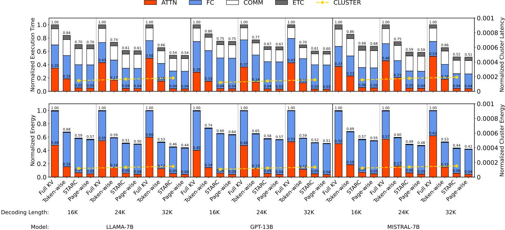

# 6 Evaluation

#### 6.1 Evaluation Methodology

Accuracy Evaluation. To evaluate the effectiveness of STARC under long-context scenarios, we consider three representative LLMs: LongChat-7B-v1.5-32K (MHA) [\[28\]](#page-15-12), LLaMA-3.1-8B-Instruct (GQA) [\[6\]](#page-15-8), and Mistral-7B-Instructv0.3 (GQA) [\[21\]](#page-15-9). These models cover both multi-head and grouped-query attention mechanisms, enabling a comprehensive study of STARC across different attention designs. For benchmarking, we use the LongBench benchmark [\[2\]](#page-15-13), consisting of 16 datasets across diverse tasks: multi-document QA (HotpotQA [\[54\]](#page-16-15), 2WikiMQA [\[53\]](#page-16-16), Musique [\[51\]](#page-16-17)), singledocument QA (QASPER [\[5\]](#page-15-14), MultiFieldQA-en, NarrativeQA [\[23\]](#page-15-15)), summarization (GovReport [\[18\]](#page-15-16), QMSum [\[58\]](#page-16-18), Multi-News [\[7\]](#page-15-17)), few-shot learning (TriviaQA [\[22\]](#page-15-18), TREC [\[30\]](#page-16-19), SAMSum [\[11\]](#page-15-19)), synthetic reasoning (PCount, PRe [\[43\]](#page-16-20)), and code completion (Lcc [\[12\]](#page-15-20), RB-P [\[34\]](#page-16-21)). We also present an evaluation on the RULER benchmark [\[17\]](#page-15-21), which is designed to stress-test model robustness under extreme long-context scenarios. In addition, we evaluate on PG-19 [\[42\]](#page-16-22) for language modeling using perplexity as the evaluation metric.

We compare STARC against three recent sparsity methods: Quest [\[49\]](#page-16-11), InfiniGen [\[26\]](#page-15-22), and SparQ [\[44\]](#page-16-23). Each baseline follows the configurations in its original paper (e.g., page size for Quest, partial weights and threshold for InfiniGen, and largest retained components for SparQ). For a fair comparison, we reproduce all methods under the same framework and adopt the Quest setting of using full KV cache in the first two layers, which typically exhibit low sparsity [\[49\]](#page-16-11). Unless otherwise specified, results are reported at a KV cache budget of 1024 tokens, matching the budget used in our performance experiments. Results under other budgets (256, 512, 2048) are provided in the appendix. For STARC, we perform clustering over every 64 consecutive tokens using cosine-based K-means, with the number of clusters fixed at = 4.

Performance on PIM Systems. To investigate how attention sparsity impacts PIM architectures and evaluate the effectiveness of STARC, we adopt the AttAcc simulator [\[40\]](#page-16-10), which extends Ramulator [\[36\]](#page-16-24) to model heterogeneous GPU–PIM systems, and evaluate on a DGX+AttAcc platform where attention kernels are offloaded to PIM units while FC layers remain on GPU. The DGX consists of 8 NVIDIA H100 cores and 40 HBM3 stacks (5.2 Gbps per pin), with a total memory capacity of 1.28 TB. The AttAcc side contains an additional 40 HBM3 stacks, also totaling 1.28 TB. Each DRAM bank integrates one GEMV unit (1P1B configuration), and all arithmetic and buffer components follow the microarchitectural assumptions in AttAcc [\[40\]](#page-16-10).

We configure inference workloads to emphasize longcontext, memory-bound decoding scenarios, with prefill/ decoding sequence pairs of (2K, 16K), (2K, 24K), and (2K, 32K). Batch size is fixed at 16. The evaluated models include

LLaMA-7B, Mistral-7B, and GPT-13B, all at FP16 precision. To highlight trade-offs between accuracy and efficiency, we incorporate STARC's KV clustering overhead into the simulation. Page-wise sparsity is represented by Quest, while token-wise sparsity is represented by SparQ, which achieves the highest accuracy in our experiments. We adopt AttAcc's optimal configuration by enabling both head-level pipelining and feedforward co-processing. All other simulator configurations follow AttAcc defaults.

#### 6.2 Accuracy Evaluation

Results on LongBench. Table 2 presents the results on LongBench datasets under a KV cache budget of 1024. Several consistent trends emerge across models. First, STARC outperforms the page-wise sparsity method Quest in terms of average accuracy across all models. Second, STARC achieves accuracy comparable to token-wise sparsity methods (SparQ and InfiniGen), and on grouped-query attention models (LLaMA-3.1 and Mistral) it achieves the best results among all sparsity methods on many datasets. These results indicate that STARC provides robust accuracy across both MHA and GQA models, while aligning better with PIM hardware.

**Figure 9.** Language modeling on PG-19 dataset.

Figure 10. Recall rate of important tokens.

Results on RULER. Table 3 reports the results on the RULER benchmark for LLaMA-3.1-8B-Instruct at a context length of 32K. RULER consists of 13 tasks grouped into four categories: Retrieval, Multi-Hop Tracing, Aggregation, and Question Answering. All methods are evaluated under the same KV budget of 1024. Overall, STARC achieves average accuracy close to the full-KV and SparQ baseline, while outperforming InfiniGen. Moreover, STARC outperforms the page-wise sparsity baseline Quest across most tasks. These results further support the robustness of STARC under long-context scenarios.

**Results on Language Modeling.** Figure 9 shows the perplexity of generated tokens on the PG-19 test set across varying input lengths, ranging from 1 to 32,000 tokens, under a fixed KV budget of 1024. STARC outperforms both Quest and InfiniGen, particularly at longer input lengths. Although SparQ slightly outperforms STARC, the gap remains narrow, and STARC consistently tracks closely with the Full-KV baseline.

**Recall Rate of Important Tokens.** Figure 10 reports the recall rate of important tokens on HotpotQA and NarrativeQA. Although STARC does not surpass SparQ, it achieves higher recall than both Quest and InfiniGen across all budgets. This demonstrates that STARC's clustering strategy improves the selection of semantically important tokens, which explains its strong downstream task performance.

#### 6.3 Performance on PIM Systems

We evaluate attention sparsity on PIM systems using three models (LLaMA-7B, GPT-13B, and Mistral-7B) under long-context decoding scenarios with sequence pairs (2k, 16k), (2k, 24k), and (2k, 32k). All methods use a KV cache budget of 1024 tokens.

To assess hardware efficiency, we analyze the attention masks produced by each method at each decoding step and map them to the row-level granularity of the PIM architecture, where each DRAM row activation fetches  $blk_{row}=16$  key/value vectors in parallel. The efficiency thus depends on how well the retrieved tokens align with row boundaries. Page-wise sparsity naturally avoids over-fetching, since each page matches the row size exactly. In contrast, token-wise sparsity often scatters tokens across many rows, leading to additional memory accesses and the processing of irrelevant data. STARC retrieves tokens at the cluster level, so semantically similar tokens are stored in the same or adjacent rows during cluster construction, significantly reducing redundant memory activations.

Figure 11 presents the normalized end-to-end decoding latency (top) and energy (bottom) per token. Each bar is broken down into attention, feed-forward, communication, and miscellaneous costs. The yellow markers show the additional KV clustering overhead of STARC, plotted against the right *y*-axis.

FWE Niah1 Niah2 Niah3 MKey1 MKey2 MKey3 MValue MQuery VT CWE QA1 QA2 Avg. Full KV 1.0000 1.0000 1.0000 1.0000 1.0000 1.0000 0.9844 1.0000 0.9938 0.1479 0.9444 0.8542 0.5312 0.8812 STARC 1 0000 1 0000 1 0000 1 0000 0.9688 0.9479 0.9688 0.9948 0.9896 0.1729 0.9167 0.8542 0.5312 0.8727 0.8831 SparO 1 0000 1 0000 1 0000 1 0000 1 0000 1 0000 0.9844 1 0000 0.9854 0.2396 0.8854 0.8542 0.5312 InfiniGen 0.9974 0.7882 0.5104 1.0000 0.9896 0.7812 0.9193 0.9542 0.1917 0.8542 0.8419 1.0000 1.0000 0.9583 Quest 0.9792 1.0000 0.8854 1.0000 1.0000 0.2500 0.9609 0.9870 0.8688 0.1115 0.8472 0.8333 0.4792 0.7848 □ СОММ ETC **CLUSTER** ATTN FC

Table 3. RULER results on LLaMA-3.1-8B-Instruct with 32K context length.

Figure 11. Normalized end-to-end decoding latency and energy on PIM systems across different models and sequence lengths.

Several consistent trends can be observed across all three models. As the decoding length increases, the attention layer rapidly becomes the dominant contributor to both latency and energy, and the benefits of sparsity grow accordingly. At the level of overall decoding, even token-wise sparsity achieves up to 34% speedup and 47% energy reduction compared to full KV retrieval. STARC further improves efficiency, providing 25%–48% speedup and 34%–56% energy reduction, corresponding to 13%–21% faster execution and 11%–18% lower energy consumption than token-wise methods.

When isolating the attention layer, the improvements are even more pronounced. Relative to full KV retrieval, STARC reduces attention latency by up to 93% and energy by up to 92%. Compared to token-wise sparsity, STARC still achieves up to 78% latency reduction and 65% energy reduction. Importantly, in both latency and energy, STARC approaches the ideal efficiency of page-wise sparsity, while preserving much higher model accuracy.

Notably, these improvements come at virtually no additional cost: the clustering overhead of STARC is negligible. Unlike full or sparse attention where each decoding step

requires past tokens (on the order of  $(L_{\rm in} + L_{\rm out})L_{\rm out}/2$  or  $B \cdot L_{\rm out}$  tokens, respectively), STARC only clusters each token once, resulting in  $L_{\rm in}+L_{\rm out}$  clustering operations in total. This incremental design makes the overhead scale linearly with context length rather than quadratically, which explains why it remains around 0.02% of total decoding latency and energy in long-context settings, as shown by the yellow markers.

Overall, STARC achieves significant reductions in attentionlayer latency and energy relative to token-wise sparsity methods, while providing substantially higher accuracy than page-wise sparsity. These results demonstrate STARC's effectiveness as a hardware-aware sparse attention mechanism tailored for long-context inference on PIM architectures.

#### 7 Related Work

#### 7.1 PIM-enabled LLM Accelerators

PIM has emerged as an effective architectural paradigm to overcome the bandwidth bottlenecks in LLMs, particularly during autoregressive decoding. By placing compute units near memory arrays, PIM boosts bandwidth utilization and

parallelism for memory-intensive workloads. This has motivated many recent efforts to integrate PIM into LLM acceleration pipelines [\[4,](#page-15-23) [14,](#page-15-10) [15,](#page-15-7) [24,](#page-15-11) [40,](#page-16-10) [59\]](#page-16-14).

Hybrid Strategy. To better balance the compute and memory workloads in LLMs, hybrid xPU–PIM designs have been proposed. AttAcc [\[40\]](#page-16-10) maps attention layers to HBM-based PIM while keeping feed-forward computation on GPUs. NeuPIMs [\[15\]](#page-15-7) combines NPUs (for GEMM) and PIMs (for GEMV) with dual-row buffers and sub-batch interleaving to reduce contention. PAPI [\[14\]](#page-15-10) extends this model by dynamically scheduling workloads between GPUs and PIM units based on runtime profiling. IANUS [\[46\]](#page-16-25) further unifies the NPU and PIM memory space, with a dedicated scheduling logic to interleave PIM execution and NPU memory accesses. However, none of these designs account for the irregular memory access patterns introduced by sparse attention.

Optimization for LLM with PIM. Several works optimize LLM inference on PIM architectures [\[24,](#page-15-11) [27,](#page-15-24) [33,](#page-16-26) [37,](#page-16-27) [59\]](#page-16-14). TransPIM [\[59\]](#page-16-14) improves Transformer inference via tokenbased dataflows and lightweight hardware extensions to HBM, yet is still tuned for dense computation. LoL-PIM [\[24\]](#page-15-11) supports long-context LLMs with a distributed PIM design and dynamic memory management, but ignores token relevance. PIM-LLM [\[37\]](#page-16-27) accelerates 1-bit LLMs by using analog PIM crossbars to perform binary projection matrix multiplications and digital systolic arrays to execute 8-bit attention matrix multiplications, yet it still assumes dense, fixed access patterns. Hermes [\[33\]](#page-16-26) leverages near-data processing DIMMs to offload cold neurons in activation-heavy workloads, focusing on activation sparsity rather than attention sparsity and lacking support for fine-grained token selection.

In summary, existing PIM-enabled LLM accelerators largely assume dense attention patterns and fail to address the challenges of sparse attention, such as irregular access and dynamic KV reuse, and fine-grained selection. This results in workload imbalance and poor memory efficiency. In contrast, our work introduces a sparsity-aware co-design of both memory layout and access strategy, enabling efficient execution of sparse attention under PIM architectures.

#### 7.2 Efficient LLM Inference

Sparsity-based methods have been widely explored to reduce the inference cost of LLMs, particularly under long-context scenarios where the KV cache becomes a memory and latency bottleneck.

KV Cache Eviction. Several works propose permanently discarding less important tokens from KV cache to reduce memory footprint. H2O [\[56\]](#page-16-28) and Scissorhands [\[35\]](#page-16-29) rely on ranking tokens by cumulative attention scores or recency, while StreamingLLM [\[52\]](#page-16-30) follows a similar recency-oriented design by retaining a small set of initial tokens as attention sinks together with a fixed sliding window. FastGen [\[9\]](#page-15-25) introduces head-specific strategies for token selection. MorphKV [\[10\]](#page-15-26) improves this by maintaining a fixed-size cache

with correlation-aware updates, mitigating early-token bias. However, this kind of method results in the loss of crucial information, as previously evicted tokens may become relevant again during decoding.

Dynamic Token Access. To avoid permanent loss, another line of work keeps the full KV cache but uses dynamic sparse attention to load only the relevant tokens at runtime. SparQ [\[44\]](#page-16-23) approximates the relevant tokens using querykey projections to reduce memory transfers. InfiniGen [\[26\]](#page-15-22) uses partial attention simulation to predict which tokens to prefetch. RocketKV [\[3\]](#page-15-27) bridges permanent eviction and dynamic selection by first filtering the KV cache through coarse-grained token eviction and then applying fine-grained dynamic fetching. These approaches improve bandwidth efficiency, but ignore the architectural constraints of emerging memory systems like PIM.

Block-Based Optimization. To bridge dynamic token access and hardware efficiency, several works adopt block-level optimization. Quest [\[49\]](#page-16-11) partitions the KV cache into fixedsize pages and selects relevant blocks using query-aware scoring, which aligns better with PIM memory layouts. However, coarse page-level division may fetch irrelevant tokens. To address this, ClusterKV [\[32\]](#page-16-31) and Squeezed Attention [\[16\]](#page-15-28) introduce clustering-based KV retrieval for finer granularity and semantic relevance. SentenceKV [\[60\]](#page-16-32) focuses on semantic clustering during the prefill stage but does not cluster or compress newly generated tokens during decoding. More broadly, these clustering-based methods do not target GPU-PIM systems, as well as the deployment considerations such as data mapping and clustering in PIM.

Our method, STARC, builds on this line of work by jointly designing clustering-based sparsity and a memory-aware layout for PIM systems. This co-design provides a balanced solution that improves both model accuracy and hardware efficiency for long-context inference.

