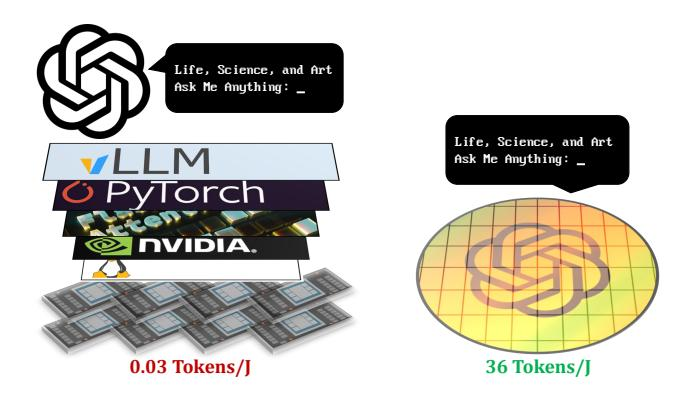
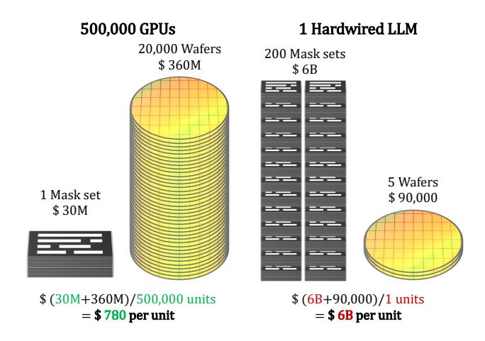
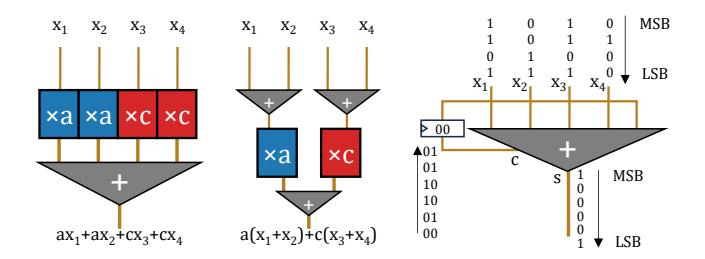

# 1 Introduction

Current trends in artificial intelligence development indicate that language capabilities serve as the core foundation for constructing advanced cognitive and learning systems. This is exemplified by the rapid advancement of Large Language Models (LLMs), which have achieved technological unification in Natural Language Processing (NLP) [\[5,](#page-14-0) [83,](#page-17-0) [87\]](#page-17-1). By demonstrating human-level performance across diverse downstream tasks, LLMs are expanding their application scope while exhibiting a growing trend toward enhanced generality—enabling a single model to handle multiple tasks that previously required distinct systems.

Driven by widespread adoption despite the heavy hardware overhead of LLMs, there has been a surge in demand for dedicated processors specifically designed for LLM inference, collectively known as Language Processing Units (LPUs). For instance, Groq LPU [\[1,](#page-14-1) [2\]](#page-14-2) and Cerebras WSE [\[48,](#page-16-0) [51\]](#page-16-1) pre-load model weights into on-chip SRAM, while Etched Sohu [\[89\]](#page-17-2) hardens the transformer dataflow into its compute fabric. These LPUs leverage the advanced specialization targeting LLMs, achieving 4 ∼ 20× energy efficiency compared to traditional CPUs, GPUs, and NPUs.

Although LPUs have brought a certain improvement in hardware efficiency, AI infrastructure still suffers from tremendous energy costs. For example, AI datacenters are estimated to occupy 12% of the total electricity capacity in the US by 2028, which is clearly unsustainable [\[62\]](#page-16-2). This is due to the fact that current LPUs and GPUs still see models as dynamically changing data, despite the fact that leading enterprises typically deploy only a single or a few proprietary LLMs. The hundreds of billions of weight parameters are repeatedly fetched during each autoregressive decoding step, consuming the majority of system power.

Figure 1. Hardwired LPU as a general-purpose processor. To the left: AI Infrastructures are originated in the rapidly evolving deep learning which appreciates universality over extreme efficiency. To the right: As LLM develops, the responsibilities of universality are shifting from HW/SW to LLMs. An extremely specialized Hardwired LPU can also be helpful in general tasks.

To fundamentally solve the limitation, we argue for pushing the specialization of LPU to the extreme. By physically hardwiring weight parameters into the LPU fabric, Hardwired LPU can achieve perfect architecture-model matching, zero parameter fetching overhead, and extreme computational efficiency from constants-arithmetic circuits. As one dominant pre-trained LLM can serve as a general-purpose cognitive substrate for a wide variety of tasks, the extreme specialization once considered too inflexible is transforming into a reasonable choice with huge potential benefits (Figure [1\)](#page-2-0).

However, previous attempts on hardwiring would be stopped by the extraordinarily large scale of modern LLM. The most optimistic estimation on hardwiring gpt-oss 120 B [\[65\]](#page-16-3) would require a 176,000 mm2 constant-multiply-and-accumulate units (CMAC) array at 5 nm technology. Unlike previous wafer-scale practices that step a repeated lithographic pattern on the wafer, here the patterns are heterogeneous everywhere, because embedded weight parameters are different everywhere. The photomask sets are valued at over 6 billion dollars, rendering the straightforward implementation of Hardwired LPU economically prohibitive.

An economically viable Hardwired LPU requires a breakthrough in weight-embedding methodology. In this paper, we propose the Metal-Embedding (ME) methodology, achieving multiple orders-of-magnitude reduction on photomask counts required to implement Hardwired LPU. Roughly speaking, instead of embedding weights in the 2D grid of cells (either MAC/CMAC/SRAM/ReRAM cells), ME embeds weights in the 3D topology of metal wires (Figure [6\)](#page-6-0). The benefits of ME are two-fold. First, due to the inherently richer expression of 3D structure, ME reduced the area by an orderof-magnitude (-93.4%) compared with the CMAC grid. Second, these metal wires can be placed at higher metal layers

(M8+), to be cost-efficiently fabricated with trailing-edge optical lithography (193i). As a result, ME keeps photomask homogeneous (shared) across all chips for all layers in Front-End-of-Line (FEOL) and critical layers in Back-End-of-Line (BEOL), including all Extreme Ultraviolet (EUV) photomask in the process. This reduced the total cost on photomask by another order of magnitude: -86.5% for initial tapeout, -92.3% for parameter-only update re-spin.

We evaluate the first Hardwired LPU design HNLPU at 5 nm technology based on post-layout characteristics, and compare with baselines (NVIDIA H100 GPU, Cerebras WSE-3) at the same technology node. Experimental results demonstrate that HNLPU achieved 249,960 tokens/s throughput (5,555× of H100, 85× of WSE-3), 36 tokens/J energy efficiency (1,047× of H100, 283× of WSE-3), at 13,232 mm2 total die area divided into 16 chips. Estimated Non-Recurring Engineering cost (NRE) of HNLPU is \$ 59.46 M–123.5 M for the initial tapeout, \$ 18.53 M–37.06 M for a parameter-only update respin. Under the OpenAI-scale deployment, the 3-Year Total Cost of Ownership (TCO) is lowered by 41.7–80.4× compared to H100 clusters with annual parameter updates under the OpenAI-scale volume, and the total carbon footprint (tCO2e) is lowered by 357×.

This paper makes the following contributions:

- We explored the concept and feasibility of Hardwired LPU for the first time.
- We propose the Metal-Embedding methodology, reduced the photomask cost of Hardwired LPU by two orders of magnitude.
- We detailed the architecture and dataflow of the first Hardwired LPU design, HNLPU. It implemented a gptoss 120 B (FP4) in 13,232 mm2 total die area, achieving unprecedented throughput and energy efficiency.
- We estimated the NRE, TCO, and tCO2e of HNLPU to show its strong economical and environmental advantage for typical cloud serving scenarios.

### 2 Background and Motivation

### 2.1 Hardwired Language Processing Units

In principle, orders-of-magnitude gains in computational efficiency can be achieved by directly fabricating neural network models into hardware. Since the 1980s, hardwired neural networks have been implemented in VLSI [\[31\]](#page-15-0), optical [\[3,](#page-14-3) [90\]](#page-17-3), and printed flexible [\[10,](#page-15-1) [59,](#page-16-4) [66,](#page-16-5) [67,](#page-16-6) [88\]](#page-17-4) circuits. However, the diversity and rapid evolution of neural networks have rendered such hardwired implementations of limited practical value and prone to rapid obsolescence. As a result, instead of hardwired neural networks, general-purpose processors such as GPUs and NPUs have prevailed due to their programmability. Contemporary AI infrastructure and software stacks including programming languages (e.g., CUDA, Triton), libraries (e.g., cuDNN, flash-attn), frameworks (e.g., PyTorch, vLLM) are built on a sweet spot between computational efficiency and architectural generality.

Figure 2. Economic challenges of hardwiring. Considering the cost on photomasks and wafers, the cost on photomasks was amortized by the mass production of GPUs. Hardwiring an LLM incurs too many photomasks and too low volume to amortize the NRE costs.

The rise of large language models (LLMs) has fundamentally altered this landscape. Unlike earlier task-specific neural networks designed for isolated tasks, LLMs function as general-purpose cognitive substrates capable of reasoning, planning, and interacting across a wide range of domains. For the first time in history, we possess a single neural network model that is valuable enough to justify hardwired implementation.

Although technically hardwired (in the sense that its parameter weights are physically immutable), the circuit embodies a new paradigm of the general-purpose processor. We refer to this novel processor paradigm as the Hardwired Language Processing Unit (Hardwired LPU). By leveraging the emergent capabilities of in-context learning and zero-shot reasoning, a hardwired LPU treats natural language prompts as a high-level instruction stream, effectively replacing the traditional binary Instruction Set Architecture (ISA) with a semantic interface. Consequently, the user programs the Hardwired LPU not by altering its models and weights, but by prompting with tokens to perform arbitrary tasks.

In this paper, we demonstrate that a single-node Hardwired LPU can outperform a middle-sized GPU cluster without requiring expensive software support, thus establishing a decisive operational-expenditure (OpEx) advantage over challengers. Therefore, we envision Hardwired LPUs as game-changing platforms for long-term, high-volume deployment, while GPU clusters assume the role of short-cycle model development and evaluation testbeds.

### 2.2 Economic Challenges

A glaring challenge has thwarted all ambitious attempts to hardwire LLMs: LLMs are too large for the current lithographic technology. The practical obstacle lies in the non-recurring engineering (NRE) cost, primarily the cost from photolithographic masks.

In semiconductor technology, chips are fabricated as layered structures defined by photomasks (analogous to stencils). Front-end-of-line (FEOL) processes, which form the device cells (transistors) on the silicon wafer, typically require on the order of 30 mask layers, while back-end-of-line (BEOL) processes, which form the metal interconnect stack, require approximately 40 additional mask layers. At 5 nm technology nodes, a full photomask set is valued at \$30 M, while each processed wafer is valued at approximately \$18,000. As shown in Figure 2, the high NRE cost of photomasks is meant to be amortized with massive production. For example, NVIDIA is estimated manufacturing 20,000 wafers of H100 GPU, then the amortized photomask cost would be \$1,500 per wafer. However, the expected production volume of hardwired LPUs is very low. Due to the extreme computational efficiency, tens of wafers would oversaturate current LLM service demand on the planet, which renders the expensive photomask set for few uses only.

A straightforward implementation would require an extraordinarily large silicon area to embed the weights, and a correspondingly large number of photomask sets. For example, the typical transistor density of high-density 5 nm technology is around 138 MTr/mm². FP4 Constant MAC (CMAC) requires 200+ transistors. This translates GPT-oss 120 B into an ideal area estimation of 176,000 mm² divided into 200+ chips. Due to reticle size limits, this hardwired LPU must be split across 200+ photomask sets. Unlike prior wafer-scale practices, these masks are heterogeneous because each chip is carrying different parts of the model weights. This incurs \$30 M  $\times$  200 = \$6 B NRE costs on photomask making, rendering a straightforward hardwired LPU economically prohibitive.

Compounding this economic infeasibility is the fast LLM development cycles. The prohibitively high NRE is even worse when considering the annual parameter updates and 3-year typical lifespan of production LLMs (e.g., GPT-4). This multiple-orders-of-magnitude cost gap is unlikely to be bridged solely through model compression. Note that the GPT-oss is already FP4 by default. The model size has a concrete lower bound implied by the Kolmogorov complexity of human knowledge representation.

To realize the concept of hardwired LPUs, there must be fundamental breakthroughs in on-die weight embedding methodologies. By co-optimizing with lithographic technology factors, we can achieve multiple orders-of-magnitude reduction in photomask count, eventually clear the path to the economically viable hardwired LPUs.

**Figure 3. Key arithmetic techniques.** To the middle: Combining repeated multipliers via the distributive law. To the right: Using Carry Save Adders (CSA) on bit-serialized inputs to trade time for area.

