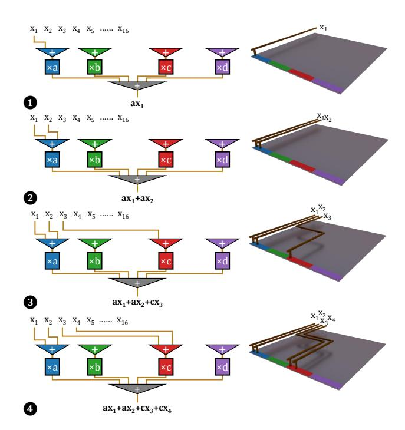
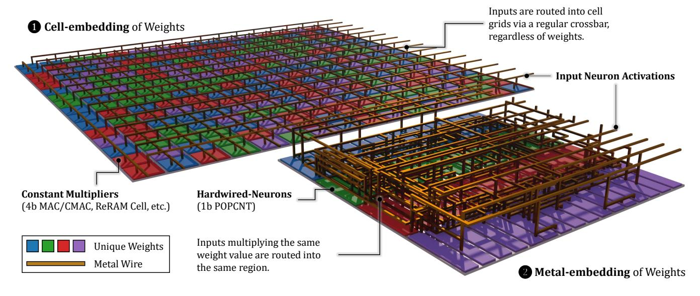
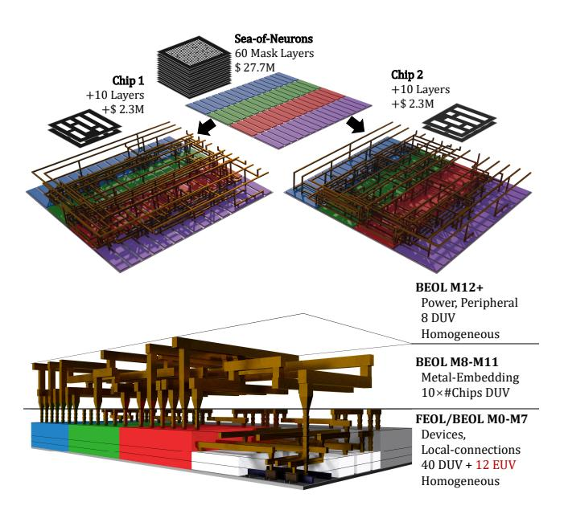
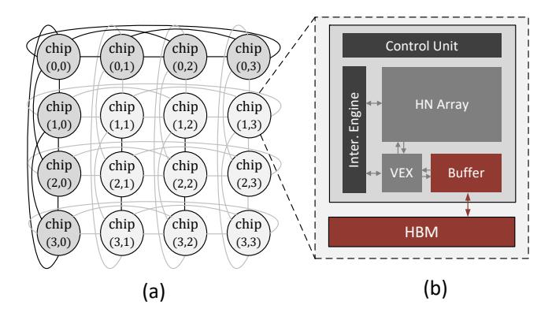
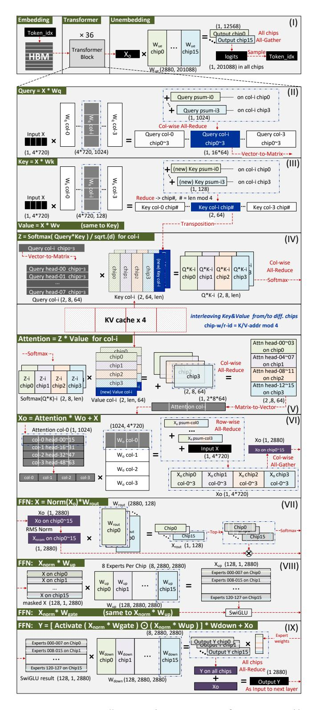
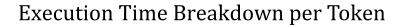

# 3 Metal-Embedding

We address this economical challenge with the novel *Metal-Embedding* (ME) methodology. There are two key innovations in ME. 1) The *Hardwired-Neuron* (HN) architecture rearranges conventional multiply-accumulate arithmetic units into accumulate-multiply-accumulate, and lifted the embedding of weight parameters from silicon devices into metal interconnections. This enables 2) the *Sea-of-Neurons* architecture – a metal-programmable structured ASIC saving photomasks through a prefabricated array of HNs.

#### 3.1 Hardwired-Neuron Architecture

We demonstrate the step-by-step evolution from the straightforward FP4 multiply-and-accumulate units to Hardwired-Neurons (HN). Several key arithmetic techniques are applied to minimize the required silicon area.

**Basic:** Weight Constancy. Conventional hardwiring (the \$6B scenario) utilizes weight constancy. By fixing the weights, multipliers could be optimized as multiply-by-constant which is several times lower in Boolean complexity. An FP4 multiply-by-constant unit is  $\sim$ 6× smaller than an FP4 multiplier as seen in GPU. Accumulation could also benefit from the weight constancy under the help of optimizing EDA tools.

**Step 1: Distributive Law.** In conventional hardwiring, FP4 weights have 16 unique values, but there are  $2,880^1$  constant multipliers in each neuron. Most of them are repeated. By the distributive law, common multipliers could be extracted and combined. As shown in Figure 3, instead of performing  $ax_1 + ax_2 + \cdots + ax_n$  (to the left), HN performs  $a(x_1 + x_2 + \cdots + x_n)$  (to the middle) which saves multipliers and reduces the width of accumulation.

**Step 2: Bit-serialization.** If input signals  $x_1, x_2, \ldots, x_n$  are in binary format, they could be serialized from the least-significant bit (LSB) to the most-significant bit (MSB) to further simplify the circuit. As shown in Figure 3 (to the right), the single-clock-cycle accumulation could unfold into a multiple-clock-cycle tree of Carry Save Adders [38], trading off speed for minimized area.

&lt;sup>1The hidden size in GPT-oss 120 B.

Figure 4. Hardwired-Neuron architecture. 

A conventional cell-embedding neuron contains 2,880 4b multipliers (16 shown) followed by an 8b×2,880 adder tree, where 2,880 is the hidden size in GPT-oss 120 B; 

With ME, Hardwired-Neurons accept 1b serialized inputs (LSB-first), (1) route the inputs multiplying the same weight value to the same region, (2) perform accumulation (POPCNT) on these input signals, (3) perform actual multiplication with 16 multipliers (4 shown), (4) sum the results with a 4b×16 adder tree. Note how \nis significantly smaller in area than 
to by reducing the number of multipliers and the strength of adders.

HN is an accumulate-multiply-accumulate unit adopting all of the above-mentioned techniques as shown in Figure 4. The main result of the sophisticated combination of these techniques is that HN lifted the embedding of weight parameters from silicon devices into metal interconnections, as the name *Metal-embedding* suggests. Conventional neurons are *Cell-Embedding* (CE, Figure 4 ①), i.e., weight parameters are written into the silicon device cells composed of different constant-multipliers; HNs are *Metal-Embedding* (ME, Figure 4 ②), i.e., the weight parameters are embedded as metal wires. The silicon device cells in HN can be made parameter-independent.

Figure 5 shows the weight embedding process through metal wires step-by-step. For each unique value in FP4, there is an accumulator (POPCNT) in the HN. We denote the accumulators corresponding to each unique weight value with different colors (FP4 has 16 unique values, 4 shown in the schematic: blue for a; green for b; red for c; violet for d). For each input  $x_i$ , the weight w is embedded as a metal wire connecting input  $x_i$  to the accumulator for the value w. For example, as the first term is  $ax_1$ , a metal wire is built connecting  $x_1$  to the blue accumulator (Figure 5  $\blacksquare$ ). Note how the silicon devices are made parameter-independent: changing the weight from a to b would only change the wire

Figure 5. Step-by-step schematic showing how weights are physically embedded in the 3D metal wire topology. HNs are accumulate-multiply-accumulate arithmetic units where each weight parameter is expressed by the source and destination of a metal wire: ①  $ax_1$  by connecting from  $x_1$  to the blue region; ②  $ax_2$  by connecting from  $x_2$  to the blue region; ③  $cx_3$  by connecting from  $x_3$  to the red region; ④  $cx_4$  by connecting from  $x_4$  to the red region.

destination from blue to green, while the whole accumulatemultiply-accumulate arithmetic unit is kept unchanged.

To address the imbalance of weight values, the size of accumulators should be made with sufficient slackness. The accumulators could be implemented as multiple slices and be reconfigurable through metal wires. Unused ports on the accumulators are connected with zero inputs (ground).

Figure 6 **②** provides an intuitive conceptual schematic of ME. The die is split into HNs; each HN is drawn as a  $\searrow$  row in the schematic. Each HN corresponds to an output neuron activation in the model. Each HN is divided into several regions (different coloring in the schematic), where each region represents a unique weight value. For 4b precision models, there are  $2^4 = 16$  unique weight values (4 shown in the schematic). To multiply with a weight, the input neuron activation signal is routed into the corresponding region via metal wires. The model weights are solely embedded within the metal interconnection, expressed by connecting each input signal with corresponding regions.

The key insight here is that, as the metal wire topology is three-dimensional, they could potentially embed information in a much higher density than silicon devices. Current CE

**Figure 6. Conceptual schematic of Metal-Embedding. ©** Conventional design embeds weights in the 2D grid of cells. Metal layers are only for physical design (P&R). **②** Metal-Embedding dramatically increases the density by leveraging the 3D topology structure of metal wires, emulating the axon-dendrite in brains.

methodologies (Figure 6 **1**) fail to recognize metal layers in their architecture design. Metal layers are only considered in physical design (place-and-route, P&R), thus the topology of metal wires does not express any specific information. We view this as a waste of resources. Since silicon devices are the area-limiting factors in the design, routing signals through complex metal wires is virtually free in both area and energy, compared with logic implemented in standard cells. We refer to the novel architecture as *Hardwired-Neurons* because of its structural similarities with biological neurons. Biological neurons in the brains have complex topology of axon-dendrite interconnections in the first place, only then come synaptic weights.

When adopted alone, the HN architecture increases the density of hardwired LLM by an order of magnitude (from 200+ chips to 16 chips). But more importantly, HN concentrates all the parameter-dependent structures into metal wires, which is a prerequisite step towards introducing the *Sea-of-Neurons* architecture.

### 3.2 Sea-of-Neurons Architecture

Up to this point, there are two common concerns to address: **1) The NRE is still high.** Even with significantly reduced area of HN, 16 chips still require 16 full mask sets each valued \$30 M, that is \$480 M. The total NRE still offset most economic interests. **2) What if the weight parameters change?** LLM requires at least annual updates to keep competitive, and there would be unforeseen hotfixes. Do we need another \$480 M for a Hardwired LPU re-spin?

The key to these concerns is to **share and reuse parameterindependent photomasks**. As the silicon devices in HN are

Figure 7. The cross section of chips [76]. Geometric patterns in semiconductor chips are defined by photomasks. Silicon devices and lower metal layers have finer geometric features and thus require much more expensive photomasks to define them.

parameter-independent, we can prefabricate HN arrays with a shared photomask set, then finalize the metal embedding wires with a few additional parameter-dependent photomask layers. By concentrating metal embedding wires into higher level metal layers, the majority of the photomask cost can be saved. The 16 chips could share the same photomask set for the prefabricated HN array, and the photomask set could be reused for future weight update re-spins.

Different layers of photomask in the set are valued differently. Generally speaking, higher levels use cheaper photomasks. As shown in Figure 7, silicon devices and lower metal layers have finer feature dimensions and requires high resolution lithographic patterning which is expensive. For

Figure 8. Sea-of-Neurons Architecture. To the top: All chips share the same prefabricated HN array and 60 layers of photomask, then the embedding metalization (M8-M11) requires additional 10 layers of photomask per chip. To the bottom: The schematic from cross section with opened HN module box, showing devices and local metal wires (M0-M7) inside the HN array that are made homogeneous and masksharing. Note all the critical layers requiring EUV are shared.

example, metal layers at M10–M11 (∼60 nm half-pitch) require Deep Ultraviolet (DUV) single-exposure patterning (193i SE); at M4–M9 (∼40 nm half-pitch), DUV double patterning is required (typically 193i SADP, with some layers modeled as LELE); at M0–M3 (∼20 nm half-pitch), DUV quadruple patterning (193i SAQP) or Extreme Ultraviolet Lithography (EUV SE) is required. FEOL processes making devices and contacts also require expensive EUV or DUV multiple patterning. Top metal layers including M12+ are typically reserved for power delivery networks, clock trees, and I/O peripherals. Therefore, we select M8-M11 (involving 10 layers of DUV photomasks, valued \$ 2.31 M) as the metal-embedding layers.

The integrated circuit design approaches to save photomask costs by semi-custom metalization over a prefabricated array of cells are known as Structured ASIC [\[94\]](#page-17-6), and have emerged throughout history, including gate arrays in the 1970s, sea-of-gates in the 1990s [\[20\]](#page-15-3), Altera HardCopy in the 2000s [\[56\]](#page-16-7), and Intel eASIC N5X in 2020 [\[39\]](#page-15-4). As our approach is prefabricating arrays of neurons instead of gates, we refer to it as the Sea-of-Neurons architecture.

Figure [8](#page-7-0) illustrates the Sea-of-Neurons architecture. Seaof-Neurons is a metal-programmable architecture: Weights are programmed into the architecture with M8-M11 metalization over a prefabricated HN array. As 60 out of 70 mask

Figure 9. The overall architecture of HNLPU system. (a) System-level architecture of HNLPU, featuring a logical 4 × 4 row-column fully-connected fabric to interconnect its 16 modules. (b) Architecture of a single compute module, comprising the core die and HBM.

layers are shared (including all critical layers requiring EUV), the photomask cost is significantly reduced from \$ 480 M to \$ 65 M [2](#page-7-1) . When the weight parameters change, a re-spin requires only \$ 37 M [3](#page-7-2) as the prefabricated HN array is ready.

The Sea-of-Neurons architecture is compatible with standard ASIC design flow and EDA tools. First, complete the P&R of the HN array module under standard cell constraints within M0-M7. The layout of HN is copied to fill the major part of die area, equipped with all SoC peripherals, power grid, and clock tree. Next, the layout is exported to custom tools which read weight parameters and generate TCL scripts to instruct the connection of metal embedding wires. The generated script is integrated into the overall layout within the P&R EDA tool. The resulting complete design is then subjected to design rule checking (DRC) and layout-versusschematic (LVS) verification, with detected rule violations resolved through automated local repair. Finally, parasitic extraction and post-layout simulation is conducted to evaluate functional correctness and timing behavior under realistic physical effects. In our experiments, the layouts successfully completed the sign-off checks showing ample routing density margins in both M0-M7 and M8-M11.

### 4 Architecture

In this section, we introduce the architecture of HNLPU in a top-down manner, as shown in Figure [9,](#page-7-3) including system integration and single chip architecture.

### 4.1 Overview

HNLPU is a complete physical implementation of gpt-oss 120 B and its computational process for inference. HNLPU

2 \$ 27.69 M (the prefabricated HN array) + \$ 2.31 M (M8-M11 metalization per-chip) × 16 (number of chips)

3 \$ 2.31 M (M8-M11 metalization per-chip) × 16 (number of chips)

system directly implements Continuous Batching on hardware to fill its pipeline. The hardware receives token IDs and generates token IDs as outputs, operating without a software stack (OS, runtime, library, compilers, frameworks). This pure hardware implementation offers two benefits: 1) It eliminates the heavy software development and maintenance cost. 2) It eliminates the software turbulence and brings more deterministic and predictable system behavior.

HNLPU distributes the weights across 16 chips interconnected via CXL. Besides the HN array, the chips also implement embedding dictionary lookup, Grouped Query Attention (GQA), Mixture-of-Experts (MoE) routing, Root-Mean-Square Normalization (RMSNorm), Swish-Gated Linear Unit (SwiGLU), and logit sampling. A memory subsystem is implemented for the embedding dictionary and the attention buffer (KV Cache), including SRAM and HBM.

### 4.2 System Integration

Interconnection topology. HNLPU system architecture is built upon a 16-module row-column fully-connected fabric. As conceptually illustrated by the logical topology in Figure [9](#page-7-3)(a), this fabric establishes direct, point-to-point links from each module to all other modules within its row and, simultaneously, to all other modules within its column. This design creates a router-less, low-latency network for efficient collective communication patterns (e.g., All-Reduce). Each compute module is a self-contained unit, equipped with a dedicated HBM for storing the KV Cache and the embedding tables.

Multi-chip group mapping. HNLPU evenly distributes its constituent chips into multiple row- and column- groups, with each row and column containing 4 chips. This grouping strategy enables a parallel mapping of the self-attention and feed-forward network—the most computationally intensive parts of a Transformer block. Specifically,

- 1. For the GQA projection, the projections for all query, key, and value heads are uniformly mapped to their respective column groups.
- 2. For attention score, query-heads are all-reduced within the same column groups, while key- and value- heads are reduced to the chip-(ℓ mod 4), where ℓ denotes the sequence length.
- 3. For the feed-forward network with MoE, all experts are uniformly distributed to all chips, and the input vector broadcasts to all chips. Specifically, each chip is responsible for 8 experts.

This group mapping strategy of HNLPU offers two key advantages. First, by distributing the GQA computation uniformly, the workload is balanced across all chips. This alleviates pressure on key computational resources (e.g., VEX units) and reduces the storage and bandwidth demands on the SRAM and HBM. Second, the independence of the MoE experts enables fully parallel FFN computation, eliminating

the need for data exchange during the projection steps. The detailed execution process and dataflow are further elaborated in Section [5.](#page-9-0)

Physical System Integration. The physical implementation of HNLPU is based on established, industry-validated High-Performance Computing (HPC) integration practices.

Packaging: Each compute module utilizes 2.5D packaging to integrate a large monolithic die with its dedicated HBM stacks (conceptual topology is similar to the NVIDIA Blackwell platform).

Inter-Chip Communication: Direct point-to-point interconnects are established via the CXL 3.0 protocol (on PCIe PHY). This open standard offers low latency (<100 ns) and high bandwidth (128 GB/s per ×16 link), with performance approaching proprietary solutions (e.g., NVIDIA NVLink).

Manufacturing Yield: The modular design enables a "Known-Good-Module" strategy. Each packaged module is tested independently, thus decoupling the final system's assembly yield from the challenging manufacturing yield of the large monolithic dies.

Thermal Management: For high thermal density, a Directto-Chip Liquid Cooling (DLC) solution is employed by mounting a cold plate on each module—an approach validated in compute platforms such as the NVIDIA DGX H100.

### 4.3 Single Chip Architecture

As shown in Figure [9](#page-7-3)(b), each chip in HNLPU is composed of five primary modules. The HN Array and VEX Unit are responsible for the LLM computation, including operations on hardwired weights, attention mechanisms, and nonlinear activation functions. The Attention Buffer serves as the onchip KV Cache. Finally, the Control Unit manages on-chip scheduling and inter-layer pipelining for multi-batch scenarios, while the Interconnect Engine facilitates inter-chip communication.

The HN Array is a dedicated unit for performing computations that involve the fixed and pre-trained weights. As shown in Figure [4.](#page-5-0)❷, we use metal embedding strategy to hardwire all the weights in the LLM onto the chip. Although the HN Array has a large area, its power consumption is remarkably low. This efficiency stems from the high sparsity of circuit activity: only 4 out of 128 experts are active at any given time in the target MoE architecture. For weight matrices (e.g., ) that are partitioned across multiple chips, each HN Array computes a partial sum. This result is then forwarded to the Interconnect Engine for aggregation with corresponding partial sums from other chips.

The Vector Execution Unit (VEX) is responsible for executing vector and matrix operations, including calculating attention scores, applying nonlinear functions (e.g., RMSNorm, SwiGLU, softmax), performing residual additions, and handling output sampling. 1) VEX adopts the FlashAttention

computation flow to calculate attention scores. The hardware implementation consists of GEMV units and nonlinear operators. It fetches queries from the Interconnect Engine and reads keys/value (K/V) pairs from the on-chip Buffer. For each chip, the VEX unit is designed to process 32 cached KV-heads per cycle without stalling. 2) VEX also integrates dedicated nonlinear modules for the efficient computation of RMSNorm, SwiGLU, and softmax operations. Additionally, it includes a vector-aligned adder for residual connections and a specialized unit to perform multinomial sampling.

Attention Buffer. The on-chip 320 MB Attention Buffer comprises 20,000 banks, each with a 16 KB capacity. Every bank features a 1W1R (one-write, one-read) port configuration with a 32-bit access width. The Attention Buffer primarily functions as a KV Cache for the chip's assigned attention groups. It offloads excess KV entries to HBM only when the on-chip capacity is exceeded. This buffer also stores activation vectors for residual connections in the FFN blocks.

Interconnect Engine and Control Unit. The Interconnect Engine and Control Unit on each chip jointly manage all inter-chip communication and data collectives. The communication topology is organized into row-wise and columnwise groups, each with specific supported operations: 1) For row-wise communication, the system supports a *Broadcast* to distribute data (e.g., the activation vector) to all chips within the same row, and a corresponding Reduce operation to aggregate the partial sums computed by each chip in that row. 2) For column-wise communication, the system distributes inputs to chips within a column using either a Scatter operation, which provides each chip with a distinct portion of a vector, or a *Broadcast* operation, which provides all chips with the identical vector. To collect the results, the system supports both Reduce for aggregating partial sums and Gather for concatenating output vectors.

#### 5 Execution Dataflow

In this section, we introduce the multi-chip interconnect dataflow of HNLPU, covering the model-to-chip mapping and the computing process of a Transformer block. In Section 5.1, we provide an overview of HNLPU dataflow. Section 5.2 details our pipelining strategy and batching inference scheduling. Detailed description of the dataflow is presented in Appendix A.

#### 5.1 Dataflow Overview

Figure 10 illustrates the dataflow of HNLPU. Our design is driven by the primary goals of distributing computational load, KV cache memory access, and thermal loads, while minimizing inter-chip data communication.

Processing begins with fetching a token vector of shape (1, 2880) from the High-Bandwidth Memory (HBM) based on the received token index. This vector then traverses through 36 transformer blocks, where self-attention and feed-forward

**Figure 10. Dataflow and mapping of HNLPU.** (I) Overview of dataflow. (II) Query projection. (III) Key and Value projection. (IV&V) Attention score. (VI) Post-attention residual addition. (VII) Router in MoE. (VIII) Up- and Gate-projection. (IX) Down-projection and residual addition.

Figure 11. A six-stage pipeline partitioning diagram for HNLPU dataflow.

network (FFN) computations are performed layer by layer. For the multi-head attention module, we employ a hybrid weight distribution strategy: the  $W_{qkv}$  weight matrix is partitioned column-wise across different chip column groups, while the  $W_o$  weight matrix is partitioned row-wise across the same set of chips. This design allows for parallel, independent computation across different chip columns for the  $W_{qkv}$  operations and across different chip rows for the subsequent  $W_o$  computations, thereby minimizing inter-chip data transfer.

The FFN implementation, which uses a Mixture-of-Experts (MoE) architecture, assigns eight experts to each chip, allowing for entirely independent computation with no inter-chip communication. A key exception to our partitioning strategy is the router weight matrix,  $W_{\rm rout}$ , which is replicated across all chips. This deliberate design trade-off introduces a negligible area overhead—as the router's weights constitute only about 0.01% of the total model weights—but eliminates the communication latency. Once all transformer blocks have been processed, the final output vector is passed through the unembedding layer, and a new token index is calculated through a sampling operation. Detailed description of the dataflow is presented in Appendix A.

#### 5.2 Pipeline and Scheduling

HNLPU employs a nested pipelining strategy to maximize throughput, consisting of both inter-layer and intra-layer pipelining. Since all layer weights are hardwired onto the metal layers, the wiring weights for each layer have their own corresponding computing resources. HNs of each layer can operate simultaneously, which facilitates the straightforward formation of a pipeline between the model layers. Within a layer, we partition the computation into a six-stage pipeline, as shown in Figure 11. Consequently, HNLPU can process up to  $(6 \times \# \text{layer})$  requests simultaneously at peak. For the 36-layers LLM, the maximum batch size can theoretically reach 216.

HNLPU employs the batching strategy similar to Continuous Batching [91]. During the **prefill** phase, there are no dependencies between the input tokens of a sequence. This independence allows for massively parallel processing, with tokens flowing through the pipeline stage-by-stage.

Consequently, HNLPU can process up to 216 tokens concurrently during prefill. Conversely, the **decode** phase is auto-regressive, meaning the generation of each new token is dependent on the completion of the previous one. However, since different sequences are independent, HNLPU can still process up to 216 sequences simultaneously. In summary, HNLPU supports a maximum batch size of 216 sequences. By leveraging Continuous Batching, the system dynamically schedules new sequences into the batch as soon as slots are freed by completed ones, thereby ensuring high throughput.

### 6 Methodology

This section details the methodology used to evaluate proposed HNLPU architecture. We describe our hardware evaluation flow, the system-level modeling for multi-chip design, the model used for performance assessment, and the configurations of all baseline systems.

### 6.1 Hardware and System-Level Evaluation

Hardware Implementation. We implemented the core components of HNLPU architecture, including HN Array, Control Unit, VEX, Interconnection Engine and on-chip Attention Buffer in RTL with Verilog, and verified the correctness of the RTL design using extensive test cases. We followed a standard ASIC design flow to obtain physical characteristics. The design was synthesized using Synopsys Design Compiler and placed-and-routed using Synopsys IC Compiler, on 5 nm technology. Power consumption was analyzed by PrimeTime PX using workload-derived switching activity (SAIF file) to accurately model both static and dynamic power. On-chip SRAMs were generated and analyzed using Memory Compiler on the same technology node.

*Multi-chip System Modeling.* Our proposed HNLPU is a  $4\times4$  multi-chip system interconnected via the CXL 3.0 protocol. We evaluated the inter-chip communication latency and power using CNSim [25], a state-of-the-art open-source analysis framework for multi-chip systems. This framework allows for detailed modeling of the network on package topology, accounting for physical layer (PHY) latency, protocol overhead, and physical routing delays in our design. We also built a cycle-level simulator for single-chip performance

evaluation.

#### 6.2 Model

We selected the OpenAI GPT-oss 120 B model for system-level evaluation. It is a state-of-the-art open-source MoE large language model built on Llama-style architecture. We used 4-bit quantized version of the model and hardwiring the weights in HN Array. HNLPU implementation of the model follows partitioning method, dataflow and mapping strategies detailed in Section 4 and Section 5.

#### 6.3 Baseline Configurations

We conducted two sets of experiments to comprehensively evaluate our architecture against relevant baselines.

Embedding Methodology Comparison. This benchmark compares the performance of a single matrix-vector multiplication:  $1 \times 1024$  input vector with a  $1024 \times 128$  FP4 weight matrix (typical dimension in an LLM attention block) under various embedding methodologies. We compare three designs at 5 nm technology: MAC Array (MA), a 64 KB SRAM companioned with a conventional computing array of 1024 MACs, Cell-Embedding (CE) and Metal-Embedding (ME) as illustrated in Figure 4. Regarding area, we compare CE and ME with the 64 KB SRAM only, excluding the arbitrarily-sized computing array.

**System-Level Performance Comparison.** This experiment compares our full HNLPU architecture against leading commercial systems running the same GPT-OSS 120 B model with a 2K token length, with hyperparameters for each system individually tuned to achieve its optimal throughput.

- 1. **NVIDIA H100**: We conducted direct measurements on a server equipped with H100 (80 GB memory, 3.35 TB/s bandwidth) GPU. The model was deployed via TensorRT-LLM, and the reported figures are averaged over multiple runs
- 2. **Cerebras WSE-3**: The throughput was empirically measured through publicly accessible Cerebras cloud service [8] running the GPT-oss 120 B model. As power measurement on cloud is not practical, we adopted the system power figures reported in [46] instead.
- 3. **HNLPU**: We utilize post-PnR simulations capturing physical layout parasitics and wire delays. This approach provides high-fidelity performance projection, as HNLPU operates on a deterministic Token-In-Token-Out execution model free from software-stack variability.

#### 7 Evaluation

### 7.1 Layout Characteristics

To validate the physical feasibility of HNLPU, we conducted a sign-off-grade implementation flow across representative PVT corners. The design achieves timing closure at 1.0 GHz

Figure 12. Area Comparison.

**Figure 13.** Time and Energy Comparison.

Table 1. Single Chip Hardware Characteristics

|                     | Area (mm²) | %     | Power (W) | %     |
|---------------------|------------|-------|-----------|-------|
| HN Array            | 573.16     | 69.3  | 76.92     | 24.94 |
| VEX                 | 27.87      | 3.4   | 33.09     | 10.73 |
| Control Unit        | 0.02       | 0.0   | < 0.01    | 0.0   |
| Attention Buffer    | 136.11     | 16.5  | 85.73     | 27.80 |
| Interconnect Engine | 37.92      | 4.6   | 49.65     | 16.10 |
| HBM PHY             | 52         | 6.3   | 63        | 20.43 |
| Total               | 827.08     | 100.0 | 308.39    | 100.0 |

under worst-case conditions (SSG, 0.675 V, 125 °C), ensuring robust operation under extreme process variations and voltage drops. The design achieves a congestion-free layout with zero overflow. The routing density on ME layers (M8–M11) remains below 70% (lower than typical accelerators), validating the feasibility of ME strategy. Signal integrity is confirmed by parasitic extraction (avg.  $R=164\,\Omega$ ,  $C=7.8\,\mathrm{fF}$ ), showing manageable coupling effects. Thermal analysis confirms that the power density (avg. 0.3 W/mm², peak 1.4 W/mm²) is well within the cooling limits of 2.5D packaging. Finally, the layout is DRC/LVS clean, and yield estimation based on Murphy's model (defect rate 0.11/cm²) confirms the manufacturability of the design.

Table 1 presents the area and power breakdown of a single chip in HNLPU. The HN Array and the Attention Buffer are the dominant components in terms of both area and power. The chip occupies a total area of 827.08 mm2 and has a power consumption of 308.39 W.

The Attention Buffer sustains 80 TB/s bandwidth and 3-cycle latency under worst-case PVT conditions, confirming sufficient performance margins.

The power density of the HN array is significantly lower than other components due to the sparse circuit activity induced by MoE. Specifically, only 4 out of 128 experts are activated at a time.

**Table 2.** System-Level Performance and Efficiency Comparison for GPT-OSS 120 B Inference

| Metric                                      | HNLPU   | H100  | WSE-3 a |
|---------------------------------------------|---------|-------|--------------------|
| Core Performance                            |         |       |                    |
| Throughput (tokens/s)                       | 249,960 | 45    | 2,940              |
| Physical Characteristics                    |         |       |                    |
| Technology Node                             | 5 nm    | 5 nm  | 5 nm               |
| Total Silicon Area (mm²)                    | 13,232  | 814   | 46,225             |
| System Footprint (Rack Units)               | 4 U     | 1 U   | 16 U               |
| Power & Efficiency                          |         |       |                    |
| Total System Power (kW)                     | 6.9     | 1.3   | 23.0               |
| Energy Efficiency (tokens/kJ)               | 36,226  | 34.6  | 127.8              |
| Area Efficiency (tokens/ $(s \cdot mm^2)$ ) | 18.89   | 0.055 | 0.064              |

&lt;sup>a WSE-3 data is obtained from published reports [9, 46, 58, 85] and calibrated against performance on its public cloud service [8].

#### 7.2 Embedding Methodology Comparison

Figure 12 presents the post-layout area comparison using the SRAM in MA as a base unit. The area of CE/SRAM(MA)/ME is  $14.3 \times /1 \times /0.95 \times$ , respectively, validating the claimed density advantage of ME.

The performance and energy consumption results are illustrated in Figure 13. Both the ME and CE designs demonstrate a dramatic reduction in execution cycles compared to the MA by fully parallelizing the computation. Constrained by the need to fetch weights from SRAM and its limited multiplier array, the MA requires significantly more cycles to complete the same task. The energy reduction of ME is also significant. It consumes the least energy by completely eliminating memory access. While the CE also eliminates power from SRAM access, its massive area leads to substantial leakage power, making it less energy-efficient than ME. The energy consumption of MA is mainly driven by repeated, power-intensive accesses to its SRAM.

In summary, the experimental results demonstrate the comprehensive PPA superiority of the ME design at the operator level. This validates the effectiveness of ME as the fundamental building block for LLM accelerators.

#### 7.3 System-Level Performance Comparison

This section provides a comparison of the system-level performance and efficiency of HNLPU, NVIDIA H100, and Cerebras WSE-3 on GPT-OSS 120 B model, as detailed in Table 2. HNLPU demonstrates orders-of-magnitude advantages in both throughput and energy efficiency, achieving up to 5,555× and 85× throughput, and 1,047× and 283× energy efficiency, respectively. HNLPU's superior performance and efficiency stem from a fundamental architectural redesign that diverges from conventional systems.

First, HNLPU physically hardwires model weights into

**Figure 14. Execution time breakdown across varying context lengths.** The total execution time is decomposed into inter-chip CXL communication, projection, non-linear operations, attention computation and memory access stalls.

the compute fabric. This creates massive, fine-grained parallelism and inherently supports ultra-high throughput inference.

Second, as a direct consequence, this design completely eliminates the need to access weights from the memory hierarchy (e.g., SRAM, DRAM), thus avoiding the immense energy cost of memory access.

Finally, HNLPU operates on a highly optimized, model-specific dataflow, workload partitioning, and pipelining strategy, which contrasts with the instruction-driven paradigm of GPUs. This eliminates the significant overhead from control unit such as instruction decoding, scheduling, and control flow. It ensures that nearly all time, power, and area are dedicated to effective computation.

#### 7.4 Execution Time Analysis

Figure 14 presents the execution time breakdown across varying context lengths. Memory access latency is effectively hidden by the double-buffering mechanism: stalls remain negligible up to 256K tokens, and reach 10.7% at an extreme context length of 512K, where KV cache is loaded from off-chip HBM. In terms of breakdown, the highly optimized computing components expose inter-chip communication as the dominant factor at shorter lengths, while attention computation becomes dominant as the sequence length increases.

### 7.5 Economic Analysis and Carbon Footprint

We present a comprehensive Total Cost of Ownership (TCO) analysis over a three-year lifecycle in Table 3. We compare HNLPU against an equivalently provisioned NVIDIA H100 GPU cluster delivering comparable inference throughput. We consider two representative deployment volumes: a low-volume deployment corresponding to a single HNLPU node, and a high-volume scenario corresponding to an OpenAI-scale deployment [63, 64]. We provide both optimistic and

Parameter Category Low Volume High Volume HNLPU H100 HNLPU H100 System Configuration & Power Number of Systems / GPUs1 1 2,000 50 100,000 Total Datacenter Power (MW) 2 0.010 3.64 0.483 182 Capital Expenditure (CapEx) Node Price3 \$ 59.25 M ∼ 123.3 M \$ 79.99 M \$ 62.83 M ∼ 129.9 M \$ 4,000 M Data Center Infrastructure4 \$ 0.2100 M \$ 54.93 M \$ 10.30 M \$ 2,747 M Total Initial CapEx \$ 59.46 M ∼ 123.5 M \$ 134.9 M \$ 73.13 M ∼ 140.2 M \$ 6,747 M Update Re-spin Cost5 \$ 18.53 M ∼ 37.06 M \$ 0.00 \$ 22.11 M ∼ 43.68 M \$ 0.00 3-Year Operational Expenditure (OpEx) Electricity Cost6 \$ 0.0250 M \$ 9.088 M \$ 1.206 M \$ 454.4 M Maintenance & Support7 \$ 0.0730 M ∼ 0.1353 M \$ 47.24 M \$ 0.3650 M ∼ 0.6765 M \$ 2,362 M 3-Year Total Cost of Ownership (TCO) Static Model (No Updates) \$ 59.56 M ∼ 123.7 M \$ 191.2 M \$ 74.70 M ∼ 142.1 M \$ 9,563 M Dynamic Model (Annual Updates) \$ 96.62 M ∼ 197.8 M \$ 191.2 M \$ 118.9 M ∼ 229.4 M \$ 9,563 M

Table 3. Total Cost of Ownership (TCO) Analysis for LLM Inference over a 3-Year Lifecycle.

All figures are rounded to four significant figures. Appendix [B](#page-18-0) presents the detailed assumptions and source references.

pessimistic estimates to account for the sensitivity of key assumptions. For detailed assumptions and source references, please refer to Appendix [B.](#page-18-0)

In the low-volume scenario, HNLPU reduces the initial capital expenditure (CapEx) by 8.5–55.9% and reduces operational expenditure (OpEx) by a factor of 351.4–574.8×. This OpEx advantage stems from the significantly reduced physical footprint and power consumption. Over a three-year lifecycle, even though HNLPU incurs two annual update re-spins, the TCO remains lower than, or breaks even with, that of an H100 cluster delivering equivalent throughput. For high-volume deployments, HNLPU reduces the initial CapEx, OpEx, and TCO by factors of 48.1–92.3×, 1,496–1,793×, and 41.7–80.4×, respectively. This increased advantage stems from amortizing the NRE costs over multiple sets of HNLPU.

Finally, we estimate the three-year equivalent carbon dioxide emissions. The carbon footprint of HNLPU is 357.2× and 371.7× lower than that of the H100 cluster, with and without annual update re-spins respectively. This is attributed to significant reductions in both hardware manufacturing (embodied carbon) and power consumption (operational carbon).

### 8 Discussion

Sustainable AI Support

Total Emissions (tCO2e) (Static / Dynamic)8

• Inference Volume. Section [7.5](#page-12-2) analyzed low (single node volume) and high (50 nodes, OpenAI-scale) volumes. These volume settings are based on existing businesses. We anticipate that the unprecedented performance of HNLPU will unlock novel LLM application scenarios that were previously infeasible, thereby stimulating further growth in inference volume. As production volume increases, NRE costs are further amortized, amplifying the cost advantages.

• Field-programmable vs Metal-programmable. 1) As the Sea-of-Neurons architecture reduces the weight update re-spin cost to a minor fraction of the TCO, we expect no strong interest towards field-programmable architecture. 2) Introducing area overhead (more chips) to implement dynamic routing would put even more pressure on the dominant bottleneck of the multi-chip interconnection (Figure [14\)](#page-12-1). Advanced interconnection technology (e.g., wafer-scale integration) would put both HNLPU and field-programmable LPU in a stronger position.

102.0 / 106.0 36,600 4,924 / 5,124 1,830,000

• Scalability. We estimate the initial NRE cost on making HNLPU chips for various LLMs other than gpt-oss in Table [4.](#page-13-1) Results suggest that a wide range of model sizes can be deployed within an acceptable budget.

Table 4. Chip NRE prices on various models.

|           | Kimi-K2 [78] | DeepSeek-V3 [52] | QwQ [79] | Llama-3 [23] |
|-----------|--------------|------------------|----------|--------------|
| Param. #  | 1 T          | 671 B            | 32 B     | 8 B          |
| Price/M\$ | 462          | 353              | 69       | 38           |

- Yield and Fault Tolerance. Unlike mass-produced processors, yield is a secondary factor to HNLPU. Assumption of 1% yield implies producing ∼50× more wafers than calculated in Table [3.](#page-13-0) These wafers cost \$ 0.5 M/\$ 22 M in low/high volume CapEx, which are marginal compared to the TCO.
- Model Updates. HNLPU updates are performance steps. There is no task that GPT-5.2 can handle but GPT-5.1 cannot attempt, just as the release of B100 did not render H100 obsolete. The "blue-green" deployment model can be adopted for seamless updates: When a model update is validated on GPU testbeds, new "green" HNLPU can be manufactured

while the "blue" HNLPU continue serving traffic. Estimated turnaround time is 6–8 weeks. The cost is comparable with regular processor re-spins thanks to the Sea-of-Neurons.

• Future works. (1) Enhanced Flexibility on Sea-of-Neurons, enabling hyper-parameter updates with annual re-spin by programmable dataflow; (2) Automated Design and Test, including an automated Hardwired-Neuron Compiler for shortening the delay in the design flow; (3) Extended Application Scenarios, implementing conditional decoding (programmable sampling algorithms), and support of use cases other than generation (sequence scoring, text-embedding, etc.); (4) LoRA for Post-Deployment Updates, adding ∼1% field-programmable HNs at side-channel to accommodate dynamic weights. However, we foresee no significant technical obstacles to implementing these features on the HNLPU.

