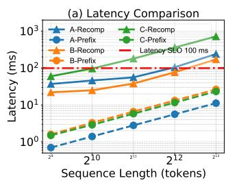

# 2.1 Recommendation System

A typical industrial-scale recommendation system follows a multi-stage pipeline [8, 21, 66] to efficiently process and rank a massive pool of candidate items. This pipeline is generally divided into two main stages: retrieval and ranking [84].

The retrieval stage serves as a coarse filtering process, retrieving a small subset (e.g., hundreds or thousands) of potentially relevant items from a much larger corpus—often

containing millions or billions of items. This stage prioritizes speed and coverage, relying on lightweight models such as collaborative filtering [23], nearest neighbor search [28, 75], or rule-based heuristics [51] to ensure the candidate set retains most of the user-relevant content.

Following the retrieval, the ranking stage re-scores the retrieved items using more expressive and computationally intensive models. These models are designed to capture finegrained user-item interactions and contextual information (e.g., time, location, user behavior history), often leveraging deep learning architectures such as Deep Learning Recommendation Models (DLRMs) [7, 8, 59, 64, 68, 92] or, more recently, Generative Recommenders (GRs) [11, 27, 29, 71, 84]. The ranking stage is typically responsible for producing the final top-k recommendations that the user will see, and thus has a critical impact on key business metrics such as clickthrough rate (CTR) and revenue.

### 2.2 Generative Recommenders (GRs)

In this paper, we focus on applying GRs to the recommendation ranking stage.

**Problem Formulation.** As shown in Figure 1, the generative ranking tasks can be formalized as: Given a user profile token set  $\mathcal{U}$ , a set of candidate items  $I = I_1, I_2, \ldots, I_N$ , where each  $I_i$  represents the tokens of a candidate item i, and instruction tokens Instr, the goal is to predict a ranked list of top-k items from N candidates that best match the user's preferences. N is typically at the hundreds-level [21], e.g., 100. The user profile  $\mathcal{U}$  typically encodes the user's historical interaction data (e.g., clicked or purchased items) and static attributes (e.g., age, gender, location). Each item

**Figure 2.** (a) Latency Comparison: Recompute vs Prefix Cache. Model A: Qwen2-1.5B [60], Model B: Llama3-1B [20], Model C: Qwen2-7B [60]. Recomp and Prefix denote recomputation and loading prefix caching from CPU memory. (b,c,d) The Distribution of User Token Numbers, User Access Frequency, and Item Access Frequency CDF from Our Tracing.

profile  $I_i$  encodes attributes such as title, brand, category, and seller information. The GR model generates a relevance score  $s_i = f(\mathcal{U}, I_i)$  to each item.

**GR Inference.** The inference of GR will stack L Transformer layers to yield the final hidden representation of the last token (or discriminant tokens). The Transformer layer  $\ell$  ( $1 < \ell <= L$ ) consists of a multi-head self-attention followed by a feed-forward network (FFN). We denote the input as a token sequence:  $x_{1:T} = [\mathcal{U}, I_1, \ldots, I_N, Instr]$ . The total length of the sequence is T. Each token  $x_t$  is mapped into its embedding:  $h_t^{(0)} = \mathbf{E}[x_t], 1 \le t \le T$ . These embeddings are processed through L Transformer layers to obtain the hidden representations

$$h_{1:T}^{(L)} = \text{Transformer}(h_{1:T}^{(0)}).$$

Assume that we take the last token as the discriminant token and we use a LLM as the ranking model. *T* is the position of the last token in the sequence. We project its hidden state to vocabulary logits:

$$\mathbf{z} = \mathbf{W}_{\text{out}} h_T^{(L)} \in \mathbb{R}^{|\mathcal{V}|}.$$

For each candidate item  $I_i$  with identifier token  $v_i \in \mathcal{V}$ , its relevance score is given by

$$s_i = \frac{\exp(\mathbf{z}[v_i])}{\sum_{j=1}^N \exp(\mathbf{z}[v_j])}.$$

The final ranked list is obtained as

$$TopK(I) = TopK_{i \in [1,N]} s_i$$
.

#### 3 Motivation

#### 3.1 Characterizing GR Inference

The GR inference process exhibits similar characteristics to the *prefill* phase in LLM inference [13]. As in LLMs, this phase is typically **compute-bound** [16, 36, 49, 87, 90], dominated by dense matrix multiplications across all transformer layers, especially when the input sequence is long.

To demonstrate this, we evaluate three popular LLMs, i.e., Qwen2-1.5B, Qwen-2-7B, and LLama3-1B, with an A100 GPU. From our tracing data, we observe that the user profile token number can be up to 8K (A similar number was reported

by Meta [84]). We vary the input sequence length from 512 to 8192 tokens and profile the compute latency per request (setting batch size to 1), as shown in Figure 2 (a). Given a 100ms latency SLO constraint [21], the computation latency can easily exceed the limitation with long sequences and large models. As recommendation systems will serve tens or hundreds of millions of users daily, we must deploy thousands of GPU machines, which incurs a high monetary cost, severely limiting the cost-efficiency of the GR.

## 3.2 Prefix Caching

Prefix caching has been proven efficient in existing studies to reduce redundant computation by using the previously computed KV cache. Formally, suppose the current input sequence  $x_{1:T}$  shares a prefix of length P with a previously processed sequence, and the corresponding KV cache  $(k_{1:P}, v_{1:P})$  has already been stored. During prefill, we only need to compute the projections for the suffix tokens  $x_{P+1:T}$ :

$$q_{P+1:T}, k_{P+1:T}, v_{P+1:T} = \text{Proj}(x_{P+1:T}),$$

and construct the complete attention context by concatenating cached and newly generated keys and values:

$$k_{1:T} = [k_{1:P}; k_{P+1:T}], \quad v_{1:T} = [v_{1:P}; v_{P+1:T}].$$

The output for the suffix tokens is then computed via standard attention:

$$o_{P+1:T} = Attention(q_{P+1:T}, k_{1:T}, v_{1:T}).$$

Finally, the updated KV cache  $(k_{1:P}, v_{1:P})$  can be stored for future reuse. This optimization with shared prefixes significantly reduces redundant computation in multi-turn or multi-request inference scenarios.

Previous studies have shown that the bandwidth requirement for loading prefix cache is as low as 8GB/s for an 8-A100 machine [49], less than 20GB/s of PCIe 4.0. We compare prefix caching with recomputation on an A100 GPU with PCIe 4.0. Figure 2 (a) reports that prefix caching can be orders of magnitude lower serving latency than recomputation. Therefore, prefix caching opens an opportunity to improve the cost-efficiency of GR serving.

#### 3.3 Challenges of Prefix Caching

We apply prefix caching to our real e-commerce advertising GR ranking workloads. Specifically, we take the user profile tokens, 100× candidate items each with 10 tokens, and a set of system instruction tokens as input sequence. We denote this organization as *User-as-prefix*, as illustrated in Figure 1. We evaluate a Qwen2-1.5B model. We identify that only the user profile tokens can be reused across a single user's multiturn requests, resulting in a cache hit rate as low as 18%. This low reuse stems from the large user base, where many users remain inactive.

- **3.3.1** Which Part of the KV Cache can be Reused? We identify that only the user profile tokens can be reused. The challenges stem from the personalized user preferences and real-time item retrieval.
- (1) Hard Inter-user Cache Sharing due to Personalization. Recommendation systems exhibit strong personalization, because each user's prompt consists of a combination of interaction history and the user's unique profile, which are highly specific and rarely shared across different users. Due to the causal attention mechanism, the item KV cache that depends on the previous user's context can also not be shared across different users.
- (2) Hard Intra-user Item Cache Sharing due to Realtime Item Retrieval. GR inference assembles prompts in an ad-hoc fashion. The candidate item set is determined dynamically by the retrieval module based on real-time user context. And the recommendation system tends to select different items for users in different turns of interactions. Thus, the item KV cache can hardly be shared across different requests of each user.

Therefore, we can only share each user's KV cache across its multi-turn requests with the *User-as-prefix* attention.

- **3.3.2** Why is Sharing Only the User Prefix not Sufficient? Similar to existing LLM systems [36, 49, 62, 87], we can use the local machine's CPU/GPU memory2 to act as the cache of the KV cache. However, due to a large user base where many users remain inactive, we identify that the user cache hit ratio can be down to 18%.
- (1) Large Number of Daily Engaged Users. In large-scale recommendation scenarios, the number of daily engaged users can be as high as  $10^8$ , as observed in our e-commerce advertising workloads and the existing workloads [84]. We identify that the total memory consumption of the user-asprefix cache can reach up to 2.9 PBs, which exceeds the feasible limits of GPU or CPU memory of serving machines. Specifically, consider a transformer model with L layers, H attention heads per layer, and head dimension D. For each token, the KV cache stores both key and value vectors of

shape  $H \times D \times L$ . Using float16 precision, the KV cache size per token is:

KV cache per token =  $2 \times H \times D \times L \times sizeof$  (FP16) Bytes. The total KV cache size for a user prefix with  $T_u$  tokens is  $T_u \times 2HDL \times 2$  bytes. As an example, we take a Qwen2-1.5B model with L=28, H=2, D=128, and average user token number  $T_u=1000$ , so a single user occupies approximately 29MB KV cache. Caching  $10^8$  such user prefixes would require over 2.9 PB of storage, thereby infeasible to store all users' KV cache in local machines.

(2) Large Number of Inactive Users. We collect the users' access frequency on an hourly basis and observe that many inactive users access the system less than two times, as shown in Figure 2 (c). This leads to a high proportion of compulsory cache misses and cache pollution, which, in turn, causes additional capacity misses. Specifically, when a new request arrives, a GR system can look up its local cache. If the prefix matches existing tokens, the prefix cache can be retrieved. Otherwise, GR needs to recompute the prefix tokens and update the KV cache in its cache system, e.g., using LRU replacement [49]. We experiment on an industrial workload (see details in § 6). We observe that the cache hit rate is reduced to 18% and the total computational savings are limited to less than 11% of recomputation. Moreover, as shown in Figure 2 (b), we observe that user tokens follow a long-tail distribution: Many inactive users have fewer than 1K tokens. Among all users, around 33% of the tokens are item tokens and can not be shared.

