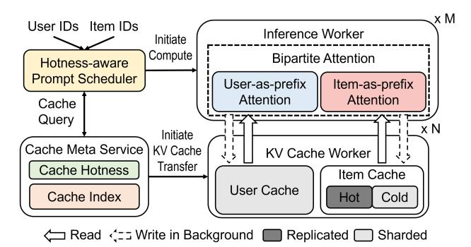

# 4 Bipartite Attention

To tackle the challenges of prefix caching, we propose Bipartite Attention, a novel algorithm that unlocks new opportunities for KV cache reuse without sacrificing accuracy.

#### 4.1 Insight

Our traces show that the item's access frequency is highly skewed, with its CDF shown in Figure 2 (d). In particular, roughly 90% of accesses focus on the top 10% of hot items. This implies that hot item tokens can be shared across a large number of users, thereby improving the memory utilization of the KV cache. Motivated by this, our key insight is that user and item semantics in recommendation prompts are permutation-invariant. The underlying reason is that the user information and item information can be regarded as an *unordered set*, instead of a *sequence* (the tokens inside each item and user are maintained as sequences). Similar phenomena have been reported by LLM's multiple-choice tasks [43]. We empirically validate this on different datasets and GR models, as shown in Table 3.

#### 4.2 Mechanism

Given a request, Bipartite Attention consists of two alternative GR inference mechanisms: 1) *User-as-prefix* attention, and 2) *Item-as-prefix* attention.

&lt;sup>2Utilizing cheap local/remote storage can achieve a larger cost-effective storage space. However, it might incur harmful access latency [6, 49] and complex IO management. We leave this for our future exploration.

User-as-prefix Attention. In this setting, the input is organized as [U, I1, . . . , I , ]. If enabling prefix caching, the KV cache of user tokens U is pre-computed and cached. During real-time inference, if the prefix cache hits, only the tokens of items and instructions are computed and discarded, as they are hard to share:

$$Attn_{\mathcal{U}\text{-prefix}} = Attn(q_{I,Instr}, k_{I,Instr} \cup k_{\mathcal{U}}, v_{I,Instr} \cup v_{\mathcal{U}}).$$

Item-as-prefix Attention. In this attention, the input is organized as [I1, . . . , I , U, ]. The key-value pairs of items I are pre-computed and cached. In inference, user and instruction queries are attended to their own tokens and the cached item prefix, and finally discarded:

$$\operatorname{Attn}_{I\operatorname{-prefix}} = \operatorname{Attn}(q_{\mathcal{U},\operatorname{Instr}},\ k_{\mathcal{U},\operatorname{Instr}} \cup k_{I},\ v_{\mathcal{U},\operatorname{Instr}} \cup v_{I}).$$

Attention Masks and Position Encoding. We adjust the attention mask and position encoding [\[55\]](#page-14-14) of Bipartite Attention to remove positional bias [\[43\]](#page-14-13), leveraging the inherent independence (to ensure fair comparison) of candidate items in recommendation systems [\[84,](#page-15-2) [92\]](#page-15-1). For example, in Transformer-based architectures, HSTU [\[84\]](#page-15-2) applies an attention mask to prevent cross-attention between items. Following this principle, we apply similar attention masks to both the User-as-prefix and Item-as-prefix settings, as shown in Figure [1.](#page-2-1) In addition, we adjust the position encoding so that all items share the same starting position ID (i.e., the position of their first token). Specifically, in the User-as-prefix case, the starting position of items is set to the length of the user tokens; in the Item-as-prefix case, it is reset to 0 (or optionally after notation tokens such as "Candidate items:"). This design ensures that the tokens of each item remain independent from other items, as well as from subsequent user and instruction tokens. Therefore, we can pre-compute every item's KV cache and store them independently. We will discuss the benefits of this design in § [4.3.](#page-5-0)

Discriminant Tokens. In our current design, the discriminant token that determines the ranking score of all items is the last token in the sequence. Specifically, we calculate the hidden states of this token and project it to a logit, which can be used to identify the probabilities of all items. Additionally, our mechanism can be extended to multiple tokens by applying attention to them, e.g., one discriminant token per item, as in other works [\[29,](#page-13-5) [84\]](#page-15-2).

Extending to HSTU [\[84\]](#page-15-2). Although we mainly focus on the language models as the GR model, we believe the idea of our Bipartite Attention can be extended to other transformer architectures, like a recent popular work, HSTU. LLMs and HSTU share the same fundamental formulation: both model user–item interactions through causal attention and treat recommendation as a next-token prediction problem (i.e., computing logits). Their primary difference lies in how users and items are represented as tokens—whether through language vocabulary, traditional item-embedding tables (HSTU [\[84\]](#page-15-2)), or intermediate representations such as

Semantic ID [\[11,](#page-13-4) [33,](#page-13-19) [50\]](#page-14-15). GR remains an emerging area without a common design paradigm. To our knowledge, many companies are actively exploring different approaches in parallel. We leave the exploration of HSTU-based GR for our future work.

Sensitivity to Base Models. We observe that in certain cases, the Item-as-prefix attention may lead to degraded performance. This phenomenon depends on the base model's ability to distinguish between set semantics and sequence semantics. For instance, in instruction-tuned language models such as Llama3-Instruct [\[20\]](#page-13-17), swapping the prefix results in a noticeable performance drop. In practice, we can select a base model that supports modifying position encodings. Meanwhile, as we will periodically fine-tune a GR model to update its knowledge with new data, we can optionally adjust its position encoding during training without incurring extra training overheads. And at inference time, we can leverage existing position-independent caching (PIC) [\[26,](#page-13-20) [77\]](#page-15-9) algorithm to improve performance, which selectively recomputes some critical tokens to mitigate accuracy degradation.

#### 4.3 Advantages of Item-as-prefix Attention

We demonstrate that there are three advantages of the Itemas-prefix attention over the User-as-prefix attention.

- (1) Enabling KV Cache Sharing Cross-users. In real recommendation scenarios, items are typically exposed to a broad user base rather than being restricted to a single individual. For example, popular items—such as trending products, frequently advertised goods, or widely consumed media content—are naturally recommended to many users, particularly those who share similar preferences [\[23\]](#page-13-14). From the supply side, item providers and advertisers deliberately promote their content to maximize exposure across diverse audiences. These two factors together lead to substantial overlap in item access patterns across users. Consequently, unlike highly personalized user profiles, item tokens exhibit much higher reuse potential. Leveraging this inherent redundancy, we enable item KV cache sharing across different users, thereby improving cache efficiency while reducing redundant computation.
- (2) Storing Item KV Cache with Only Local Memory. In our workload, the item number of a single recommendation scenario can be 1M to 10M. We observe that the average item token number is around 10. Similar numbers can be found in Amazon's datasets [\[24\]](#page-13-21). With a Qwen2-1.5B model, the total item KV cache size is about 287GB to 2.87TB. Many modern servers' CPU memory can be up to 2TB, and overall GPU memory, e.g., 8×H20, can be up to 768GB. With our hotreplicated cold-sharded item cache placement (See [5.2](#page-6-0) for more details), it's feasible to leverage the local machine/cluster's CPU/GPU memory to store item KV cache. In contrast, storing all user KV cache requires PB-scale storage.
- (3) Saving More Tokens for Inactive Users. As shown in Figure [2\(](#page-3-0)b), 36% of users have fewer tokens in their profiles

Figure 3. Overall Architecture of Bat.

than the number of item tokens (e.g., around 1,000 tokens for 100 candidate items). For these users, leveraging the item KV cache yields, on average, a 13.2% higher token reuse rate compared to the user KV cache. Moreover, more than 55% of users access the recommendation system only once per hour. In such cases, the user KV cache often suffers from compulsory misses, whereas item caching can consistently save up to 1,000 tokens per user. Finally, as the number of candidate items and the token length per item increase, the advantages of item caching become even more significant.[3](#page-6-1)

