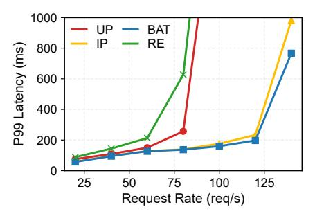
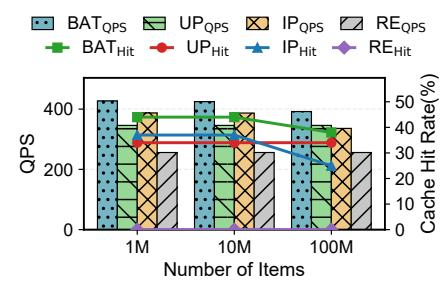
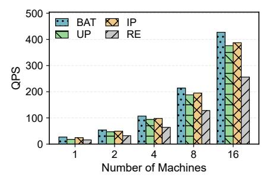

# 6.4 Impact of Cache Placement and Prompt Scheduling

In this set of experiments, we examine the impact of cache placement and prompt scheduling strategies. We evaluate on the *Books* dataset and Owen2-1.5B model.

Effectiveness of HRCS Item Cache Placement. We first examine the effectiveness of cache placement. We evaluate the throughput and cache hit rate of BAT under two network bandwidth settings: 10Gbps and 100Gbps. The KV cache transfer is enabled by GPUDirect RDMA. For comparison, we implement two baselines: BAT-Replicate and BAT-Hash. In BAT-Replicate, the item cache is fully replicated across all machines, with the remaining memory allocated to user cache. In BAT-Hash, 1/4 of the item cache is stored on each machine, and item updates are distributed in a round-robin manner across four machines. We allocate 150GB host memory per machine for KV cache.

Figure 7 presents the throughput and cache hit rate results. Compared to BAT-Replicate, BAT improves throughput by 10% and 16% under 10Gbps and 100Gbps networks, respectively, due to the availability of larger cache space for user KV caching. BAT-Hash achieves a higher cache hit rate but suffers from significant network communication overhead

Figure 7. Impact of HRCS Item Cache Placement

(around 31% of inference latency), which reduces its throughput to only 78% of BAT-Replicate under the 10Gbps setting. In contrast, BAT selectively replicates only the hottest items, thereby reducing network overhead while maintaining high cache hit rate.

Effectiveness of Hotness-aware Prompt Scheduling. We compare BAT's hotness-aware prompt scheduling with a cache-agnostic baseline. The baseline determines the prefix by comparing the number of user tokens with item tokens and always choosing the larger side as the prefix. We evaluate both throughput and cache hit rate. For fairness, the item cache size is fixed across both systems, while the user cache size is varied from 25GB to 100GB.

As shown in Figure 8, when the user cache is small, the cache-agnostic baseline exhibits significantly lower throughput and cache hit rate than BAT. This is because it naively selects users with long profiles as User-as-prefix, resulting in frequent compulsory and capacity misses. In contrast, BAT strategically selects only high-frequency users for *User-as*prefix and schedules the others to Item-as-prefix, thereby minimizing cache misses and sustaining higher throughput. How these components contribute to overall throughput? Table 4 shows the ablation study following the end-toend configuration in section 6.2. For simplicity, ABC denotes enabling all three proposed techniques: (A) Bipartite Attention, without A uses *User-as-prefix* attention only; (B) HRCS cache placement, without B replicates the item cache across workers (at the 1M scale, where replication causes OOM and we adopt hash sharding instead); and (C) hotness-aware scheduling, without C uses cache-agnostic scheduling. Since B and C are sensitive to the scale of the item cache, we vary the item number (X) of the Books dataset(Books-X) to evaluate their effectiveness at different scales. For Books-280K, the throughput of AB is comparable to that of ABC, as the user cache space is large enough to minimize user cache capacity misses. For Books-1M, AC achieves a comparable throughput to ABC due to near user cache space and low network communication overheads under 100Gbps network. In summary, with A, BAT outperforms traditional UP attention; B is suitable for scenarios with slow networks and large item sizes; and C is beneficial when user cache space is limited.

#### 6.5 Latency

This experiment evaluates the P99 end-to-end serving latency of BAT at varying request rates. Figure 9 illustrates

Figure 8. Impact of Hotness-aware Prompt Scheduling

**Table 4.** Ablation Study (Throughput in QPS). **ABC** denotes enabling three proposed techniques.

| Dataset    | ABC | AB  | AC  | A | None |
|------------|-----|-----|-----|---|------|
| Books-280K | 128 | 128 | 115 |   | 83   |
| Books-1M   | 126 | 106 | 125 |   | 83   |

the latency-throughput curves of BAT and the baseline systems, measured with the Qwen2-1.5B model on the *Industrial* dataset. The curves indicate that latency grows gradually with the request rate until the system reaches a saturation point. Beyond this point, latency increases exponentially as incoming requests exceed the system's maximum serving capacity [36]. Given a 200ms P99 latency SLO, BAT sustains approximately 1.47× and 1.57× higher request rates compared to UP and RE, respectively. These results indicate that BAT can handle significantly more recommendation traffic while reliably meeting the SLO.

#### 6.6 Scalability

In this subsection, we examine BAT to scale along both the *dataset scale* (item corpus size) and the *node number* (serving capacity) on the production testbeds and the *Industrial*-X datasets (See section 6.1), with the same data generation process in 6.2.

Scalability with Dataset Size. First, we evaluate the serving throughput and cache hit rate of BAT across 16 nodes from the production testbeds, scaling the corpus size from 1M to 100M items. The evaluated model is Qwen2-1.5B. As shown in Figure 10, BAT consistently outperforms the baselines as the item number increases. The results on the *Industrial*-100M demonstrate that BAT remains effective when processing the full item corpus from multiple scenarios. Under this configuration, BAT caches approximately 10% of the hottest items and recomputes the remaining items for *Item-as-prefix* attention, while scheduling more requests to *User-as-prefix* attention. In contrast, the IP baseline suffers a more severe drop in cache hit rate due to higher item cache miss.

Scalability of Serving Capacity. We evaluate the serving throughput of BAT when varying node number from 1 to 16, as shown in Figure 11. We evaluate on *Industrial-1M* dataset and Qwen2-1.5B model. The throughput of BAT increases near-linearly from 1 to 16 nodes. This is because request traffic is sharded across many service instances in

**Figure 9.** P99 Latency w.r.t. Request Rate (Req/s)

**Figure 10.** Serving Throughput/Cache Hit w.r.t. Dataset Size

**Figure 11.** Serving Throughput w.r.t. Machine Number

a data-parallel manner, and adding nodes increases serving capacity approximately linearly. Moreover, the HRCS cache placement strategy effectively minimizes the network overhead for communicating item KV Cache.

#### 7 Related Work

**Generative Ranking.** Many works [5, 9–11, 18, 25, 27, 29, 39, 40, 63, 67, 70-73, 82, 84, 88] take generative models to perform ranking tasks. Among them, systems [11, 27, 29, 71, 84] like Onerec [11], HSTU [84], GenRank [27] have been deployed in real large-scale industrial recommendation systems, e.g., Meta, KuaiShou, achieving remarkable online improvement over traditional recommendation paradigms. They take user profiles and candidate items as the input of the generative models, model the user-item interaction with self-attention, and score the user preference. Our GR is also based on this paradigm. Other approaches [5, 34, 72, 73] have also been explored, which use generative models as encoders to learn user and item embeddings separately and apply interaction models, e.g., DLRMs [73], on learned embeddings. Generative Retrieval. Many works [50, 71, 80] utilize generative models in the retrieval stages of the recommendation pipeline. The objective and key user-item interaction paradigm are similar to the ranking stage, but the candidate item number is orders larger, e.g., 10K candidates. We believe our Bipartite Attention will save more computation for larger candidate item sets and leave this as our future work.

**LLM Inference and Prefix Caching.** Recent advancements in LLM serving systems [6, 16, 17, 19, 30, 32, 44, 49, 62, 76, 77, 81, 87, 89] have proposed the prefix caching technique to accelerate LLM inference. These systems mainly focus on general LLM applications like chatbots. They take input prompts as the user-deterministic queries and passively manage the KV cache. In contrast, BAT is the first system that proactively changes input prompt orders and manages KV cache, tailored for recommendation scenarios.

**DLRMs.** Deep learning recommendation models (DLRMs) [7, 8, 59, 64, 68, 92] combine large-scale embedding tables for sparse categorical features with relatively small dense layers for numerical features and final prediction [47]. These models are currently the cores of industry-scale recommender

systems [2, 14, 21, 31, 37, 41, 42, 45–48, 52–54, 56–58, 65, 69, 74, 75, 75, 78, 86] to accelerate training and inference. In contrast, BAT focuses on generative recommendation, a new paradigm with new system-side challenges. Unlike DL-RMs, where embedding lookups are the primary bottleneck, generative recommenders shift the performance bottleneck toward compute-intensive transformer blocks [12, 84].

#### 8 Conclusion

In this paper, we present **BAT**, an efficient GR serving system, based on the key observation that the semantics between user and item tokens are permutation-invariant. We propose Bipartite Attention attention to adaptively select either the user or the item as the prompt prefix without losing accuracy to enhance KV cache reuse. We further co-design a disaggregated KV cache pool to proactively manage userand item-prefix caches separately. To reduce memory overhead, we develop a hot-replicated cold-sharded item cache placement strategy to minimize memory usage by exploiting the skewed access distribution and the availability of fast local networks. Finally, we introduce a hotness-aware prompt scheduling strategy to optimize prefix selection under memory constraints. Extensive experiments on multiple recommendation datasets show that BAT improves serving throughput and reduces overall computation.

#### Acknowledgments

We thank the anonymous ASPLOS reviewers and our shepherd Yang Zhou for their valuable feedback and constructive suggestions that helped improve this paper. The work is supported by the following grants: National Science and Technology Major Project (2022ZD0117000), the Major Project of the Zhejiang Provincial Natural Science Foundation under Grant No. LD26F020002, the National Natural Science Foundation of China under the grant numbers (62472384, 62441236, U24A20326), Starry Night Science Fund of Zhejiang University Shanghai Institute for Advanced Study (SNZJU-SIAS-0010), Research Council of Finland (grant number 362729). This work was also supported by Alibaba Group through Alibaba Innovative Research Program. Zeke Wang and Fei Wu are the corresponding authors.

