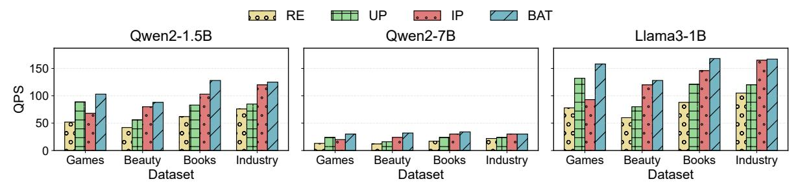
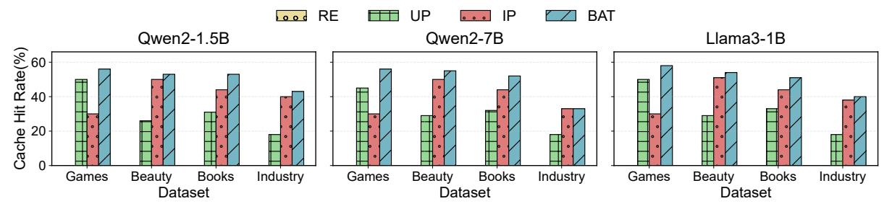

# 5.3 Hotness-Aware Prompt Scheduler

We propose a hotness-aware prompt scheduler to determine the attention pattern for each request. The key question is:

Given a memory constraint, how to select the attention pattern for each request to maximize the overall system throughput?

**Trade-off: User-as-prefix vs Item-as-prefix.** Given a limited cache budget, our goal is to *minimize the total number of newly computed tokens*, or in other words, *maximize the number of tokens reused from cache.* As Figure 2 (b) shows, the users' history tokens follow a skewed and long-tail distribution. Some active users have more behaviors, such as clicking or purchasing more items, leading to more history tokens to

#### Algorithm 1 HRCS Item Cache Placement

#### 1: Input:

- B: Measured network bandwidth (tokens/sec)
- $\mathcal{F}$ : Item access frequency distribution
- $\tau_u$ : Average user token count
- $\tau_i$ : Average item token count
- $\alpha$ : Communication time threshold ratio
- c: Candidate items per request
- N: KV cache worker number

return r

20: end procedure

- 2: **Output:** Hotspot replication ratio *r*
- 3: procedure ComputeReplicationRatio
- t ← PrefillTime( $τ_u$ ,  $c × τ_i$ )  $\rightharpoonup$  Offline prefill time estimation
- 5:  $T_{\max} \leftarrow \alpha \cdot t$  > Max allowed communication time 6:  $S_{\text{item}} \leftarrow \tau_i$  > Average item size in tokens 7:  $R_{\max} \leftarrow \frac{T_{\max} \times B \times (N-1)}{c \times S_{\text{item}} \times N}$  > Max allowed communication ratio
- Sort  $\mathcal{F}$  in **Descending** order  $\triangleright$  Prepare for CDF scan 8:  $CDF \leftarrow 0$ 9: for  $i \leftarrow 1$  to  $|\mathcal{F}|$  do 10:  $CDF \leftarrow CDF + \mathcal{F}[i]$ 11: if CDF  $\geq 1 - R_{\text{max}}$  then 12:  $r \leftarrow i/|\mathcal{F}|$ ▶ Replication ratio 13: break end if end for Place replicated items on all workers 17: Uniformly partition non-replicated items across workers

encode their behaviors. For example, some users' token numbers are up to 8K, while 100 candidate items have around 1K tokens. For these users, selecting the *User-as-prefix* attention saves more computation than the *Item-as-prefix* attention. However, some inactive users have much fewer tokens, e.g., 800. Selecting *Item-as-prefix* minimizes their computation. Therefore, selecting either *User-as-prefix* or *Item-as-prefix* is not a one-size-fits-all decision.

Cache-agnostic Prompt Scheduling. We observe that it's inefficient to decide the prefix for each request statically, without considering the cache states. For example, a straightforward strategy is to minimize computation greedily. For each request, it compares the number of user tokens and item tokens and selects the one with more tokens as the prefix. We observe that over 70% of requests are scheduled by it to *User-as-prefix* on the books dataset (See Table 1). The inefficiency arises from two aspects: 1) the cache of users with low frequency meets many compulsory misses, and 2) the cache of users with high access frequency could be evicted by the ones with low frequency (although low

 $^5\mathrm{We}$  observe that the access frequency of items changes on an hourly or daily basis.

frequency users' cache can be rejected from admission by advanced cache replacement design, the rejected requests's attention is determined and can not leverage item cache to save computation on time).

Hotness-aware Prompt Scheduling. We propose a hotness-aware prompt scheduling strategy that explicitly considers cache states when selecting prefixes. In scenarios where the GR computation is the primary bottleneck, reducing computational overhead can be regarded as improving throughput. Under this objective, and given the constraint of limited cache capacity, the strategy should prioritize maximizing access frequency per unit of cache space, which suggests allocating cache to the highest-frequency user tokens within a specified time window.

To capture request frequency, we define a sliding-window metric  $f_u$ , which measures how often a user issues requests within a recent time window (e.g., the past W seconds or minutes). While the exact future frequency  $f_u$  is inherently unpredictable, our key insight is that a user's consecutive behaviors tend to exhibit similarity. For instance, if a user intends to purchase a specific item, they are likely to repeat a search within a few minutes of the initial query. In contrast, casual browsing often produces a more stable interaction pattern, such as consecutively viewing multiple pages over a short interval. To empirically validate this observation, we sample and analyze the online traces of thousands of users. For each user, we compute an average similarity score of consecutive sliding-window frequencies using the formula  $\frac{|f_u(t)-f_u(t-\delta)|}{|f_u(t)+f_u(t-\delta)|}$ , where the window sizes W are set to 5 minutes or 60 minutes, and  $\delta$  denotes the interval between windows. A higher value of this formula, approaching 1, indicates greater similarity between the two consecutive frequency windows. Figure 4 shows that most users exhibit consistent behaviors across consecutive time windows. Based on this observation, we approximate a user's current  $f_u$  as a reliable estimate of their near-future request frequency.

Based on the frequency estimation  $f_u$ , we design a hotness-aware greedy policy to decide the user or the item as the prefix. Formally, for a request r with user token length  $\tau_u(r)$  and item token length  $\tau_i(r)$ , the prefix selection rule is:

$$\mathrm{prefix}(r) = \begin{cases} \mathrm{user}, & \tau_u(r) \geq \tau_i(r) \ \land \ f_u(r) > \min_{p \in C_u} f_p, \\ \mathrm{item}, & \mathrm{otherwise}, \end{cases}$$

where  $C_u$  denotes the set of cached user pages, and  $f_p$  represents their estimated frequencies.

Intuitively, when the user tokens are fewer than the item tokens, we directly adopt the *Item-as-prefix* strategy to reuse item caches. When the user tokens are longer, the scheduler queries the cache meta service for the lowest-frequency user pages in  $C_u$ . If the predicted frequency  $f_u(r)$  of the incoming user exceeds that of these pages, the scheduler replaces them with the new user cache (*User-as-prefix*); otherwise, the request falls back to the *Item-as-prefix* strategy.

**Figure 4.** The Consistency of User Access Frequency across Many Time Windows from Our Tracing.

Table 1. Detailed Information of Datasets

| Dataset              | Games | Beauty | Books | Industry |
|----------------------|-------|--------|-------|----------|
| User Num.            | 15K   | 22K    | 510K  | 10M      |
| Item Num.            | 8K    | 12K    | 280K  | 1M       |
| Ave. User Token Num. | 1245  | 2043   | 1586  | 1500     |
| Ave. Item Token Num. | 11    | 18     | 15    | 10       |

Table 2. Model Architecture

| Models                  | Qwen2-1.5B  | Qwen2-7B    | Llama3-1B   |
|-------------------------|-------------|-------------|-------------|
| KV Head Num.            | 2           | 4           | 8           |
| Head Dim.               | 128         | 128         | 64          |
| Layer Num.              | 28          | 28          | 16          |
| KV Cache Size per Token | 28672 Bytes | 57344 Bytes | 32768 Bytes |

Whenever an existing user cache is accessed, the cache meta service *decays* its sliding-window frequency estimate and maintains the statistics asynchronously. Since consecutive user requests usually arrive at the granularity of seconds, such asynchronous updates incur negligible latency.

#### 6 Evaluation

#### 6.1 Experimental Setup

**Testbeds.** The main experiments are conducted on a 4-node cluster from Zhejiang University. Each node has an Intel(R) Xeon(R) Silver 4214 (2×24 threads) CPU @ 2.20GHz, 200 GB memory, one 40GB-A100 GPU connected with PCIe 3.0x16, and 100Gbps network. We deploy one inference worker and one KV cache worker per node. **Production Testbeds.** We also evaluate BAT's scalability on a 16-node production cluster (See section 6.6), where each node has one NVIDIA H20 GPU, an Intel Xeon Platinum 8469C CPU (2 sockets × 48 cores/socket × 2 threads/core), 500 GB host memory, and 200 Gbps network.

**Datasets**. We evaluate on three open source real-world recommendation datasets, *Games*, *Beauty*, and *Books* from Amazon [24], and one synthetic dataset *Industry* generated from our real e-commerce advertising workload. See Table 1. **Production Dataset**. In industry, the full item corpus can reach hundreds of millions. However, recommendation traffic is typically partitioned into multiple scenarios (e.g., channel-specific entrances such as clothing, toys, etc.), each served by

Figure 5. System QPS Comparison across Datasets for Different Models

Figure 6. System Cache Hit Rate Comparison across Datasets for Different Models

dedicated models. In our production practice, the item set per scenario is usually at the million scale. For a 1B-parameter model (e.g., Qwen), this implies a total item KV Cache footprint ranging from ~ 287 GB (1M items) to ~ 2.87 TB (10M items), where average token per item is 10. To examine BAT's scalability with large item corpus (See section 6.6), we vary the number of items of the synthetic *Industry* dataset, denoted as *Industry*-X, where X is the item number. **Unless explicitly specified, the evaluation is done on normal testbed and datasets.** 

**Models.** We evaluate three language models as GRs: Qwen2-1.5B, Qwen2-7B [60], and Llama3-1B [20]. Table 2 details the models. We use FP16 as the data type for KV cache. We mainly focus on the GR ranking task. We apply a linear recurrence-based model as our retrieval model [83].

**Baselines.** We select three prefix-caching-based designs as well as a recomputation-based design as our baselines. For all baselines, we implement the model inference based on vLLM [36] and Flashinfer [79] and leverage CPU memory as an LRU cache to store the KV cache.

- **Recomputation (RE).** RE performs GR serving without prefix caching.
- User-as-prefix (UP). UP performs the *User-as-prefix* attention for all requests. This is the widely adopted approach in existing GR works [11, 27, 29, 84].
- • Item-as-prefix (IP). IP performs the *Item-as-prefix* attention for all requests.

#### 6.2 Overall System Performance

We compare the overall throughput and cache hit rate of BAT with three baselines and four datasets. We randomly sample the users with replacement from the history log of each dataset. For each user, we take their history access frequency as the basis for ad-hoc frequency and randomly sample the intervals between consecutive accesses to simulate realistic request patterns. For each request, we retrieve 100 candidate items to make an input prompt. Since the original user histories in the Games, Beauty, and Books datasets are relatively short, we expand their profile token lengths so that the maximum prompt length approaches 8K tokens. We define the cache hit rate as the ratio of reused prefix tokens to the total number of tokens per prompt. We allocate a fixed size of host memory to store to the KV Cache. The cached token number is determined by both allocated host memory size and each model's hyper-parameter.

Figure 5 and Figure 6 present the overall throughput and cache hit rate, respectively. Compared to RE, BAT achieves up to 58% cache hit rate and improves throughput by as much as  $2.3\times$ , the highest among all baselines. Relative to UP, BAT delivers up to  $1.6\times$  speedup.

When comparing UP and IP, we observe that on the *Beauty*, *Books*, and *Industry* datasets, IP achieves a higher cache hit rate and throughput than UP. This is because IP benefits from better memory utilization and fewer compulsory misses. In contrast, on the *Games* dataset, where the average user access frequency is high, UP outperforms IP.

On the *Industry* dataset, BAT achieves throughput comparable to IP, since the item cache sizes are already large under the given memory constraints, leaving limited space for user

**Table 3.** Performance Comparison of UP and IP Policies across Datasets and Models. Higher values indicate better performance.

| Dataset | Model      | Strategy | Recall@10 | MRR@10 | NDCG@10 | Recall@5 | MRR@5  | NDCG@5 |
|---------|------------|----------|-----------|--------|---------|----------|--------|--------|
| Beauty  | Qwen2-1.5B | UP       | 0.6558    | 0.2912 | 0.3756  | 0.4433   | 0.2627 | 0.3068 |
|         |            | IP       | 0.6827    | 0.2998 | 0.3881  | 0.4505   | 0.2687 | 0.3129 |
|         | Qwen2-7B   | UP       | 0.6509    | 0.2574 | 0.3491  | 0.4262   | 0.2284 | 0.2774 |
|         |            | IP       | 0.6766    | 0.2571 | 0.3555  | 0.4546   | 0.2279 | 0.2841 |
|         | Llama3-1B  | UP       | 0.6365    | 0.2651 | 0.3506  | 0.3824   | 0.2317 | 0.2689 |
|         |            | IP       | 0.6339    | 0.2428 | 0.3331  | 0.3816   | 0.2101 | 0.2525 |
| Games   | Qwen2-1.5B | UP       | 0.6149    | 0.2458 | 0.3310  | 0.3794   | 0.2144 | 0.2549 |
|         |            | IP       | 0.6412    | 0.2531 | 0.3424  | 0.3908   | 0.2200 | 0.2618 |
|         | Qwen2-7B   | UP       | 0.6442    | 0.2574 | 0.3465  | 0.4021   | 0.2256 | 0.2688 |
|         |            | IP       | 0.6392    | 0.2228 | 0.3201  | 0.4017   | 0.1912 | 0.2434 |
|         | Llama3-1B  | UP       | 0.5813    | 0.2263 | 0.3075  | 0.3326   | 0.1941 | 0.2281 |
|         |            | IP       | 0.5846    | 0.2234 | 0.3064  | 0.3422   | 0.1921 | 0.2289 |
| Books   | Qwen2-1.5B | UP       | 0.5756    | 0.1727 | 0.2646  | 0.2802   | 0.1344 | 0.1702 |
|         |            | IP       | 0.5515    | 0.1607 | 0.2496  | 0.2572   | 0.1228 | 0.1558 |
|         | Qwen2-7B   | UP       | 0.6718    | 0.1858 | 0.2998  | 0.4418   | 0.1553 | 0.2257 |
|         |            | IP       | 0.6535    | 0.1830 | 0.2931  | 0.4199   | 0.1524 | 0.2182 |
|         | Llama3-1B  | UP       | 0.6472    | 0.3029 | 0.3818  | 0.4085   | 0.2717 | 0.3053 |
|         |            | IP       | 0.6541    | 0.3009 | 0.3822  | 0.4202   | 0.2704 | 0.3072 |

cache. With additional machines or larger memory capacity, BAT could allocate more space to user cache, thereby achieving higher throughput.

#### 6.3 Accuracy of Bipartite Attention

In this experiment, we evaluate the effectiveness of Bipartite Attention on the ranking scenario, using three widely adopted ranking metrics: recall (Recall@k), mean reciprocal rank (MRR@k), and normalized discounted cumulative gain (NDCG@k) with  $k \in [5, 10]$ . Following the setup of previous work [82], our testing dataset includes only those requests where the ground truth item appears in the top-K list, e.g., top-100, ranked by the retrieval model [83], treating these as post-retrieval candidate items. Table 3 reports the performance comparison of UP and IP attentions.

Table 3 shows that IP maintains similar performance as UP in most cases, indicating that selecting both strategies has an ignorable impact on the recommendation quality. In some cases, IP even achieves higher performance than UP, e.g., Qwen2-1.5B on *Beauty*. However, in some cases, e.g., Qwen2-1.5B on *Books*, IP experiences a slight quality degradation compared to UP due to the modification of position encoding. We can apply existing position-independent [26, 77] caching (PIC) algorithm to further improve IP's performance. For example, we implement PIC like CacheBlend [77] to improve the Qwen2-1.5B IP's Recall@10, MRR@10, and NDCG@10 to 0.5634, 0.1676, and 0.2576 on *Books* dataset, narrowing the gap between IP and UP. We leave more effective PIC algorithm as future exploration.

We have also evaluated UP and IP attention mechanisms with our production workloads and found that both can achieve comparable performance (e.g., in terms of *Recall* and *Page View*).

