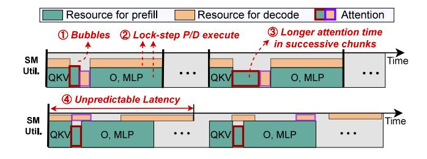

# 2 Background and Motivation

## 2.1 LLM Computational Workflow

Recent LLMs [32, 50, 68] are mainly built by stacking Transformer blocks [62], with each containing four core components: QKV-projection layer, self-attention computation, Output-projection layer and multi-layer perception (MLP). These components are primarily implemented through general matrix multiplications (GEMMs), with element-wise operations interspersed between layers. Among them, the self-attention specifically operates on query, key, and value matrices produced by the QKV-projection. Its computational efficiency has been significantly enhanced through optimized kernel implementations like FlashAttention [26].

The LLM inference pipeline operates through two distinct computational phases. During the initial prefill phase, the system processes all input tokens in parallel to generate the first output token, with the latency measured as time-to-first-token (TTFT). This compute-intensive stage performs full attention computations across the entire sequence while building the KV cache to store intermediate key-value states. Subsequently, the decode phase generates tokens sequentially, with each iteration consuming only the most recent output token to produce the next. The average iteration latency is termed time-per-output-token (TPOT). Unlike prefill, this memory-bound phase primarily retrieves data from the KV cache and performs relatively lightweight computations for the current token's transformations.

## 2.2 GPU Utilization in LLM Serving

## 2.2.1 Execution Model and Theoretical Performance

**Bound.** Modern GPUs employ a hierarchical architecture with hundreds of streaming multiprocessors (SMs), each containing general-purpose cores and specialized matrix units like Tensor Cores [17]. GPU's grid-block-thread programming model [21] aligns with this architecture, where kernels are organized into grids of thread blocks (TBs) that each manage thousands of cooperating threads. Upon kernel launch, it enters an asynchronous task queue (termed

stream in CUDA[21]) for scheduling. The hardware scheduler retrieves kernels from these queues and dispatches them across SMs, enabling the concurrent kernel execution (CKE) [31, 49, 64] from different streams when required resources are satisfied.

During execution, multiple TBs can reside on the same SM to share its registers, shared memory, and thread slots. The TBs per SM can be obtained via hardware vendor's runtime APIs [4, 21]. The SM executes the warps (32-thread groups) in successive waves to interleave different instructions and maximize hardware utilization. However, if the number of TBs is not evenly divisible by the number of SMs, a workload imbalance situation called wave quantization [18, 44, 77] occurs. Some SMs finish early and remain idle while waiting for others to complete the tail wave. Formally, given a kernel with q TBs, N SMs, and b TBs per SM, the kernel demands  $w = [q/(b \cdot N)]$  waves to complete. In the final wave, the TBs are distributed unevenly due to Most-Room Policy [7, 31], resulting in only  $tail = [q/b - N \cdot (w - 1)]$  SMs active. Therefore, the corresponding ratio of idled SM cycles can be quantified as idle = (N - tail)/(Nw).

GPU kernels typically use power-of-2 grid sizes to match data dimensions, but this conflicts with non-power-of-2 SM counts in GPUs. For example, 108 for Nvidia A100 [16] and 132 for H100 [17]. Therefore, wave quantization remains an open issue [42, 51] across diverse kernels. This inefficiency is particularly pronounced in Transformer's self-attention [26, 62] and small-shaped GEMMs for short input sequences or small *chunked prefill-sizes* (§2.3.1) [3]. Additional underutilization causes arise from memory-bound kernels, such as LLMs' decode phases and element-wise operators, which idle compute resources during frequent memory accesses.

2.2.2 LLM Kernel Characteristics. We quantify LLM serving efficiency by analyzing execution time (Figure 2a), hardware utilization (Figure 2b,c), and the theoretical waste caused by wave quantization (Table 2). The experiments are conducted on the platform detailed in Section 4.1. While MLP operations achieve up to 92% compute utilization, complete Transformer layers sustain only 70%-76% due to compounding inefficiencies. For shorter sequences, severe wave quantization in GEMMs creates substantial underutilization, as evidenced by the O-proj's measured 49% and 70% utilization, respectively. This result closely agrees with the theoretical bound of 59% and 79% (100%-idle\_ratio in Table 2). Although

**Table 2.** Theoretical SM idle ratio (%) caused by wave quantization effects, normalized to kernel/layer's execution time.

| Seq. Len. | QKV  | Attn | O    | MLP  | Layer's Total |
|-----------|------|------|------|------|---------------|
| 1024      | 11.1 | 21.0 | 40.7 | 13.0 | 19.4          |
| 2048      | 11.1 | 5.2  | 21.0 | 7.6  | 10.4          |
| 4096      | 11.1 | 5.2  | 5.2  | 7.6  | 9.1           |
| 16384     | 1.9  | 0.2  | 0.2  | 0.4  | 0.5           |

(b) Compute utilization. (c) Memory bandwidth utilization

**Figure 2.** Breakdown of execution time and hardware utilization in the prefill phase of Llama-3.1-8B model on Nvidia A100 GPU. The aggregate utilization per layer remains below peak sustainable capacity (red line).

the results are highly dependent on vendor-implemented libraries [48], wave quantization remains significant for popular chunk sizes. For attention kernels, paged attention mechanism [43] forces the kernel to indirectly access KV cache through indices. Therefore, attention exhibits much lower utilization than GEMM even with optimized implementations [26, 69], which is also observed by recent industrial practices [27, 58]. Together, the effects of wave quantization and attention bottleneck create persistent performance gaps between the theoretical peak and the achieved throughput. These gaps remain substantial regardless of sequence length, inherently constraining overall system efficiency.

2.2.3 GPU Resource Provisioning and Sharing. Naturally, compute- and memory-bound kernels are suitable to co-execute on GPUs, saturating both compute and bandwidth resources [13, 35, 59, 75]. The complementary nature of the prefill and decode phases makes them ideal for such concurrent execution. Since LLM serving systems generally necessitate adherence to service-level objectives (SLOs) of predefined latency requirements [3, 53, 79], predictable and controllable execution time over the two phases is demanded. However, current GPUs lack deterministic concurrent scheduling controls [6, 41, 49], forcing users to carefully provision resources for kernels to achieve reliable overlap [59, 75, 76]. While modern GPUs provide compute resource partitioning through Nvidia's multi-process service (MPS) [22], precise kernel management is still required to ensure effective resource sharing while meeting SLO requirements. Figure 3 demonstrates that prefill scales near-linearly with SM count, while decode exhibits super-linear scaling. This suggests potential throughput gains from concurrent execution with properly balanced SM allocation.

**Takeaway 1**. GPUs remain underutilized even during computeintensive prefill. While co-locating prefill and decode saturates the resources, precise resource provisioning to orchestrate the two phases is demanded.

## 2.3 Biased Throughput-Latency Tradeoff

**2.3.1** Chunked Prefill Workflow. As shown in Figure 4, chunked prefill [3] achieves low TPOT by leveraging a fixed token budget to concatenate the prefill and decode tokens into a *hybrid batch*, executing in a lockstep fashion (2). Given a chunk size of cs, the hybrid batch is first filled with ds active decode requests first, and allocates the remaining cs - ds tokens to the prefill sequences. Sequences sl exceeding this residual capacity are split into chunks, leaving residual tokens processed in subsequent iterations. Therefore, the prefill completion requires  $N = \lceil sl/(cs - ds) \rceil$  iterations. This forces  $N \cdot (N+1)/2$  times KV cache reloads as each new chunk *must* reprocess previous chunks' cached states.

Due to the lock-step execution of the hybrid batch, a smaller chunk size effectively decreases TPOT at the cost of increased TTFT and degraded system throughput [3], while larger chunks exhibit the opposite effect. Previous works [3, 80] recognize these inherent tradeoffs and propose tuning chunk size based on workload's prefill-to-decode time ratio through manual tuning or automatic searching [2, 11].

2.3.2 Sub-optimal Hardware Utilization. Despite the throughput-latency tradeoff has been extensively studied, we highlight that such a tradeoff is biased, and the resulting performance degradation remains overlooked. First, as discussed in §2.2.2, chunked prefill typically uses suboptimal chunk sizes below GPU-saturating levels to prioritize low latency. This produces severe wave quantization effects [51], creating GPU bubbles (Figure 4-1). Second, redundant KV

**Figure 3.** Speedup of using partial SMs normalized to using full GPU. (Purple dashed line: linear scale.)

**Figure 4.** Kernel-level workflow of existing systems featuring chunked (top) and uncoordinated sharing (bottom). Both suffer from biased throughput-latency tradeoff.

- (a) Hardware utilization.
- (b) Per-chunk and total latency.

**Figure 5.** GPU utilization and latency for 1k and 2k chunk sizes, showing performance degradation compared to the unchunked baseline.

cache reloads required for long sequences significantly prolong attention computation time (③), further reducing GPU utilization. **Third**, these factors collectively inflate TTFT, triggering a cascading congestion effect in which queued requests stall while awaiting prefill completion, degrading overall system throughput.

Figure 5 systematically quantifies the performance degradation of chunked prefill of a 16k-token sequence prefill even without hybrid batching decode requests. For 1k chunk size, a progressive 10% drop in compute efficiency (from 71% to 61%) across successive chunks is witnessed in Figure 5a, which falls substantially below the 77% achievable peak. This under-utilization stems from redundant KV cache reloading in chunked attention, which also causes the final chunk's processing time to be 1.9× that of the initial chunk. Consequently, per-chunk latency scales linearly with chunk counts and increases total prefill latency by 1.13× compared to unchunked execution. While a larger chunk size of 2k partially mitigates utilization drops from -18% to -7%, the average per-chunk latency increases by 1.86×, significantly diminishing the TPOT improvements that motivated chunked prefill. This fundamental tension between maintaining high hardware utilization and minimizing TPOT poses an intractable optimization challenge for chunked prefill.

