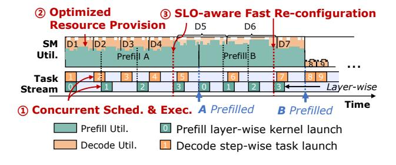

# **2.3.3 Existing Optimizations.** Despite recent optimizations of chunked prefill, the technique remains intrinsically

**Figure 6.** Dynamic spatial-temporal orchestration of concurrently executed prefill and decode tasks.

limited. PodAttention [54] fuses prefill and decode attention kernels to accelerate hybrid-batch attention, yet this operator-specific optimization does not mitigate the fundamental latency penalties imposed by chunking (§2.3.2). Nanoflow [80] designs a fixed-size pipeline that uses CUDA streams to overlap chunked attention and linear layers with careful inter-kernel synchronizations. However, the latency of chunked attention grows by successive chunks, which eventually eliminates the chances of overlapping. Apart from chunked prefill-based approaches, MuxServe [29] (Figure 4) decouples prefill and decode phases into separate processes, leveraging MPS [22] with manually configured, fixed SM quotas to enable spatial sharing. This coarse-grained static partitioning leads to unpredictable latency despite saturating the GPU. Therefore, neither solution fully resolves the throughput-latency tradeoff under varying serving demands.

**Takeaway 2**. Both chunked prefill and uncoordinated spatial sharing exhibit skewed throughput—latency tradeoffs. This urges for a fine-grained yet predictable execution mechanism for optimal LLM serving performance.

### 2.4 Opportunities and Challenges

To address the inefficiencies discussed above, an inter-phase orchestration system is demanded to achieve optimal latency-throughput balance while maximizing GPU utilization, as illustrated in Figure 6.

Concurrent Schedule and Execution. Co-executing prefill and decode eliminates redundant KV-cache reloads and fully utilizes GPU resources, but sustaining latency targets demands real-time request monitoring and kernel scheduling that respond to execution progress and system state. A layer-level, SLO-aware scheduler must tightly control execution advance to avoid inter-phase resource competition. While LLM online serving further requires low-overhead control plane and support for rapid reconfiguration, rendering these challenges non-trivial.

**Optimized Resource Provision.** By carefully partitioning available SM resources, memory-bound decode kernels may efficiently co-execute with compute-intensive prefill kernels. However, LLM's multi-dimensional nature of input parameters and dynamic inter-kernel contention creates a complex optimization space. This necessitates precise latency modeling across varying SM provisions and efficient exploration algorithms to identify optimal configurations.

SLO-aware Rapid Re-configuration. In response to runtime workload dynamics, resource allocation between prefill and decode phases must be re-configured. These frequent adjustments demand near-zero-overhead reconfiguration to maintain efficiency. Although MPS [22] offers context APIs [21] to adjust different SM quotas, it incurs significant memory overhead when applied to LLM serving scenarios due to dynamic inputs. An even more lightweight approach is demanded to maintain for instantaneous switching between optimized resource partitions.

