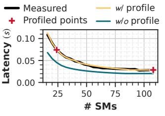
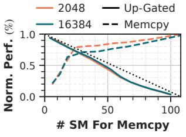

# 3 Design

## 3.1 Overview

Figure 7 illustrates Bullet's workflow for concurrent prefilldecode execution with dynamic and fine-grained resource provisioning, with all components operating at microsecondlevel overhead. Bullet comprises four key components around the scheduling, resource partitioning and execution: performance estimator, SLO-aware task scheduler, resource manager, and concurrent execution engine. The performance estimator (§3.2) **1** first builds an analytical model for the served LLM, augmented with lightweight offline samples. The model provides precise latency predictions across different configurations of co-executing prefill and decode batch sizes under varying resource allocations. At runtime, the SLO-aware task scheduler (§3.3) acts as the central coordinator to enable GPU sharing between prefill and decode tasks via spatialtemporal scheduling. During every layer-wise scheduling cycle, the scheduler **2** proactively retrieves system status from the concurrent execution engine (§3.4), monitoring request progress and 3 evaluating potential SLO violations by performance estimator. Observed statistics are also used to refine the performance estimator online. The scheduler rapidly searches for **4** an optimal resource configuration and scheduling decision that maximizes throughput while ensuring SLO compliance. Computational resource manager is 6 triggered for lightning resource reconfiguration when necessary. Finally, the prefill and decode kernels are 6 launched concurrently on the provisioned SMs. Bullet dynamically balancing the competing demands of TTFT and TPOT maintains high utilization with negligible overhead.

## <span id="page-5-0"></span>3.2 Performance Estimator

<span id="page-5-5"></span>**3.2.1 Problem Formulation.** For a given LLM and hardware, the latency of co-executed prefill and decode is determined by six factors, termed as Execution State (ES): prefill sequence length ( $sl_i$ ), batch size (pbs) and number of allocated SMs (pm), alongside decode context length ( $cl_i$ ), batch size (dbs) and SMs (dm). Enumerating the millions of ES combinations for profiling is infeasible. Therefore, we build a lightweight analytical model with a minimal profile and runtime overhead. First, we propose SM-scaling

<span id="page-5-1"></span>

Figure 7. Workflow of Bullet. (Numbers: dataflow order.)

roofline model (SRM) to derive single kernel latency under partitioned SMs without interference. Second, memory-subsystem contention is quantified when concurrent kernels are isolated in distinct SMs. Finally, the model is augmented with minimal sampled data for calibration. At runtime, the model executes within microseconds and continuously refines with online statistics.

**3.2.2 SM-scaling Roofline Model (SRM).** We examine the performance of compute, memory access, and network communication when only  $N_p$  of the SMs are available. Theoretical compute performance scales linearly as  $C_p = C_{peak} \cdot N_p/N$ . Memory and network bandwidth exhibit proportional scaling until reaching inflection points  $N_d$  and  $N_w$ , where the SMs generate sufficient traffic to saturate the respective peak bandwidth  $D_{peak}$  and  $W_{peak}$ . Figure 8a illustrates the throughput of a memory-copy kernel, showing the inflection points of Nvidia A100 and H20 GPUs.

Given a kernel with  $flop_k$  operations and  $mem_k$  bytes of memory transactions, we construct an SM-scaling roofline model (SRM) in Equation 1 to estimate the theoretical latency on  $N_p$  SMs. In the example of Figure 8b, the memory bandwidth inflection point  $N_d = 30$ . When using 54 SMs, the attainable memory bandwidth remains at its peak, maintaining the original roofline slope while lowering the plateau. For 20 SMs, both the slope and plateau decline.

<span id="page-5-3"></span>
$$\begin{cases} T'_{k,p} = flop_k \cdot \min \left( flop_k / mem_k \cdot D_p, C_p \right)^{-1} \\ C_p = C_{peak} \cdot N_p / N; \ D_p = D_{peak} \cdot \min(1, N_p / N_d) \end{cases}$$
 (1)

For each Execution State ES, we compute the arithmetic intensity of every LLM kernel with llm-viewer [72], apply SRM to obtain its baseline latency  $T'_{k,p,ES}$  on Np SMs, and aggregate these values to yield the total LLM latency  $T'_{p,ES}$ . Since practical execution rarely matches the roofline bound, Equation 2 derives a scaling factor for calibrating SRM:

<span id="page-5-4"></span>
$$\alpha_{p,ES} = T_{p,ES}^{\text{measured}} / T_{p,ES}'$$
 (2)

The factor is then extrapolated to unmeasured configurations, since the utilization pattern is near-linear between similar kernel inputs [10, 13, 71]. As shown in Figure 9, only two samples are sufficient to model the decode latencies by varying SMs. This demonstrates effective estimation aligned with kernel characteristics without extensive profiling.

<span id="page-5-2"></span>

**Figure 8.** Modeling peak performance by number of SMs.

<span id="page-6-1"></span>



**Figure 9.** Calibrating estimated decode latency with only 2 samples.

**Figure 10.** Normalized performance of co-executed upgated and memory copy.

3.2.3 Contention Modeling. When kernels execute on isolated SMs to prevent compute contention, memory subsystem and network contention persist. Identifying each type of contention at kernel-level online is challenging. However, we verify that end-to-end latency remains stable under such interference, even if underlying hardware scheduling and inter-kernel resource competition vary. Extensive evaluation of 7360 concurrent *ES* on A100 (serve Llama3.1-8B [32]) and 8×H20 (serve Qwen3-32B [68]), each repeated for 30 runs, observes that 95% of latency measurements deviate less than ±6.8% from the mean of the respective repeated runs. This tight distribution confirms the stability of end-to-end latency under varying prefill-decode interference patterns, which can be used as a reliable metric for contention modeling.

The worst-case memory subsystem interference can be quantified by co-executing a memory copy kernel on  $N_p$ SMs and an up-gated layer (UG), which is a large-shaped GEMM in LLM, on the residual  $N - N_p$  SMs. This is because prefill and decode kernels typically exhibit lower resource utilization than both UG and memory copy. Figure 10 shows that UG exhibits marginal performance degradation (<8%) when using more than 60% SMs. Therefore, the latency of prefill kernels can be reliably calibrated via Equation 2 with minimal sample size. Conversely, memory-copy throughput decreases as UG sequence lengths grow. To model decode latencies, we measure the attainable bandwidth  $D_{p,sl}$  when concurrently executed with sl-length prefill to update SRM. Equation 2 is then applied for further refinement, since the memory interference pattern scales linearly with kernel utilization characteristics [13, 67].

Inter-phase network contention is low since the traffic scales with either sl or dbs, where dbs is relatively small. The memory subsystem impact of network transfers is inherently lower than memory copy, and prefill-to-decode interference is already accounted for in the end-to-end  $D_{p,sl}$  calibration.

**3.2.4 Profiling and Online Calibration.** During offline profiling, Bullet records compute, memory, and network performance across varying SM counts in a single sweep to construct SRM. It then samples a sparse set of concurrently executed prefill and decode configurations to empirically derive a scaling factor for each sample's end-to-end latency. This avoids time-consuming Nsight Compute [23] profiling

<span id="page-6-2"></span>

**Figure 11.** Mean absolute relative error (MAPE) of different estimators using diverse numbers of profiled samples and range, validated on 7360 samples.

employed in previous works [13, 59, 76] to precisely model inter-kernel interference. For online prediction, Bullet estimates latency using the SRM and calibrates this initial estimation by interpolating the scaling factor from the premeasured samples. Continuous online data collection for recalibration is straightforward. Leveraging only Equation 2 and linear extrapolation, the runtime overhead for update and prediction is negligible.

Figure 11 validates different estimators profiled using different sample counts and ranges. Employing an established predictor [65] designed for sole-run latency estimation (contention ignored bar) significantly degrades the accuracy of decode latency prediction. This observation is consistent with decode kernels exhibiting higher sensitivity to contention than prefill kernels (Figure 10), underscoring the need for analyzing this inter-phase contention. Furthermore, a linear regression model using the parameters in ES, with quadratic term for pl, proves inaccurate. This failure highlights the highly non-linear relationship among SM budget, contention, and performance. In contrast, SRM maintains high accuracy, even for inputs beyond the sampled range. The mean scaling factor of 1.61, and the profiling overhead remains below one hour. This accuracy-overhead tradeoff is comparable to previous works [13, 59, 74, 76] and enables for reliable real-time scheduling optimization.

#### <span id="page-6-0"></span>3.3 SLO-aware Task Scheduler

**3.3.1 Scheduling Workflow.** Each of the prefill and decode *concurrent execution engine* (§3.4) runs a scheduler autonomously. At every step, the scheduler reads system status from the global metadata buffer (§3.4.1), forecasts latencies with *performance estimator*, and reorders pending requests. Upon detecting potential SLO violations, the scheduler greedily searches for the optimal configuration and invokes *computational resource manager* (§3.4.2) to repartition SMs.

As illustrated in Figure 12, for prefill scheduler, a fixed number of layers is launched per step, and synchronizes for CPU (teal triangle) to make subsequent scheduling decisions. This enables fine-grained control over prefill progress temporally for rapid adaptation to system fluctuations. Conversely, decode scheduler issue kernels as a single CUDA Graph [21] to eliminate the launch overhead of small kernels.

<span id="page-7-2"></span>

**Figure 12.** Asynchronous scheduler launches layer-wise prefill kernels and step-wise decode graphs, monitoring latencies and dynamically reallocating SMs.

Bullet navigates the *non-linear* SM budget-performance relationship for TTFT-TPOT balance. The primary scheduling objective is to prioritize prefill while respecting decode SLOs, since shorter prefill latency enlarges decode batch size and raises system throughput [3]. During concurrent operation, the decode phase is provisioned with the minimum SM counts that satisfy SLO. As the final prefill layer approaches completion, additional SMs are allocated to the decode phase to facilitate a smooth transition between co-running prefill/decode and decode-only. During reconfiguration, Bullet eliminates inter-phase synchronization by partially sharing SMs between phases rather than idling unused resources. Although a perfect non-overlapping allocation is challenging, layer-wise prefill scheduling confines such compute resource interference to minimal, predictable regions.

## 3.3.2 Request Scheduling and Resource Provisioning.

To facilitate SLO-aware scheduling, Bullet monitors the system state defined as S = (ES, PS, RS), where ES denotes the execution state (§3.2.1), PS the prefill progress, and RS the per-request latency metrics. Prefill state PS comprises the queuing-request set Q, the in-flight request set P, and the executed layer count  $L_{exe}$ . For every request i, arrival time  $a_i$  and decode-start time  $d_i$  are recorded. At time t, the prefill scheduler estimates GPU execution times for all requests in  $P \cup Q$  under current ES, while the decode scheduler predicts next-step latency and updates the corresponding TPOT. These estimations are then written to the global metadata buffer, allowing each scheduler perceive the holistic state.

Algorithm 1 outlines the prefill scheduler, and the decode scheduler follows analogously. The algorithm continuously monitors execution progress and updates latency estimates (lines 2-4). Requests in the waiting queue are reordered by ascending predicted latency (line 5) when the reordering does not violate TTFT SLOs for pending requests. This reduces average TTFT without starvation. To start a new prefill step (line 10-13), requests are batched until reaching arithmetic intensity limits under the current execution state. When provisioning resources, prefill phase is prioritized and provisioned with more SMs unless TPOT is compromised (line 15). In extreme cases of high request load, the decode phase would be temporarily suspended (Figure 12-②) if TPOT SLO is still met. When both SLOs cannot simultaneously be satisfied, indicating the system is beyond maximum capacity, a

<span id="page-7-4"></span>

**Figure 13.** Concurrent execution engine with shared KV cache/weight GPU address spaces, exchanging system states and request metadata via OS-managed shared memory.

balanced SM ratio is enforced to limit excessive latency in either phase (line 14).

## <span id="page-7-0"></span>3.4 Concurrent Execution Engine

<span id="page-7-1"></span>**3.4.1 Engine Architecture.** Figure 13 shows the concurrent execution engines for prefill and decode, each residing in a separate process and driven by the corresponding scheduler. Both engines share a CPU buffer and unified GPU memory pool. The CPU buffer is implemented as OS-managed shared memory, storing global system states and employing compact control bits to indicate data availability, thereby enabling low-latency status exchange. For GPU memory management, Bullet employs a dedicated initialization process that allocates model weights and KV cache [43] prior to engine launch. The resulting memory region is shared between

```
Algorithm 1: SLO-aware Scheduling for Prefill
```

```
Input: System state S, TTFT/TPOT SLO \Gamma_p/\Gamma_d
   Output: Next requests & layers to run next_tasks
1 Function Schedule(S):
 2
       ttft \leftarrow \text{EstimateLatency}(S)
       WRITEGLOBALBUFFER(ttft)
 3
       tpot \leftarrow ReadGlobalBuffer()
4
5
       SortByLeastEstimLatency(O)
       if P \neq \emptyset then
6
           satisfy \leftarrow \text{req.ttft} \leq \Gamma_p, \text{req} \in P
 7
            next tasks \leftarrow P
 8
       else
 9
            satisfy \leftarrow P90(ttft) \leq \Gamma_{t}
10
            next \ tasks \leftarrow \emptyset
11
            while ArithInten(next_tasks, S.ES) < peak do
12
                next_tasks.append(Q.pop())
13
       if not satisfy and P90(tpot) > \Gamma_d then
14
            SetBalancedSM(S, ttft, tpot)
15
       else if P90(tpot) \leq \Gamma_d then
16
            ReduceDecodeSM(S, ttft, tpot)
17
       else if P90(tpot) > \Gamma_d then
18
            ReducePrefillSM(S, ttft, tpot)
19
       return next_tasks, L_{exe} + L_{step}
20
```

engines via cudaIpcGet/OpenMemHandle API [21] with no adverse effects as documented. Equivalent facilities, such as AMD's hipIpcOpenMemHandle [4], allow the same design to be deployed on other hardware. Since the address space and metadata are shared, Bullet is fully compatible with existing KV cache and prefix cache optimizations. An atomic lock serializes allocation and deallocation transactions that may be issued concurrently by both engines, ensuring correctness with minimal performance impact.

<span id="page-8-1"></span>**3.4.2** Computational Resource Management. While MPS [22] with CUDA Green Context [20] supports SM partitioning, its memory overhead exceeds 700MB for only 4 static policies in LLM serving [25], rendering it impractical for fine-grained, dynamic control required by Bullet. For flexible, low-overhead SM provisioning, Bullet leverages established SM masking techniques [5, 6]. Specifically, we utilize the libsmctrl\_set\_stream\_mask API to modify the metadata of CUDA stream [21] to constrain all subsequent kernel executions to a specified subset of SMs. Similar interfaces exist on other platforms, exemplified by AMD's hipExtStreamCreateWithCUMask [4], which can be utilized to pre-create multiple streams with masks [56] to mitigate SM partitioning overhead.

Bullet creates a CUDA stream in each *concurrent execution engine* for prefill and decode. Whenever the scheduler issues a repartitioning command, the system immediately invokes the libsmctrl API to reconfigure the corresponding stream, thereby restricting all subsequent kernels to the newly provisioned SMs. This instantaneous configuration (Figure 12-①③), supports rapid adaptation to dynamic system states with flexible SM allocation. Section 4.3.3 validates that this on-demand setting adds only microsecond-level runtime overhead and zero additional memory footprint.

**3.4.3 Execution Workflow.** The prefill engine's execution begins with receiving requests and follows the scheduling workflow in §3.3, retrieving decode-side states from the buffer, such as batch size and TPOTs. Once prefill completes, the request migrates to decode without KV-cache transfer, and only metadata is asynchronously sent to the decode engine via ZeroMQ [73], enabling microsecond overhead. The decode engine receives newly prefilled requests and merges them into the current running batch. Output tokens are directly forwarded to the frontend server, eliminating

**Table 3.** Server configurations for experiments.

<span id="page-8-2"></span>

| GPUs/Node   | #SMs/GPU | Intra-node<br>Bandwidth | Inter-node<br>Bandwidth |  |
|-------------|----------|-------------------------|-------------------------|--|
| 8×A100-80GB | 108      | 20 GB/s                 | N/A                     |  |
| 8×H100      | 132      | 600 GB/s                | N/A                     |  |
| 8×H20       | 78       | 400 GB/s                | 200GB/s                 |  |

any CPU involvement by the prefill engine. Bullet's control plane works independently while proactively communicating through the buffer, unblocking both CPU and GPU execution. This decentralized architecture allows concurrent kernel submissions while eliminating the need for frequent synchronization compared with a centralized architecture. We implement Bullet on top of SGLang [78] v0.4.6 and Py-Torch 2.6.0 with 4100 lines of Python code, and integrate a modified libsmctrl [5] library to optimize GPU resource allocation within the serving engine. The prefill and decode engines are implemented as SGLang's workers, with MPS [22] enabled for spatial sharing. Bullet relies on libraries' heuristics for optimal kernel hyperparameters under varying SM budgets, rather than re-implement and tune custom kernels [80]. These libraries provide highly efficient, optimized implementations, and the profiling already encapsulates the SM budget-kernel performance relationship.

