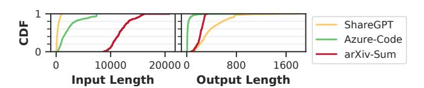
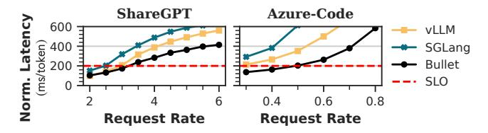
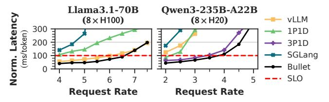
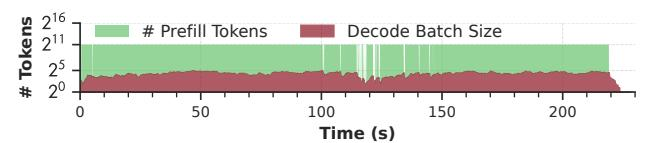
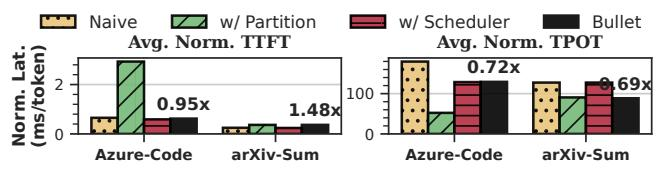

# 4 Experimental Evaluation

## 4.1 Methodology

Models and Platforms. Experiments are conducted on three servers in Table 3 with CUDA 12.4. We evaluate dense model Llama3.1-8B/70B [32] and MoE model Qwen3-235B-A22B-FP8 [68]. All multi-GPU setups use tensor parallelism, which is commonly employed in production deployment [27, 68] and prior studies [3, 43, 80].

**Evaluated Schemes.** We compare Bullet against several state-of-the-art systems of chunked prefill-based optimization: SGLang [78] v0.4.6 (1024/2048-chunk) with FlashInfer [69] v0.2.7, vLLM [43] v0.8.5 (1024-chunk), and Nanoflow [80] (1024-chunk) that employs GPU spatial-sharing for optimization. We also include *xPyD* disaggregated-prefill with SGLang backed by MoonCake [55] in multi-GPU evaluation.

Workloads Three representative datasets are used for evaluation, whose request arrivals follow a Poisson process aligned with previous works [3, 43, 80]. Figure 14 details the cumulative distribution function (CDF) of the datasets' sequence length. The ShareGPT [61] contains real-world conversational data, Azure-Code [53] is a production code

Table 4. Workload latency requirements.

|            | ShareGPT | Azure-Code | e arXiv-Sum |  |
|------------|----------|------------|-------------|--|
| norm. TTFT | 3.0 ms   | 1.5 ms     | 1.5 ms      |  |
| TPOT       | 150 ms   | 200 ms     | 175 ms      |  |

Figure 14. Workload input/output length CDF.

**Figure 15.** Performance comparison of ShareGPT (top row), Azure-Code (middle) and arXiv-Summary (bottom) of Llama3.1-8B on an A100 GPU. Bullet achieves the highest throughput and SLO compliance across all workloads, attributed to remarkably decreased TTFT with modest TPOT increments.

completion trace released by Azure, and arXiv-Summary [15] is long-context summarization.

**Metrics.** We report TTFT, TPOT and throughput. For SLO compliance measurement, we define prefill and decode latency that satisfy both the constraints listed in Table 4, aligning with previous works [65, 79, 80]. Request rate is scaled by the number of GPUs for disaggregated-prefill [65, 79]. Due to the variation in sequence length, we use *normalized input/generation latency* established previously [65, 80] for SLO. We collect hardware metrics using Nsight Systems [24].

#### 4.2 End-to-End Performance

4.2.1 Single GPU Performance. Figure 15 evaluates four baselines and Bullet across three real-world workloads on an A100 GPU using Llama3.1-8B [32]. Bullet demonstrates consistent throughput improvements, achieving 1.09× average and up to 1.20× higher throughput compared to SGLang-1024. Overall, Bullet maintains superior prefill latency enhancement (13.5×) with acceptable TPOT (0.94×) in average through dynamic SM allocation, translating to 1.86× endto-end speedup compared with SGLang-1024. Bullet also achieves a better TTFT-TPOT trade-off over chunked prefill, evidenced by reduced TTFT and TPOT versus SGLang-2048. In contrast, all the chunked prefill-based systems exhibit unacceptable TTFT degradation even in a low request rate. For example, on the ShareGPT workload, with a request rate of 20req/s, the prefill latency ranges from 1.8s (Nanoflow) to 14.9s (vLLM). The key reason is that chunk prefill limits the system's capability to process the prefill phase (§2.3.2) on high load and creates a cascading queuing delay. However, Bullet mitigates such congestion by adaptively adjusting SM partitions, which is further demonstrated in Figure 20.

For tail latency distribution, Figure 15d presents the P90 SLO attainment rate, Figure 16 shows the median and P90

latencies of ShareGPT workload. By eliminating the bottlenecks through SM allocation and adaptive scheduling, Bullet achieves mean TTFT of 0.16s and P90 tail latency of 0.31s, which is 54.9× and 78.5× better to SGLang-1024. The lower prefill latency remarkably translates to larger decode batches that boost overall throughput and SLO compliance (1.49×). Bullet effectively balances the throughputlatency tradeoff that is skewed in chunked prefill systems. While SGLang-2048 demonstrates a 3.20× TTFT improvement and 1.18× higher throughput than SGLang-1024, the 2048 chunk suffers from 0.78× worse TPOT on average, confirming the imbalanced tradeoff inherent in chunked prefill. Bullet breaks this paradigm by simultaneously achieving both lower TTFT  $(4.2\times)$  and better TPOT  $(1.20\times)$  than SGLang-2048 through exploiting GPU utilization via concurrent prefill-decode execution. While Nanoflow achieves 2.37× longer TTFT and 0.86× shorter TPOT than Bullet via static kernel overlapping pipeline, it still suffers from the inherent limitations of chunked prefill that inflate TTFT tail latency. This results in 5.2% lower SLO compliance and 20.0% lower throughput compared to Bullet.

**Figure 16.** Median and P90 latencies of TTFT and TPOT on ShareGPT workload.

**Figure 17.** Mean normalized generation latency of Llama3.1-70B served on 8×A100. Bullet sustains higher request rates while remaining within the SLO constraint.

**Figure 18.** Mean normalized generation latency of various models across different hardware serving Azure-Code.

**4.2.2 Multi-GPU Performance.** Figure 17 depicts the generation latency of Bullet when Llama3.1-70B is deployed across eight A100 GPUs, with vLLM and SGLang using a chunk size of 2048. On the ShareGPT workload at 3.0 req/s, Bullet achieves a mean latency of 173 ms/token (223 ms/token for P99), whereas vLLM and SGLang attain 207 ms/token and 319 ms/token, respectively. For the Azure-Code dataset, where input lengths are significantly longer, Bullet's advantages is more pronounced, sustaining 203 ms/token at 0.5 req/s. In contrast, vLLM and SGLang already exhibit 213 ms/token and 291 ms/token at a lower rate of 0.3 req/s.

Figure 18 shows that on H100 GPUs, the elevated memory bandwidth mitigates chunked-prefill overhead, yet Bullet continues to outperform SGLang and vLLM. Bullet's concurrent handling of prefill and decode tasks leverages potential overlaps between computation, communication and memory operations with fine-grained SM control between phases. We also demonstrate Bullet's generalization to other LLMs on H20 GPUs. For the highly sparse, FP8-quantized MoE Qwen3-235B-A22B, chunked prefill's inherent lock-step batching impedes both prefill and decode speeds, while 1P1D is insufficient to exploit disaggregated-prefill fully. However, Bullet orchestrates the two phases effectively, achieving comparable performance against the heavy-weight 3P1D deployment. At 4.0 req/s, Bullet delivers 110 ms/token, with 1.4s TTFT and 45ms TPOT, respectively, which are  $17.7\times$ ,  $16.2\times$ , and  $4.2\times$  lower than vLLM.

We further evaluate Bullet on a production cluster serving retrieval-augmented generation (RAG) [45] workloads. As illustrated in Figure 19, Bullet consistently delivers lower TTFT and end-to-end latency compared to both chunked prefill and 6P1D, a small-scale disaggregated-prefill configuration. While large-scale disaggregation of 30P6D achieves superior inter-token and end-to-end latency, Bullet remains

**Figure 19.** Normalized latency on internal production trace.

(a) SM allocation for prefill changes dynamically according to system load (top). Concurrently processing tokens/batch size in Bullet (middle). Number of requests waiting for prefill (bottom). Bullet adaptively partitions SMs to avoid request congestion on burst.

**(b)** SGLang's hybrid batch status. Decode requests occupy chunk budget, degrade prefill efficiency, incurring severe queuing time.

**Figure 20.** System serving status of the Azure-Code workload in timeline view (request rate: 5.0 req/s).

highly competitive, offering a more resource-efficient alternative to both chunked prefill and small-scale disaggregated deployments. These results indicate that intra-GPU spatial-temporal orchestration can achieve performance gains previously only accessible through multi-node disaggregation.

#### 4.3 Performance Contribution Analysis

4.3.1 Impact of Dynamic SM Partition. We break down the effectiveness of dynamic resource provisioning in Figure 20 by timeline with the Azure-Code workload (5.0 req/s, Llama3.1-8B). The top row in Figure 20a demonstrates the number of SMs provisioned for the prefill phase, with each bar showing the SM count and duration. On request rate bursts (spikes in Figure 20-bottom), Bullet adaptively sets the number of prefill SMs to use full GPU, and may temporarily delay decode requests. This enables the rapid response to queuing requests, avoiding excessive waiting time. After processing the pending requests, Bullet quickly reconfigures the resources to a balance point for both phases. Instead, chunked prefill-based systems cannot optimize for this scenario, since redundant KV cache accesses inflate prefill speed. Moreover, decode batch shares the token budget with prefill

tokens (Figure 20b), enforcing more iterations to complete a prefill, which further degrades performance. These factors jointly result in  $4.17\times$  longer queuing delay for SGLang-2048. Bullet exempts from the token budget (Figure 20-middle) and orchestrates the two phases with fine-grained resource control to saturate GPU, significantly decreasing both TTFT and TPOT by  $9.15\times$  and  $1.33\times$ , respectively.

**4.3.2 GPU Utilization.** Figure 21 presents hardware utilization measured with Nsight Systems. Despite Bullet introducing increased memory traffic due to independent weight loading during decoupled prefill and decode, this trade-off is advantageous compared to chunked prefill. While chunked prefill idles Tensor Cores during redundant KV cache loading, Bullet maintains their high utilization in concurrent execution. Consequently, Bullet effectively elevates both compute and bandwidth utilization, leading to improved overall performance. From 0s to 27s, when the system concurrently handles prefill and decode requests, Bullet sustains an average of 86.2% active SM cycles, which is 11.2% higher than SGLang. Correspondingly, utilization of Tensor Cores rises by 11.8%, while memory-bandwidth utilization increases by 19.3%. These utilization gains directly reduce the mean end-to-end request latency from 25.8 s to 21.4 s.

**4.3.3 Overheads.** Table 5 quantifies the CPU overhead of Bullet's key components. Sending and receiving metadata only necessitates serialization and deserialization of Python objects, therefore achieving a mean latency of 0.21ms. The performance prediction module incurs merely  $10.2\mu s$  overhead by simply invoking the analytical model. For GPU resource management, SM masking enables instantaneous reconfiguration with negligible runtime overhead. These designs jointly ensure Bullet's control plane adds minimal latency while enabling fine-grained resource optimization.

## 4.4 Sensitivity Studies

To study the effect of dynamic resource provisioning, we run the workloads under fixed SM configurations for prefill and allow decode to use all SMs, which mimics static sharing systems like MuxServe [29]. The results are reported in Figure 22. The SM-108 configuration (no partitioning) demonstrates severe imbalance in the Azure-Code workload.

**Figure 21.** Compute and memory bandwidth utilization of a timeslice in ShareGPT workload (20 req/s, Llama3.1-8B).

**Table 5.** Overheads of Bullet's components.

|                                       | Mean | Std. | P90  | P99  |
|---------------------------------------|------|------|------|------|
| Metadata Send/Recv (ms)               | 0.21 | 0.44 | 0.89 | 1.54 |
| <b>Performance Predict</b> ( $\mu$ s) | 10.2 | 5.1  | 24.5 | 25.8 |
| <b>Resource Re-config</b> ( $\mu$ s)  | 4.1  | 0.79 | 4.2  | 5.9  |

While achieving low TPOT, SM-108 suffers 1.20× higher TTFT on average and 1.19× worse P90 tail latency compared to Bullet, ultimately reducing throughput and SLO attainment by 13%. Smaller static partitions, like 84 SMs, prove even more problematic, exacerbating latency imbalance with 1.78× worse TTFT even than chunked prefill baselines and reducing throughput by 5.9%. Therefore, there is no optimal fixed SM allocation, as smaller partitions improve TPOT but degrade TTFT and introduce tail latency violations, and vice versa. These results confirm Bullet's dynamic approach, which adaptively orchestrates resources to simultaneously maintain balanced latency targets and maximize throughput.

#### 4.5 Ablation Studies

Figure 23 analyzes the contributions of different components in Bullet by isolating part of the design. Naive: concurrent execution without resource provisioning or scheduling. w/Partition: adds resource provision only. w/Scheduler: Incorporates only request reordering and delayed decode. The Naive design exhibits the expected latency imbalance (§4.4), high TPOT and low TTFT attributed to unpartitioned resource contention. The w/Partition variant improves TPOT for Azure-Code but suffers unacceptable TTFT degradation from its inability to reorder pending requests. Conversely,

**Figure 22.** Sensitivity study on fixed SM counts for prefill. Static setups cause latency-throughput imbalance: more SMs reduce TTFT but harm TPOT and goodput. Bullet's dynamic SM tuning optimizes both.

Figure 23. Ablation study of Bullet.

w/Scheduler maintains comparable latency while reducing Azure-Code TPOT through contention alleviation. Only the complete Bullet design, combining both partitioning and scheduling, achieves balanced latency across all workloads.

#### 4.6 Discussions

While Bullet shows promising improvements, we identify several operational boundaries. First, on low-compute GPUs running dense models, the limited SM budget obliges the decode phase to claim a larger ratio of SMs to saturate memory bandwidth (Figure 8a), slightly tempering concurrentexecution benefits. However, this caveat is immaterial for MoE models, whose lighter compute footprint preserves the full advantage (Figure 18). Second, Bullet's SM isolation policy could be relaxed to partial sharing, yet such exploration is orthogonal to the paper's core contribution of fine-grained spatial-temporal orchestration and can be retrofitted without architectural changes. Third, for specialized architectures like DeepSeek-MLA [27] where disaggregation proves fundamentally advantageous, Bullet's co-located approach may not match dedicated solutions' peak performance. Extending the latency model to cover new attention variants or LoRA adapters [39] is straightforward and left to future work. Bullet's core innovations maintain broad applicability across standard LLM architectures and typical workload distributions while extensible to emerging models.

## 5 Related Works

**LLM Serving Systems.** System-level optimizations for LLM serving have been extensively explored, which can be categorized as prefill-decode co-location and disaggregation. Co-located techniques represented by chunked prefill [3, 80] improve batching efficiency but maintain lockstep prefill and decode phase execution that underutilizes hardware. Disaggregated systems [30, 53, 55, 79] eliminate inter-phase interference but incur costly KV cache migration and load imbalance among prefill-decode instances. Bullet uniquely enables intra-GPU prefill-decode execution, maximizing utilization without overheads while meeting SLOs. Recent intra-GPU sharing proposals for LLM inference remain fundamentally constrained. Nanoflow [80] exploits kernel overlap atop chunked prefill. However, the approach's intrinsic limitations erode gains as sequence lengths increase. MuxServe [29] and Semi-PD [37] rely on static SM allocations, requiring costly engine relaunches for reconfiguration. Drift [25] explores lock-step execution between prefill blocks and decode in gangs using predefined SM partitions. These coarse designs lack the agility required by dynamic workloads. Bullet addresses these shortcomings through adaptive fine-grained resource management, enabling optimal GPU utilization across diverse workloads.

**Concurrent Kernel Execution.** Co-executing kernels with complementary resource demands has been proven to

improve GPU utilization and performance. Spatial-temporal multiplexing techniques [14, 28, 34] typically classify kernels by computational characteristics and latency requirements. These techniques subsequently rely on CUDA streams [21] or the Multi-Process Service (MPS) [22] for kernel submission and execution control. However, these approaches treat the hardware scheduler as a black box, providing limited control [41, 49] over actual execution. While several systems use precise kernel fusion [40, 66] or hardware resource provisioning [13, 59, 63, 75, 76] to enforce predictable scheduling, they focus on co-locating traditional, independent DNN workloads. However, GPU sharing for LLM inference necessitates complex coordination between dependent prefill and decode phases and KV cache management. Bullet distinguishes itself from previous works by fine-grained orchestration of LLM's interdependent phases and layer-level precise resource management.

Kernel Scheduling. Effective scheduling is essential for optimizing concurrent kernel execution. Several general-purpose schedulers [9, 47, 52] automatically resolve kernel dependencies and dispatch kernels into concurrent streams. Latency model-based solutions [13, 59, 75] schedule kernels within latency constraints but rely on excessive offline profiling, which is unsuitable for the dynamic workloads in LLM serving. Although estimating standalone LLM inference latency is well-established [2, 65, 72], the complex interactions between concurrent prefill and decode phases remain unstudied. Existing solutions either rely on simplified models [37] or assume contention-free execution [25]. Bullet addresses this gap by developing a profile-augmented analytical model for performance estimation and refining kernel scheduling mechanisms for LLM serving.

## 6 Conclusion

This paper proposes Bullet to optimize LLM serving through precise GPU resource provisioning. By carefully orchestrating spatial-temporal execution between prefill and decode phases, Bullet effectively saturates wasted GPU resources. At runtime, Bullet employs real-time task progress estimation to optimize scheduling decisions and resource allocation, enabling precise and fine-grained control over layer-level resource quotas. Experimental evaluation confirms consistent latency compliance and substantial throughput gains.

