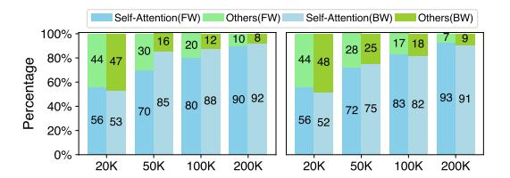
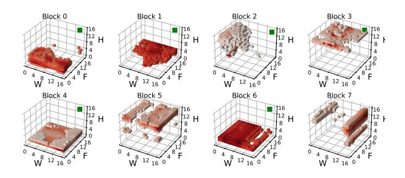
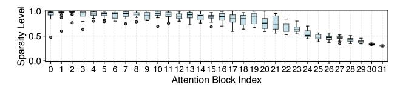
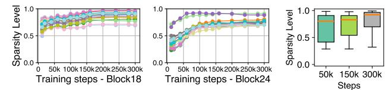

# 2.1 Video DiT

Diffusion models have become a leading framework in generative modeling, excelling in image synthesis [\[14,](#page-14-3) [19\]](#page-14-4) and video generation [\[3,](#page-14-0) [4,](#page-14-1) [13,](#page-14-2) [36,](#page-14-5) [39,](#page-14-6) [40\]](#page-14-7). These models corrupt

**Figure 1.** Overview of video DiT training. (a) The main input is the video, which is compressed by a VAE (omitted here). The timestamp is used as conditioning, and the text prompt is used as the Key-Value input in the cross-attention module. (b) Interleaved spatial-temporal attention blocks. (c) 3D full attention blocks.

data with noise in a forward process and learn to reconstruct it through a reverse generative process. Among them, DiT has emerged as the de facto backbone [7, 36, 39].

In a typical video DiT training process, a video clip is first encoded by a VAE [7, 10, 39], which compresses and downscales the input into a latent representation. Random noise is added to this latent representation, and the noised latent video-along with any conditioning information (e.g., timestamps or text prompts for text-to-video tasks)-is fed into the DiT model. As shown in Figure 1, the DiT model consists of multiple DiT blocks that process video tokens alongside conditional inputs, guiding video generation during training. At the core of each DiT block are self-attention modules, which employ interleaved spatial and temporal attention or full attention to capture the complex relationships among video tokens across different dimensions. Additionally, cross attention aligns the video with text prompts, ensuring consistency between modalities. The model's output is used to compute the loss, following either a denoising diffusion probabilistic model paradigm [24] or a flow matching paradigm [33, 35].

#### 2.2 Various Self-Attention Paradigms

Self-attention, or multi-head attention, is widely used in natural language processing and computer vision [18, 50] to capture long-range dependencies. Given an input sequence  $H = [h_1, \cdots, h_S]^{\top} \in \mathbb{R}^{S \times d}$ , where S is the sequence length and d the hidden dimension, each attention head maps H to Q, K, and V using learnable projection matrices  $W_Q$ ,  $W_K$ ,  $W_V \in \mathbb{R}^{d \times d_k}$ . The head output is computed as:

$$H' = \operatorname{softmax}\left(\frac{\mathbf{Q}\mathbf{K}^{\top}}{\sqrt{d_k}}\right)\mathbf{V},$$

where  $d_k$  is the dimensionality of each attention head. Ultimately, the outputs from all attention heads are concatenated and combined to produce the final output.

For video DiTs, various attention paradigms have been developed. One approach employs spatial-temporal attention, alternating computations along spatial and temporal dimensions [36]. While computationally efficient, studies

**Figure 2.** Time breakdown for self-attention and other operations in different DiTs (left: 1.3B, right: 3B) with various token lengths in forward (FW, left bar) and backward (BW, right bar) computation.

have found it inadequate for capturing detailed information, prompting a shift to full attention paradigms [3, 40, 54].

Full attention computes interactions across all tokens in the 3D temporal-spatial space, outperforming spatial-temporal attention. However, it processes a significant number of tokens, often exceeding 100k-even in latent space (e.g., for a latent input of  $32\times96\times96^1$ , 300k tokens are required). This makes full attention extremely compute-intensive.

#### 2.3 Large-Scale Video DiT Training

The efficiency of large-scale video DiT training is primarily influenced by two key aspects.

**Full attention bottleneck.** In high-resolution, long-video processing, self-attention becomes a major bottleneck due to its  $O(n^2)$  complexity with respect to the number of tokens and the non-causal nature of DiT, where the lengths of Q, K, and V all match the number of video tokens. In contrast, cross-attention is far more efficient, as only Q matches the video token count, while K and V are constrained to the text prompt length (typically under 120 tokens). As shown in Figure 2, self-attention increasingly dominates computation time as the number of video tokens grows. For example, in 1.3B and 3B models with a sequence length of 200K, self-attention accounts for 92% and 93% of forward and backward computation time, respectively. Thus, developing efficient attention mechanisms is critical to alleviating this bottleneck and enabling scalable video DiT training.

**Context parallelism.** Context parallelism (CP) enables longsequence training by dividing sequences into chunks distributed across multiple GPUs. However, self-attention requires inter-device communication to process the entire sequence, with two common paradigms:

• **Sequence-wise CP.** QKV tensors are split into chunks of shape [*B*, *H*, *S*/*N*, *D*], where *B* is the batch size, *H* the number of heads, *S* the sequence length, *N* the number of GPUs, and *D* the head dimensionality. Each GPU processes its local query chunk across all heads, gathering KV from other GPUs to compute attention via block-wise operations [34], often using ring-based communication.

 $^1$ Throughout this paper, latent video dimensions (e.g.,  $16\times16\times16$ ) are ordered as frames, height, and width unless otherwise specified.

Figure 3. Left: The attention score distribu- Figure 4. The output tion for each query in a histogram. Right: The difference between cumulative distribution function of the sorted attention with full attention scores for each query.

KV and critical KV.

• Head-wise CP. GPUs also initially hold QKV chunks partitioned along the sequence dimension for all heads. After All-to-All operations, each GPU gets complete QKV tensors for a subset of heads, reshaped to [B, H/N, S, D]. GPUs then compute attention outputs independently for their assigned heads. A final All-to-All re-partitions the outputs to restore the original layout [28].

These paradigms have trade-offs in computation efficiency and communication cost [20, 22]. Determining an efficient and optimal parallelism strategy is non-trivial, as it depends on the specific input case and hardware configuration.

## **Empirical Observations on the Sparsity of** Attention in Video DiT

We conduct an in-depth analysis of the sparsity patterns of attention in video DiT training across various datasets and model sizes, as in §9. Our findings, demonstrated through a case study, validate the rationale behind our system design. The case study focuses on a 2.7B model with an architecture similar to Meta's MovieGen [40], representing a moderate scale for video generation [3, 7, 36]. The model is trained on the WebVid-10M dataset [12] using 8 H100 GPUs with a global batch size of 32 and a latent input size of  $16 \times 16 \times 16$ .

We begin by some definitions. Given a query vector q, let  $S_q = \{(k_i, v_i)\}_{i=1}^n$  denote the set of all n key-value (KV) pairs. The attention score function  $A(q,k_i) = \operatorname{softmax}(q \cdot k_i)$ computes the scaled dot product between q and each key  $k_i$ . The set of *critical KV pairs*  $I_q \subseteq S_q$  is then defined as the subset of pairs  $(k_i, v_i)$  where  $A(q, k_i)$  exceeds the  $\theta$ -percentile threshold of all attention scores. The threshold  $\theta$  can be set by a numerical cutoff or a cumulative sum, such that critical pairs account for 90% of total attention. In this paper, we use a 90% cumulative sum threshold as the default, i.e. the critical KV pairs are the top ones that together represent 90% of total attention. The sparsity of an attention head is then defined as the average proportion of non-critical KV pairs across all queries:  $\mathbb{E}_{q \sim Q} \left[ \frac{|S_q \setminus I_q|}{|S_q|} \right]$ 

Attention sparsity and power-law distribution. We first investigate the distribution of attention scores for each query to demonstrate attention sparsity.

Observation 1: Attention scores in sparse blocks follow a power-law distribution.

Figure 5. Distribution of critical KV positions for a query (green) at position (15, 15, 15) in the 3D latent space. The visualized keys are those that yield attention scores exceeding the 90th percentile when attending to the query.

Figure 6. Sparsity of different heads across blocks in iteration 80k.

As shown in Figure 3, attention scores of queries in two blocks are highly skewed, with most being small (<0.001) and only a few large (>0.1). Notably, the few top keys dominate, with the top 10% accounting for over 90% of total scores in 95.2% of queries (block 6) and 86.8% (block 21), highlighting the inherent sparsity. Figure 4 further shows that using only the top 10% of KV pairs yields minimal output differences.

The power-law distribution of attention scores suggests that a great portion of attention computation may be pruned without significantly impacting performance. By efficiently identifying critical KV pairs, we can potentially reduce computational costs while maintaining model quality.

Locality of critical KV. A common and simple method to identify critical KV pairs is to rely on locality: a token's query often attends to nearby tokens' keys or specific global keys, enabling the use of window-based patterns or token sinks as in LLM inference [6, 52, 58]. Given the spatio-temporal dependencies in video DiT, we first investigate whether similar locality patterns exist and can be applied in this context.

## Observation 2: Critical KV pairs do not exhibit locality patterns in video DiT.

In Figure 5, we visualize the critical KV positions in a 3D space for a query. Contrary to expectations, critical KV pairs do not have a specific pattern, unlike those found in LLM inference [6, 52, 58]. More generally across queries, our experiment reveals that only 15.1% of critical KV pairs are within a 5-token radius, while 48.5% are more than 10 tokens away. This suggests that applying fixed patterns to approximate attention would not fare well in video DiT.

Heterogeneity of sparsity. We further establish the spatial heterogeneity of attention sparsity across different attention blocks and heads within a block, which adds to the difficulty of identifying critical KV pairs.

**Figure 7.** The change in sparsity of different **Figure** attention heads during the training process in sparsity transformer blocks. Only two blocks are shown blocks due to space constraints.

