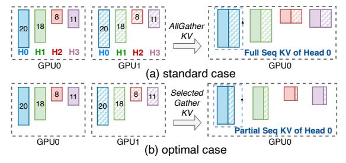
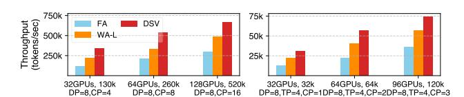
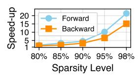
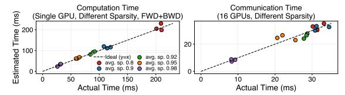
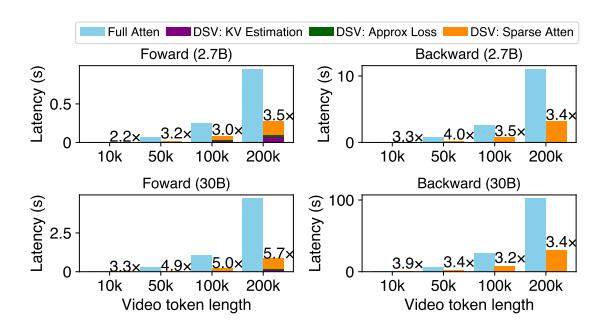

# 7 Hybrid Sparsity-Aware Context Parallelism

Sparsity in attention adds a new dimension to context parallelism (CP). In this section, we first analyze the performance of head-wise and sequence-wise CP in sparse settings with the best tuning. Building upon this, we propose a hybrid

<span id="page-7-0"></span>

**Figure 13.** An example of load imbalance in HCP with four attention heads (different colors). A sequence is split into two chunks (different shades) each held by one GPU. A chunk's length on a head represents its relative computational burden, i.e. 1 minus the sparsity level. A GPU's total burden is the sum of that across all heads it hosts.

sparse CP strategy that computes the best configuration by jointly optimizing both forms of CP for each attention block.

#### 7.1 Modeling Context Parallelism with Sparsity

We consider N GPUs within a CP group, each initially processing a partial sequence and storing the corresponding Q, K, and V chunks with shape [H, S/N, D], where H is the number of heads, S sequence length, and D head dimension.

**7.1.1** *Head-wise CP with Sparsity.* HCP redistributes the attention workload across the head dimension using all-to-all operations. Each GPU transitions from processing a sequence partition across all heads to handling a few heads for the entire sequence. However, the varying sparsity levels across heads introduce additional complexity and inefficiency.

Computation load imbalance. The head-wise split for attention computation, combined with sparsity heterogeneity leads to uneven computational burdens across GPUs as shown in Figure 13. Here, attention heads are distributed uniformly across GPUs, resulting in a significant load imbalance: GPU0 becomes a straggler due to low sparsity levels of its heads. Swapping the head-GPU assignment reduces the end-to-end time by 35.7% with more balanced workloads. This highlights the need for a balanced head-wise reallocation to account for sparsity heterogeneity. The best head allocation scheme within a HCP group can be found by a small combinatorial optimization problem that minimizes the maximum computational burden per GPU. We refer to this minimal per-GPU computation burden as comp<sup>hcp</sup>.

**Communication cost.** We turn to analyze the total communication volume of each GPU in a sparse HCP group. Let  $H_i^r$  represent the final number of heads allocated to GPU i. The training process involves four uneven all-to-all operations (QKV and output) for each GPU, with total cost amounting to:  $comm_i^{hcp} = 3SD \max(H_i^r(N-1)/N, (H-H_i^r)/N) + SD \max((H-H_i^r)/N, H_i^r(N-1)/N)$ .

**Memory cost.** Similar to communication, the memory consumption for *QKV* and output on each GPU of a HCP group

<span id="page-8-0"></span>

**Figure 14.** An example shows redundant communication of SCP in the same setting as in Figure 13. The width of each chunk represents the held KV size for that chunk. For simplicity, only GPU 0 is shown here after the KV gathering; GPU 1 should have a similar situation.

could slightly differ due to the potential uneven head allocation, and is given by:  $mem_i^{hcp} = 4SDH_i^r$ .

**7.1.2 Sequence-wise CP with Sparsity.** SCP does not reallocate the computational burden, as the sparsity level is uniform across queries within each head (§3) and SCP retains partial queries from all heads in each GPU. Instead, it computes the attention output for the local *Q* with both local *KV* and remote *KV* gathered from other GPUs within the same group.

**Communication cost.** In standard SCP a GPU gathers all remote KV tensors, but this is unnecessary in the sparse setting as shown in Figure 14(a). Only the critical KV tensors are needed now, which leads to *selective KV gathering* as in Figure 14(b). Consequently, the actual communication volume is:  $comm_i^{scp} = 2HDS/N \cdot \max(\sum_{j \in N, j \neq i} \alpha_i^j, \sum_{j \in N, j \neq i} \alpha_j^i)$ , where  $\alpha_i^j$  denotes the fraction of KV tensors on GPU j that is needed by GPU i.

**Memory cost.** Similarly, the memory consumption for additional non-local critical KV varies with  $\alpha_i^j$  as well. It can be expressed as:  $mem_i^{scp} = 2HD\sum_{j\in N, j\neq i}(\alpha_i^jS/N)$ .

### 7.2 Hybrid Sparse Context Parallelism

The analysis of optimized HCP and SCP in sparse settings highlights their respective strengths and limitations. HCP has a big impact on each GPU's computation load, while SCP does not. However, the communication overhead for both varies depending on the sparsity pattern.

Naturally, HCP and SCP can be combined with HCP rebalancing the workloads across heads and SCP further splitting them across sequences for certain heads. For example, in an 8-GPU setup with a HCP degree of 4, ranks 0-3 and 4-7 form HCP groups where head-wise reallocation occurs. Each GPU pair across HCP groups (e.g., rank 0 and rank 4) then forms four SCP groups (SCP degree 2), with ranks in each SCP group handling different sequence chunks for the same heads. By flexibly partitioning workloads across both dimensions, the hybrid approach (see Algorithm 1) can potentially achieve an optimal balance of computation and communication under certain sparsity pattern.

#### <span id="page-8-1"></span>Algorithm 1 Hybrid sparsity-aware context parallelism

```
1: function HybridSparseCP(Q, K, V, G_{hcp}, G_{scp})
       ▶ Per-GPU forward workflow
       \rightharpoonup G_{hcp}/G_{scp}: HCP/SCP comm groups of this GPU
 2:
       if |G_{hcp}| > 1 then
           Q, K, V \leftarrow LoadBalanceHCP(Q, K, V, G_{hcp})
 3:
 4:
       if |G_{scp}| > 1 then
           K, V \leftarrow \text{SelectiveCommSCP}(Q, K, V, G_{scp})
 5:
       Output \leftarrow SparseAttn(Q, K, V)
 6:
       ▶ Redistribute output if HCP used
 7:
       if |G_{hcp}| > 1 then
            Output \leftarrow UnevenAlltoAll(output, G_{hcp})
 8:
 9: function LoadBalanceHCP(Q, K, V, Group)
       ▶ Periodically solve optimal head allocation
       plan ← GetLoadBalancePlan(Group,Head_Sparsity)
10.
       \triangleright Reorder QKV by heads for comm layout
        Q, K, V \leftarrow Permute\_and\_Split(Q, K, V, plan)
11:
12:
        Q, K, V \leftarrow UnevenAlltoAll(Q, K, V, Group)
        return Q, K, V
14: function SelectiveCommSCP(Q, K, V, Group)
       ▶ Get global critical KV indices via predictor
15:
        Critical\_KV\_idx \leftarrow Estimate\_with\_Predictor()
       ▶ Exchange indices to decide sends
        KV\_idx\_to\_send \leftarrow UnevenAlltoAll(Critical\_KV\_idx)
16:
       ▶ Prepare, exchange, and merge KV
17:
        KV\_to\_send \leftarrow Prepare\_KV\_to\_send(KV\_idx\_to\_send)
18:
        Gathered_KV \leftarrow UnevenAlltoAll(KV\_to\_send)
        K, V \leftarrow \mathsf{MergeKV}(K, V, Gathered\_KV)
19:
        return K, V
20:
```

**Optimal CP configuration.** To find the best configuration for hybrid CP, we formulate an optimization problem that arrives at the optimal HCP and SCP degrees  $g^h$ ,  $g^s$  for each attention block:

<span id="page-8-4"></span><span id="page-8-3"></span><span id="page-8-2"></span>min 
$$\max_{i} \left( T_{i}^{comm}(g^{h}, g^{s}) + T_{i}^{comp}(g^{h}, g^{s}) \right)$$
  
s.t.  $T_{i}^{comp}(g^{h}, g^{s}) = f_{i}(comp^{hcp}(g^{h})),$  (1)  
 $T_{i}^{comm}(g^{h}, g^{s}) = h_{i}(comm_{i}^{hcp}(g^{h}) + comm_{i}^{scp}(g^{s})),$  (2)  
 $mem_{i} \left( g^{h}, g^{s} \right) = mem_{i}^{hcp}(g^{h}) + mem_{i}^{scp}(g^{s}) \leq M,$  (3)  
 $g^{h} \cdot g^{s} = N, g^{s} \geq 1, 1 \leq g^{h} \leq H.$  (4)

<span id="page-8-5"></span>The objective is to minimize the maximum execution time, including both communication and computation on any GPU given the CP configuration  $g^h, g^s$ . The computation time depends on the minimum per-GPU computation burden  $comp^{hcp}$  found for  $g^h$  in cons. (1), while the communication time is directly determined by the communication volume in cons. (2) (and intra- and inter-node bandwidths which are known). Cons. (3) ensures that memory usage remains within acceptable limits, while (4) imposes restrictions on group sizes: the HCP group size is bounded by the model's

head count, and the product of the HCP and SCP group sizes must equal the total number of GPUs.

To enable accurate modeling and efficient optimization, we fit two regression models to estimate computation and communication times across various sparsity levels and input sizes. During training, we evaluated the necessity of adjusting the CP configuration at intervals (e.g., every 50 iterations), as sparsity levels remained relatively stable over time. The associated operational overhead—including optimization within a limited search space and communication group reconfiguration—can be overlapped with GPU computation and checkpointing, thereby minimizing its impact on training performance. For deployment, we dynamically determine whether to prioritize HCP-first or SCP-first intranode placement based on their estimated communication time under a specific configuration and sparsity pattern.

#### 8 Implementation

DSV is open source at https://github.com/NetX-lab/DSV. We implement DSV on PyTorch's FSDP framework, extending it for tensor and context parallelism. The sparse attention kernel is built with Triton [8], and critical KV estimation in CUDA. DSV provides a non-invasive module that integrates seamlessly with any training framework and model. Its low-rank sparsity prediction is decoupled from the main model training, allowing replication across devices and manual control of computation and gradient synchronization. To reduce GPU memory overhead, we asynchronously offload large critical KV indices to the CPU after attention and prefetch them during the next block's backward pass, if necessary.

#### <span id="page-9-0"></span>9 Evaluation

**Setup.** We evaluate on servers with 8 NVIDIA H800 GPUs connected via NVLinks and 200 Gbps RoCE for cross-node communication. Training is done in BF16 except for gradient reduction and optimizer updates which use FP32.

**Datasets.** We adopt four datasets: the widely used UCF-101 [42] and Webvid-10M [12] by prior work, and the more recent VideoGen [44] and OpenVid [37] that feature high-definition videos with detailed text descriptions.

Models. The model configurations are listed in Table 1. Their architectures, based on DiT blocks with 3D self-attention and cross-attention, are similar to Meta MovieGen [40] and other SOTA models [3, 4]. For video compression, we use Stability-AI's VAE [10] to reduce spatial resolution by 8×8. The CLIP text encoder [1] is used for UCF-101 and WebVid-10M, while the T5-xxl text encoder [11] is applied to VideoGen and Open-Vid. Models are trained with the Adam optimizer (learning rate: 1e-4) and gradient checkpointing [15] is enabled. Flow matching [33], a widely adopted generative modeling approach, is used for its advanced performance [3, 7, 40].

**Baselines.** We compare DSV with the following baselines:

<span id="page-9-1"></span>

| Model | #Layer | #Head | Head size | Activation       | Norm Type          |
|-------|--------|-------|-----------|------------------|--------------------|
| 0.8B  | 28     | 12    | 96        | GeGLU            | AdaLayerNormSingle |
| 2.7B  | 32     | 16    | 128       | GeGLU            | AdaLayerNormSingle |
| 30B   | 42     | 24    | 256       | GeLU-approximate | AdaLayerNormSingle |

Table 1. Model configurations in our evaluation.

- Vanilla full attention (FA). The 3D full attention computation based on FlashAttention-2 [2, 16] is the de facto implementation choice today.
- Window-based attention (WA). A common way to use sparse attention in video models [23, 57] where a query attends to KV pairs in a 3D window centered on itself. We explored WA-Medium (WA-M) with each dimension at 1/3 of the original size, and WA-Large (WA-L) at 2/3 instead.

For context parallelism, we prioritize head-wise CP for baselines due to its superior performance in our testbed. If the CP degree exceeds the number of head, we adopt intranode head-wise CP with inter-node sequence-wise CP.

#### 9.1 Overall Model Quality

We compare DSV's training convergence and model quality with baselines across various configurations. A small 0.8B model is trained on UCF-101 and WebVid-10M with a latent input size of  $16\times16\times16$  (4k tokens), while bigger 2.7B models are trained on VideoGen and OpenVid with latent input of  $32\times32\times32$  (32k tokens) and  $40\times56\times56$  (125k tokens), respectively.

Training and validation loss. Figure 15 compares the training and validation loss trends across different attention mechanisms. These losses reflect model improvement in the flow matching paradigm [40]. DSV exhibits faster convergence and achieves lower final loss values compared to WA-M and WA-L, and is comparable to FA across all datasets and models. Notably, WA-M fails to converge on UCF-101. Moreover, for validation loss, DSV also closely matches FA while outperforming both WA methods.

Video quality. Table 2 presents the video generation quality of DSV compared to other baselines across various datasets and evaluation metrics. Consistent with prior work, we use FVD [45] to quantify differences between generated and original videos, supplemented by VBench [27] which measures quality and semantic coherence through model-based methods.

In terms of FVD, DSV consistently achieves the lowest values or performs comparably to FA, indicating its ability to generate videos that closely resemble the ground truth (FA). In contrast, WA-M consistently exhibits poor performance. Similarly, for semantic and quality scores in VBench, DSV continues to demonstrate superior performance.

**User study.** We also conduct a user study with 30 volunteers, each blindly rating 15 sets of video samples generated by different methods in random order. Table 3 shows that DSV and FA generate videos with better quality to the human

<span id="page-10-0"></span>

Figure 15. Comparison of training loss and validation loss throughout the training process for different methods across four datasets.

<span id="page-10-1"></span>

|          |        | Quality |          |            |  |
|----------|--------|---------|----------|------------|--|
| Dataset  | Method | FVD↓    | Quality↑ | Semantic ↑ |  |
| UCF-101  | WA-M   | 700.98  | 69.18%   | 55.03%     |  |
|          | WA-L   | 520.92  | 70.70%   | 55.84%     |  |
|          | FA     | 440.32  | 71.00%   | 56.23%     |  |
|          | DSV    | 438.02  | 71.08%   | 56.60%     |  |
| WebVid   | WA-M   | 580.12  | 71.10%   | 40.10%     |  |
|          | WA-L   | 530.38  | 73.23%   | 40.56%     |  |
|          | FA     | 409.24  | 73.79%   | 42.56%     |  |
|          | DSV    | 414.56  | 73.66%   | 42.88%     |  |
| VideoGen | WA-M   | 1395.23 | 77.33%   | 53.08%     |  |
|          | WA-L   | 1100.72 | 78.82%   | 53.32%     |  |
|          | FA     | 908.91  | 79.39%   | 55.34%     |  |
|          | DSV    | 834.32  | 79.14%   | 54.99%     |  |
| OpenVid  | WA-M   | 884.15  | 78.78%   | 55.98%     |  |
|          | WA-L   | 826.43  | 79.47%   | 56.51%     |  |
|          | FA     | 838.52  | 79.54%   | 56.07%     |  |
|          | DSV    | 782.22  | 79.63%   | 56.36%     |  |

**Table 2.** Comparison of model quality metrics on four datasets.

|        | 111  | ***** | ***** | DO V |
|--------|------|-------|-------|------|
| Score↑ | 4.25 | 2.89  | 3.81  | 4.57 |
| Table  | 3. N | Vorma | lized | user |
| rating |      |       |       |      |

WA-M WA-I

|         |       |        | Method |       |      |
|---------|-------|--------|--------|-------|------|
| Dataset | Model | Length | FA     | WA-L  | DSV  |
| UCF-101 | 2.7B  | 100k   | 703s   | 389s  | 220s |
| UCF-101 |       | 200k   | 2757s  | 1272s | 810s |
| Webvid  | 30B   | 50k    | 112s   | 63s   | 39s  |
| webviu  |       | 100k   | 396s   | 207s  | 125s |

**Table 4.** Inference latency comparison for 40 sampling steps using CFG [25]. 2.7B model runs on 1 H800 GPU and 30B model runs on 4 H800 GPUs with TP=4.

<span id="page-10-2"></span>

**Figure 16.** Training throughput comparison for 2.7B model with VideoGen (left) and 30B model with OpenVid (right). A tensor parallelism degree of 4 is used to accommodate the 30B model.

eye, significantly outperforming WA methods with WA-M receiving the lowest ratings.

#### 9.2 System Efficiency

We evaluate DSV's efficiency compared to 3D FA and WA-L. We exclude WA-M in the comparison due to its consistently poor performance.

9.2.1 Training. In large-scale training, DSV significantly outperforms vanilla 3D FA and WA in training throughput. On the VideoGen dataset with a 2.7B model, DSV achieves 2.1-3.02× higher throughput over FA and 1.38-1.54× over WA-L on up to 128 GPUs while handling inputs of up to 520k tokens, as in Figure 16. On OpenVid with the 30B model, DSV outperforms FA by 2.06-2.53× and WA-L by 1.37-1.42×. FA suffers from high computational overhead due to its quadratic complexity in spatial and temporal dimensions. WA reduces this overhead by limiting attention to a fixed local

<span id="page-10-3"></span>

**Figure 17.** Critical KV prediction accuracy.



**Figure 18.** Speedup for different sparsity levels of 2.7B model.

window, achieving a fixed sparsity ratio (~70% for WA-L) but fails to identify critical KV pairs. In contrast, DSV dynamically adapts to sparsity patterns across heads, reaching over 95% sparsity in many blocks at later steps. Additionally, DSV's optimized hybrid CP strategies addresses load imbalances and improves efficiency as well.

**9.2.2 Inference.** DSV also elevates inference efficiency via its low-rank sparsity predictors acquired during training and efficient kernel designs. This results in a 2.0-3.5× speedup over FA and a 1.4-2.6× speedup over WA-L, enabling faster inference without performance loss (see Table 4). Note CP is not used in the inference experiments.

#### 9.3 Deep Dive

9.3.1 Critical KV prediction accuracy. We evaluate our sparsity prediction for identifying critical KV pairs in a 2.7B VideoGen-trained model. As shown in Figure 17, the prediction improves during the course of training and achieves over 90% accuracy for most blocks after ~100k iterations. The estimated KV pairs account for over 98% of the total attention score compared to ground truth, as the most critical KV pairs are easily distinguishable. Although certain pairs are harder to identify, they seem to cause minimal effect on model performance.

**9.3.2** *Modeling accuracy for hybrid sparsity-aware CP configuration solving.* Figure 19 demonstrates the accuracy of our computation and communication modeling for sparse CP optimization. The left subfigure evaluates single-GPU computation time for a 2.7B model's attention block at 32K token length, testing varied sparsity levels. For each

<span id="page-11-0"></span>

<span id="page-11-1"></span>**Figure 19.** Modeling accuracy of computation and communication time for sparse CP configuration optimization.


**Figure 20.** Throughput comparison during the training progression of a 2.7B model on 8 GPUs. The global token length is 128K, with DP=1 and CP=8.

target average sparsity, we compare estimated and measured execution times across multiple distribution, achieving <5.3% relative error in 80% of cases. Similarly, the right subfigure assesses communication time accuracy for DSV's hybrid CP configurations on 16 GPUs at 256K global token length across different sparsity levels. It shows consistently low relative errors (typically <8%), with a rare worst-case outlier at 16.4% that has little effect on the overall optimization outcome.

**9.3.3** *Performance with training progression.* We further evaluate the performance of DSV against other baselines at different training stages, characterized by growing global sparsity levels. Note that here we utilize a well-trained sparsity predictor to focus solely on comparing DSV's performance under varying levels of overall sparsity. Specifically, We sample global sparsity from a 2.7B model during VideoGen training and compare end-to-end throughput on 8 GPUs with CP=8 and DP=1. Figure 20 presents the comparison results. In the very early training stages, DSV exhibits lower throughput than WA-L and slightly higher than FA. This is because the global sparsity is low overall, so DSV often falls back to full attention in many blocks, as the computational benefits of sparse attention are insufficient (see §5.3). In contrast, WA-L always applies fixed window-based sparse attention computation across all blocks, regardless of training progression. As training advances, global sparsity increases, and DSV's performance advantage becomes more significant, surpassing both baselines by up to 2.44× at step 50k and 3.81× at step 200k. This acceleration is well aligned with video DiT requirements, where extended training is essential for high-quality generation, and thus the growing sparsity enables DSV to consistently achieve superior throughput over time.

9.3.4 Kernel speedup and overhead breakdown. Figure 21 shows DSV's efficient kernels deliver in total  $2.2-5.7\times$  and  $3.3-4.0\times$  speedups for forward and backward pass, respectively, at 90% sparsity. This shows DSV's efficiency for long

<span id="page-11-2"></span>

Figure 21. DSV's kernel speedup and overhead breakdown at 90% sparsity with varying token lengths.

<span id="page-11-3"></span>

**Figure 22.** Comparison of context parallelism schemes for a 2.7B model, with timings based on the slowest GPU processing the attention operation. Line plots show head sparsity within each sampled block. "HS" combines standard intra-node HCP and internode SCP. DSV (x,y) denotes a sparse HCP degree of x and sparse SCP degree of y.

sequences. Note the forward pass incurs overhead from estimating critical KV pairs and updating predictors. Figure 18 further highlights DSV's speedup at varying sparsity levels for 100K sequences. It achieves over 15× speedup at 98% sparsity compared to FA.

**9.3.5** *Hybrid sparse context parallelism.* We compare DSV's hybrid sparse CP against conventional CP for the 2.7B model with varying sparsity patterns, GPU counts, and sequence lengths. We analyze the end-to-end execution time of a self-attention operation, focusing on the slowest GPU processing time within the CP group while accounting for sparsity disparities sampled from training. Figure 22 shows the results. In cases 0 and 2, significant head sparsity outliers cause severe straggler effects in standard HCP and sparse HCP even after re-balancing. DSV opts to use SCP only in these cases to fully balance the workload and reduce the communication cost via selective KV gathering compared to standard SCP. In case 1, more evenly distributed sparsity allows sparse HCP to slightly outperform standard HCP while reducing communication overhead compared to SCP. In case 3, with moderately uneven sparsity, DSV optimally configures hybrid CP to balance computation, outperforming both HCP and HS, and lowering communication compared to seq-wise CP with its hybrid combination.

<span id="page-12-0"></span>

**Figure 23.** The training and validation loss with different critical KV definition threshold on VideoGen.

**9.3.6** *Threshold for critical KV.* Recall we define critical KV with a fixed threshold, requiring them to contribute 90% of the overall score (§3). Here we analyze DSV's sensitivity to this threshold and find that it works for moderately large thresholds (>80%). A threshold set too low (40%) omits too many critical KV and degrades model performance. The results are shown in Figure 23.

#### 10 Discussion and Future Work

**Finer-grained query-specific sparsity.** We currently use a uniform sparsity level for all queries in an attention head. Exploring query-specific sparsity level may further improve the performance gain but also increase implementation complexity.

Dynamic sparsity on pipeline parallelism. Current video DiTs typically have under 30B parameters [7, 26, 40, 54], and tensor parallelism alone is sufficient. However, as model sizes grow, pipeline parallelism may become necessary, raising load balancing challenges due to dynamic sparsity across different stages. Efficient runtime management and block re-assignment strategies to handle these imbalances are an interesting problem.

**Kernel implementation.** Current Triton-based attention operation has slower backward performance than the CUDA version, as noted in our measurements and prior work [2, 16]. Optimizing with CUDA could improve performance.

Attention sparsity across different model architectures. We primarily evaluate video DiTs with GeGLU or GeLU-Approximate activations. While model architecture and components like activation functions may influence attention weights learning, we observe that attention sparsity consistently persists. Recent studies [51, 57] report similar findings across various activations and models (e.g., SiLU in Hunyuan MMDiT [3], GeLU in Wan and CogVideo [47, 54]). These works achieve high attention sparsity and significant inference speedups by exploiting this property, indicating this attention sparsity stems from redundancy in video data, not from specific model choices. Thanks to its non-intrusive design, DSV can be effectively applied to diverse architectures while maintaining performance.

**Broader application of DSV.** Although our focus is on video DiT training—where long-context challenges are particularly acute—the proposed techniques (trainable sparse attention and sparsity-aware context parallelism) are also

applicable to other domains with sparse, irregular, and long-context workloads, such as GNN computation [49] and sparse LLM training [55].

#### 11 Related Work

Video DiT training and inference. Prior work has explored a variety of attention mechanisms to improve the efficiency and effectiveness of video DiTs. These include approaches such as 3D attention in expert transformers [53], hybrid spatio-temporal and full 3D attention mechanisms [3], and efficiency-oriented designs featuring local attention and token merging [41, 48]. Additionally, linear attention has been utilized to eliminate the quadratic complexity associated with standard attention [60]. In contrast, DSV preserves model integrity by replacing only the attention module, ensuring compatibility with any architecture without structural changes. For inference, studies [31, 43, 56] have optimized computation by reusing cached activations via activation similarities across generation steps, which complements DSV's efficiency gains derived from its inherent sparsity.

Attention sparsity exploration. FlashAttention [16, 17] provides block-level sparse attention but requires static sparsity patterns. Some work on LLMs has focused on sparsity during inference, particularly for long context. Methods like sliding window attention [6], StreamingLLM [52], and Minference [29] optimize efficiency using predefined or profile-based patterns. Besides, some studies explore trainable sparse attention [21, 55], using modules to learn block-level sparsity with training or fine-tuning. Similar techniques have been applied to video DiT inference [51, 57], though they typically impose fixed attention pattern and focus on inference in pre-trained models. In contrast, DSV is the first to adaptively exploit inherent sparse attention patterns for video DiT training while exploring sparse context parallelism.

#### 12 Conclusion

We present DSV, a training acceleration framework leveraging video DiT attention sparsity. DSV employs a two-stage algorithm to enable adaptive sparse computation with specialized kernels. It also integrates hybrid sparsity-aware context parallelism to optimize sparse computation and communication across devices. These jointly yield up to a 3.02× improvement in end-to-end training throughput on our 128-H800 testbed, while maintaining model quality.

#### Acknowledgments

We sincerely thank our shepherd, Di Wu, and the anonymous reviewers for their valuable time and feedback, which greatly improved this paper. This work is supported in part by funding from the Research Grants Council of Hong Kong (14212425, C7004-22G).

