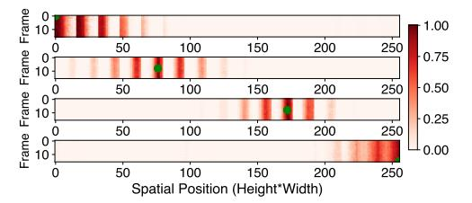
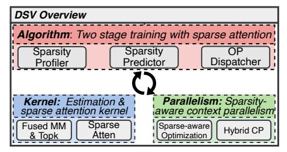

# Observation 4: Sparsity also varies over the course of training before stabilizing.

As illustrated in Figure 7, sparsity of different heads becomes more pronounced as training progresses. For block 24, the average attention sparsity for each head increases from 0.30 to 0.78. Further, Figure 8 shows that across all attention blocks, the median sparsity increases from 0.81 at 50k iterations to 0.92 at 300k iterations. This dynamic evolution of sparsity during training suggests that the strategy for leveraging sparsity should be adjusted dynamically: As the model learns to focus on the most relevant features, the attention mechanism becomes more selective, resulting in increased sparsity [46]. This highlights the importance of dynamic methods that can capture and exploit the evolving sparsity patterns throughout the training process.

Critical KV overlap ratio for adjacent tokens in 3D space. Finally, we demonstrate an interesting phenomenon between queries of adjacent tokens.

Observation 5: Adjacent tokens have similar critical KV pairs.

**Figure 9.** Critical KV pair overlap ratio between four anchor queries (green, at indices 0, 2124, 2220, 4095) with all queries in an attention block. Each subplot shows a 2D projection of the 3D video with rows representing flattened frames.

We quantify this phenomenon by measuring the overlap of critical KV indices across queries. Figure 9 is a case study with four anchor queries (in green), where darker shades indicate higher overlap ratios. Significant overlaps in critical KV indices are observed among adjacent tokens. For tokens within a  $2\times2\times2$  3D cube (shown as a 2D projection), the four anchor queries and their adjacent queries exhibit over 92.4% overlap in critical KV indices. On average, this overlap remains consistent at 80.1% across blocks. This aligns with the intuition that video pixels represent continuous signals, unlike discrete language signals, making adjacent tokens similar. It suggests neighboring queries tend to attend to similar KV pairs (though these KV pairs may not be close to the query as Obs.2 reveals), offering opportunities to optimize attention computation by leveraging the similarity in sparsity patterns among adjacent tokens.

#### 4 DSV Overview

Our empirical findings in §3 uncover inherent sparsity patterns in video DiT attention during training, some of which are different from sparsity in LLM inference for language tasks and have not been previously reported. Due to high sparsity, by computing only the most critical KV pairs, the overall computational burden of full attention can be significantly reduced, leading to more efficient training. Moreover, this reduction in KV computations also lowers communication overhead in large-scale settings, where KV data is frequently exchanged for context parallelism. Together, they highlight the potential for substantial end-to-end speedups by exploiting attention sparsity in video DiT training.

Building on this insight, we now discuss the unique challenges posed by these sparsity patterns and introduce the architecture of our solution, DSV.

#### 4.1 Challenges

Sparsity entails design challenges in three basic aspects of the training system: algorithm, kernel, and parallelism.

• Critical KV identification: Our first major challenge stems from the dynamic and uncertain distribution of critical KV pairs in video DiT training (Obs.2). Any fixed sparse attention pattern becomes impractical when the critical

Figure 10. DSV overview.

KV varies dramatically with changing context and/or training steps. While computing the complete attention score matrix (i.e.,  $\operatorname{softmax}(QK^T)$ ) and selecting the  $\operatorname{top-}k$  entries per query fully capture these changing distributions, it does not save any computation of the attention score. Moreover, this would disrupt the fused kernels such as FlashAttention [16, 17] with IO-awareness optimization, limiting the sparsity benefits to only the score-value (AV) computation, ultimately degrading overall performance.

- Efficient sparse attention computation: Even if the attention scores are available for identifying critical KVs, performing top-k selection at scale introduces considerable implementation hurdles. Specifically, the attention score tensor has a shape of [H, S, S], where H is the number of heads and S is the sequence length, which can easily reach up to 100K. Saving such large tensors alone requires excessive GPU memory. Furthermore, following top-k selection, each query might access a very sparse set of KV entries in an irregular and scattered pattern. This irregularity can degrade parallel efficiency especially in memory access and result in low use of SM resources, making it difficult to fully reap the gains from sparsity.
- Re-visiting context parallelism: The last challenge emerges when training with long video sequences that must be distributed across devices. Existing context parallelism (CP), head-wise and sequence-wise, would fail to work efficiently once sparsity is introduced. Head-wise CP can become problematic when certain heads exhibit higher degrees of sparsity than others (Obs.3), creating load imbalances and stragglers. Moreover, standard sequence-wise CP often transfers all KV pairs among devices without considering which ones are critical [34], unnecessarily increasing communication overhead. As a result, we need to overhaul the parallelization strategy to account for the idiosyncrasies due to sparsity.

#### 4.2 DSV Architecture and Workflow

DSV addresses the three challenges with three key designs as summarized in Figure 10.

• Algorithm: Two-stage training with low-rank QKestimation. At the core of DSV lies an efficient low-rank estimation of query and key to approximate the attention score. Two low-rank matrices are trained for each attention module to approximate  $QK^T$  (separate from FlashAttention). These matrices enable identification of critical KV pairs without fully computing attention scores or modifying FlashAttention kernels. DiT training then becomes a two-stage process: in the first stage these low-rank matrices, called *sparsity predictors* hereafter, are continuously learned until their approximation is accurate enough, and all attention is computed in full. Then we enter the second stage: in each step, when the sparsity level exceeds a threshold, we perform sparse attention over the critical KV pairs found by the low-rank estimations.

- Kernel: Critical KV estimation and sparse attention. To overcome the second challenge and maximize the benefits of sparse training, DSV introduces optimized kernels tailored for critical KV estimation and sparse attention. Specifically, a fused kernel calculates the approximate attention scores using learned low-rank matrices and performs top-k selection at the desired sparsity level in a single pass to minimize intermediate memory consumption. Additionally, DSV adopts a sparse attention kernel with query grouping to enhance memory access and computation parallelism, as queries that are close in position often share similar critical KVs as noted in Obs.5.
- Parallelism: Sparsity-aware context parallelism. Lastly, DSV leverages sparsity-aware context parallelism (CP) strategies to dynamically adapt to varying sparsity levels across different attention blocks and heads. It introduces new optimizations for sparse settings, including head-wise workload reallocation for standard head-wise CP and selective KV gathering for seq-wise CP. Further, DSV determines the optimal hybrid parallelism configuration for each attention block based on its head-wise sparsity patterns. By jointly optimizing computational load balancing (mitigating inefficiencies from sparsity-induced workload imbalances) and communication overhead across paradigms, it ensures optimal performance when parallelizing large video inputs.

