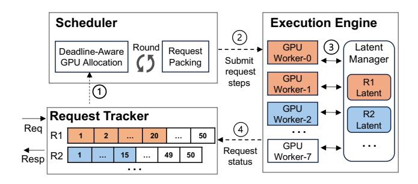
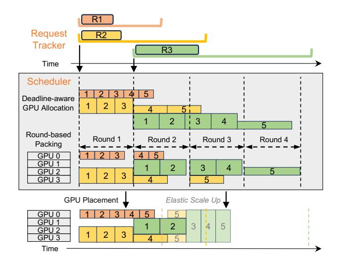

# 2.3 Challenges and Opportunities

Limitations of Current Solutions. Conventional serving strategies using a fixed degree of parallelism are ill-suited for the heterogeneous nature of DiT workloads, a limitation illustrated in the toy example in Figure 1. With data parallelism (xDiT, SP=1), the small request meets its deadline, but the larger requests fail due to insufficient processing speed. Conversely, a high fixed degree of parallelism (xDiT, SP=4)

<span id="page-3-1"></span>

(a) Fixed Degree Performance

(b) Breakdown by Resolution

**Figure 4.** Performance of fixed degree xDiT variants under the Uniform workload. (a) The overall SLO Attainment Ratio (SAR) is low for all fixed strategies. (b) The spider plot, shown for a representative arrival rate of 12 req/min, reveals the underlying reason: low SP degrees fail on large resolutions, while high SP degrees perform poorly on small ones.

handles the large request well, but it still misses the deadline (along with the medium one) due to head-of-line blocking and inefficient resource use of the small request.

Experimental results confirm this trade-off. As shown in Figure 4a, under a Uniform workload with a tight SLO Scale of 1.0×, no fixed-parallelism strategy achieves an SLO Attainment Ratio (SAR) above 0.6. The spider plot in Figure 4b reveals why: each fixed strategy only works well for specific resolutions. SP=1 and SP=2 achieve near-perfect SAR for  $256 \times 256$  images but fail completely for  $2048 \times 2048$ , while SP=4 and SP=8 handle  $2048 \times 2048$  effectively but perform poorly on smaller resolutions due to scaling inefficiency and head-of-line blocking. No single parallelism degree works across the board.

Optimization Opportunities. The limitations of fixed parallelism highlight a key opportunity: moving to dynamic, step-level sequence parallelism. As shown in Figure 1(c), our approach, TetriServe, meets all three deadlines by adapting the degree of parallelism for each request at the step level. It assigns fewer GPUs to the initial steps of the medium request, freeing up resources, and then scales up to meet the deadline, thus avoiding the rigid trade-offs of fixed strategies.

This flexibility to adjust the sequence parallelism degree *per step* allows a scheduler to allocate more GPUs when deadlines are tight and fewer when they are not, freeing capacity for other requests. By exploiting DiTs' predictable step execution times and heterogeneous scaling behavior, this approach enables finer-grained resource shaping and better SLO attainment than conventional fixed-SP policies.

**Insight 3:** Step-level parallelism adapts GPU allocation to request deadlines, avoiding the resource waste of fixed parallelism and improving SLO attainment.

<span id="page-4-1"></span>

Figure 5. TetriServe architecture and request lifecycle.

### 3 TetriServe Overview

TetriServe allows more DiT serving requests with heterogeneous output resolutions to meet their SLOs by judiciously scheduling and packing them on shared GPU resources. In this section, we provide an overview of how TetriServe fits in the DiT serving lifecycle to help the reader follow the subsequent sections.

**System Components.** TetriServe is designed around a scheduler that makes deadline-aware GPU allocation decisions in a round-based manner. Its key components are:

- Request Tracker: Maintains metadata on active requests, including resolutions, deadlines, and execution states (e.g., remaining steps).
- Scheduler: The core component consists of deadlineaware GPU allocation and round-based request packing. At every round, it minimizes individual requests' GPU consumption while maximizing SLO attainment.
- Execution Engine: A distributed pool of GPU workers that execute assigned diffusion steps in parallel.
- Latent Manager: Handles intermediate latent representations across steps, reducing redundant computation and memory overhead.

Together, these components enable TetriServe to adapt resource allocation at millisecond scale, sustaining high throughput and SLO attainment for heterogeneous DiT workloads.

Request Lifecycle. When a request arrives, the Request Tracker records its resolution, state, and deadline. The Scheduler then places it into the next scheduling round ①, where a deadline-aware policy determines GPU allocations in terms of step numbers for each request for one round. For example, in Figure 5, it selects Request 1 to run 20 steps on 2 GPUs (orange) and Request 2 to run 15 steps on 1 GPU (blue) for the scheduling round. Different requests are dispatched to GPU workers in the Execution Engine ②, which compute diffusion steps and produce intermediate latents managed by the Latent Manager ③. Upon completion, workers notify the request tracker to update dependent steps ④. After all steps finish, the final output is returned to the user.

## 4 Deadline-Aware Round-Based Scheduler

TetriServe introduces a deadline-aware scheduler designed to optimize SLO attainment for DiT serving. We begin with a formal definition of the GPU scheduling problem in the offline scenario and prove that it is NP-hard. We then propose a *round-based scheduling mechanism*, which maximizes goodput via minimizing GPU-hour consumption for each request. Later we proposes enhancements so that TetriServe balances utilization, latency, and scalability in DiT serving.

### <span id="page-4-0"></span>4.1 Problem Statement

Given a collection of GPUs and requests, the DiT serving objective for each invocation of the scheduler is the following: Find a step-level schedule that maximizes the number of requests meeting their deadlines given a fixed number of GPUs.

**Problem Formulation.** Consider an N-GPU cluster and R outstanding requests. Each request  $req_i$  consists of a sequence of  $S_i$  dependent diffusion steps  $\{s_{i1}, s_{i2}, \ldots, s_{iS_i}\}$ . Each step  $s_{ij}$  can be executed using  $k \in \{1, 2, 4, \ldots, N\}$  GPUs, where k is a power of two. The execution time of a step, denoted  $T_{ij}(k)$ , is a function of k. The completion time of a request is defined as:

$$C_i = \sum_{i=1}^{S_i} [Q_{ij} + T_{ij}(A_{ij})],$$

where  $Q_{ij}$  is the queuing delay before step  $s_{ij}$  begins and  $A_{ij}$  is the number of GPUs allocated. Then we can formulate the DiT serving objective as:

Maximize 
$$\sum_{i=1}^{R} I_i, \text{ where } I_i = \begin{cases} 1 & \text{if } C_i \leq D_i, \\ 0 & \text{otherwise.} \end{cases}$$

This formulation is subject to the following conditions:

1. **Step Dependency**: A step  $s_{ij}$  can start only after the previous step completes:

$$Start(s_{ij}) \ge Completion(s_{i(i-1)}). \quad \forall i, \forall j > 1$$

Therefore, at most one step of a request can be executed at any time.

2. **GPU Capacity**: At any time, the total number of GPUs allocated across all steps cannot exceed *N*:

$$\sum_{i=1}^{R} \sum_{i=1}^{S_i} A_{ij}(t) \le N, \quad \forall t$$

where  $A_{ij}(t)$  denotes the GPUs allocated to step  $s_{ij}$  if it is running at time t, and zero otherwise.

The goal is to find a set of GPU assignments  $\{A_{ij}\}$  that maximizes the number of requests meeting their deadlines.

**NP-hardness.** To highlight the computational complexity, we consider the special case where each request has a single non-preemptive step  $(S_i = 1)$ . Time is discretized into slots  $\mathcal{T} = \{0, 1, \ldots, T_{\text{max}} - 1\}$ . Let  $\mathcal{K} = \{1, 2, 4, \ldots, N\}$  denote the

Table 2. Notations used in the GPU Scheduling Problem.

| Symbol      | Description                                    |
|-------------|------------------------------------------------|
| N           | Total number of GPUs.                          |
| R           | Number of requests.                            |
| $S_i$       | Number of steps in request $req_i$ .           |
| $D_i$       | Deadline of request $req_i$ .                  |
| $T_{ij}(k)$ | Execution time of step $s_{ij}$ with $k$ GPUs. |
| $Q_{ij}$    | Queueing delay before step $s_{ij}$ starts.    |
| $A_{ij}$    | GPU allocation for step $s_{ij}$ .             |
| $C_i$       | Completion time of request $req_i$ .           |

allowed GPU allocations. For each request i, start time  $t \in \mathcal{T}$ , and GPU count  $k \in \mathcal{K}$ , introduce a binary decision variable:

$$x_{i,t,k} = \begin{cases} 1 & \text{if request } i \text{ starts at time } t \text{ with } k \text{ GPUs,} \\ 0 & \text{otherwise.} \end{cases}$$

**Objective.** Maximize the number of requests completing by their deadlines:

$$\max \sum_{i} \sum_{t \in \mathcal{T}} \sum_{k \in \mathcal{K}} x_{i,t,k}.$$

Constraints.

$$\sum_{t \in \mathcal{T}} \sum_{k \in \mathcal{K}} x_{i,t,k} \le 1, \qquad \forall i, \tag{1}$$

$$arrival\_time(i) \le t, \quad \forall i,$$
 (2)

$$t + T_i(k) \le D_i, \quad \forall i, t, k,$$
 (3)

$$\sum_{i} \sum_{k \in \mathcal{K}} \sum_{u \in [t, t+T_{i}(k)-1]} k \cdot x_{i,t,k} \leq N, \qquad \forall t, u \in \mathcal{T}, \quad (4)$$

$$x_{i,t,k} \in \{0,1\}, \quad \forall i, t, k.$$
 (5)

Constraint (1) ensures each request starts at most once. Constraints (2) and (3) enforce arrival times and deadline feasibility. Constraint (4) enforces that at any time slot u, the sum of GPUs assigned to running requests does not exceed system capacity N. Constraint (5) enforces integrality.

This Zero-one Integer Linear Program (ZILP) exactly captures the offline DiT serving problem in the single-step case, where  $I_i = \sum_{t \in \mathcal{T}} \sum_{k \in \mathcal{K}} x_{i,t,k}$ . We show in Appendix A that solving such formulations is NP-hard [5, 14, 19, 32, 45]. Therefore, **multi-step DiT serving is NP-hard** as well.

## 4.2 Round-Based Scheduling

Step-level scheduling for DiT serving is NP-hard, making global optimization expensive. To enable practical scheduling, TetriServe adopts a round-based heuristic: instead of scheduling steps arbitrarily in a continuous global timeline, we discretize execution into rounds, where each round corresponds to a fixed-length GPU execution window. This allows us to (i) limit the scheduling search space and (ii) enable efficient preemption between rounds. Within each round, TetriServe determines the minimal required GPU allocation for

requests and dynamically packs these requests to maximize SLO attainment ratio.

**4.2.1 Deadline-Aware GPU Allocation.** Exhaustively enumerating GPU allocations for each step is infeasible, and over-allocation wastes resources due to scaling inefficiencies in DiT models (e.g., kernel launch and communication overheads). While more GPUs reduce latency, they increase total GPU hours. To balance these trade-offs, TetriServe identifies the minimal GPU allocation needed for each request to meet its deadline at the beginning of each round. Since required allocation depends mainly on resolution and deadline, this approach avoids exploring the full allocation space.

For a step  $s_{ij}$ , the execution time  $T_{ij}(k)$  is a function of the number of GPUs k. The GPU hour for executing step  $s_{ij}$  with k GPUs is  $k \times T_{ij}(k)$ . The goal is to minimize the total GPU hour for each request:

$$\min_{\{A_{ij}\}} \ \sum_{j=1}^{S_i} \left(A_{ij} \times T_{ij}(A_{ij})\right) \quad \text{s.t.} \quad \sum_{j=1}^{S_i} \left(Q_{ij} + T_{ij}(A_{ij})\right) \leq D_i$$

where  $A_{ij}$  is the GPU allocation for step  $s_{ij}$ .

Offline Profiling for Cost Model. To make the optimization tractable, TetriServe profiles execution times offline. For every step type  $s_{ij}$  and GPU count  $k \in \{1, 2, 4, ..., N\}$ , we measure the actual execution time  $T_{ij}(k)$ . From this, we derive the GPU hour  $k \times T_{ij}(k)$  and store it in a lookup table. At runtime, TetriServe simply enumerates candidate GPU assignments using these pre-profiled values.

The above process aims to assign each request the minimum number of GPUs required to meet its deadline while minimizing the total GPU hours. Figure 6 illustrates this process with a concrete example: three requests (R1–R3), each with five steps, arrive over time. R1 has a small resolution (e.g., 256) and is fixed at SP=1 since higher parallelism would reduce efficiency (see Figure 3). For R2 and R3, TetriServe identifies GPU allocations with two parallelism degrees that just meet their deadlines while minimizing overall GPU usage. The GPU allocations produced by this selection serve as the input to the subsequent request packing stage, where TetriServe schedules requests across GPUs to maximize goodput.

**4.2.2 Request Packing.** The objective of scheduling is to maximize the number of requests that complete before their deadlines. To make the problem tractable, we approximate it by minimizing the number of requests that become *definitely late*—those that cannot meet their deadlines even under maximal parallelism if not advanced in the current round. Deadline-aware GPU allocation determines the minimal GPU allocations needed for each request to meet its deadline while minimizing GPU hours. This makes it possible to pack more requests into each round and thereby reduce the number that would otherwise be definitely late.

<span id="page-6-0"></span>

**Figure 6.** Illustration of TetriServe's scheduling process. The progression is shown from top to bottom: each row represents an intermediate scheduling step, while the final row shows the actual GPU allocation decision. Time is fixed across rows.

After deadline-aware GPU allocation, each request  $req_i$  is described by a set of allocations  $(s_i^m, A_i^m)$ , where  $s_i^m$  is the number of steps executed with allocation  $A_i^m$ , and per-step times  $T_i(A_i^m)$  are obtained from the cost model. To schedule requests across N GPUs, TetriServe divides time into rounds of fixed duration  $\tau$ , which serves as the scheduling granularity. The choice of  $\tau$  balances overhead and responsiveness: shorter rounds allow finer-grained preemption and more adaptive scheduling, while longer rounds reduce overhead but make scheduling coarser.

At the beginning of each round r (time  $t_r$ ), the scheduler considers all pending requests and their allocations, and decides which to place within the N GPUs. Within a round of duration  $\tau$ , if GPU allocation m of request i is chosen, the number of steps that can complete is

$$q_i^m = \min \left\{ s_i^m, \left\lfloor \frac{\tau}{T_i(A_i^m)} \right\rfloor \right\}.$$

Options with  $q_i^m = 0$  are discarded to avoid wasting resources. Choosing option  $o \in \{\text{none}, 1, 2, ...\}$  updates the remaining steps as

$$\tilde{s}_i^m(o) = s_i^m - \mathbb{I}[o = m] q_i^m$$

clipped at zero, where  $\mathbb{I}[o=m]$  equals 1 if o=m and 0 otherwise. The next round begins at  $t_{r+1}=t_r+\tau$ .

To decide which requests must be scheduled *now*, we identify those that would become *definitely late* at  $t_{r+1}$  if not advanced in this round. Using the fastest possible step time  $T_i^{\min} = \min_{k \in \{1,2,4,\dots,N\}} T_i(k)$ , we define the *residual completion time lower bound* under option o as

$$LB_i(o) = \left(\sum_{m} \tilde{s}_i^m(o)\right) T_i^{\min},$$

```
Algorithm 1: DP Round Scheduler
    Input: Pending requests R with \{(s_i^m, A_i^m)\}_{m \in \mathcal{M}_i}
                  and T_i(\cdot); capacity N; round length \tau;
                  current time t_r
    Output: Selected plan
 1 \ t_{r+1} \leftarrow t_r + \tau
 2 foreach i \in R do
          foreach m \in \mathcal{M}_i do
           4
          T_i^{\min} \leftarrow \min_{k \in K} T_i(k)
 5
          O_i \leftarrow \{\mathsf{none}\} \cup \{m \in \mathcal{M}_i \mid q_i^m > 0 \land A_i^m \leq N\}
 6
          foreach o \in O_i do
               foreach m \in \mathcal{M}_i do
 8
                |\tilde{s}_i^m(o) \leftarrow s_i^m - \mathbb{I}[o=m] \cdot q_i^m
               LB_i(o) \leftarrow \left(\sum_{m \in \mathcal{M}_i} \tilde{s}_i^m(o)\right) T_i^{\min}
10
               \mathrm{sv}_i(o) \leftarrow \mathbb{I}[\ t_{r+1} + \mathrm{LB}_i(o) \leq D_i\ ]
11
               w_i(o) \leftarrow 0 \text{ if } o = \text{none else } A_i^o
13 Initialize dp[0..N] \leftarrow -\infty, dp[0] \leftarrow 0
14 foreach i \in R do
          next[0..N] \leftarrow dp
15
          for c = 0 to N do
16
17
               foreach o \in O_i do
                     if w_i(o) \le c then
18
                          next[c] \leftarrow
                             \max\{\text{next}[c], \text{dp}[c-w_i(o)] + \text{sv}_i(o)\}
         dp \leftarrow next
```

<span id="page-6-3"></span><span id="page-6-2"></span>20

where  $\tilde{s}_{i}^{m}(o)$  is the updated step count. A request survives only if

$$t_{r+1} + LB_i(o) \leq D_i$$
.

Each option o consumes  $w_i(o)$  GPUs:  $w_i(\mathsf{none}) = 0$ ,  $w_i(m) = A_i^m$ . The per-round scheduling problem is therefore to select at most one option per request, with total GPU  $\leq N$ , maximizing the number of requests that survive to the next round. For requests that have already missed their deadlines, we assign at most one GPU in a best-effort manner without impacting other requests, and scale them up later if idle GPUs become available. By anchoring scheduling decisions on the round duration  $\tau$ , TetriServe balances preemption overhead and responsiveness, while ensuring urgent requests receive priority.

**Dynamic Programming.** Naively enumerating all perrequest options  $O_i$  for feasible packings within a round is exponential in the number of requests and quickly becomes intractable. We observe that the per-round decision has the *group-knapsack* structure: for each request i (a group), we

must choose at most one option o (run one of its GPU allocation this round or none), each option consumes width (GPUs) and yields a binary "survival" value indicating whether the request is *not definitely late* at the next round start. This lets us replace exhaustive search with a dynamic program (DP) that maximizes the number of surviving requests under the round capacity N.

Concretely, the DP state  $\mathrm{dp}[c]$  stores, after processing the first i requests, the maximum number of surviving requests achievable with exactly capacity  $c \in \{0, \ldots, N\}$  consumed in the current round. For request i, we build its option set  $O_i$  once (group constraint): none (consume zero GPUs, no progress) and one option per allocation m that can make progress in this round, i.e.,  $q_i^m = \left\lfloor \tau/T_i(A_i^m) \right\rfloor > 0$  and  $A_i^m \leq N$ . For each option  $o \in O_i$ , we compute:

- 1. **Line 9:** the updated remaining steps  $\tilde{s}_{i}^{m}(o)$ .
- 2. **Line 10:** a conservative lower bound  $LB_i(o)$  on the residual processing time from  $t_{r+1} = t_r + \tau$ .
- 3. **Line** 12: its width  $w_i(o)$  (0 for none,  $A_i^m$  for allocation m).

We then set the survival indicator  $\operatorname{sv}_i(o) = \mathbb{I}[t_{r+1} + \operatorname{LB}_i(o) \le D_i]$ . The DP transition iterates options once per request (respecting the group constraint) and, for each capacity c, admits only options with  $w_i(o) \le c$  (respecting the capacity constraint):

$$\operatorname{next}[c] \leftarrow \max \left\{ \operatorname{next}[c], \operatorname{dp}[c - w_i(o)] + \operatorname{sv}_i(o) \right\}.$$

Using a rolling array yields O(N) space. Since each request contributes at most  $|O_i|$  options, DP runs in O(RN) time and O(N) space per round (rolling array), which is tractable even at millisecond-scale rounds for moderate N. This is orders of magnitude cheaper than enumerating all feasible packing combinations.

**Round Duration.** Algorithm 1 schedules in fixed-length rounds of duration  $\tau$ . The choice of  $\tau$  balances two factors: short rounds reduce admission delay for new requests but increase scheduling frequency, while long rounds amortize scheduling cost but risk larger queueing delay and deadline misses. For a given GPU configuration (e.g., NVIDIA H100), TetriServe adapts  $\tau$  to the step execution times of requests across different resolutions, so that requests with heterogeneous step lengths can finish around the same round boundary. This minimizes idle bubbles while keeping  $\tau$  short enough to avoid excessive queueing delay. In practice, we determine  $\tau$  by the *step granularity*, which means each round executes multiple diffusion steps. We will further discuss the impact of round duration in the evaluation section (§6.4).

**4.2.3 Efficient GPU Placement and Allocation.** In the round-based framework (Algorithm 1), TetriServe improves efficiency via two complementary steps: *placement preservation* and *work-conserving elastic scale-up*, illustrated in Figure 6. First, to avoid idle bubbles between rounds, TetriServe

adopts a placement-aware policy: requests continue on the same GPUs across consecutive rounds whenever possible. This eliminates state-transfer delays and ensures immediate progress at round boundaries.

Second, any GPUs left idle after placement are reclaimed through a work-conserving elastic scale-up policy. Requests with sufficient remaining steps are granted additional GPUs if  $T_i(k_i') < T_i(k_i)$ , prioritizing those that benefit most from parallelism. This ensures no GPU remains unused within a round, reducing future load and improving deadline satisfaction. Together, placement preservation minimizes interround stalls, while elastic scale-up guarantees work-conserving allocation within each round.

