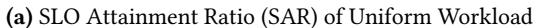
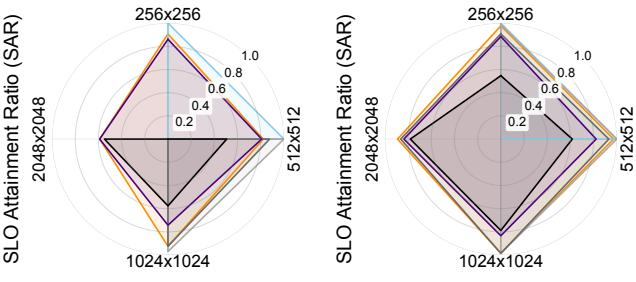
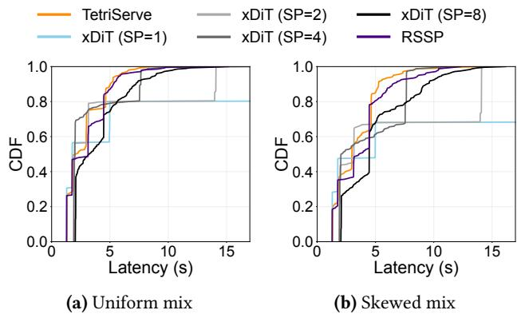
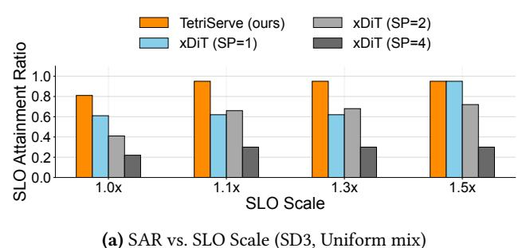
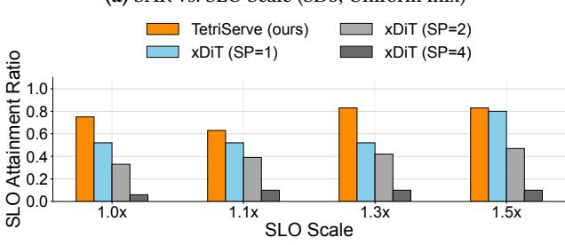

# 5 Implementation

TetriServe is implemented in 5,033 lines of Python and C++ code. We reuse components from existing solutions, including the sequence parallelism engine from xDiT [12], async logic from vLLM [20], and process launcher from MuxServe [11] and SGLang [47].

**Scheduler.** The scheduler's core decision loop is implemented in C++ and exposed via lightweight bindings, achieving millisecond-level control-plane latency.

VAE Decoder Sequential Execution. The VAE decoder imposes a large activation-memory footprint at high resolutions and batch sizes, whereas its wall-clock cost is very small relative to diffusion steps. Accordingly, we adopt sequential per-request decoding to bound peak memory by avoiding concurrent decoder activations across a batch. Because the decoder is largely off the critical path, this design does not increase end-to-end latency. The reduced peak usage also increases headroom for model state and communication buffers, lowering the risk of out-of-memory failures under mixed workloads.

**Communication Process Groups Warmup.** We precreate process groups for all relevant combinations of devices (e.g.,  $\binom{8}{k}$ ) groups for degrees  $k \in \{1, \dots, 8\}$ ). Creating the group itself is lightweight and does not materially consume GPU memory. However, the *first* invocation on a group initializes NCCL [31] channels and allocates persistent device buffers for subsequent collectives. Proactively warming *every* group therefore inflates memory usage and can exceed available HBM. To balance startup latency and memory footprint, we warm only a compact set of commonly used, overlapping groups (e.g., [0,1,2,3], [0,2,3,4]) and defer others to on-demand warmup. Empirically, this strategy preserves performance while maintaining low peak memory.

*Latent Transfer.* Because TetriServe executes at step granularity, intermediate latents and lightweight metadata

must be handed off across GPU groups. We provide a Future-like abstraction for latents that enables asynchronous, non-blocking transfer between steps. Latent tensors are compact (in the compressed latent space), so transfer overhead is negligible; consequently, the scheduler excludes latent-transfer time from deadline accounting. We quantify this overhead in Section 6.4 and show it remains below 0.05% of per-step latency across all configurations.

Selective Continuous Batching. Batching in diffusion inference is only effective for identical, small-resolution requests that would otherwise underutilize GPUs. This creates a throughput-latency trade-off. Our scheduler employs a selective, step-level batching strategy that only groups requests if their SLOs are not compromised, thus improving resource utilization without harming latency.

### 6 Evaluation

We evaluate TetriServe against state-of-the-art baselines across diverse workloads. Key findings:

- TetriServe outperforms baselines by up to 32% across all resolutions (§6.2).
- TetriServe is robust to bursty arrivals and adapts to changing resolution mixes (§6.3).
- Sensitivity analysis confirms TetriServe's advantage holds across varying arrival rates, step granularities, and homogeneous workloads (§6.4).
- Ablation studies show that GPU placement preservation and elastic scale-up are crucial to TetriServe's performance (§6.5).

#### 6.1 Methodology

Testbed. We conduct experiments on two GPU clusters. The first comprises nodes with 8 NVIDIA H100-80GB HBM3 GPUs interconnected via NVLink 4.0 (900 GB/s inter-GPU bandwidth). The second features nodes with 4 NVIDIA A40-48GB GPUs connected in pairs via NVLink and interfaced to the host via PCIe 4.0. Our software environment is based on NVIDIA's NGC container with CUDA 12.5, NCCL 2.22.3 [31], PyTorch 2.4.0 [46], and xDiT [12] (git-hash 8f4b9d30).

Models and Metrics. We select FLUX.1-dev [21] and Stable Diffusion 3 Medium (SD3) [3] as representative models, evaluating them on H100 and A40 clusters, respectively. We report SLO Attainment Ratio (SAR; fraction of requests finishing within SLO) as our primary metric and plot end-to-end latency CDFs to show the latency distribution.

Baselines. We compare TetriServe against:

- **xDiT** (**SP=1**/2/4/8**).** Fixed sequence parallelism degree; each request uses a constant number of GPUs.
- **Resolution-Specific SP (RSSP).** Selects the best SP degree per resolution via offline profiling: SP=1 for 256 × 256

and  $512\times512$ , SP=2 for  $1024\times1024$ , and SP=8 for  $2048\times2048$ . Represents an oracle static configuration.

**SLO Settings.** We adopt resolution-specific latency targets grounded in user-perceived responsiveness. Prior research [1] reports that 63% of users prefer a maximum response delay of 5 seconds in interactive settings. Accordingly, we cap the target at 1.5 seconds for small images and set an upper bound of 5.0 seconds for the largest resolution: (256, 256) = 1.5 s, (512, 512) = 2.0 s, (1024, 1024) = 3.0 s, and (2048, 2048) = 5.0 s. We sweep SLO Scale from  $1.0 \times$  to  $1.5 \times$  relative to each resolution's baseline.

**Workload and Dataset.** We sample 300 prompts from DiffusionDB [42] to generate requests. By default, requests arrive as a Poisson process at 12 requests/minute.

We consider two resolution mixes:

- Uniform: equal number of requests across resolutions {256, 512, 1024, 2048}.
- *Skewed*: resolutions sampled with exponential weight over latent length,  $p_i \propto \exp(\alpha \cdot L_i/L_{\max})$ , with  $\alpha = 1.0$  and  $L_i = (H_i \cdot W_i)/16^2$ , biasing toward larger resolutions.

#### 6.2 End-to-End Performance

TetriServe Improves SAR.. Figures 7 and 8 show the end-to-end SLO Attainment Ratio (SAR) of TetriServe compared to fixed-parallelism baselines for FLUX on H100s for both the Uniform and Skewed workload mixes at an arrival rate of 12 requests per minute. As shown in Figures 7a and 8a, TetriServe consistently achieves the highest SAR across all SLO scales and both workload distributions. This demonstrates the effectiveness of its step-level parallelism control and request packing, which allow it to dynamically adapt to the workload and outperform the rigid strategies of the baselines.

On average, TetriServe outperforms the best fixed parallelism strategy by 10% for the Uniform mix and 15% for the Skewed mix. The performance gap is particularly pronounced at tighter SLOs. For instance, with an SLO scale of 1.1× in the Uniform mix, TetriServe outperforms the best baseline by 28%. Similarly, in the Skewed mix with a 1.2× SLO scale, TetriServe's SAR is 32% higher than the best-performing fixed strategy.

Notably, this advantage holds even when compared against RSSP, a strong per-resolution baseline that selects the best fixed parallelism degree for each input resolution. Despite this, RSSP remains fundamentally limited by its lack of deadline awareness and runtime adaptation, whereas TetriServe dynamically adjusts parallelism at the step level to meet per-request SLOs. This highlights TetriServe's superior performance under challenging, tightly constrained Workloads.

*TetriServe Benefits All Resolutions.* TetriServe's strength lies in its ability to deliver high SAR across all request resolutions, unlike fixed strategies that only excel at specific

**(b)** Uniform, SLO Scale=1.0× **(c)** Uniform, SLO Scale=1.5×

**Figure 7.** End-to-end performance on the Uniform workload at 12 req/min. **(Top)** TetriServe achieves the highest SLO Attainment Ratio (SAR) across all SLO scales. **(Bottom)** The spider plots show that xDiT variants only perform well for specific resolutions, TetriServe delivers high SAR across all resolutions no matter tight or loose SLO Setting.

ones. The spider plots in the bottom row of Figures 7 and 8 break down SAR by resolution. With a relaxed SLO of  $1.5\times$  (Figures 7c and 8c), TetriServe achieves near-perfect SAR across all resolutions for both workload mixes, consistently outperforming all xDiT baselines. Under the tightest SLO of  $1.0\times$  (Figures 7b and 8b), TetriServe provides the best overall performance. While some fixed-parallelism strategies may marginally outperform TetriServe on a single resolution (e.g., xDiT SP=1 on 256px), they perform poorly on others. In contrast, TetriServe dynamically adapts its parallelism, providing high SAR across the entire spectrum of resolutions.

Conceptually, RSSP is a restricted variant of TetriServe in which the scheduler cannot adjust parallelism beyond a fixed configuration. Since RSSP explores only a subset of TetriServe's decision space, it cannot exploit additional parallelism for deadline-critical requests, resulting in uniformly lower SAR across resolutions. In contrast, TetriServe avoids over parallelization for less urgent requests and prioritizes more GPU resources for more urgent requests, thus performing well on all resolutions.

**Tail Latency.** Figure 9 plots the CDF of end-to-end request latency under the tightest SLO setting (SLO scale =  $1.0\times$ ) for both the Uniform and Skewed mixes. We compute the CDF over completed requests only, i.e., requests

(a) SAR of Skewed Workload

(b) Skewed, SLO Scale=1.0×

(c) Skewed, SLO Scale= $1.5 \times$ 

**Figure 8.** End-to-end performance on the Skewed workload at 12 req/min. **(Top)** TetriServe again achieves the highest SLO Attainment Ratio (SAR) across all SLO scales. **(Bottom)** The spider plots confirm that TetriServe's adaptive parallelism provides robust performance across all resolutions, even in a workload dominated by large images

that finish execution at least once (those that miss the deadline and are dropped/timeout are excluded from the latency distribution). Across both workload mixes, TetriServe produces a consistently more favorable tail distribution than fixed-parallelism baselines and RSSP. Compared to fixed SP baselines, TetriServe shifts the latency distribution left and reaches high completion probability at lower latency, indicating that most served requests finish quickly even under strict deadlines. Compared to RSSP, which restricts scheduling to a smaller decision space, TetriServe further reduces tail latency by dynamically reallocating GPUs toward more urgent requests and avoiding over-parallelization on less critical ones. Overall, these results show that TetriServe improves not only SAR but also keep the steady long tail latency under tight SLO scale.

## Compatibility with Cache-Based Diffusion Accelera-

*tion.* TetriServe is orthogonal and compatible with cachebased diffusion acceleration techniques. To demonstrate this, we integrate Nirvana [2] into our system. Nirvana accelerates diffusion inference by reusing intermediate denoising latents from prior requests. Each incoming prompt is embedded using CLIP [35] and matched against a cache of previously served prompts. Based on prompt similarity, the system determines how many initial diffusion steps can be skipped, yielding an effective diffusion length of N − k steps, where

**Table 3. SAR with Nirvana Integration.** SLO Attainment Ratio (SAR) under uniform and skewed workload mixes (12 req/min, SLO Scale =  $1.0\times$ ). TetriServe combined with Nirvana [2] achieves the highest SAR by jointly exploiting cache-based step reduction and adaptive GPU parallelism.

| Workload | RSSP | TetriServe | RSSP + Nirvana | TetriServe + Nirvana |
|----------|------|------------|-------------------|-------------------------|
| Uniform  | 0.32 | 0.42       | 0.77              | 0.88                    |
| Skewed   | 0.04 | 0.19       | 0.53              | 0.75                    |

**Figure 9. End-to-end latency CDF under strict SLOs** (FLUX on H100, SLO scale = 1.0×). TetriServe shows more consistent and better tail latency distribution than other baselines under strict SLO settings. The x-axis is truncated at 17s for readability; the SP=1 baseline has a much heavier tail beyond this range.

 $k \in \{5, 10, 15, 20, 25\}$  and N = 50 by default. We warm up the cache using the first 10K requests and then maintain a fixed-size cache with LRU eviction for online requests.

Table 3 compares four configurations: RSSP, TetriServe, RSSP combined with Nirvana, and TetriServe combined with Nirvana, under both Uniform and Skewed mix workloads under the SLO Scale of 1.0×. While Nirvana alone substantially improves SLO attainment by reducing per-request computation, it does not address resource fragmentation caused by heterogeneous request resolutions. By contrast, TetriServe further improves SLO attainment by dynamically adjusting GPU parallelism to match the reduced and variable step counts introduced by caching. As a result, the combined system achieves the highest SLO attainment across both mixes, confirming that cache-based step reduction and TetriServe's scheduling operate on complementary and orthogonal dimensions.

## 6.3 Performance Stability under Bursty Traffic

TetriServe maintains a high and stable SAR even under bursty arrival patterns, whereas fixed-parallelism approaches exhibit significant performance oscillations. For instance, Figure 10 plots the SAR over time for the Uniform mix (12

**Figure 10.** Performance stability under the Uniform workload at 12 req/min with a 1.5x SLO Scale. TetriServe maintains a high and stable SLO Attainment Ratio (SAR) over time, which handles burstiness well.

**Figure 11.** Average parallel degree of TetriServe during serving under the Uniform workload (1.5× SLO Scale). TetriServe dynamically adjusts sequence parallelism (SP) per request, assigning more GPUs to intensive requests (longer bars) to meet deadlines.

req/min, SLO Scale=1.5×). TetriServe's SAR remains consistently high with low variance. In contrast, the fixed xDiT variants suffer from periodic drops in SAR, a result of utilization bubbles and subsequent queueing delays when bursty arrivals create contention.

The key to TetriServe's stability is its ability to adapt the degree of sequence parallelism (SP) at the step level. As shown in Figure 11, when bursty arrivals create contention, TetriServe dynamically raises the SP degree for computationally intensive, urgent requests to shorten their critical path and reduce SLO violation risk. Conversely, it scales down the degree for less urgent requests steps while maintain SLO Attainment Ratio. This fine-grained, adaptive parallelism is how TetriServe handles burstiness and achieves superior efficiency and responsiveness compared to rigid, fixed-degree systems.

**Figure 12.** TetriServe's performance on the Stable Diffusion 3 (SD3) model. The plots show the SLO Attainment Ratio (SAR) as a function of SLO Scale for the Uniform mix (left) and Skewed mix (right) on 4×A40 GPUs. In both workloads, TetriServe consistently outperforms all xDiT variants

(b) SAR vs. SLO Scale (SD3, Skewed mix)

**Figure 13.** SLO Attainment Ratio vs. arrival rate under the Uniform mix (SLO Scale=1.0x). TetriServe gracefully handles increasing load, maintaining a high SAR.

## 6.4 Sensitivity Analysis

Different GPU Settings and Models. On SD3, trends align with FLUX. In both the Uniform mix (Figure 12a) and Skewed mix (Figure 12b), TetriServe achieves the highest SAR across all SLO scales, with the largest margins at tight SLOs (1.0×). As SLOs loosen, fixed SP2 and SP4 improve but remain below TetriServe, while fixed SP1 underutilize and plateau. This indicates the benefits generalize to a different DiT architecture. On the A40 cluster, NVLink links GPUs only in pairs; at SP=4, collectives traverse PCIe, and even at SP=2 poor placement can cross PCIe. For SD3 this communication path becomes the bottleneck, so SP2 and SP4 perform notably worse than on H100.

**Figure 14.** SLO Attainment Ratio for homogeneous workloads at 12 req/min with a 1.5x SLO Scale. Each group of bars represents a workload with only one resolution type. TetriServe consistently achieves the highest SAR across all resolutions.

**Figure 15.** Sensitivity of SLO Attainment Ratio to step granularity and arrival rate under the Uniform mix (SLO Scale=1.0x). A moderate granularity (5/10 steps) provides the most robust performance as system load increases, balancing scheduling flexibility and overhead.

Arrival Rate. Figure 13 shows the SAR of different scheduling strategies under the Uniform mix with a tight SLO of 1.0× as the arrival rate increases from 6 to 18 req/min. TetriServe demonstrates superior performance across the full range of arrival rates. At low-to-medium rates, TetriServe maintains a consistently high SAR, while fixed-parallelism strategies already show signs of degradation. At high arrival rates, where the system is under heavy load, TetriServe's SAR remains relatively high, showcasing graceful degradation.

Homogeneous Resolutions. To isolate the effect of input resolution on parallelism strategies, we evaluate homogeneous workloads containing only a single resolution. Figure 14 shows the SLO Attainment Ratio (SAR) for workloads consisting of only one resolution type at an arrival rate of 12 req/min and an SLO Scale of 1.5x. Even in these simplified scenarios, TetriServe still achieves the highest SAR across all resolution types. This demonstrates that TetriServe's adaptive scheduling is effective not only for mixed workloads but also for homogeneous ones, as it can still optimize resource allocation to better meet deadlines.

**Step Granularity.** We examine the impact of step granularity, which defines how frequently TetriServe can reschedule and change the degree of parallelism for an in-flight

**Table 4.** Latent transfer overhead as a percentage of inference step latency. Across all configurations, the overhead is negligible (< 0.05%).

| Batch Size | 256×256 | 512×512 | 1024×1024 | 2048×2048 |
|------------|---------|---------|-----------|-----------|
| BS = 1     | 0.03%   | 0.03%   | 0.04%     | 0.01%     |
| BS = 2     | 0.04%   | 0.03%   | 0.05%     | 0.02%     |
| BS = 4     | 0.04%   | 0.05%   | 0.03%     | 0.01%     |

request. This presents a fundamental trade-off: fine-grained control (e.g., every 1-2 steps) offers maximum flexibility at the cost of high scheduling overhead, while coarse-grained control (e.g., every 10 steps) minimizes overhead but creates longer, non-preemptible execution blocks that reduce adaptability. Figure 15 illustrates this trade-off under the Uniform mix (SLO Scale=1.0x) across different arrival rates. At low rates, performance is less sensitive to granularity. However, as load increases, a moderate granularity of 5 steps proves most robust, balancing adaptability and overhead. Very finegrained control (1 step) suffers from excessive overhead, while coarse-grained control (10 steps) is too inflexible to handle preemption, leading to lower SLO attainment.

Parallel Reconfiguration Overhead. TetriServe performs step-level scheduling, which requires transferring intermediate latent representations and metadata across GPU groups when parallelism changes between steps. Table 4 quantifies this parallel reconfiguration overhead as a percentage of per step inference latency across varying resolutions and batch sizes. We observe that the overhead is consistently negligible, accounting for at most 0.05% of step latency in all configurations. As a result, TetriServe's scheduler can safely ignore latent transfer time in deadline accounting without affecting SLO accuracy.

## 6.5 Ablation Study

TetriServe includes two practical mechanisms on top of the round-based DP scheduler: (i) *GPU Placement Preservation*, which keeps a request on the same GPU set across rounds whenever possible to avoid remapping stalls; and (ii) *Elastic Scale-up*, which makes use of idle GPUs after placement and temporarily grants extra GPUs to requests that benefit from higher parallelism. To quantify their impact, we ablate these components under two SLO scales (1.0× and 1.5×) on two workload mixes: Uniform and Skewed. Table 5 reports the SLO Attainment Ratio and mean latency.

Overall, both mechanisms are important for improving serving efficiency. GPU Placement Preservation improves SAR and/or mean latency in most settings by avoiding remapping overhead and enabling immediate progress at round boundaries, while Elastic Scale-up consistently increases SAR (up to +0.11 absolute on Skewed mix at 1.5×) and typically further reduces mean latency by utilizing idle GPUs. Consequently, enabling both GPU placement preservation

**Table 5. Ablation of scheduling mechanisms.** GPU Placement Preservation reduces inter-round stalls by keeping requests on the same GPU set; Elastic Scale-up opportunistically reallocates idle GPUs to requests that benefit from extra parallelism.

| (a) Uniform M |
|---------------|
|---------------|

| Variant             | $SLO = 1.0 \times$                      | $SLO = 1.5 \times$                      |
|---------------------|-----------------------------------------|-----------------------------------------|
|                     | SAR $\uparrow$ / Mean Lat. $\downarrow$ | SAR $\uparrow$ / Mean Lat. $\downarrow$ |
| TetriServe schedule | 0.54 / 4.45                             | 0.74 / <b>4.81</b>                      |
| + Placement         | 0.56 / 3.96                             | 0.69 / 5.14                             |
| + Elastic Scale-Up  | 0.63 / 3.89                             | <b>0.78</b> / 4.83                      |
|                     | (b) Skewed Mix.                         |                                         |
| Variant             | SLO = 1.0×                              | SLO = 1.5×                              |
|                     | SAR $\uparrow$ / Mean Lat. $\downarrow$ | SAR $\uparrow$ / Mean Lat. $\downarrow$ |
| TetriServe schedule | 0.27 / 8.43                             | 0.38 / 9.92                             |
| + Placement         | 0.31 / <b>7.64</b>                      | 0.45 / 8.16                             |
| + Elastic Scale-Up  | <b>0.36</b> / 7.68                      | 0.55 / 7.71                             |

and Elastic Scale-up achieves the best SLO Attainment Ratio across all tested scenarios, while also improving latency compared to disabling these optimizations.

## 7 Related Work

LLM Serving Frameworks. LLM serving systems [20, 47] are not directly applicable to DiT workloads. LoongServe [43] optimizes prefill-decode stages for long-context LLMs, while PrefillOnly [10] targets memory efficiency for short, prefill-intensive requests. Neither suits the multi-step, stateless inference pattern of DiTs.

DiT Inference and Serving. DiT-specific serving systems are still emerging. xDiT [12] uses fixed sequence parallelism, which is inefficient for heterogeneous workloads. DDiT [17] targets video generation and maximizes throughput rather than meeting SLOs. TetriServe uniquely prioritizes SLO attainment for heterogeneous requests through cost-model-driven scheduling.

Text-to-Image Caching. Several systems accelerate text-to-image diffusion via caching. AsyncDiff [8] parallelizes diffusion through asynchronous denoising cross requests. Caching-based approaches exploit reuse across prompts or adapters, including approximate latent caching in Nirvana [2], layer-level caching [26], final image caching [44], workflow-aware reuse [24], and patch-level reuse [40]. These techniques reduce redundant computation; TetriServe addresses an orthogonal dimension by scheduling GPU parallelism across concurrent requests and could integrate these methods for further gains.

**Resource Scheduling.** In VM allocation frameworks [6], machine count is fixed at admission. GPU schedulers like

Gavel [30], Tiresias [15], and AlloX [22] focus on job placement and fairness but require users to specify parallelism. In contrast, TetriServe treats parallelism as a scheduling decision, dynamically adjusting GPU degree at step granularity based on deadlines and scaling efficiency.

## 8 Conclusion

We presented TetriServe, a deadline-aware round-based DiT serving system that addresses the challenge of meeting SLOs under heterogeneous workloads. TetriServe dynamically adapts parallelism at the *step level*, guided by a profiling-driven cost model and a deadline-aware scheduling algorithm. Extensive evaluation shows that TetriServe consistently outperforms fixed-parallelism baselines, achieving up to 32% higher SLO attainment and robust performance across varying resolutions, workload distributions, and arrival rates.

