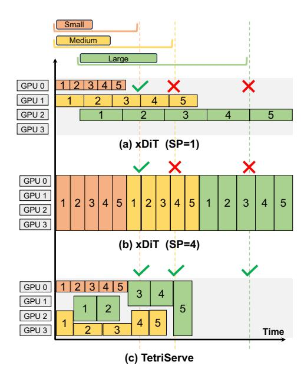
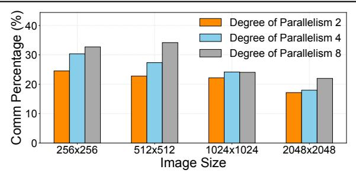

# Mosharaf Chowdhury

mosharaf@umich.edu University of Michigan Ann Arbor, Michigan, USA

**Keywords:** diffusion transformer serving, gpu resource scheduling, sequence parallelism

#### **ACM Reference Format:**

Runyu Lu, Shiqi He, Wenxuan Tan, Shenggui Li, Ruofan Wu, Jeff J. Ma, Ang Chen, and Mosharaf Chowdhury. 2026. TetriServe: Efficiently Serving Mixed DiT Workloads. In *Proceedings of the 31st ACM International Conference on Architectural Support for Programming Languages and Operating Systems, Volume 2 (ASPLOS '26), March 22–26, 2026, Pittsburgh, PA, USA.* ACM, New York, NY, USA, 16 pages. https://doi.org/10.1145/3779212.3790233

## 1 Introduction

Diffusion models [3, 4, 16, 21, 34, 37, 38] have significantly advanced text-to-image and text-to-video generation, enabling photorealistic content from natural language descriptions. They now power a wide range of commercial and creative services such as OpenAI Sora [7] and Adobe Firefly [2]. At the core of these breakthroughs are *Diffusion Transformers (DiTs)* [34], which have become the backbone of leading models including Stable Diffusion 3 (SD3) [3] and FLUX.1-dev [21]. By replacing conventional UNet architectures [16, 36], DiTs achieve higher fidelity by iteratively refining a full-image latent representation over a sequence of discrete denoising steps, setting a new standard for generation quality.

As DiT models move into production, *online DiT serving* becomes a key systems challenge. Deployments such as Flux AI [13] must satisfy strict service level objectives (SLOs) in the form of a *deadline* for each request while sharing a fixed GPU pool across many users to minimize cost. Serving is particularly challenging because requests arrive with heterogeneous output resolutions and tight deadlines.

Despite advances in LLM serving [10, 20, 27–29, 33, 43, 47], these solutions are insufficient: DiTs have fundamentally different serving characteristics. Specifically, DiT inference differs from LLMs in three ways: (i) it is stateless, requiring no KV cache; (ii) it is compute-bound, as multiple denoising steps operate on the full set of latent image tokens; and (iii)

\*Both authors contributed equally to this research.

**Figure 1.** Three DiT serving requests—each with 5 denoising steps—arrive over time with different SLOs and output resolutions. DiT serving solutions using static parallelism cannot adapt and fail to meet multiple SLOs. TetriServe meets more SLOs via SLO-aware scheduling and packing.

model sizes are small enough to fit on a single GPU. Consequently, generating a high-resolution  $2048 \times 2048$  image on a single H100 GPU can take up to a minute, while a  $4096 \times 4096$  image may exceed ten minutes. To meet the stringent latency demands of online serving, parallelism is essential.

The most common approach for parallelizing DiTs is sequence parallelism (SP) [18, 25], which partitions the sequence of image tokens across GPUs. However, simply applying a fixed degree of SP to all requests is inefficient and leads to poor SLO attainment. This is because the optimal degree of parallelism is highly sensitive to the input image resolution; a configuration that is ideal for one resolution can be detrimental to another. As shown in the toy example in Figure 1, the fixed-degree SP approach creates a fundamental tradeoff: low degrees of parallelism (e.g., SP=1 or 2) are efficient for small inputs but underutilize the GPU cluster for large ones by leaving some GPUs idle and prolonging request runtime, while high degrees of parallelism (e.g., SP=4 or 8) accelerate large inputs but introduce excessive communication overhead for small ones, leading to head-of-line blocking. Compounding this issue, existing DiT inference engines [12] are non-preemptive: once a request begins execution with a fixed degree of parallelism, it holds its allocated GPU(s) until completion, preventing more optimal scheduling of other requests in the queue.

We observe that *step-level scheduling*, in which the degree of parallelism is adjusted across steps within each request

based on its resolution and deadline, can significantly improve the serving efficiency of mixed DiT workloads. High-resolution or urgent requests can be accelerated with more GPUs, while smaller or less urgent ones conserve resources. Unfortunately, we prove that finding a globally optimal step-level schedule that maximizes deadline satisfaction under a fixed GPU budget is NP-hard (§4.1). In addition, the online arrival of requests and the need for millisecond-level scheduling decisions make exhaustive optimization infeasible.

We present *TetriServe*, a step-level DiT serving system designed to maximize SLO attainment under deadline constraints. At its core, TetriServe introduces a *deadline-aware round-based scheduler* that transforms the continuous time in the serving problem into a sequence of tractable, fixed-duration rounds. In each round, the scheduler decides which requests to serve and at what GPU parallelism degree. To make these decisions, TetriServe leverages a cost model that profiles per-step latency as a function of GPU count and identifies the *minimal feasible GPU allocation* for each request that can still meet its deadline. This allows TetriServe to construct a set of candidate allocations and perform request packing with the explicit goal of minimizing the number of requests that would otherwise become late in the next round.

TetriServe further enhances GPU efficiency while preserving request deadlines. It uses *selective continuous batching* to merge steps across small-resolution requests, reducing kernel launch overhead and boosting throughput. Meanwhile, *GPU placement preservation* and *work-conserving elastic scale-up* ensure idle GPUs are utilized without remapping distributed jobs. Together with the round-based scheduler, these techniques allow TetriServe to handle diverse DiT workloads—from small to large resolutions—while substantially improving deadline satisfaction over fixed-degree baselines.

We evaluate TetriServe on popular open-source DiT models (FLUX.1-dev and SD3) and different hardware platforms (8×H100 and 4×A40 nodes). We show that TetriServe consistently outperforms xDiT [12]—a DiT-serving engine that allows different fixed SP configurations—across diverse experimental settings by up to 32% in terms of SLO attainment ratio. TetriServe is also robust to bursty request arrival patterns, diverse workload mixes, and different model—hardware combinations.

We summarize the contributions as follows:

- We cast DiT serving as a step-level GPU scheduling problem and prove its NP-hardness.
- We present TetriServe, a deadline-aware round-based scheduler that minimizes late completions via dynamic programming.
- We show that TetriServe achieves substantial gains in SLO attainment over fixed-degree baselines on state-ofthe-art DiT models while maintaining image quality.

## 2 Motivation

Serving DiT models has become a popular workload for modern image generation systems [2, 12]. DiT inference is both compute-intensive and latency-sensitive. To better understand the challenges of serving such workloads, in this section, we discuss DiT background, workload characteristics, and the resulting opportunities and challenges.

## 2.1 DiT Background

Diffusion models [7, 16, 34, 37, 38] have significantly advanced text-to-image and text-to-video generation, enabling photorealistic content from natural language descriptions. Each step operates on the full latent representation, removing noise based on a learned denoising function. Although early diffusion models used *UNet* architectures [16, 36], modern high-quality image generators use *Diffusion Transformers* (*DiTs*) [9, 34] as their backbone. DiTs use attention [41] to capture global context and long-range dependencies.

DiT vs. LLM Parallelism. Although both DiTs and LLMs are built upon the Transformer architecture, their inference characteristics diverge significantly, requiring different parallelism strategies. Traditional model-sharding strategies for LLMs, such as tensor and pipeline parallelism, are inefficient for DiTs. This is because DiT models are typically small enough to fit on a single GPU. For example, the largest open-source text-to-image DiT has only 12B parameters [21] and fits comfortably on a single 80GB H100 GPU. Consequently, applying model sharding introduces unnecessary communication overhead without the benefit of accommodating a larger model, resulting in poor hardware utilization.

DiTs adopt sequence parallelism (SP) [18, 23, 25], a more efficient parallel approach tailored to their compute-bound nature. In SP, token sequences (image tokens) are distributed across GPUs, enabling collaborative computation within each transformer layer. Two representative implementations are *Ulysses attention* [18], which uses all-to-all collectives to transpose tokens and heads across GPUs before local attention, and *Ring attention* [25], which arranges GPUs in a ring and passes partial Q, K, V slices peer-to-peer, overlapping communication with computation. In practice, Ulysses attention is often preferred on systems with high-bandwidth interconnects like NVLink, as its use of collective primitives can be more efficient [12].

## 2.2 Characteristics of DiT Workloads

DiT serving exhibits distinctive workload characteristics that affect the design of scheduling and resource management.

*Heterogeneous Inputs.* Unlike LLM workloads, where input text can vary widely in length, DiT serving workloads are characterized by a small, discrete set of possible input image resolutions [13, 39]. In this work, we focus on four

**Table 1.** Characteristics of representative input sizes for the FLUX.1-dev model [21], including latent tokens and computational cost (TFLOPS). Execution stability (CV) is measured over 20 steps on 8xH100 GPU for different sequence parallelism (SP) degrees.

| Image Size       | Tokens | TFLOPs   | SP=1  | SP=2  | SP=4  | SP=8  |
|------------------|--------|----------|-------|-------|-------|-------|
| 256 × 256        | 256    | 556.48   | 0.13% | 0.31% | 0.67% | 0.62% |
| $512 \times 512$ | 1024   | 1388.24  | 0.06% | 0.15% | 0.14% | 0.53% |
| $1024\times1024$ | 4096   | 5045.92  | 0.07% | 0.12% | 0.04% | 0.09% |
| $2048\times2048$ | 16384  | 24964.72 | 0.05% | 0.11% | 0.14% | 0.28% |

**Figure 2.** Percentage of time spent in communication for FLUX.1-dev for four resolutions on an 8×H100 server (Batch Size = 4). Larger resolutions benefit more from increased parallelism because of relatively less communication overhead.

representative resolutions common in production environments; their characteristics for the FLUX.1-dev model [21] are detailed in Table 1. Despite the small number of distinct input sizes, the substantial differences in their computational demands still lead to highly heterogeneous resource requirements across requests.

**Predictable Execution.** Despite input diversity, DiT inference remains compute-bound and therefore exhibits stable per-step runtimes across a wide range of input resolutions. As shown in Table 1, execution time is highly stable: profiling over 100 runs with varying sequence-parallel degrees yields a coefficient of variation (CV) below 0.7% in all cases. This low variability indicates that DiT model inference is predictable across resolutions and degrees of parallelism, enabling accurate performance modeling and effective deadline-aware scheduling.

**Insight 1:** DiT workloads consist of heterogeneous input requests with different output resolutions, but per-step runtime for each resolution is highly predictable.

**Scaling Efficiency of Sequence Parallelism.** Sequence parallelism distributes tokens across GPUs, but its scaling efficiency is sublinear to the degree of parallelism. Two factors drive this: (i) communication overhead from collectives (all-to-all or ring exchanges) that scales with the degree of parallelism and sequence length; and (ii) reduced per-GPU

**Figure 3.** End-to-end scaling efficiency of FLUX.1-dev for four resolutions on an 8×H100 server for different batch size (BS). Efficiency scales sublinearly. Larger resolutions benefit more from increased parallelism, while smaller resolutions exhibit limited scalability. Note different Y-axes scales.

kernel efficiency when workloads are split, lowering occupancy and cache locality. Figure 2 quantifies this by showing the communication percentage across image sizes and degrees of parallelism. For small inputs (e.g.,  $256 \times 256$  and  $512 \times 512$ ), increasing the degree of parallelism rapidly increases the communication percentage, exceeding 30% at higher degrees. In this case, communication dominates execution time, leading to poor scaling and decreasing the benefits from additional GPUs. Figure 3 shows that small inputs (e.g.,  $256 \times 256$ ,  $512 \times 512$ ) underutilize GPUs and scale poorly, while larger inputs (e.g.,  $1024 \times 1024$ ,  $2048 \times 2048$ ) improve efficiency though computation remains the bottleneck. This explains why in Figure 1, latency does not scale linearly with the number of GPUs.

**Insight 2:** Sequence parallelism in DiT workloads scales sublinearly with the degree of parallelism and differently for each input resolution.

