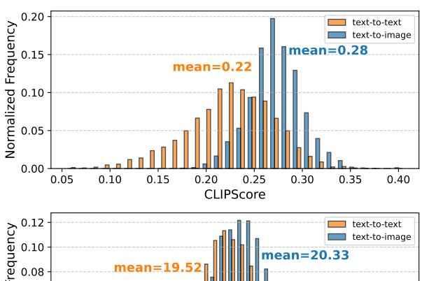
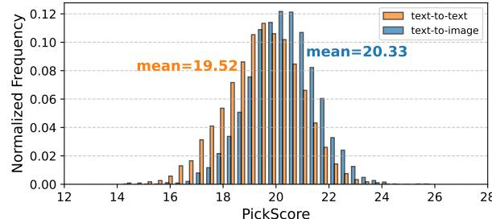

# 3 Challenges of Mixture-of-Models Design

This section explores the challenges and opportunities of using a model mixture to balance the latency-quality trade-off and addresses key research questions for designing an effective caching-based serving system. (1) How can we design a cache that minimizes space usage while being model agnostic? (2) How can we efficiently retrieve cached items to ensure optimal quality of image generation? (3) How can we best balance high image generation quality with low inference latency?

#### 3.1 What to Cache?

Prior work [6] uses latent caching, storing multiple intermediate representations to speed up diffusion model inference. However, it has two main drawbacks: significant storage overhead, with 2.5MB per image due to the need to store multiple latent intermediates (using Stable Diffusion-3.5-Large as an example), compared to 1.4MB for storing only the final image; and model dependence, as latents from one model are incompatible with other models, leading to cache fragmentation and scalability issues in multi-model environments. An alternative is to cache *full images*, which are universally interpretable and model-independent, simplifying cache management and reducing storage costs. This approach eliminates the need for separate latent caches, utilizes compressed formats like PNG and JPEG, and allows the dynamic reintroduction of noise to reconstruct intermediate

**Figure 2.** Comparison of CLIPScore and PickScore distributions for retrievals based on text-to-text and text-to-image similarity. Higher is better for both scores.

states, enabling compatibility across different models and improving scalability in large-scale serving systems.

**Insight:** Caching full images reduces storage overhead, eliminates model dependency, and enables broad reuse across different diffusion models.

