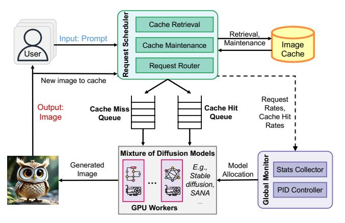

# 4.1 Design Goals

MoDM addresses the challenges of serving diffusion model inference workload with the following Design Goals (DG).

DG#1: Dynamically Balancing Latency and Quality. Building on the trade-off discussed in [§2.1,](#page-1-0) our goal is to achieve inference latency close to a small diffusion model while preserving the image quality of a large model. MoDM accomplishes this by strategically leveraging both small and large models for serving. Unlike prior works that either statically reduce inference costs by designing new models [\[15\]](#page-13-9) or achieve limited gains by skipping a few de-noising steps [\[6\]](#page-13-5), MoDM strives to dynamically optimize the latency-quality trade-off.

DG#2: Compatibility with Multiple Models. Different diffusion models and model families (e.g., Stable Diffusion and SANA) offer distinct trade-offs in terms of latency, quality, and architectural optimizations. Relying on a single model family limits flexibility and may lead to suboptimal performance across diverse request rates. Our design goal is to enable seamless serving across multiple model families, allowing the system to dynamically select the best model for different requests based on latency considerations.

DG#3: Optimized Cache Design and Retrieval. Our caching mechanism is designed to maximize efficiency while maintaining broad compatibility. The key goals include (1) achieving a high cache hit rate with minimal storage overhead, (2) ensuring cached items remain usable across multiple models (DG#2), (3) implementing cache management to prevent over-representation of specific items in future generations, and (4) adopting an accurate retrieval that effectively matches new prompts with cached items.

DG#4: Adaptability to Varying Request Rates. Request rates fluctuate over time [\[3,](#page-13-2) [6\]](#page-13-5), posing challenges for maintaining efficient serving performance. Our system is designed to dynamically adapt to these variations by selectively utilizing different models, ensuring an optimal balance between quality and latency under varying workloads.

### 4.2 System Design Overview

Fig. [4](#page-4-0) presents an overview of the MoDM system architecture, highlighting its key design components. The system takes a text-based user prompt as input and generates an image as output. To optimize real-time text-to-image generation with diffusion models, our approach integrates cacheaware request scheduling and dynamic model selection.

The Request Scheduler manages the flow of incoming image generation requests, ensuring efficient resource utilization. Upon receiving a request, it generates a text embedding using a CLIP model hosted by the scheduler. This embedding is then analyzed to determine if a cached image closely

**Figure 4.** Overview of MoDM system design.

matches the request, as detailed in §5.2. If a sufficiently close match is found, the scheduler retrieves the cached image, enabling content reuse and reducing computational overhead. For cache-hit requests, the scheduler dynamically adjusts the number of de-noising steps based on the text-to-image similarity score, resuming the generation process from a later stage with lower computation. If no suitable cached image is identified, the request is marked as a cache miss and undergoes full inference.

To meet **DG#1** and optimize throughput, an underlying design principle in MoDM is to **serve cache-hit requests with a small model** (more details in §5.1), which *reduces latency while maintaining the quality of the generated image through cached content.* **Cache-miss requests are handled by a larger model**, ensuring high image *generation quality* with full inference from scratch. The scheduler directs each request to the appropriate queue: cache-hit requests go to the *cache hit queue*, where a refined image is generated with fewer diffusion steps, while cache-miss requests are sent to the *cache miss queue* for full synthesis. Additionally, to meet **DG#3**, the scheduler manages the cache by storing newly generated images and removing older ones, ensuring efficient memory usage and maintaining content diversity.

The **Global Monitor** continuously tracks request patterns and system load in real time, leveraging data from the request scheduler to optimize model allocation across GPU workers. To meet **DG#4**, a *PID (Proportional-Integral-Derivative) controller* dynamically adjusts GPU allocation based on key metrics such as request rate, cache hit rate, and de-noising step distribution. The system strategically balances between model variants, with larger models handling full inference for high-quality outputs and refinements, while smaller models focus solely on efficient refinements of cached images. By adapting to workload fluctuations, the global monitor ensures optimal resource distribution, preventing resource underutilization while maintaining quality. These design details are discussed in §5.3.

**Table 1.** Notations used in this design.

| Symbol               | Description                                                         |
|----------------------|---------------------------------------------------------------------|
| $H_{\rm cache}$      | Cache hit rate in the last monitoring period.                       |
| T                    | Total de-noising steps                                              |
| K                    | Number of de-noising steps skipped                                  |
| P(K = k)             | Fraction of cache-hit requests assigned to refinement step <i>k</i> |
| R                    | Recorded request rate in the last monitoring period                 |
|                      | (requests per minute).                                              |
| $W_{\rm hit}$        | Cache-hit workload.                                                 |
| $W_{\rm miss}$       | Cache-miss workload.                                                |
| N                    | Total number of GPU workers.                                        |
| $P_{\rm small}$      | Profiled throughput of the small model                              |
|                      | (requests per minute per GPU).                                      |
| $P_{\mathrm{large}}$ | Profiled throughput of the large model                              |
|                      | (requests per minute per GPU).                                      |
| $N_{\rm small}$      | Number of allocated small models.                                   |
| $N_{\rm large}$      | Number of allocated large models.                                   |
| $K_p, K_i, K_d$      | PID tuning parameters for dynamic resource allocation.              |

The Workers execute image generation tasks in parallel across multiple GPUs, each hosting a model variant based on the global monitor's allocation and dynamically switching models as needed. While workers running larger models are capable of handling both cache-hit and cache-miss requests, they prioritize cache-miss requests, as these require full inference across all denoising steps and therefore incur significantly higher latency. In contrast, workers running smaller models exclusively process cache-hit requests, focusing on efficient refinement to minimize system-wide latency. This dynamic task assignment and model switching strategy ensures optimal GPU utilization, maintaining high throughput while balancing the image generation quality to meet DG#1 and DG#2.

### 5 MoDM Design Details

In this section, we present the detailed design of MoDM, addressing four key research questions. (1) How to use cached images for generation by applying a subset of de-noising steps with a small model? (2) How to effectively retrieve items from the cache and determine the optimal number of de-noising steps for a given prompt? (3) What is the role of the global monitor in managing GPU resources and model allocation to optimize efficiency under varying load conditions? (4) How does the request scheduler manage the image cache to ensure efficient system performance? The notations used in this section are explained in Table 1.

