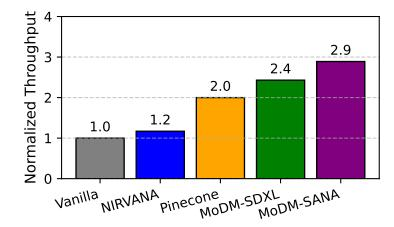
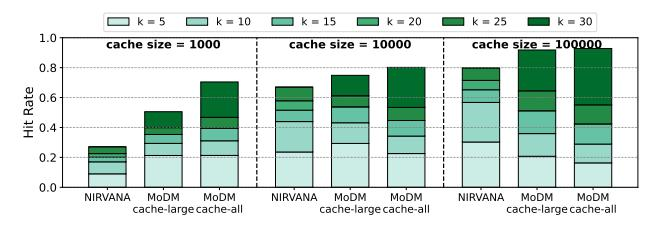
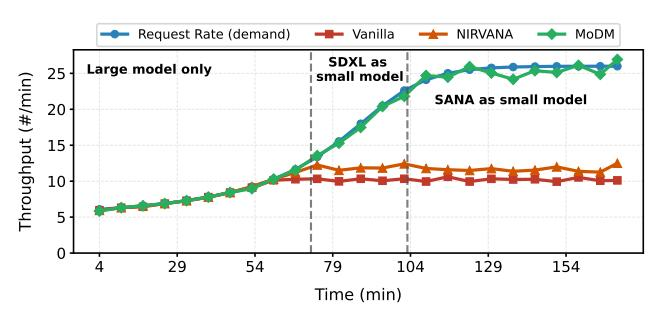

# 6 Evaluation Methodology

Implementation and Hardware. We implement MoDM, our inference-serving system, in Python using PyTorch [\[28\]](#page-13-23), with the request scheduler, global monitor, and each worker running in a separate process. Node communication is handled by PyTorch RPC [\[29\]](#page-13-24), enabling efficient distributed deep learning. MoDM is deployed on two hardware configurations: a single server with four NVIDIA A40 GPUs (48GB

memory) and a 16-node cluster, each node equipped with four AMD MI210 GPUs (64GB memory).

Models and Workloads. We evaluate MoDM using four models to demonstrate cross-model compatibility. The large models used in our study includes Stable Diffusion-3.5-Large (SD3.5L) with 8B parameters [\[14\]](#page-13-8) and FLUX.1-dev (FLUX) with 12B parameters [\[30\]](#page-13-25). The small models include Stable Diffusion XL (SDXL) with 3B parameters [\[23\]](#page-13-16) and SANA with 1.6B parameters [\[15\]](#page-13-9). SD3.5L and FLUX are both flow-based models trained using the Flow Matching framework. We also include Stable Diffusion-3.5-Large-Turbo (SD3.5L-Turbo), a distilled variant of the SD3.5L model optimized to generate high-quality images in significantly fewer steps, to compare MoDM against a distilled baseline. All models except SDXL run in BF16 precision, while SDXL uses FP16, following the developers' default recommendations. All models use = 50 denoising steps and generate 1024×1024 images, except SD 3.5-Turbo, which uses 10 steps. For evaluation, we use DiffusionDB [\[3\]](#page-13-2), a real-world production dataset with 2 million images, and MJHQ [\[31\]](#page-13-26), a high-quality dataset of 30k MidJourney-generated images.

Modeling of Request Arrivals. We model the request arrival process as a homogeneous Poisson process with varying rates. We replay the trace of user-submitted prompts from the DiffusionDB dataset in their original arrival order (and in trace order for MJHQ, which lacks timestamp information) to emulate a production environment consistent with the portal deployment of a Stable Diffusion–based model. The image cache operates with the proposed FIFO-based cache management policy that shows a high degree of temporal locality as detailed in Appendix [A.1.](#page-15-1)

System Performance. We use the following metrics.

Maximum Throughput: We compare the highest throughput achieved by different baselines assuming that there enough number of requests to keep the system busy.

Service Level Objective (SLO) Compliance: We analyze the system's ability to meet predefined latency thresholds under varying request rates. Specifically, we evaluate compliance with two SLO requirements: latency within 2× and 4× that of the large model (Stable Diffusion-3.5-Large) inference.

Tail Latency: We measure the 99th percentile latencies to capture the worst-case response times and ensure system stability under load.

Maximum Load: We determine the highest sustainable request rate the system can handle while maintaining acceptable latency and quality of service.

Image Quality. Four metrics are used for quality.

CLIPScore [\[12\]](#page-13-6): Measures the alignment between the generated image and its corresponding prompt, providing an assessment of semantic accuracy.

FID (Fréchet Inception Distance) Score [\[13\]](#page-13-7): Quantifies the similarity between generated and groundtruth images by comparing their feature distributions.

Figure 6. Hit rate of MoDM for DiffusionDB.

*IS (Inception Score)* [21]: Evaluates the quality and diversity of generated images by analyzing the confidence and variety of class predictions from an Inception network.

**PickScore** [20]: Estimates human preference alignment by scoring how likely a generated image would be selected over others, trained on pairwise human comparisons.

**<u>Baselines.</u>** We compare against the following baselines.

**Vanilla System**: An inference-serving system where every request is fully processed by the large model (*i.e.*, SD3.5L or FLUX) without leveraging cached images or retrieval mechanisms. This represents a traditional approach to serving diffusion models.

**NIRVANA** [6]: A caching-based diffusion inference system that improves efficiency by reusing previously generated images to reduce redundant computation.

**PINECONE** [32]: Retrieves and serves an image based on the most similar prompt using CLIP text embedding similarity without refinement; if no suitable match is found, it generates the image from scratch.

**Experimental Setup.** Fig. 6 shows the overall hit rate across all 2 million requests from DiffusionDB with two different cache sizes. The hit rate remains consistent across both settings, indicating that conducting experiments on a subset of the dataset provides a generalizable result.

Throughput Experiments: We conduct experiments with 10000 requests from each dataset, using a cache of 10000 images generated by the large model. Unlike latency experiments, these tests focus solely on measuring maximum system throughput, ignoring timestamps. Additionally, we perform a scalability study w.r.t. GPU resources.

Latency and SLO Experiments: To evaluate tail latency and SLO compliance, we use the DiffusionDB dataset, sorting them by arrival time. We assign timestamps to requests using a Poisson distribution under different request rates to study the performance of the system under varying load.

Image Quality Comparison: To assess image quality, we generate 10,000 cached images per dataset in a warm-up phase, then serve another 10,000 requests, retrieving cached images when possible. This experiment runs in throughput-optimized mode, representing the worst-case image quality scenario (§5.3). For FID, we generate four sets of 10,000 images using the large model with identical requests but different seeds, randomly selecting ground truth for comparison.

**Figure 7.** Throughput of different baselines normalized to Vanilla (Stable Diffusion-3.5-Large) on two datasets.

**Figure 8.** Throughput of different baselines normalized to Vanilla (FLUX) on DiffusionDB dataset. Both NIRVANA and MoDM baselines use FLUX as a large model.

With SD3.5L as the large model, we use cache-all for DiffusionDB (cache outputs from both small and large models) and cache-large for MJHQ (store only large-model outputs to preserve throughput while improving quality, §A.5). For experiments using FLUX as the large model, we also employ the cache-large strategy.

### 7 Evaluation Results

We evaluate the performance of MoDM using a variety of metrics including throughput, adaptability to varying request rates, scalability with respect to GPU resources, SLO compliance, and the quality of image generation1.

### 7.1 Throughput Evaluation

Fig. 7 presents the normalized throughput of MoDM and several baselines on the DiffusionDB and MJHQ datasets, using a cache size of 10,000 images. Throughput is normalized to the Vanilla baseline (Stable Diffusion-3.5-Large). On the real-world DiffusionDB workload, MoDM achieves a 3.2× improvement with SANA as the small model and 2.5× with SDXL. On MJHQ—a synthetic dataset with less temporal locality—the cache hit rate drops, resulting in reduced speedups (2.4× with SANA and 2.1× with SDXL). The performance gains primarily come from avoiding redundant denoising steps and utilizing smaller models on cache hits. To evaluate generality across different large model baselines, Fig. 8 reports throughput on DiffusionDB normalized to

&lt;sup>1Profiling results may vary across different software stack and configurations. The preliminary results presented here are specific to the evaluation framework used in this study for representative academic purpose.

**Figure 9.** Comparison of cache hit rates for NIRVANA and MoDM for the DiffusionDB dataset [3].

FLUX. MoDM continues to outperform all baselines, achieving up to 2.9× speedup with SANA and 2.4× with SDXL as small models. This demonstrates the robustness of our approach under varying model configurations and workload characteristics.

Fig. 9 compares cache hit rates and skipped de-noising steps between NIRVANA and MoDM using DiffusionDB (see §A.5 for the MJHQ dataset). We evaluate MoDM under two configurations: (1) caching only images generated by the large model when a cache miss occurs (MoDM cache-large) and (2) caching both cache-miss images and refined cache-hit images from both small and large models (MoDM cache-all). Cache hit rates are assessed across three cache sizes: 1000, 10000, and 100000.

The results highlight four key insights. First, MoDM achieves higher cache hit rates than NIRVANA. This improvement stems from our sliding window-based cache maintenance policy, which better accommodates similar requests occurring in close temporal proximity (§5.4), and our text-to-image similarity based retrieval policy, which enhances visual alignment with prompts (§3.2). Second, our text-to-image retrieval strategy increases the number of skipped de-noising steps. A higher k value (dark green portion) indicates more skipped steps, leading to substantial computational savings.

Third, caching images from both small and large models further improves cache hit rates. This is expected, as caching all images better serves temporally adjacent requests, whereas caching only large-model-generated images results in missed opportunities. Additionally, as shown in §A.6, caching images generated by the small model does not degrade image quality, justifying this design choice from a quality standpoint. Fourth, a cache size of 100000 is sufficient to achieve a high hit rate of 92.8%. This insight informs our design decision to balance cache size with hit rates while minimizing cache management and retrieval overhead. Notably, this is much smaller than prior work [6].

Fig. 10 illustrates how MoDM handles an increasing request rate, ranging from 6 to 26 requests per minute. This experiment was conducted using 16 MI210s. The vanilla system reaches a maximum throughput of approximately 10 requests per minute, while NIRVANA achieves a 20% improvement. However, as the request rate continues to rise, only MoDM is able to sustain the required throughput. Between

Figure 10. System throughput under increasing request

Figure 11. Scalability of MoDM with increasing #GPUs.

12 and 22 requests per minute, MoDM uses SDXL as the small model for efficiency. Beyond 22 requests per minute, even SDXL cannot meet demand. To address this, MoDM dynamically switches the small model from SDXL to SANA, further increasing throughput. We also evaluate these systems under fluctuating request rates, as shown in Fig. 17 in the Appendix. MoDM adapts to changes in workload more effectively than baseline systems, maintaining high throughput throughout periods of variability. This adaptive model selection allows MoDM to maintain stable performance by dynamically balancing image quality and latency, effectively handling diverse use cases like varying SLO demands and quality requirements. No prior state-of-the-art work offers such a broad and flexible trade-off between latency and quality.

To evaluate MoDM's scalability, we analyze how throughput improves with respect to GPU resources. Fig. 11 demonstrates super-linear scalability on MI210s, indicating that MoDM effectively utilizes available resources and remains adaptable to larger clusters without bottlenecks. The observed super-linear scalability arises from the fact that, with more GPUs, requests are processed at a faster rate. As a result, within a given time period, a greater number of generated images are added to the cache, leading to a higher cache hit rate. This increased cache efficiency further boosts throughput, reinforcing the benefits of scaling multiple GPUs.

