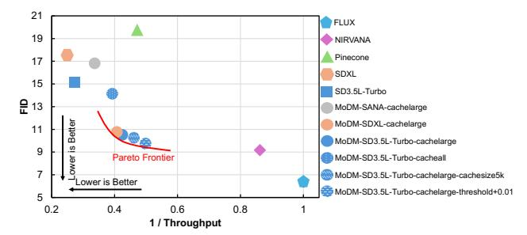

# 7.4 Comparison on the Quality-Performance Trade-off Space

To complement our main results, Fig. 14 visualizes the tradeoff space between image generation quality (measured using the FID score) and system throughput for various diffusionbased serving strategies. We plot the inverse throughput (1/Throughput) on the x-axis and FID score on the y-axis:

**Figure 14.** Quality-performance trade-off across serving strategies. The large model used is FLUX, and the evaluation is conducted on the DiffusionDB dataset. The default cache size for all systems is 10k unless otherwise specified.

both axes where lower values are desirable. This orientation highlights the dual objective in MoDM of optimizing for faster image generation, maintaining high visual fidelity.

In this figure, we show multiple data points of MoDM by changing various runtime parameters including (1) small model used: SANA, SDXL, and SD3.5L-Turbo), (2) caching strategies: caching images generated by large model only and caching images generated by all models, (3) cache size: 10k images (default) and 5k images, and (4) varying cache hit threshold: 0.25 (default) and 0.26 (i.e., +0.01). The figure highlights *three key takeaways*. First, MoDM offers a flexible configuration that supports pairing any two diffusion models: not only from the same family but also across different families, including distilled variants, enabling a unique and customizable trade-off between output quality and generation performance. Second, MoDM supports runtime adaptivity to system parameters, demonstrating its capability to dynamically adjust and maintain optimal quality-performance balance under varying conditions. Third, within the landscape of state-of-the-art diffusion-based image generation systems, MoDM achieves a system design that resides on the *Pareto frontier*, effectively pushing the boundary of the achievable trade-off between quality and performance.

#### 7.5 Additional Results

Due to page limitation, we include additional results in appendix that includes (1) comparison of 99th percentile tail latency of different baselines: §A.2, (2) throughput comparison across fluctuating request rates: §A.3, (3) comparison of energy consumption of different approaches: §A.4, (4) cache hit rates for the MJHQ dataset: §A.5, and (5) examples of images generated using different baselines: §A.7.

