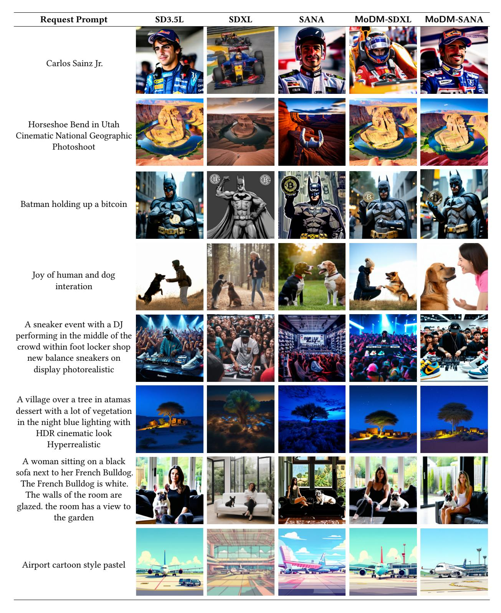

# B.4 Installation

Download the MoDM code base from [https://github.com/](https://github.com/stsxxx/MoDM.git) [stsxxx/MoDM.git](https://github.com/stsxxx/MoDM.git). Follow the instructions in the README to install all dependencies and to download the dataset metadata, pre-generated cache images, embeddings, and latents.

### B.5 Experiment Workflow

- 1. Install all dependencies.
- 2. Download and prepare the dataset metadata, as well as all pre-computed cached images and latents.
- 3. Run the throughput experiments on MoDM and other baselines.
- 4. Compute the image quality metrics.

### B.6 Evaluation and expected results

After the experiments complete, all generated images will be saved under the images directory. The throughput and image quality results can be found at the end of each corresponding log file (e.g., MoDM\_throughput\_diffusionDB\_sdxl.txt).

Figure 20. Generated images for different methods on 8 sample requests. MoDM uses SD3.5L as a large model.