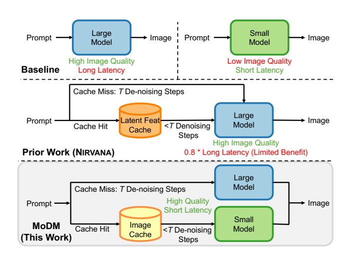

# CCS Concepts: • Computer systems organization $\rightarrow$ Cloud computing.

Keywords: Model serving; Image generation; Caching

#### **ACM Reference Format:**

Yuchen Xia, Divyam Sharma, Yichao Yuan, Souvik Kundu, and Nishil Talati. 2026. MoDM: Efficient Serving for Image Generation via Mixture-of-Diffusion Models. In Proceedings of the 31st ACM International Conference on Architectural Support for Programming

This work is licensed under a Creative Commons Attribution-NonCommercial 4.0 International License.

ASPLOS '26, Pittsburgh, PA, USA
© 2026 Copyright held by the owner/author(s).
ACM ISBN 979-8-4007-2165-6/2026/03

https://doi.org/10.1145/3760250.3762220

Languages and Operating Systems, Volume 1 (ASPLOS '26), March 22–26, 2026, Pittsburgh, PA, USA. ACM, New York, NY, USA, 20 pages. https://doi.org/10.1145/3760250.3762220

**Figure 1.** Overview of MoDM that balances between high image quality and short latency using a mixture of models.

#### 1 Introduction

Diffusion models have revolutionized text-to-image generation, enabling the creation of high-quality, photorealistic images from natural language descriptions. Their success has made them a cornerstone of AI-driven creative tools, powering applications in digital art, content generation, and interactive media. The demand for diffusion models is at an all-time high. Adobe's Firefly service [1] has generated over 2 billion images, while OpenAI's DALL-E 2 [2] has seen similar adoption, alongside an exponential rise in prompt submissions to Stable Diffusion systems, as shown by DiffusionDB [3]. However, each diffusion model inference takes 10s of seconds, making it a computationally expensive task. Meeting this growing demand requires significant improvements in serving system throughput and latency.

An effective way to improve diffusion model performance is through *caching*, which reduces redundant computations and accelerates inference. Prior works have explored various caching techniques [4–11], including latent caching (storing intermediate noisy features), feature caching (storing activations), and image patch caching. While these techniques enhance performance, caching intermediate features has two major limitations. First, it restricts serving to a single model, as cached content is model-specific. Second, relying on just one model limits the potential performance gains, reducing flexibility in optimizing inference.

In this paper, we introduce MoDM, an efficient serving system for text-to-image generation using a mixture of diffusion models. While our work is based on the general idea of caching, MoDM is uniquely designed to achieve three design goals. (1) Diffusion models trade off inference latency and image quality: large models generate high-quality images but are slow, while smaller models are faster but sacrifice quality. MoDM dynamically exploits this trade-off by designing a caching strategy compatible with multiple models to optimize both speed and quality. (2) To maintain high-quality image generation, MoDM implements an advanced retrieval strategy that ensures retrieved cached content closely aligns with new prompts. (3) Finally, MoDM introduces an adaptive serving system that dynamically balances latency and quality based on request rates and system load, ensuring efficient and scalable performance.

Fig. 1 shows the design overview of MoDM. To ensure that the cache content is accessible and relevant for multiple models, we propose to *cache final generated images* in the past, in contrast to caching latent intermediate images in prior work [6]. When a new prompt closely matches a cached image, MoDM retrieves the image, applies controlled noise, and refines it using a smaller model. This approach preserves the quality of the cached image while benefiting from the lower latency of the smaller model. Requests that miss the cache are processed using a large model. This hybrid approach effectively balances latency and image quality by using a *mixture of models*.

Caching final images enables retrieval based on text-to-image similarity, unlike prior works [6] that rely solely on text-to-text similarity by caching intermediate features. Leveraging the CLIP score [12] and image generation examples, we demonstrate that text-to-image similarity retrieval better aligns with user prompts, using it for cache retrieval in MoDM. Building on this, MoDM integrates image caching and a mixture of models into a high-performance diffusion model serving system. The system features a *Request Scheduler* that manages incoming requests, categorizes them into cache hits and misses, retrieves cached images, and maintains cache content over time. Additionally, a *Global Monitor* analyzes request rates and cache hit/miss distributions to dynamically allocate GPU resources, scheduling different models for inference based on workload conditions.

We evaluate the effectiveness of MoDM using both performance (i.e., throughput and tail latency) and image quality (i.e., CLIP [12] and FID [13] scores) metrics. Using the DiffusionDB [3] dataset, we demonstrate that MoDM achieves a 2.5× improvement in inference throughput and 46.7% lower energy consumption, compared to using only a high-quality model, by leveraging Stable Diffusion-3.5-Large as a highquality model and Stable Diffusion-XL as a low-latency model. Additionally, we evaluate tail latency under varying request rates, showing that MoDM sustains significantly higher loads without violating Service Level Objectives (SLOs), outperforming state-of-the-art solutions. Finally, we highlight the versatility of MoDM by serving requests across different model families, including Stable Diffusion [14] and SANA [15]. Unlike SANA that statically reduce inference cost by designing smaller models, MoDM introduces a novel technique that can intelligently and dynamically balance latency and quality by leveraging a mixture of diffusion models. The contributions of MoDM are as follows.

- An optimized cache design and retrieval policy based on final images to accelerate diffusion model inference.
- Generating images by retrieving a cached image, adding noise, and de-noising it with a low-cost model.
- A hybrid serving approach that leverages small and large models to balance latency and image quality.
- MoDM: an end-to-end text-to-image serving system design that dynamically adjusts to load variations, achieving 2.5× performance improvement.

