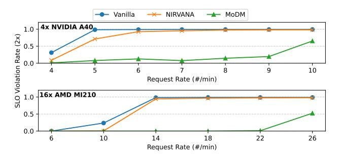

# 7.2 SLO Compliance

Figs. 12 and 13 depict the SLO violation rates across different baselines. We evaluate SLO violations under two conditions: (1) when the generation latency exceeds 2× that of the large

**Figure 12.** SLO violation rate (>2× inference latency of Stable Diffusion-3.5 Large) for different request rates.

**Figure 13.** SLO violation rate (>4× inference latency of Stable Diffusion-3.5 Large) for different request rates.

model (Stable Diffusion-3.5-Large), as shown in Fig. 12, and (2) when it surpasses 4× the large model's latency, as shown in Fig. 13. Both figures compare SLO violations across varying request loads for two hardware configurations: 4 NVIDIA A40s and 16 AMD MI210s. The results demonstrate MoDM's ability to sustain significantly higher request loads without violating SLO, using the same hardware resources.

At low request rates, all three systems meet SLO requirements with minimal violations. However, as the request rate exceeds 5 requests per minute on A40s and 14 requests per minute on MI210s, SLO violations become predominant in both the vanilla system and NIRVANA. In contrast, MoDM maintains compliance for much higher loads, supporting up to 10 requests per minute on A40s and 22 requests per minute on MI210s under the 2× threshold, and up to 26 requests per minute on MI210s under the 4× threshold. MoDM achieves this by leveraging a combination of large and small models. As shown in Fig. 10, our system adaptively switches to a small diffusion model for inference under high request rates, significantly reducing computational overhead. These results underscore MoDM's superior efficiency in handling high request loads while minimizing SLO violations. §A.2 in appendix expands on these results further showing the 99th percentile tail latency values for different baselines.

