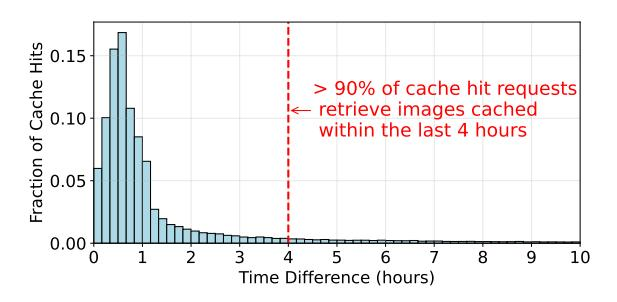
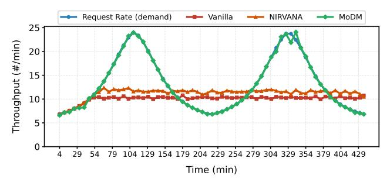

# A.1 Timing Analysis Between a New Prompt and its Retrieved Cache Image

**Figure 15.** Distriution of time elapsed between new requests and the generation of their retrieved images from the cache.

To evaluate the effectiveness of a simple FIFO-based cache management strategy, we conduct an experiment using the production dataset DiffusionDB [3], which accurately captures the temporal correlation between different prompts. Specifically, we measure the time elapsed between a new prompt that results in a cache hit and the original image generation of its retrieved cached item. Fig. 15 presents the distribution of these time intervals, showing that over 90% of new prompts retrieve images generated within the past four hours. In other words, caching all requests from the last four hours can achieve a high cache hit rate of over 90%, making it feasible to ignore images generated much earlier. This behavior is intuitive, as users often iteratively refine their prompts to better align the generated visual content with their expectations. Based on this quantitative analysis, MoDM adopts a simple yet effective FIFO-based cache maintenance strategy.

#### A.2 Tail Latency Evaluation

**Figure 16.** P99 tail latency for varying request rates.

Fig. 16 demonstrates that MoDM significantly reduces the 99th percentile tail latency compared to the vanilla system and NIRVANA. The upper subfigure compares tail latency using 4 A40s. At 4 requests per minute, all three systems maintain a low tail latency of under 200 seconds. However,

as the request rate increases from 4 to 10 requests per minute, the tail latency of the vanilla system and Nirvana surges past 1000 seconds, making them impractical for real-time serving. In contrast, MoDM can handle significantly higher system loads, supporting up to 10 requests per minute with the given GPU resources. Due to the compute-heavy nature of diffusion model serving, reducing latency beyond this rate requires a substantial increase in GPU resources.

The lower subfigure in Fig. 16 presents tail latency with 16 MI210s. Similarly, both the vanilla system and NIRVANA can only sustain a low tail latency when the request rate does not exceed 10 requests per minute. In contrast, MoDM remains stable at much higher request rates, successfully handling over 20 requests per minute, further demonstrating its robustness and scalability under increasing load.

### A.3 Throughput Under Fluctuating Request Rates

**Figure 17.** Throughput over time under fluctuating request rates.

Fig. 17 illustrates how different systems respond to varying load conditions over time. As the request rate increases and decreases, MoDM consistently adapts to match the demand, achieving higher throughput across both low and high load periods. In contrast, baseline systems such as Vanilla and Nirvana show noticeable lag during peak request intervals, indicating limited scalability. Notably, their throughput remains high during low request rates because they are still draining queued requests from earlier peak periods. These results highlight the effectiveness of our design in maintaining high throughput even under rapidly changing workload patterns.

