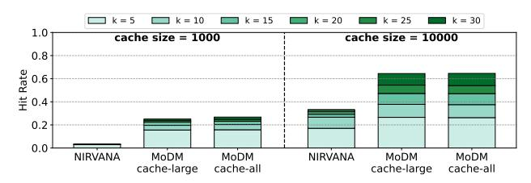

# A.5 Cache Hit Rate Comparison on MJHQ Dataset

**Figure 19.** Comparison of cache hit rates for NIRVANA and MoDM for the MJHQ dataset [31]. A cache size of 100k is not shown as the dataset only has 30k prompts.

Fig. 19 compares the cache hit rates of NIRVANA and MoDM on the MJHQ dataset [31]. The figure evaluates hit rates for two cache sizes: 1000 and 10000 images. A cache size of 100000 is not feasible for this dataset, as it contains only 30000 prompts. Unlike DiffusionDB, MJHQ is not a production dataset, meaning there is no strong temporal correlation between requests. Despite this, Fig. 19 demonstrates that MoDM consistently improves cache hit rates compared to NIRVANA.

Interestingly, the results reveal minimal difference between caching only images from the large model and caching all images. This is because the dataset lacks temporal proximity of similar prompts, making the inclusion of all images in the cache less beneficial. Without temporal correlation, caching images generated by a small or a large model provides similar benefits. This suggests that when prompts submitted in close temporal proximity lack significant similarity, caching only images generated by the large model (cache miss requests in MoDM) is sufficient. Nonetheless, MoDM's retrieval and management policies effectively reduce computational overhead, leading to substantial improvements in overall throughput (§7.1).

