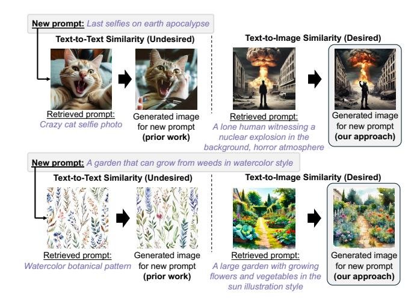

# 3.2 How to Retrieve Cached Items?

Existing caching methods [6] use text-to-text similarity for cache retrieval, which often leads to incorrect matches due to a lack of visual alignment. These methods focus on text embeddings, which do not guarantee that the retrieved image accurately reflects the user's intent. Additionally, since prior approaches cache only latent representations rather than full images, they cannot leverage text-to-image similarity, further reducing retrieval precision.

Image caching enables retrieval based on text-to-image similarity, significantly improving alignment with the user's request in terms of style, structure, and content. By using CLIP embeddings or similar cross-modal techniques, the system ensures better visual relevance. As shown in Fig. 2, text-to-image retrieval results in higher CLIPScore compared to text-to-text retrieval, indicating stronger visual alignment between the retrieved image and the new request text. To address potential bias from using CLIP for both retrieval and evaluation, we also report PickScore, which similarly favors text-to-image retrieval. Fig. 3 highlights cases where

Figure 3. Comparison of image quality using a cached image retrieved through text-to-text and text-to-image similarity.

text similarity does not align well visually, underscoring the importance of cross-modal retrieval for effective caching.

Insight: Text-to-image similarity-based retrieval is superior to text-to-text similarity because it ensures better visual alignment with user intent.

### 3.3 How to Balance Between Latency and Quality?

Using a single diffusion model for inference fails to effectively balance the latency-quality trade-off. In Nirvana, despite a large cache of 1.5 million latents and a cache hit rate over 90%, the system only achieves a 20% reduction in computation, remaining vulnerable to high request bursts and frequent SLO violations (more details in [§7.2\)](#page-10-0). To address this, cachehit requests can be offloaded to a smaller diffusion model, as recent studies suggest that minor refinements can be efficiently handled by lightweight models [\[24,](#page-13-17) [25\]](#page-13-18). Research on diffusion dynamics [\[26,](#page-13-19) [27\]](#page-13-20) shows that early de-noising steps determine structure, while later steps focus on fine details, enabling smaller models to handle cache-hit requests with minimal quality loss. Comparing large and small models reveals that adaptive model selection can reduce computation time while maintaining acceptable quality, offering a promising approach for real-world serving systems. Here, a large model refers to one like Stable Diffusion-3.5-large, while a small model refers to one like SANA.

Insight: Using a mixture of small and large diffusion models optimizes the latency-quality trade-off, ensuring efficient computation while maintaining high image quality.

