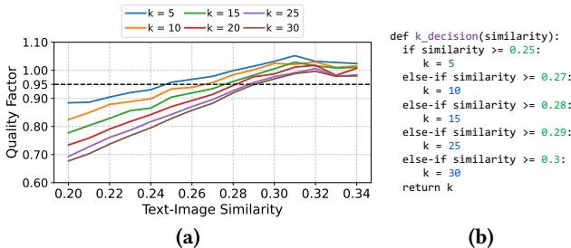

# <span id="page-4-1"></span>5.1 Generation using Cached Image with Reduced De-Noising Steps

Upon receiving a request, the request scheduler uses the prompt embedding to check for a sufficiently similar image in the cache. If a match is found, MoDM retrieves the image, adds noise to it by a pre-determined amount, and finally uses a diffusion model to de-noise the image for the given prompt. The key idea is to augment with sufficient noise to generate a new image, enabling the system to skip de-noising steps.

Given a query embedding q, the system retrieves the most relevant cached image by computing its cosine similarity with cached image embeddings (§3.2):

$$S(q, I^*) = \frac{q \cdot e_{I^*}}{\|q\| \|e_{I^*}\|} \tag{1}$$

where  $e_{I^*}$  is the embedding of the cached image  $I^*$ , extracted using a pretrained CLIP image encoder. Retrieval is performed only if the similarity score  $S(q, I^*)$  exceeds a predefined threshold  $\tau$ , which is treated as a hyperparameter controlling the trade-off between retrieval precision and recall. Rather than using the retrieved image directly, the system reintroduces noise using the same scaling method as image-to-image diffusion, enabling the image to re-enter the de-noising process at an intermediate timestep. This approach allows for refinement of the retrieved image, ensuring better alignment with the request while preserving computational efficiency. Given a target timestep  $t_k$ , the noisy image  $\tilde{I}$  is generated using the diffusion model's noise schedule:

$$\tilde{I} = \sigma_{t_k} \cdot \epsilon + (1 - \sigma_{t_k}) \cdot I^*, \tag{2}$$

where  $\sigma_{t_k}$  is the noise scaling factor retrieved from the diffusion model's noise schedule sigmas  $[t_k]$ ,  $\epsilon \sim \mathcal{N}(0, I)$  is Gaussian noise sampled from a standard normal distribution, and  $I^*$  is the retrieved image.

The system then runs the diffusion model for the remaining T-k steps, skipping the initial k de-noising iterations. This step refines the retrieved image to match the new request. Since the retrieved image shares high-level features with the target, running only the later de-noising steps allows controlled adjustments to colors, textures, and details without regenerating the image from scratch. By avoiding redundant computation, this method significantly reduces inference cost while preserving high image fidelity.

The choice of k is determined dynamically based on the similarity between the retrieved image and the new request (§5.2). A higher similarity score indicates that the retrieved image closely matches the new prompt, requiring fewer modifications to align with the desired output. In such cases, a larger k is selected to skip more de-noising steps and reduce latency. Conversely, for lower similarity, a smaller k is used to allow more iterative refinement.

With  $H_{\text{cache}}$  to be the cache hit rate with  $C_{\text{gen}}$  denoting the total compute cost for generating a new image from scratch using the large model. Each request requires a total of T de-noising steps with cache hits only requiring T-k steps. The computation saved per cache-hit request, weighted by the distribution of different diffusion steps K, is:

$$C_{\text{saved}} = H_{\text{cache}} \sum_{k=0}^{T} \frac{k}{T} C_{\text{gen}} P(K = k).$$
 (3)

Instead of running the large model for refinement, our system can offload cache-hit refinements to a smaller model, which performs the remaining T - k steps at a significantly

lower cost. Let  $C_{\text{small}}$  denote the compute cost of the small model per step relative to the large model. The total compute savings, considering the distribution of K, is:

$$C_{\text{total\_saved}} = H_{\text{cache}} \sum_{k=0}^{T} P(K=k) \left( \frac{k}{T} C_{\text{gen}} + \frac{T-k}{T} (C_{\text{gen}} - C_{\text{small}}) \right).$$
(4)

Since the small model also performs only the remaining T-k steps, its impact on total compute savings depends on how much cheaper each step is relative to the large model. The larger the gap between  $C_{\rm gen}$  and  $C_{\rm small}$ , the greater the additional efficiency gained by refinement offloading.

#### <span id="page-5-0"></span>5.2 Cache Retrieval and k Selection

Since our system caches full images rather than latents, we can generate intermediate states for any k by applying controlled noise to the cached image. To balance computational efficiency and generation diversity, we restrict k to choose from a discrete set of N values (where N=6 in our case),  $\mathcal{K}=\{5,10,15,20,25,30\}$ . This selection ensures efficient refinement while covering a sufficient range of de-noising steps to maintain high-quality generation. Given that a full generation requires (T=50) de-noising steps, we cap k at 30 to prevent excessive similarity between refined outputs while still achieving significant computational savings.

To ensure that cached image refinements maintain a sufficiently high level of quality, MoDM follows a quality constrained retrieval policy. Specifically, we enforce that the quality of an image generated from a retrieved cached image using a small model must be at least  $\alpha$  times the quality of an image generated from scratch using a large model, where  $\alpha \leq 1$  is the quality degradation factor controlling the allowable trade-off between efficiency and output fidelity:

$$Q_{\text{cache-hit}}(k) \ge \alpha \cdot Q_{\text{full-gen}}.$$
 (5)

We conduct an empirical evaluation to determine appropriate cache hit thresholds  $\tau$  and k selection values. We generate 10000 images from DiffusionDB [3] using a large model and then performed refinements starting at different k steps ( $k \in \{5, 10, 15, 20, 25, 30\}$ ), selecting the most semantically aligned cached image from a cache of 100000 stored images. We set a strict quality constraint of  $\alpha = 0.95$ . While this analysis is inspired by prior work [6], the key difference is that we rely on text-to-image similarity for retrieval based on §3.2 instead of earlier text-to-text similarity attempt.

We present a detailed analysis of these results in Fig. 5a, illustrating the relationship between the similarity score between the query and retrieved image, the selected k, and the final image quality. For a fixed k, as the text-image similarity increases, the final image quality also improves. Furthermore, for the same text-image similarity, a smaller k involves more refinement to the retrieved image, resulting in higher final image quality but lower computational savings. A quality factor greater than 1 is observed when the retrieved images

<span id="page-6-1"></span>

**Figure 5.** (a) Relationship between final image quality and text-image similarity across different k, (b) logic for determining k based on text-to-image similarity.

closely align with the new prompt (*i.e.*, exhibits high text-to-image similarity). In such cases, even partial refinement using a smaller model can further enhances image quality. The figure also marks the quality degradation parameter  $\alpha$ , and for each k, we determine the lowest possible text-image similarity that ensures the final image quality remains above  $\alpha$ , using this value as the cache hit threshold for that specific k. Fig. 5b presents the decision process for determining k based on similarity. This ensures that MoDM maximizes computational savings while maintaining the required image quality.

Cache Threshold Selection. MoDM utilizes text-to-image similarity (CLIPScore) to achieve higher cache utilization while maintaining a stringent quality factor ( $\alpha \ge 0.95$ ) compared to Nirvana's text-to-text similarity-based method for ( $\alpha \geq 0.90$ ). Although NIRVANA applies high thresholds (0.65-0.95) on text-to-text similarity, this measure does not directly account for the perceptual fidelity between the input prompt and generated images. In contrast, CLIP scores explicitly capture semantic alignment between text and images, providing a more accurate representation of the final visual output's relevance to the user's query. Consequently, even with lower numerical thresholds (from 0.25 to 0.3), MoDM achieves better cache utilization by targeting semantically similar images, better matching the user's intent. We evaluate the effectiveness of the proposed threshold heuristic (Fig. 5b) by randomly sampling a new set of 1,000 prompts, distinct from those used during training the heuristic, that result in cache hits. For each prompt, we use our heuristic to determine the number of denoising steps, generate the corresponding image, and assess its quality using the CLIP score. On average, the heuristic-guided images achieve a CLIP score of 28.50, compared to 28.59 from the full large-model pipeline, corresponding to 99.7% of the baseline quality. This not only surpasses our target of 95% quality retention but also demonstrates that our method can significantly reduce the number of denoising iterations, and hence inference cost-with minimal loss in perceptual fidelity.

**Performance of Cache Retrieval.** MoDM performs text-to-image similarity computations on the GPU with minimal

overhead. First, image embeddings require very little memory: storing 100000 image embeddings consumes just 0.29 GB. Second, cosine similarity computation is highly optimized for GPUs, as it involves element-wise normalization and matrix multiplication, both of which are efficient operations. The latency of cache retrieval, therefore, is negligible, taking only 0.05 seconds for 100000 cached images, whereas the de-noising process takes over 10 seconds. This ensures that similarity checks remain lightweight and do not become a bottleneck in cache retrieval.

### <span id="page-6-0"></span>5.3 Resource Management using Global Monitor

A large-scale serving framework must leverage multiple GPUs to efficiently handle high request volumes. Since diffusion models are computationally intensive, a single model running on a single GPU would quickly become a bottleneck under heavy workloads. To achieve high throughput, a serving system distributes requests across multiple GPUs, allowing concurrent execution of multiple inference tasks. MoDM introduces a mixture-of-models design to balance latency and image quality. This necessitates a resource management system that efficiently allocates GPU workers between large and small models to balance request throughput, latency, and quality. In specific we present two operational modes.

- Quality-Optimized Mode: MoDM aims to meet the request rate while maintaining the highest image quality.
- Throughput-Optimized Mode: MoDM maximizes throughput, ensuring the highest number of processed requests while still maintaining acceptable image quality.

**5.3.1 Quality-Optimized Mode.** In this mode, the resource management system dynamically allocates available GPU workers between large and small models to (1) meet the request rate requirement and (2) maintain image quality as high as possible. The system determines the optimal number of large  $N_{\text{large}}$  and small  $N_{\text{small}}$  models based on real-time metrics such as the cache hit rate, the distribution of cachehit refinement steps k, and the request rate R. Each GPU (a worker) can only host one model at a time, imposing

<span id="page-6-2"></span>
$$N_{\text{large}} + N_{\text{small}} \le N.$$
 (6)

The system must also satisfy the following constraints to ensure compliance with the latency objectives.

Cache Miss Throughput Constraint. Since cache-miss requests require full image generation and can only be processed by large models, the aggregate throughput of all large models must be at least the workload required to process cache miss requests at a given request rate.

<span id="page-6-3"></span>
$$N_{\text{large}}P_{\text{large}} \ge W_{\text{miss}} = (1 - H_{\text{cache}})R.$$
 (7)

**Cache Hit Throughput Constraint.** Cache hit requests are processed using either a large or a small model; the amount of work depends on the selected refinement step k.

The effective workload for cache hit requests depends on the portion of requests assigned to different *k*-values:

<span id="page-7-1"></span>
$$W_{\text{hit}} = H_{\text{cache}} R \sum_{k \in \mathcal{K}} P(K = k) \left( 1 - \frac{k}{T} \right). \tag{8}$$

To ensure the system meets this workload demand, the remaining throughput from large (after serving cache-miss requests) and the small models must *together* be at least the cache-hit workload.

<span id="page-7-0"></span>
$$(N_{\text{large}}P_{\text{large}} - W_{\text{miss}}) + N_{\text{small}}P_{\text{small}} \ge W_{\text{hit}}.$$
 (9)

**Optimization Objective.** To maintain the highest possible image quality, we maximize the number of large models  $N_{\text{large}}$ , subject to the constraints in Eqs. (5)–(8):

<span id="page-7-3"></span>
$$\max_{N_{\text{large}}, N_{\text{small}}} N_{\text{large}}, \quad s.t. \quad \text{Constraints (6)-(9)}. \tag{10}$$

5.3.2 Throughput-Optimized Mode. In this mode, all cache miss requests are processed using a large model, while all cache hit requests are processed using a small model. This strategy minimizes the total computational workload by leveraging the efficiency of small models for all refinement tasks. To achieve the highest possible throughput, the system balances the allocation of large and small models based on the ratio of cache-hit and cache-miss workloads. Since all cache-hit requests are processed by a small model, the cache-hit workload should be adjusted to account for the difference in throughput between large and small models. The weighted cache-hit workload is computed as:

$$W_{\rm hit}^{\rm weighted} = \frac{W_{\rm hit}}{P_{\rm small}/P_{\rm large}}.$$
 (11)

Here,  $W_{\text{hit}}$  is calculated in Eq. (8).

The number of large models needed based on workload:

$$N_{\rm large} = \frac{W_{\rm miss}}{W_{\rm hit}^{\rm weighted} + W_{\rm miss}} \times N.$$
 (12)

where N represents the total number of available workers and  $W_{\rm miss}$  is calculated in Eq. (7).

To achieve our design objective, we develop the Global Monitor algorithm (shown in Algorithm 1). The algorithm begins by analyzing request patterns from the previous recording period to compute two key workloads: the cache miss workload, which consists of requests that bypass the cache and must be fully processed by large models, and the cache hit workload, which includes requests that retrieve an image from the cache and require additional refinement.

For quality-optimized mode, the algorithm first computes the minimum number of large models required to meet the cache miss throughput constraint (Eq. 7), ensuring sufficient capacity for full image generation. It then iteratively increases the number of large models while verifying that the combined throughput of the remaining large and small models remains sufficient to handle the cache hit workload

### <span id="page-7-2"></span>Algorithm 1 Global Monitor for Dynamic Model Allocation

**Require:** Number of GPUs N, PID parameters  $(K_p, K_l, K_d)$ , large model throughput  $P_{\text{large}}$ , small model throughput  $P_{\text{small}}$ , total denoising steps T, cache hit rates  $H_{\text{cache}}$ , request rate R, refinement step distribution  $k\_rates$ 

```
Ensure: Dynamic allocation of large and small models to balance request load
       Initialize PIDController with K_p, K_i, K_d
       // Compute cache miss workload miss_workload \leftarrow (1 - H_{\rm cache}) \times R
 3:
        // Compute refinement workload factor
 5:
        For each k, rate in k_rates.items():
          F_{\text{refine}} \leftarrow F_{\text{refine}} + \text{rate} \times \left(1 - \frac{k}{T}\right)
 6:
 7:
        // Compute hit_workload
        hit\_workload \leftarrow H_{cache} \times R \times F_{refine}
 9:
        If Quality-Optimized Mode:
           // Compute minimum number of large models
           num\_large \leftarrow \lceil miss\_workload / P_{large} \rceil
11:
           // Search for the maximum possible number of large models
12:
13:
           While num_large \leq N do
14:
              \texttt{available\_throughput} \leftarrow \texttt{num\_large} \times P_{large} - \texttt{miss\_workload}
                                               +(N-num\_large) \times P_{small}
15:
              If available_throughput ≥ hit_workload then
16:
17:
                 Increase num_large by 1 and continue
18:
                 Decrease num_large by 1 and break
19:
20:
        Else If Throughput-Optimized Mode:
           // Compute weighted cache-hit workload
21:
           \texttt{hit\_workload\_weighted} \leftarrow \texttt{hit\_workload} \times \frac{r_{\text{large}}}{P_{\text{small}}}
22:
           // Compute number of large models based on workload ratio
23:
           num\_large \leftarrow \left(\frac{\texttt{miss\_workload}}{\texttt{hit\_workload\_weighted+miss\_workload}}\right) \times N
24:
25.
        // Apply PID adjustment to current_num_large
        \Delta_{large} \leftarrow PIDController.compute(num_large, current_num_large)
        current_num_large \leftarrow current_num_large + \Delta_{large}
         // Compute final allocations
        N_{\text{large}} \leftarrow \max(1, \min(\texttt{round}(\texttt{current\_num\_large}), N))
30:
        Return
           \texttt{model\_allocation} \leftarrow \texttt{["large"]} \times N_{\text{large}} + \texttt{["small"]} \times (N - N_{\text{large}})
```

(Eq. 9). This process continues until the cache-hit workload constraint is violated, aligning with the optimization objective in Eq. 10.

For throughput-optimized operation, the system first computes the weighted cache hit workload to account for differences in throughput between large and small models. It then balances the allocation of large and small models proportionally to workload demands, ensuring an optimal distribution. This approach enables efficient scaling while preventing resource underutilization.

After obtaining the heuristic-based initial allocation for either mode, the PID controller stabilizes resource distribution by adjusting large model counts in response to real-time demand fluctuations. With carefully tuned parameters ( $K_p = 0.6, K_i = 0.05, K_d = 0.05$ ), it dampens rapid changes, preventing oscillations. This hybrid approach leverages the efficiency of heuristics for quick decision-making while utilizing PID to enforce gradual, stable adjustments, ensuring both responsiveness and robustness in dynamic serving environments.

#### <span id="page-7-4"></span>5.4 Cache Maintenance

To maintain cache relevance, we explore trade-offs between different cache maintenance strategies. While prior work [6] adopts a utility-based approach, we investigate whether a simpler sliding window-based strategy can be equally effective. In this sliding window approach, newly generated images update the cache while the oldest images are discarded, effectively following a FIFO management policy. Our findings indicate that this FIFO-based strategy performs well. Using the DiffusionDB [\[3\]](#page-13-2) production dataset, we analyze the temporal correlation between requests, measuring the time gap between a new request and its corresponding retrieved image. Fig. [15](#page-15-0) (relocated to [§A.1](#page-15-1) due to space limitation) presents this data, revealing that over 90% of cache-hit requests retrieve images cached within four hours of the new request. This aligns with user behavior, as many users iteratively prompt diffusion models with similar text variations to refine generated content. Beyond its quantitative benefits, this policy also helps maintain content diversity in the cache. In contrast, a utility-based cache can lead to high reuse of a small subset of images, biasing future image generations. Based on both qualitative and quantitative analysis, MoDM adopts a simple yet effective FIFO-based cache maintenance.

As inference serving progresses in production, a key design decision is whether to cache only images generated by the large model or to include those generated by both the small and large models. To address this, we evaluate whether caching images produced by the small model maintains image generation quality. [§A.6](#page-16-0) provides a detailed quantitative analysis that compares the quality-performance trade-off of two design choices: caching images generated by (1) a large model only, and (2) both large and small models. Our evaluation shows that caching images generated by both models leads to a marginal drop in generation quality. This design choice, however, improves overall throughput by increasing a cache hit rate. This trade-off allows system designers to prioritize and select design choices in accordance with their overarching objectives.

### <span id="page-8-0"></span>5.5 Model-Agnostic Caching for Flexible Serving

Prior works [\[5](#page-13-21)[–8\]](#page-13-22) improve diffusion model inference using caching but rely on internal, model-specific features (e.g., latent representations, activations, image patches), restricting them to a single model for serving. In contrast, MoDM caches final images based on [§3.1,](#page-2-2) a universal representation compatible across multiple model families. This allows MoDM to serve requests with different diffusion models, dynamically balancing performance and quality to adapt to workload demands, SLOs, and image quality constraints.

