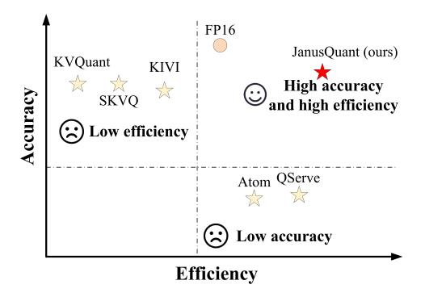
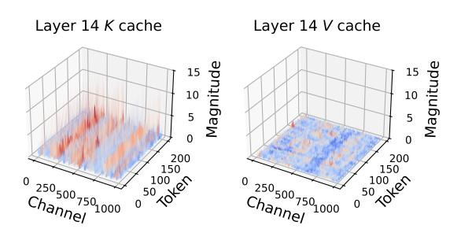
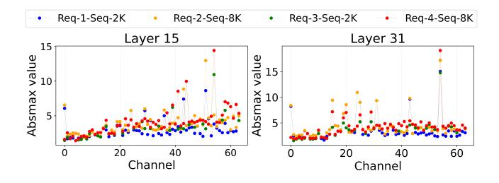
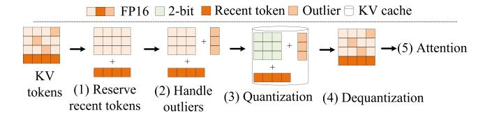
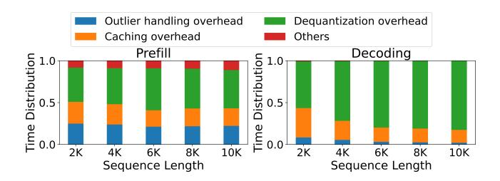
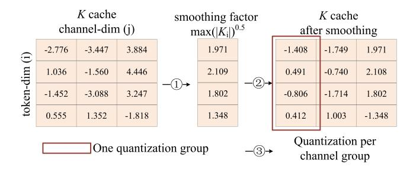
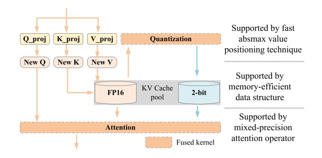
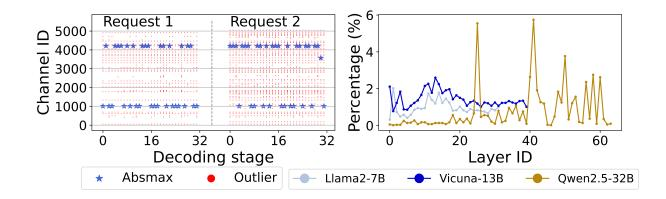
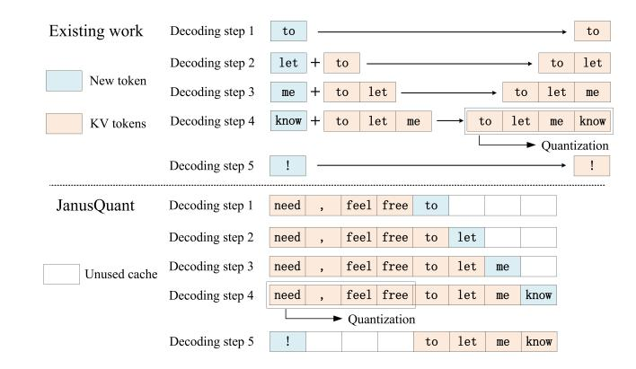
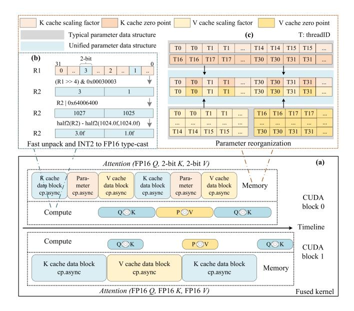

# 1 Introduction

Large language models (LLMs) [\[1,](#page-11-0) [8,](#page-11-1) [38\]](#page-12-0) have demonstrated exceptional performance across a wide range of advanced applications, significantly impacting our daily lives [\[22,](#page-11-2) [29,](#page-12-1) [31,](#page-12-2) [45,](#page-12-3) [49\]](#page-13-1). With the growing demand for tasks such as document summarization and code assistance, LLMs are increasingly expected to handle longer input contexts. Recent models like Deepseek-R1 [\[9\]](#page-11-3) and Llama-3.3 [\[28\]](#page-12-4), for example, support sequences up to 128K tokens. However, this extended context capability introduces significant deployment challenges. As sequence lengths grow, the key-value (KV) cache—a transient structure generated during autoregressive inference—begins to dominate memory usage. For instance, while the Llama2- 13B model has a fixed weight size of 24.5GB, serving a single request with 128K tokens in FP16 requires over 100GB of KV cache—far exceeding the capacity of a typical A100- 40GB GPU. Moreover, the attention mechanism must access all stored KV pairs during decoding, making the process highly memory-bound. As KV cache memory consumption increases, this memory bottleneck becomes a dominant limiter of inference performance.

Quantization is a direct and effective technique for reducing the memory footprint of the KV cache. By converting FP16 activations into lower-precision formats, significant memory savings can be achieved. Prior works such as FlexGen [\[35\]](#page-12-5) and Atom [\[53\]](#page-13-2) have incorporated 4-bit KV cache quantization into inference optimization pipelines,

Figure 1. Efficiency and accuracy of quantization methods.

demonstrating promising gains in efficiency. As serving systems strive for even higher compression ratios to support longer context lengths on resource-constrained GPUs, 2-bit KV cache quantization emerges as a compelling alternative. However, our analysis reveals a critical limitation: existing 2-bit quantization methods struggle to achieve an effective balance between accuracy and inference efficiency.

Several efficiency-oriented quantization systems, such as Atom [\[53\]](#page-13-2) and QServe [\[24\]](#page-12-6), aim to enhance inference efficiency by using offline calibration to determine quantization parameters and integrating these parameters with weights to minimize runtime overhead. However, these methods exhibit unacceptable accuracy degradation when applied at 2-bit precision. We attribute this to two key factors. First, while per-token quantization is straightforward and efficient, it leads to interference between channels: outlier values in one channel can significantly distort the quantization of neighboring values. Second, offline calibration is unable to adapt to dynamic runtime variations across different input requests and sequence lengths, making it ill-suited for managing outliers during generation.

To preserve model quality, accuracy-oriented quantization systems—SKVQ [\[12\]](#page-11-4), KVQuant [\[15\]](#page-11-5), and KIVI [\[27\]](#page-12-7)—adopt advanced techniques including channel reordering, denseand-sparse quantization, and recent token reservation. However, our analysis shows that these methods often incur higher latency than FP16 baselines without quantization. We attribute this inefficiency to three key sources of overhead. First, these systems require explicit outlier detection and extraction prior to quantization, introducing additional computation and global memory access overhead. Second, the caching strategies used for recent token reservation are costly, introducing memory concatenation overhead during the decoding process. Third, they rely on a separate dequantization kernel prior to attention computation, adding further latency due to dequantization overhead.

To this end, we propose JanusQuant, a 2-bit KV cache quantization system tailored for long-context LLM inference. As shown in Figure [1,](#page-1-0) JanusQuant leverages a co-design of algorithm and system to simultaneously improve accuracy

and efficiency, thereby realizing the practical potential of 2-bit quantization in LLM inference.

On the algorithmic front, JanusQuant introduces RtSmooth, a runtime per-token smoothing transformation that mitigates the impact of outliers. RtSmooth narrows intra-channel value gaps, enabling a more balanced representation across tokens. Unlike static calibration methods, RtSmooth dynamically adapts to KV cache variations across requests and sequence lengths, improving accuracy under diverse workloads. From a system perspective, JanusQuant builds on a key observation: the channel holding the absolute maximum (absmax) value per token is typically sparse and predictable. Leveraging this, we propose a fast absmax positioning technique that accesses fewer than 2% of channels to compute smoothing factors at runtime, significantly lowering outlier handling overhead. To further enhance memory efficiency, we design a new data structure for recent token reservation, which minimizes memory concatenation overhead during decoding. We also develop a custom mixed-precision attention kernel that fuses dequantization and attention computation, reducing kernel launch and memory access overhead.

We implement JanusQuant on top of PyTorch [\[32\]](#page-12-8) and Transformers [\[41\]](#page-12-9), supporting LLMs such as the Llama, Mistral, Vicuna and Qwen families. JanusQuant is lightweight and easy to integrate into other models. To our knowledge, JanusQuant is the first system to fully leverage 2-bit KV cache quantization to achieve both high accuracy and efficient inference in practical long-context LLM deployment.

Our contributions are summarized as follows:

- Characterization of design limitations: We analyze the limitations of existing 2-bit KV cache quantization systems and identify key sources of overhead, including inefficient token caching, hardware-unfriendly outlier handling, and separate dequantization operations.
- Quantization algorithm: We propose RtSmooth, a runtime per-token smoothing algorithm that adaptively mitigates outliers to reduce quantization difficulty. To minimize overhead, we introduce a fast absmax positioning technique that exploits the sparsity and regularity of per-token maxima.
- System-level optimizations: We design a memoryefficient token cache and a custom mixed-precision attention kernel to address overheads in KV token management and computation. These system components co-optimize with RtSmooth to deliver high-speed inference.

Experimental results on several representative LLMs—across varying model sizes and context lengths—show that JanusQuant delivers decoding speedups of 5.64× over FP16, 5.84× over KIVI, 4.45× over QServe, and 2.50× over DuoAttention. Additionally, JanusQuant reduces long-context KV cache memory consumption by 5.3× compared to FP16, enabling more efficient deployment on resource-constrained hardware.

#### 2 Background and Motivation

#### 2.1 Generative Inference and KV Cache

LLMs typically adopt a decoder-only transformer architecture optimized for next-token prediction. The inference process consists of two stages: prefill and decoding. In the prefill stage, the model processes the entire input prompt to compute contextual representations and generate the first output token. In the decoding stage, LLMs iteratively generate one token at a time, using the most recent token along with previously generated tokens as input. Central to this process is the self-attention mechanism, which enables each token to incorporate contextual information from preceding tokens. The core computation is multi-head attention, defined as:

$$Attention(Q, K, V) = Softmax(\frac{Q \times K^{T}}{\sqrt{h}}) \times V$$
 (1)

where the Query (Q), Key (K), and Value (V) matrices are computed by projecting input tokens through corresponding learned weight matrices, and h denotes the number of attention heads. During the prefill stage, Q, K, and V have the same dimensions, proportional to the prompt length. In the decoding stage, however, the attention computation involves only a single Q (from the current token) and all previously computed K and V matrices. To avoid recomputing K and V at each decoding step, these matrices are cached in memory—known as the KV cache. This cache significantly accelerates inference but introduces memory and bandwidth challenges, especially for long sequences.

#### 2.2 Quantization Technique

While the KV cache reduces computation during decoding, its memory usage grows linearly with sequence length, becoming a major bottleneck for deploying LLMs on resource-constrained hardware. Quantization is an effective technique to compress the KV cache by mapping high-precision floating-point values to *n*-bit low-precision discrete integers. A typical quantization process involves the following steps:

1. Compute quantization parameters—specifically, the scaling factor *s* and the zero point *z*:

$$s = \frac{max(X) - min(X)}{2^{n} - 1}, z = min(X)$$
 (2)

2. Quantize the original tensor X to a low-precision  $Q_X$ :

$$Q_X = clamp(\frac{X-z}{s}, 0, 2^n - 1)$$
(3)

3. Dequantize  $Q_x$  to an approximate high-precision  $\hat{X}$ :

$$\hat{X} = (O_x \times s) + z \tag{4}$$

Quantization can be applied at different levels of granularity. Per-tensor quantization uses a single scaling factor

**Table 1.** Existing efficiency-oriented quantization systems fail to maintain models' accuracy when extending their solutions to 2-bit precision.

| Methods     | Accuracy (Llama2-7B perplexity) |  |  |  |
|-------------|---------------------------------|--|--|--|
| FP16        | 5.47                            |  |  |  |
| Atom [53]   | 4-bit: 5.93 / 2-bit: 103.05     |  |  |  |
| QServe [24] | 4-bit: 5.70 / 2-bit: 11.36      |  |  |  |

Figure 2. Magnitude of the KV cache on Llama2-13B.

and zero point for the entire tensor. Per-channel quantization assigns distinct parameters to each column, while pertoken quantization does so for each row. A more fine-grained approach, per-group quantization, further subdivides each channel or token into groups, applying separate quantization parameters per group. We denote the group size as *q*.

#### 2.3 Challenges in 2-bit KV Cache Quantization

Numerous studies [3, 24, 35, 53] have employed 4-bit KV cache quantization as part of inference optimization strategies. However, as LLMs scale to longer context lengths, 4-bit quantization increasingly falls short on resource-constrained GPUs. For example, applying 4-bit group quantization with a group size of g=128 to a 128K-token sequence results in 26.6GB of KV cache memory usage—still exceeding the capacity of an A100-40GB GPU when serving the Llama2-7B model, which already occupies 14GB of weights.

To achieve higher compression, 2-bit quantization presents a compelling alternative. It not only enables support for longer contexts, but also offers greater theoretical speedups due to the memory-bound nature of attention operations. However, existing 2-bit KV cache quantization systems struggle to balance accuracy and efficiency, thereby hindering their practical deployment.

**2.3.1** Accuracy Limitations of Prior Efficiency-oriented Methods. Efficiency-oriented methods such as Atom [53] and QServe [24] apply per-token group quantization to the KV cache, leveraging row-major memory access patterns for faster execution. To reduce accuracy degradation caused by outliers, QServe introduces a per-channel smoothing transformation for the *K* cache, adapted from SmoothQuant [43]. Specifically, channels in

**Figure 3.** The absmax value per channel varies with different requests and different sequence lengths.

the K cache are scaled using smoothing factors  $\gamma$ , such that  $Q \times K^T = (Q \times \Delta) \times (K \times \Delta^{-1})^T$ , where  $\Delta = diag(\gamma)$  and  $\gamma_j = max(|K_j|)^\alpha$ ,  $0 \le j < hidden\_size$ . To reduce runtime overhead, QServe precomputes  $\Delta$  via offline calibration and integrates it into the preceding layer's weights, modifying them as  $W_Q = \Delta W_Q$  and  $W_K = \Delta^{-1}W_K$ . While these methods maintain reasonable accuracy under 4-bit quantization, they fail to generalize to 2-bit precision. As shown in Table 1, the perplexity of Atom on Llama2-7B rises from 5.93 (4-bit) to 103.05 (2-bit). Although QServe performs better than Atom, its accuracy at 2-bit precision remains insufficient for practical use. Through further analysis, we identify two primary causes of accuracy loss in these systems under 2-bit quantization, as discussed next.

(1) Outlier channels amplify quantization error in grouped quantization. As shown in Figure 2, the K cache exhibits strong outliers concentrated in some channels, whereas the V cache does not. In per-token group quantization, outliers in one channel can significantly increase the quantization error of neighboring values. To quantify this effect, we compute the mean square error (MSE) of the K cache under 2-bit quantization in three settings: (a) Atom, (b) OServe, and (c) an ideal case where the most extreme outlier channel in each group is replaced with a non-outlier channel before applying OServe. On randomly selected WikiText2 sentences, the MSEs are 1.0352 (Atom), 0.5552 (QServe), and 0.3734 (ideal case). These results show that while QServe's smoothing transformation reduces the error gap caused by outliers compared to Atom, it does not fully mitigate the interference—outlier channels continue to inflate the quantization error of other values in the same group.

(2) Offline calibration fails to adapt to runtime dynamics of the KV cache. QServe relies on offline calibration to compute per-channel smoothing factors using a predefined dataset. However, because these factors are derived solely from static channel-wise absmax values, they cannot adapt to variations across input requests or sequence lengths. To evaluate this, we sample random sentences of varying lengths and measure the per-channel absmax values, as shown in Figure 3. It is observed that these absmax values fluctuate significantly—sometimes by more than 4×

**Figure 4.** Workflow of accuracy-oriented 2-bit KV cache quantization methods.

across requests and sequence lengths. Because the smoothing factors are fixed at calibration time, they fail to reflect these runtime shifts, resulting in reduced quantization accuracy, especially at 2-bit precision. Notably, although our results are shown for fixed-length sequences, this mismatch becomes more severe with increasing context lengths, where KV cache variance is even more pronounced.

2.3.2 Efficiency Limitations of Prior Accuracy-oriented Methods. Several studies have explored strategies to preserve accuracy in 2-bit KV cache quantization. For example, SKVQ [12] uses channel reordering to group channels with similar distributions. KVQuant [15] adopts a dense-and-sparse quantization approach, isolating outliers for separate sparse attention computation. KIVI [27], on the other hand, stores a fixed number of recent tokens in FP16 precision. As illustrated in Figure 4, these systems generally follow a similar multi-step pipeline: (1) retain recent tokens in FP16; (2) detect and extract outliers; (3) quantize the remaining KV cache; (4) dequantize before attention; and (5) perform attention computation. Despite their accuracy benefits, these methods suffer significant performance bottlenecks, which we attribute to three sources.

- (1) Outlier handling overhead. Outliers must be detected and handled prior to quantization. Systems like SKVQ [12] and KVQuant [15] first identify outliers among generated tokens, then reorder channels to group them by value range into variable-sized segments. These operations introduce non-trivial overhead—and because these steps are memory-bound, the cost grows linearly with sequence length.
- (2) Caching overhead. Reserving recent tokens in FP16 is critical for preserving accuracy, especially in long-context inference where attention prioritizes recent information. Prior works such as SKVQ [12] and KIVI [27] adopt a sliding-window caching strategy that appends new tokens to the end and removes the oldest from the front. The evicted token is then quantized and added to the low-precision KV cache. However, this approach incurs extra memory overhead, as each append and remove operation during decoding requires tensor concatenation, which is costly and frequent.
- (3) Dequantization overhead. SKVQ [12] performs outlier extraction and rearrangement across hidden dimensions, which conflicts with the multi-head attention mechanism. Since attention heads are computed independently but may

Figure 5. Runtime breakdown of Llama2-7B attention layer.

share quantization groups, the dequantization kernel cannot be fused with attention computation. This results in a separate dequantization step and adds memory-bound overhead that scales linearly with sequence length.

To further illustrate the overhead, we analyze the attention layer kernels of the SKVQ baseline [12]. Figure 5 shows the runtime breakdown for the Llama2-7B attention layer. The results reveal that the combined overhead from outlier handling, recent token reservation and separate dequantization accounts for over 85% of total runtime in the prefill stage (20% / 20% / 45%) and over 97% in the decoding stage (2% / 15% / 80%). These costs significantly limit end-to-end inference efficiency, especially during decoding.

**Summary.** Previous attempts at 2-bit KV cache quantization face fundamental trade-offs. Efficiency-oriented methods avoid runtime outlier handling through offline calibration but suffer significant accuracy loss, while accuracy-oriented methods rely on recent token reservation and complex outlier handling to preserve accuracy but remain less efficient than FP16 inference. These challenges call for runtime-aware approaches that mitigate outlier effects across diverse requests. Moreover, advancing end-to-end performance requires lightweight outlier detection, memory-efficient data structures for the cache, and fused mixed-precision attention kernel to reduce deployment costs.

#### 3 JanusQuant Design and Implementation

We introduce JanusQuant, a system that unifies an outlier-aware quantization algorithm with a set of system-level optimizations to enable accurate and efficient 2-bit KV cache quantization. JanusQuant is co-designed across algorithm and system: its core component, RtSmooth, dynamically adapts to outlier patterns at runtime, while the supporting architecture minimizes memory and compute overhead through lightweight data structures and fused computation. Together, these components enable JanusQuant to deliver both high compression and high accuracy, with practical performance gains for long-context LLM inference.

#### 3.1 RtSmooth: An Outlier-Aware Algorithm

As discussed in our motivation analysis, accurate outlier handling in the K cache is essential for maintaining model accuracy under 2-bit quantization. Our design is based on

**Figure 6.** An example of RtSmooth algorithm, suppose g = 4.

three key insights: (1) Using per-channel quantization for the K cache helps localize outlier effects, since outliers are typically concentrated in some channels—unlike per-token quantization, where grouped values from different channels are affected. (2) To adapt to dynamic runtime conditions (e.g., different requests or sequence lengths), outlier handling must occur at runtime. (3) Due to the locality bias in the attention mechanism, preserving a small number of recent KV tokens in FP16 is important during decoding. Based on these observations, we propose RtSmooth, an outlieraware quantization algorithm. Specifically, RtSmooth applies per-token smoothing transformation alongside per-channel group quantization for the K cache, and uses per-token group quantization for the V cache. During decoding, it maintains FP16 precision for newly generated KV tokens and performs quantization on the buffered FP16 tokens every *q* steps.

RtSmooth dynamically determines smoothing factors at runtime for each request to improve accuracy. As illustrated in Figure 6, it first computes the smoothing factor for each token as  $max(|K_i|)^{\lambda}$ , where  $\lambda=0.5$  is selected empirically based on experimental results. The computed factors are then applied to scale each token's values. This runtime smoothing transformation reduces the value range within each quantization group, narrowing the gap between the maximum and minimum values, thereby reducing quantization error. Let  $\epsilon_{gp}$  denote the quantization error for values in a group gp. Its upper bound is defined by the quantization scale:

$$\epsilon_{gp} \le \frac{s_{gp}}{2}, s_{gp} = \frac{max_{gp} - min_{gp}}{2^n - 1}$$
 (5)

Reducing the quantization scale  $s_{gp}$  leads to smaller quantization error, meaning dequantized values more closely approximate their original floating-point values. After smoothing, the value range shrinks, resulting in a lower error bound:

$$\epsilon_{smooth(gp)} \le \frac{s_{smooth(gp)}}{2} < \frac{s_{gp}}{2}$$
 (6)

While RtSmooth maintains high accuracy in 2-bit quantization, it introduces additional processing overhead during both quantization and dequantization. The JanusQuant system integrates lightweight architectural optimizations to hide this overhead and enable efficient deployment.

Figure 7. Workflow of JanusQuant.

Figure 8. Left: the absmax value and outlier value distribution of the 2-nd layer cache of Llama2-13B model. Right: the ratio of the calibrated channel set size relative to the total number of channels. The input data comes from WikiText2.

#### 3.2 System-level Optimizations

Leveraging the RtSmooth algorithm, JanusQuant synergizes three key attention-layer optimizations (Figure [7\)](#page-5-0). For quantization, it introduces a fast absmax positioning technique to reduce the overhead of runtime outlier handling. For caching, it employs a memory-efficient data structure that transitions seamlessly from FP16 KV buffering to low-bit quantization. For dequantization, it implements a custom mixed-precision attention kernel that fuses dequantization and attention computation to minimize processing overhead.

3.2.1 Lightweight Quantization via Fast Absmax Value Positioning. Figure [8](#page-5-1) (left) presents the distribution of absmax and outlier [1](#page-5-2) values. Outliers exhibit dynamic variation across requests and decoding steps, incurring substantial overhead for direct identification. In contrast, the absmax values exhibit a layer-wise pattern of sparsity and regular concentration: a small subset of channels consistently accounts for the absmax values across tokens. This insight motivates our fast absmax value positioning technique (FAVP), which combines offline calibration with lightweight runtime computation to reduce overhead. With a one-time calibration (only a few minutes) before deployment, we identify the most likely absmax channels for each layer. Figure [8](#page-5-1) (right) shows that these channels remain stable and sparse across 128 random 8K-length WikiText2 samples, with over 90% of layers involving fewer than 2% of all channels.

Figure 9. Two methods of recent token reservation ( = 4).

At runtime, we restrict the smoothing factor computation to only these channels, dramatically reducing memory access. Without this technique, computing the absmax across all channels incurs substantial overhead. In fact, as shown in Figure [15a,](#page-10-0) more than 80% of the quantization kernel's overhead stems from absmax calculation. Our technique significantly mitigates this bottleneck. To further improve efficiency, we implement a fused quantization operator that integrates the smoothing transformation with quantization parameter (scaling factor and zero point) computation and reorganization, and KV cache quantization. Note that the parameter reorganization—an optimization for attention calculation—is detailed in Section [3.2.3.](#page-6-0)

3.2.2 Token Reservation via Memory-efficient Data Structure. While prior works such as KIVI [\[27\]](#page-12-7) preserve model accuracy by reserving several recent tokens in FP16 precision, they often rely on inefficient caching mechanisms that degrade inference speed. As illustrated in Figure [9,](#page-5-3) these implementations use memory-intensive tensor concatenation to sequentially store recent tokens, quantizing the entire group once a fixed size is reached [2](#page-5-4) . This approach incurs global memory movement at each decoding step, as concatenation triggers memory reallocation and data copying.

To mitigate the associated overhead, a straightforward approach involves maintaining a fixed cache capable of accommodating tokens, thereby reducing the frequency of memory allocation and copying. While this approach improves efficiency, it may not adequately account for the effects on accuracy. In the current implementation, not all decoding steps benefit from the accuracy improvements associated with recent token reservation. For example, the cached recent tokens are reset to zero after each quantization, means that the next decoding will only have one newly generated token with FP16 precision; while ideally, reserving at least 32 tokens for each decoding would improve accuracy [\[14\]](#page-11-8).

The above observations motivate the development of a novel data structure that optimizes the trade-off between

1Following prior works [\[6\]](#page-11-7), values greater than 6 are identified as outliers.

2Following prior works [\[12,](#page-11-4) [27\]](#page-12-7), we set = 32 for 2-bit quantization.

**Figure 10.** Kernel timeline and optimization strategies.

memory usage and accuracy by appropriately increasing memory allocation. The design centers on piecewise quantization, which separates the tokens involved in the quantization process from at least the most recent g tokens. As shown in Figure 9, in this example, the cache is fixed to hold 2g tokens, with newly generated tokens alternately assigned to the first or second half of the cache. Upon reaching full capacity, the system automatically quantizes the older half and transfers them to the quantized KV cache.

Despite this cache size being sufficient to improve accuracy in experiments, JanusQuant implements efficient caching based on a ring buffer data structure, enhanced with pointers to manage critical information, such as the location of the next token, the decision to perform quantization, and the identification of the next segment to be quantized. This approach facilitates user-defined cache size as any integer multiples of g, thereby accommodating diverse accuracy requirements. Specifically, when the cache accommodates ng tokens, each decoding process retains at least (n-1)g tokens.

Furthermore, the cache introduces no additional overhead since it is pre-allocated prior to inference, and the extra memory consumption remains negligible, especially in long-context reasoning scenarios. For example, when processing 128K tokens, the additional memory reserved for full precision (assuming the cache holds 2g tokens) amounts to only 0.05% of the total token count.

