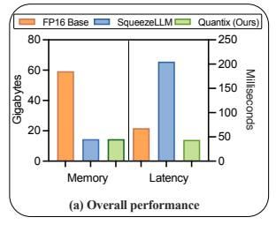
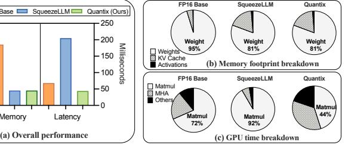

# 1 Introduction

Large Language Models (LLMs) have attracted increasing research and industrial attention [\[34,](#page-11-0) [37,](#page-11-1) [43\]](#page-12-1), but their practical

[This work is licensed under a Creative Commons Attribution 4.0 Interna](https://creativecommons.org/licenses/by/4.0)[tional License.](https://creativecommons.org/licenses/by/4.0)

PPoPP '26, Sydney, NSW, Australia © 2026 Copyright held by the owner/author(s). ACM ISBN 979-8-4007-2310-0/2026/01 <https://doi.org/10.1145/3774934.3786423>

deployment is often constrained by their massive size that requires hundreds of gigabytes of memory just to store the model weights [\[36,](#page-11-2) [43\]](#page-12-1). It creates a significant bottleneck in memory bandwidth, which limits inference throughput during auto-regressive generation where weights are repeatedly fetched from memory [\[2,](#page-10-0) [11\]](#page-11-3).

Weight-only quantization is a widely used strategy to address the memory challenge by reducing the numerical precision of model weights from 16-bit floating-point to lower bit-widths [\[7,](#page-11-4) [10,](#page-11-5) [11,](#page-11-3) [24,](#page-11-6) [39,](#page-12-2) [42\]](#page-12-3). Pioneering methods typically adopt uniform quantization [\[3,](#page-10-1) [6,](#page-11-7) [10,](#page-11-5) [11\]](#page-11-3), which maps floating-point (FP) values to low-bit integers (INT) with uniformly spaced intervals. Uniform quantization incurs lightweight computations as the conversion between FP and INT can be efficiently implemented with bitwise intrinsics. Nonetheless, it struggles with accuracy at ultra-low bit-widths.

Recently, non-uniform quantization [\[6,](#page-11-7) [19,](#page-11-8) [33\]](#page-11-9) is developed to deliver high compression while preserving nearlossless model accuracy. Instead of a linear mapping, these approaches use K-means clustering to the weight distribution. Each weight is replaced by a low-bit index W pointing to a shared, full-precision cluster centroid C, such that the reconstructed weight is W† = C[W]. Clustering provides a finer approximation of irregular weight distributions, leading to higher model quality. For example, non-uniform SqueezeLLM reduces the perplexity (a metric where lower scores indicate higher model accuracy) for a 3-bit LLaMA-7B model to 6.32, significantly outperforming the 7.55 offered by the uniform GPTQ [\[19\]](#page-11-8).

However, the non-uniform quantization often introduces a counter-intuitive trade-off: Although compressing weights reduces memory traffic and should benefit memory-bound LLM inference, it instead brings substantial slowdowns (see § [3\)](#page-2-0). These slowdowns arise from the three stages of LLM inference: (1) during offline quantization, sub-byte formats such as 3 bits misalign with GPU data types (32-bit INT), leading to wasted or scattered bits, (2) during online dequantization, reconstructing W† = C[W] requires pointer-based memory accesses that break cache locality and remarkably increases instruction overhead, and (3) during matrix multiplication, execution proceeds token by token as sequential matrix–vector multiplications on CUDA cores, underutilizing the massive parallelism (e.g., Tensor Cores) of modern GPUs.

To address these challenges, we propose Quantix, a highperformance framework for non-uniformly quantized 3-bit LLM inference. We focus on 3-bit quantization as it presents the most significant and unique challenges for efficient hardware execution, requiring novel solutions for bit packing, memory alignment, and cache optimization. Moreover, our analysis of performance challenges and the proposed optimization techniques are broadly applicable and can be effectively extended to other bit-widths (e.g., 2 and 4), which pose fewer but related hardware challenges. Also, we prioritize batched inference, where multiple tokens are generated in parallel, as real-world deployments demand massive throughput (e.g., OpenAI serves millions of tokens per second [15]). Batched inference is particularly challenging, as its higher arithmetic intensity limits the ability to fully overlap computation with reduced memory movement.

Quantix integrates several key optimizations to boost non-uniformly quantized LLM inference. First, it employs offline bit shuffling (§ 4.2) to reorganize the quantized weights ( $\mathbf{W}_q$ ) for aligned and coalesced GPU access. This transformation is lossless w.r.t. the non-uniformly quantized model, because it leaves the cluster centroids (C) unchanged, thereby fully preserving model accuracy. Second, Quantix implements a fused kernel for data prefetching, loading, dequantization and matrix multiplication (§ 4.3), incorporating a hierarchical software pipeline to overlap these steps. Further, dequantization is performed on CUDA cores with in-register optimizations, and parallel matrix—matrix multiplication is accelerated on Tensor Cores, facilitating efficient batched inference.

The performance of Quantix is evaluated on both kernel and model levels, in comparison with state-of-the-art methods, including SqueezeLLM [19], Any-Precision [33], Marlin [11], and Bitsandbytes [6]. At the kernel level, Quantix's 3-bit matrix multiplication achieves an average speedup of 4.82× (up to 8.40×) over the FP16 cuBLAS baseline on an inference-optimized L40 GPU. At the model level, Quantix enables the LLaMA-65B model to be served on a single GPU, which is infeasible with FP16, achieving more than 10× higher throughput than SqueezeLLM.

In summary, our contributions are listed as follows:

- We identify the performance bottlenecks of 3-bit nonuniform quantized LLM inference on GPUs, including inefficient bit-packing, high dequantization overhead, and GPU underutilization.
- We propose Quantix, a high-performance framework that overcomes these issues by integrating hardware-aligned bit shuffling, in-register dequantization and Tensor Coreaccelerated computation within a hierarchical pipeline.
- We demonstrate significant speedups with Quantix at both the kernel and end-to-end model levels, validating its performance and scalability across various bit-widths, LLM models, and GPUs.

#### 2 Background and Related Work

### 2.1 GPU Architecture

NVIDIA GPUs are widely adopted for parallel computing, featuring multiple Streaming Multiprocessors (SMs) that include general-purpose CUDA Cores and specialized Tensor Cores. CUDA Cores handle scalar arithmetic and thread-level logic operations, enabling diverse computations. Tensor Cores [25], on the other hand, are optimized for low-precision dense matrix operations and support matrix multiplication and accumulation (MMA). They deliver significantly higher throughput than CUDA Cores, accelerating deep learning workloads with supported MMA shapes such as  $\langle 16, 16, 16 \rangle$  in FP16 [20, 25].

Despite improvements in compute performance, especially from Tensor Cores, memory bandwidth has lagged behind. Over two decades, peak server FLOPS have increased by  $\sim\!60,\!000\times$ , while DRAM bandwidth has improved by only  $\sim\!100\times[14]$ . This imbalance has caused many low arithmetic intensity workloads to become memory bound, shifting the performance bottleneck from computation to data movement, a phenomenon known as the "memory wall."

#### 2.2 LLM Inference Workload Characteristics

Large Language Models (LLMs) are based on the transformer architecture [37], which consists of stacked layers of multihead self-attention and feed-forward networks (FFNs). Self-attention generates context-aware token embeddings by computing query-key similarities, while FFNs apply nonlinear transformations independently to each token. LLM inference workloads are characterized by two phases with distinct compute and memory behaviors [32]:

In the **prefill phase**, the full input prompt is processed in parallel, making it compute-bound due to large matrix multiplications. Given input activations  $\mathbf{A} \in \mathbb{R}^{N \times K}$  and weights  $\mathbf{W} \in \mathbb{R}^{K \times M}$ , the output  $\mathbf{Y} = \mathbf{A} \times \mathbf{W}$  involves  $N = L \times B$  total tokens, where L is sequence length and B is batch size.

In the **decode phase**, tokens are generated autoregressively, with only one token per sequence processed at each step ( $N = 1 \times B$ ). The smaller workload reduces arithmetic intensity but frequently accesses weights and KV cache, making this phase memory-bound.

#### 2.3 LLM Quantization

Quantization techniques for neural networks fall into two main categories: *Quantization-Aware Training (QAT)* and *Post-Training Quantization (PTQ)*. QAT simulates quantization during training to maintain accuracy [18, 27]. By contrast, PTQ quantizes a pretrained model without retraining [10, 19, 28, 33], making it more practical. Quantization can be applied to *weights* and *activations*. Weight quantization is widely used to reduce model size, while activation quantization is less common due to its dynamic variability [7, 41].

Figure 1. Performance comparison between FP16 baseline, 3-bit SqueezeLLM and Quantix for OPT-30B on A100

The value mapping scheme in quantization can be uniform or non-uniform. Uniform quantization uses fixed scale and zero-point to map values to evenly spaced levels [\[18\]](#page-11-15), as in FP6-LLM [\[39\]](#page-12-2), GPTQ [\[10\]](#page-11-5), AWQ [\[24\]](#page-11-6) and SmoothQuant [\[40\]](#page-12-5). With efficient bitwise intrinsics, Marlin [\[11\]](#page-11-3) accelerates LLM inference with uniform 4-bit quantization. Conversely, nonuniform quantization, as adopted by SqueezeLLM [\[19\]](#page-11-8) and Any-Precision LLM [\[33\]](#page-11-9), adapts to data distribution, consistently delivering better accuracy at low bit-widths. Any-Precision LLM improves upon SqueezeLLM by supporting wider bit-widths and enhancing CUDA core utilization. Bitsandbytes [\[6\]](#page-11-7) supports both uniform and non-uniform schemes. Our work focuses on accelerating inference for LLMs that use post-training, weight-only, non-uniform quantization.

Model pruning is another common approach to reduce parameter size by eliminating redundant weights [\[9,](#page-11-18) [17,](#page-11-19) [22,](#page-11-20) [35\]](#page-11-21). Pruning can target either structured blocks [\[4,](#page-10-2) [23\]](#page-11-22) or unstructured individual weights [\[21,](#page-11-23) [22,](#page-11-20) [26\]](#page-11-24). Similar to quantization, the matrix sparsity from pruning often requires careful optimization to translate into actual inference speedups on GPUs [\[12\]](#page-11-25). Since pruning is orthogonal to quantization, the two techniques can be jointly applied to achieve higher model compression and accuracy [\[8,](#page-11-26) [16,](#page-11-27) [19\]](#page-11-8).

