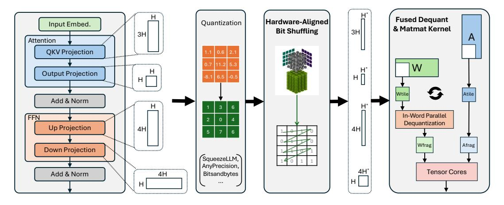
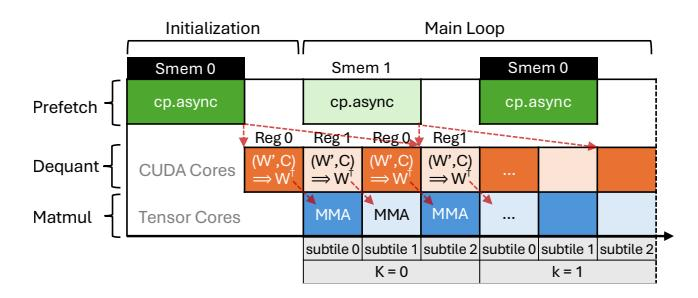
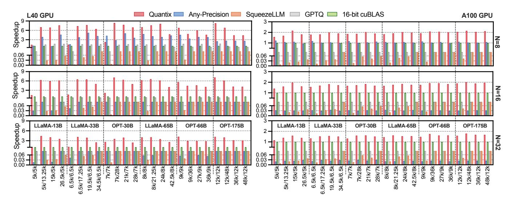
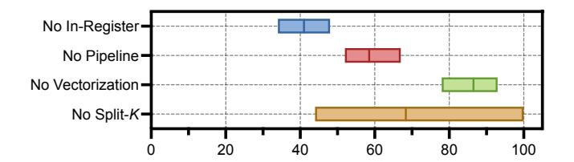

# 4 Quantix Design

#### 4.1 Design Overview

To overcome the aforementioned challenges, we introduce Quantix, a high-performance framework that accelerate existing advanced low-bit quantization schemes. As visualized in Fig. [5,](#page-4-0) Quantix effectively converts memory savings into inference speedups through two key co-designed components: (1) hardware-aligned bit shuffling, and (2) a highly optimized fused kernel.

First, we leverage the static nature of model weights by applying a one-time, offline weight transformation. Quantix employs a novel hardware-aligned bit shuffling (detailed in [§4.2\)](#page-3-0). This critical pre-processing step reorganizes the packed 3-bit data into a hardware-friendly layout. The goal is to ensure that all memory accesses during the online inference stage are perfectly aligned and coalesced, which is essential for maximizing GPU memory bandwidth.

Second, to exploit the GPU hardware effectively, we design a single fused kernel that combines the dequantization and matrix multiplication stages (detailed in [§4.3\)](#page-5-0). The fused kernel is built to orchestrate the use of both CUDA and Tensor Cores efficiently. It uses in-register dequantization ([§4.3.2\)](#page-5-1) to prepare weights on CUDA Cores while immediately feeding the results to the specialized Tensor Cores for high-throughput matmul. The entire process is managed by a hierarchical software pipeline ([§4.3.3\)](#page-6-0) that overlaps memory transfers, dequantization and computations, effectively hiding latency and maximizing hardware utilization.

#### <span id="page-3-0"></span>4.2 Hardware-Aligned Bit Shuffling

To prepare the quantized weight matrix W for efficient GPU computation, Quantix performs bit shuffling that transforms the layout of the quantized weights (W) without modifying the cluster centroids (C), thereby fully preserving model accuracy. Bit shuffling achieves both coalesced memory access and high storage density, overcoming the respective inefficiencies of naive spanning and padding strategies.

<span id="page-4-0"></span>

Figure 5. Overview of Quantix

The weight bits are shuffled to align with the hardware features via two steps: *bit dividing* and *bit mapping*. Since it is a one-time, offline operation on static model weights, the cost of bit shuffling is negligible as it's amortized over all inference runs.

Step 1: Bit Dividing for Memory Alignment. This step transforms the difficult problem of packing odd-bit data (3-bit) into simpler problems of packing 1-bit and 2-bit data, which align perfectly with native GPU integer types. As shown in Figure 6a, the 3-bit element in the quantized weight matrix  $\mathbf{W}_q$  is divided into two components: a single bit and the remaining two bits. The specific single bit chosen for separation (e.g., the most or least significant bit) is arbitrary, as a consistent inverse mapping is applied during dequantization (see § 4.3.2). These components are then used to populate two new matrices of identical dimensions:  $\mathbf{W}_{q,1}$ , which contains only 1-bit elements, and  $\mathbf{W}_{q,2}$ , which contains 2-bit elements.

The efficacy of bit dividing lies in the subsequent packing process. Since both 1 and 2 are factors of 32 and 64, the elements from the new matrices can be packed perfectly native 32-bit and 64-bit INT. Specifically, 32 elements from  $\mathbf{W}_{q,1}$  precisely occupy a 32-bit word, and 32 elements from  $\mathbf{W}_{q,2}$  exactly fill a 64-bit word. Consequently, bit dividing overcomes the limitations of both naive bit-packing strategies aforementioned in § 3.2. It eliminates the memory fragmentation of padding by perfectly packing elements into standard INTs and avoids the inefficient data access pattern of spanning by ensuring no element crosses a word boundary.

Step 2: Bit mapping for Tensor-Core Alignment. This step addresses the layout mismatch between the logical structure of tiles and the physical memory layout required for Tensor Cores (TCs), a challenge detailed in §3.4. To cope with this challenge, Quantix further maps the packed elements of  $\mathbf{W}_{q,n}$  to align with the data access patterns of Tensor Cores and improve spatial locality.

As depicted in Figure 7b, each warp is first assigned a  $64 \times 64$  tile, which is further divided into sixteen  $16 \times 16$ 

<span id="page-4-1"></span>

**Figure 6.** Bit dividing for memory alignment. Numbers 1-3 in boxes represent bit positions within elements.

<span id="page-4-2"></span>

**Figure 7.** Bit mapping for Tensor Core (TC) alignment. Warp tile consists of 16 TC tiles, showing 4 for clarity.

TC tiles. Within each TC tile, every thread is responsible for 4 pairs of elements. Next, Quantix aligns the data layout to TCs by gathering all elements assigned to a single thread across these 16 tiles into a single contiguous segment. This mapping procedure produces a linear memory space for the warp tile, consisting of 32 contiguous weight segments (denoted as  $\mathbf{W}'_n$ , where n = 1, 2 indicates the bit width), one for each thread. Each segment has a logical size of  $16(tiles) \times 4(pairs) \times 2(elements/pair) \times n(bits/element) =$ 

128n bits. Additionally, the bit mapping step is performed independently on the two matrices  $\mathbf{W}_{q,1}$  and  $\mathbf{W}_{q,2}$  generated in Step 1, organizing their respective INT-packed data into the final contiguous weight segments.

The two-step bit shuffling aligns the data access pattern to GPU's memory system and Tensor Cores. Step 1 ensures word-aligned, coalesced memory accesses. Step 2 allows each thread to retrieve its entire data assignment for the Tensor Cores with a short burst of sequential loads. Furthermore, the large segment sizes facilitate efficient long-vector instructions. For example, the 128-bit  $\mathbf{W}_1'$  weight segment is fetched with a single  $\mathtt{cp.async}$  instruction with 128-bit width, while the 256-bit  $\mathbf{W}_2'$  weight segment utilizes two such instructions. More details in vectorization are discussed in §4.3.

#### <span id="page-5-0"></span>4.3 High-Performance Fused Kernel

**4.3.1 Execution Model.** Quantix's kernel fuses memory access, dequantization, and computation into a hierarchical software pipeline. It hides the latency of data movement and preparation to maximize the utilization of Tensor Cores. The execution model of the fused kernel is outlined in Algo. 1. The kernel first performs a one-time initialization. The initial warp tiles are fetched to shared memory (line 2). A subset of the initial tiles is further loaded to registers and dequantized (line 3) to prepare for the upcoming pipelined execution.

#### **Algorithm 1:** Fused Kernel in Quantix

```
Input: Quantized weights W'_1 (1-bit), W'_2 (2-bit); Activations A;
             Centroids C
   Output: Result matrix Y = A \times Dequant(W'_1, W'_2, C)
1 for each processing unit do in parallel
         // Initialization
         Fetch initial warp tiles to shared memory (smem)
         Load subtile from smem to registers and dequantize weights
         // Main Loop with Hierarchical Pipeline
         for k \leftarrow 0 to Number of K-tiles - 1 do
               // Inter-tile level: Overlap Compute and Memory
               Prefetch \mathbf{W}'_{1,k+1}, \mathbf{W}'_{2,k+1}, \mathbf{A}_{k+1} to shared memory
 5
               // Intra-tile level: Overlap Dequant and Matmul
               for s \leftarrow 1 to Number of subtiles do
                     Load subtile s from shared memory to registers
                     \mathbf{W}_{k.s}^{\dagger} \leftarrow \text{Dequant}(\mathbf{W}_{1,k,s}', \mathbf{W}_{2,k,s}', \mathbf{C}_{k,s})
                     \mathbf{Y}_{k,s-1} \leftarrow \mathrm{Matmul}(\mathbf{Y}_{k,s-1},\mathbf{A}_{k,s-1},\mathbf{W}_{k,s-1}^{\dagger})
               Synchronize and wait for prefetch completion
10
         Store Y back to global memory
11
```

The core of the kernel is organized as a nested loop that drives the hierarchical pipeline (lines 4–10). At inter-tile level, memory transfers are overlapped with computation (line 5-6). At intra-tile level, dequantization on CUDA Cores is overlapped with multiplication on Tensor Cores (line 8-9). The first subtile consumed by Tensor Cores is already prepared during initialization (line 3). The details of the pipeline design are further elaborated in § 4.3.3.

Fig. 8 illustrates the data movement through the GPU memory hierarchy within the fused kernel. 1. The kernel

<span id="page-5-3"></span>

Figure 8. Data movement across memory hierarchy

operates on the hardware-aligned weight layout  $(\mathbf{W}')^1$  organized via bit shuffling. The online execution begins with the Prefetch stage (a), where the kernel issues asynchronous copy instructions  $(\mathbf{cp.async}$  with 128-bit width) to prefetch the weight segments  $(\mathbf{W}')$  and activations  $(\mathbf{A})$  for a future iteration from global memory into on-chip shared memory. The memory transfer runs in the background, overlapping with the computation of the subsequent tiles.

In the Load stage (b), the kernel loads data from shared memory into private registers. FP16 activations A are loaded and formatted for the Tensor Cores via the ldmatrix instruction, while low-bit weight segments W' and their corresponding centroids C are loaded using ld.shared. Next, register-held W' and C are used together to reconstruct the FP16 weight W<sup>†</sup>. The dequantization produces the reconstructed weight directly in registers without writing intermediate results to memory. Finally, in the Compute stage (c), the prepared FP16 activations and the dequantized FP16 weights are consumed by the Tensor Cores to perform matmul. This pipelined data flow ensures that the performant Tensor Cores are constantly supplied with data, minimizing stalls and maximizing hardware utilization.

<span id="page-5-1"></span>**4.3.2 In-Register Dequantization.** To minimize instruction overhead and cache misses, Quantix integrates efficient on-the-fly in-register dequantization into the fused kernel. The dequantization occurs entirely within the GPU's registers after the hardware-aligned weight segments and the centroids have been loaded from shared memory into registers. This process, plotted in Fig. 9, consists of two steps:

First, bit concatenation reconstructs the original 3-bit indices. As shown in the figure, a 1-bit value from a  $W_1'$  segment is concatenated with a corresponding 2-bit value from a  $W_2'$  segment to form a 3-bit index (e.g.,  $[1]+[10]\rightarrow[110]$ ). The concatenation is performed in parallel for 4 pairs of indices within a TC tile. The 8 resulting 3-bit indices are packed into a single 32-bit register. The register layout is specifically designed to interleave data from different matrix rows (e.g., row0, row8) to match the required data access pattern of the Tensor Core, as previously depicted in Fig. 7.

Second, *centroid indexing* uses these reconstructed indices to retrieve the final FP16 values. In x-bit quantization, each row has  $2^x$  cluster centroids (e.g., 8 centroids for 3-bit case).

 $<sup>^{1}</sup>$ The subscript n is omitted for brevity

<span id="page-6-1"></span>

**Figure 9.** In-Register dequantization via bit concatenation and centroid indexing. Numbers in the boxes represent the actual values. 3-bit quantization has 8 centroids per row.

<span id="page-6-2"></span>

**Figure 10.** Hierarchical pipeline with double buffers. Buffer sets are distinguished by colors. 3 subtiles are used for clarity.

Each 3-bit index is used to select a value from its corresponding row-specific centroid set, which is also held in registers. For example, at row 8, the index 110 (binary for 6) is used to retrieve the 7th element (0-indexed) from the centroids.

The extraction of each 3-bit index from the packed register is performed using efficient bitwise operations that avoid conditional branching. For a given register R, the i-th index is isolated by first applying a bitwise right shift ( $\gg$ ) of 3\*i bits to move the target index to the least significant position. Subsequently, a bitwise AND (&) operation with the hexadecimal mask 0x7 (i.e., binary 111) zeroes out all other bits, yielding the final 3-bit value. The entire operation is expressed as:  $q_i = (R \gg (3 \cdot i))\&0x7$ .

In-register dequantization is a key advantage of our kernel, eliminating the instruction overhead of prior methods (see §4.3.2) and enabling high cache efficiency (see §5.3).

<span id="page-6-0"></span>**4.3.3 Hierarchical Software Pipeline.** Quantix's kernel employs a hierarchical software pipeline to overlap data movement, dequantization, and computation. As illustrated in Fig. 10, the pipeline relies on a *two-level double buffering* mechanism to process different data tiles concurrently.

At the inter-tile level, memory transfers are overlapped with computation (dequantization and multiplication) at a coarse granularity. Two shared memory buffers (Smem 0 and Smem 1 in Fig. 10) are used: while one buffer is consumed

by the computing units, the other is simultaneously filled with the next tile.

At the intra-tile level, dequantization and multiplication are overlapped at a finer granularity. Each warp tile is divided into subtiles loaded into register buffers (Reg 0 and Reg 1 in Fig. 10) sequentially. When one register buffer is dequantized on CUDA cores, the other is used by Tensor Cores for multiplication.

This carefully orchestrated pipeline effectively addresses the challenges identified in §3.4 by hiding the latency of data movement and dequantization, and thus maximizing Tensor Cores utilization.

**4.3.4 Parallelization and Vectorization.** The fused kernel further incorporates two core optimizations to fully exploit GPU's parallelism and memory bandwidth.

Split-K for Computing Parallelism. To enhance parallelism and saturate GPU's computational resources, we employ Split-K work decomposition, inspired by NVIDIA's CUTLASS [31]. This technique is widely adopted by conventional GEMM problems where the M and N dimensions are not large. It partitions the matrix multiplication along the K-dimension, dividing the work into several independent slices. Each slice is assigned to a distinct group of thread blocks, which computes a partial sum of the final output matrix. We integrate Split-K into our fused kernel by modifying the main loop in Algo. 1. Each thread block is assigned a specific slice and only iterates over the K-tiles within that slice's boundaries. After all slices are processed in parallel, a final, lightweight reduction kernel is launched to sum the partial results, producing the final output matrix.

Vectorized Memory Access. To maximize memory bandwidth, we leverage wide, vectorized memory instructions. The hardware-aligned data layout is deliberately designed so that the weight segments and centroids from the quantized weight matrices as well as the dense matrices align perfectly with the GPU's 128-bit memory transaction size. Specifically, the data blocks are reinterpreted as the UINT4 vector type (4×32-bit) within the kernel. This allows a full 128-bit chunk of data to be transferred with a single instruction, both for asynchronous global-to-shared memory copies (cp.async) and for shared-to-register loads (1d.shared). The data is cast back to its native type only when it is needed for computation (i.e., the bitwise operations during dequantization). The vectorization significantly maximizes memory bandwidth and minimizes instruction overhead.

#### **5 Evaluation**

Through extensive experiments, we demonstrate that Quantix<sup>2</sup> effectively accelerates quantized LLM inference across

<sup>&</sup>lt;sup>2</sup>https://github.com/yuang-chen/Quantix-PPoPP26

<span id="page-7-1"></span>

Figure 11. Linear layer speedups of 3-bit quantization approaches over unquantized 16-bit cuBLAS.

diverse model sizes, multiple bit-widths, and various hardware platforms, by two sets of experiments: kernel-level (§5.1–5.4) and model-level (§5.5).

#### <span id="page-7-0"></span>5.1 Kernel Benchmark

Settings. To profile kernel performance, we extract weight matrices from the linear layers of the LLaMA [36] and OPT [43] model families and evaluate them across a range of batch sizes N. For a fair comparison, we benchmark 3-bit Quantix against several 3-bit baselines. Specifically, SqueezeLLM [19] and Any-Precision LLM [33] employ non-uniform quantization executed on CUDA cores, whereas GPTQ [10] uses uniform quantization. We also include the unquantized 16-bit cuBLAS implementation as a reference. The majority of results are profiled on the NVIDIA L40 GPU that is specifically built for LLM inference [29], which allows all kernels to reach their peak performance (e.g., Quantix achieves  $1.7 \times$  speedups on L40 over A100).

Results. Fig. 11 presents the performance of Quantix and other approaches, normalized to the 16-bit cuBLAS baseline. On L40 GPU, Quantix achieves an average speedup of 4.82×, 3.93×, 46.07× and 10.25× over the 16-bit cuBLAS baseline, Any-Precision LLM, SqueezeLLM and GPTQ, respectively. Any-Precision LLM achieves high throughput at batch size 8, but their performance drops significantly as the input batch is increased. SqueezeLLM exhibits unsatisfactory performance in all test cases due to inefficient kernel design. GPTQ occasionally outperforms cuBLAS on the L40 at a batch size of 8. However, despite employing simplified uniform (de-)quantization, it remains limited by suboptimal kernel design and fails to exploit GPU resources.

Quantix consistently outperforms across all batch sizes. Its performance peaks at batch sizes of approximately 8–16,

<span id="page-7-2"></span>

**Figure 12.** Relative kernel performance without different optimizations on L40.

then gradually declines as the workload shifts from memory-bound to compute-bound at larger batch sizes (see details in §5.3). Quantix achieves a modest 1.43× speedup for the 5120×5120 matrix, as the matrix is too small to fully utilize GPU resources. We observe lower speedups (e.g., 1.79×, 4.64×, 30.25× and 8.33× over cuBLAS, Any-Precision LLM, SqueezeLLM and GPTQ, respectively) on the A100 GPU, which is commonly used for training. This is because A100's higher memory bandwidth reduces the relative performance advantage of memory-efficient kernels such as Quantix.

#### 5.2 Ablation Study

Fig. 12 presents an ablation study evaluating the performance impact of four optimization components: in-register dequantization, software pipelining, Split-K parallelization, and vectorization. Their performances are normalized to that of the fully optimized version and expressed as percentages.

The results demonstrate that the most critical optimization is in-register dequantization, as its removal causes the most significant slowdown by around 60% of its peak performance. Disabling pipelining reduces performance to approximately 41% of the baseline. Vectorization, which enables efficient 128-bit memory transactions, provides an important 14% performance contribution. Split-*K* improves performance on

<span id="page-8-2"></span>

(c) Cache efficiency (left y-axis) and throughput (right y-axis)

Figure 13. GPU Utilization for a 12,288×12,288 linear layer at different batch sizes on L40.

small matrices by partitioning them into smaller units to increase parallelism and better utilize GPU resources. For large matrices, however, the inherent parallelism is sufficient, making Split- redundant.

