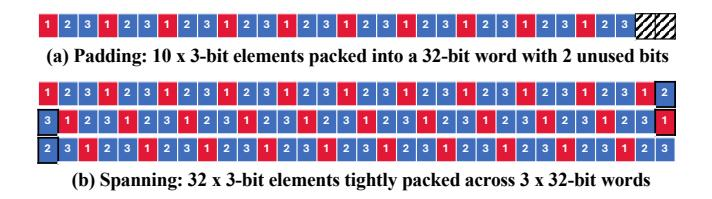

# 3 Gaps and Challenges

#### 3.1 The Performance Gaps

Non-uniform quantization effectively reduces memory footprint and is thus expected to accelerate memory-bound LLM inference. However, it often causes a paradoxical slowdown. Fig. [1a](#page-2-1) presents performance for the OPT-30B model on an A100 GPU (batch size 16, token length 128). Under 3-bit quantization, SqueezeLLM exemplifies the trade-off: it achieves a measured memory reduction of 4.07× but increases the latency by 3.01× compared to FP16 baseline. In contrast, Quantix achieves the same memory reduction while delivering a 1.36× speedup, effectively translating memory savings into faster inference

The performance breakdown in Fig. [1b](#page-2-1)-c reveals the source of the performance gap. For FP16 baseline, weight storage and matrix multiplication (matmul) dominate memory (95%) and computing time (72%). Though SqueezeLLM successfully

Figure 2. Naive bit packing for 3-bit quantization. Numbers 1-3 in boxes represent bit positions within elements.

reduces weight memory, its inefficient kernels inflate matmul time to 92% of the total. In contrast, Quantix reduces the matmul time cost to just 44%. This comparison highlights that memory savings from quantization do not automatically translate into faster inference. A co-designed compute strategy is required to unlock the potential performance gain.

### 3.2 Challenges in Bit Packing

The use of 3-bit weights presents an architectural challenge because their bit-width does not naturally align with standard 32-bit or 64-bit data types. Fig. [2](#page-2-2) depicts two naive packing schemes that create non-trivial performance penalties.

Padding and Internal Fragmentation: A straightforward strategy is to pack a fixed number of elements into a word and pad the remainder with unused bits. For instance, ten 3-bit elements (30 bits) can be packed into a 32-bit word, leaving 2 bits for padding. While the padding approach simplifies data access, the unused bits within each word, though small, accumulate over large matrices, increasing the model's total memory footprint and the required memory bandwidth during execution.

Spanning and Memory Misalignment: Alternatively, elements can be packed tightly, spanning across word boundaries to maximize memory utilization. For example, 32 3 bit elements fit into three 32-bit words (96 bits). Though the spanning approach eliminates wasted space, it creates memory misalignment, requiring additional logic to access elements spanning multiple words. This disrupts memory coalescing, introduces branching, and leads to inefficient memory utilization and warp divergence, ultimately degrading GPU performance.

## 3.3 Pressure on CUDA Cores

The complex dequantization process of non-uniform schemes places heavy computational pressure on general-purpose CUDA cores. Fig. [3](#page-3-1) quantifies the costs by measuring the instruction counts of SqueezeLLM, the FP16 baseline, and Quantix. SqueezeLLM, which performs both dequantization and matmul on CUDA cores, exhibits a rapidly growing instruction count as the batch size increases. This imposes a substantial and unsustainable computational load on the GPU, explaining its high latency in Fig. [1a](#page-2-1).

Figure 3. Instruction count of different methods for a single linear LLM layer sized 21504×7168 from OPT-30B on A100

Figure 4. Challenges in utilizing Tensor Cores

In contrast, FP16 baseline maintains low instruction counts, as its operations are natively supported by the hardware without dequantization. Quantix effectively avoids the instruction explosion seen in SqueezeLLM by optimizing the computational pipeline for dequantization and matmul. It keeps the instruction count orders of magnitude lower than SqueezeLLM when ≥ 8, and only slightly higher than FP16 baseline.

## 3.4 Challenges in Utilizing Tensor Cores.

The over-utilization of CUDA cores for dequantization directly leads to the underutilization of the GPU's powerful Tensor Cores. The key to enabling fast LLM inference on modern NVIDIA GPUs lies in effectively utilizing their Tensor Cores [\[20,](#page-11-12) [29,](#page-11-28) [32\]](#page-11-14), which provide significant acceleration for the core matmul operation. However, conventional nonuniform quantization [\[19,](#page-11-8) [33\]](#page-11-9) completely bypasses Tensor Cores and leaves the GPU's highest-throughput units idle for the very operation they are designed to accelerate. The obstacles to leveraging Tensor Cores are rooted in two fundamental, hardware-level challenges:

Layout Mismatch. Tensor Cores do not operate on simple row- or column-major data. They require operands to be loaded from memory into registers in a specific, complex interleaved pattern to function correctly. As shown in Fig. [4a](#page-3-2), directly loading contiguously stored dequantized weights causes them to be scattered incorrectly across the Tensor Core's internal matrix representation. This problem

is exacerbated with 3-bit data, as values are packed across byte boundaries, making it highly complex to efficiently dequantize and simultaneously arrange them into the required interleaved pattern.

Dequantization Overhead. The dequantization of 3-bit weights comprises a long sequence of low-throughput bitwise and type-conversion instructions on CUDA cores due to the complex logic to extract non-power-of-two bit-width values [\[19,](#page-11-8) [33\]](#page-11-9). As shown in Fig. [4b](#page-3-2), the dequantization forms a critical dependency in the execution pipeline. The highthroughput Tensor Cores are left stalled and idle while waiting for the low-throughput dequantization to produce their input. This pipeline bubble effectively serializes the workload, nullifying any potential performance gains.

