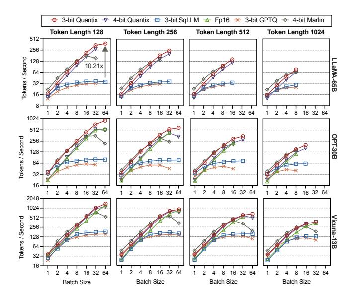
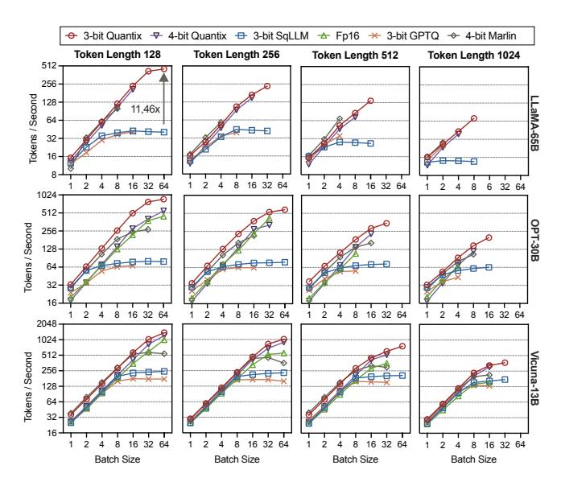

# 5.4 Other Bit Widths

Settings. We evaluate 2-bit and 4-bit variants of Quantix to assess its applicability across different bit widths. These variants are compared against other non-uniform quantization methods, including Any-Precision LLM (Any) [\[33\]](#page-11-9) and Bitsandbytes [\[6\]](#page-11-7). We extend Any to support 2-bit quantization. For 4-bit evaluation, we also include Marlin, a highperformance kernel specifically designed for uniform 4-bit quantization that incurs negligible dequantization overhead. The 16-bit cuBLAS serves as the baseline. All methods are tested on four linear layers of LLaMA-65B : L1: 8192 × 8192, L2: 8192 × 22016, L3: 22016 × 8192 and L4: 43520 × 8192.

Results. Fig. [14](#page-8-3) compares the throughput of various quantization methods. 2-bit Quantix delivers the highest performance at all batch sizes, achieving an average speedup of

Figure 15. Throughput of LLM Inference on a A100 GPU

**Figure 16.** Breakdown of LLM inference time on a A100. MHA: Multi-Head Attention.

 $5.45\times$  (up to  $8.59\times$ ) over the 16-bit baseline. Quantix's performance scales effectively with precision, as shown by its  $2.15\times$  higher throughput than 4-bit Quantix, indicating that memory savings convert directly into speedups. Compared to other methods, 2-bit Quantix also demonstrates a substantial lead, outperforming 2-bit and 4-bit Any by  $43.78\times$  and  $80.98\times$ , respectively, and 4-bit Marlin by  $1.49\times$ .

As the workload becomes compute-bound at larger batch sizes, the relative speedup from quantization narrows for all methods. The performance of Any collapses at batch sizes of 32 and 64. Only Quantix and Marlin consistently sustain high throughput through the entire range of batch sizes. At larger batch sizes, 4-bit Quantix is outperformed by 4-bit Marlin due to the centroid overhead, which is a trade-off inherent to non-uniform quantization that enables higher accuracy and smaller model size.

#### 5.5 End-to-End Inference

**Settings.** To evaluate Quantix, we integrated our kernel into the HuggingFace Transformers library [38]. We utilized the non-uniform quantization scheme from SqueezeLLM (SqLLM) [19], replacing its default inference backend with

Figure 17. Throughput of LLM Inference on two L40s

**Figure 18.** Breakdown of LLM inference time on two L40s. MHA: Multi-Head Attention, Comm: Communication.

Quantix for both 3-bit and 4-bit configurations. We compared performance against four baselines: unquantized FP16 (cuBLAS), the original SqLLM kernel, 3-bit GPTQ [10], and 4-bit Marlin [11]. For the uniform quantization baselines (GPTQ and Marlin), we use the AutoGPTQ library [1] for its broad compatibility. We evaluated Vicuna-13B [5], OPT-30B [43], and LLaMA-65B [36] on a single NVIDIA A100 and dual L40 GPUs. We fix the input (prompt) sequence length at 128 tokens and measure token generation throughput (tokens per second), excluding prompt processing time. We vary batch sizes from 1 to 64 and output (generated) sequence lengths ranging from 128 to 1024 tokens. Any-Precision LLM [33] is excluded due to out-of-memory errors during quantization.

**Results.** Fig. 15 and Fig. 17 present the throughput of LLM inference on an A100 GPU and on two L40 GPUs, respectively. The results demonstrate *Quantix effectively translates the memory savings from quantization into inference speedups*. This advantage is most evident in LLaMA-65B (top rows in both figures), which cannot run with standard FP16, where 3-bit Quantix achieves up to 11.46× speedup over SqLLM.

On the A100, 3-bit Quantix delivers average speedups of  $1.20 \times$  over 4-bit Quantix,  $1.35 \times$  over the FP16 baseline,  $2.98 \times$ 

over SqLLM, 2.45× over GPTQ and 1.16× over Marlin. On the dual L40s, these gains increase to 1.39×, 1.64× and 3.27×, 3.30× and 1.29×, respectively. The substantial end-to-end inference speedup is driven by Quantix's acceleration on matmul that dominates the model's runtime.

Quantix consistently outperforms both SqLLM and the FP16 baseline across all configurations. Its performance gains increase with both batch size and model size. SqLLM is competitive at a batch size of 1, but scales poorly as batch grows due to its underlying inefficient matrix-vector kernel. Furthermore, Quantix yields greater speedups on larger models because of the higher proportion of the matmul operation, which is the focus of our optimization.

4-bit Quantix offers higher precision, but it is consistently slower than the 3-bit configuration. The performance drop results from two factors: (1) the increased bit-width consumes more memory bandwidth, and (2) the larger number of centroids (24 vs. 23 ) imposes higher dequantization overhead. This reflects the inherent trade-off between accuracy and inference throughput in quantization.

Compared to uniform quantization methods like GPTQ and Marlin, 3-bit Quantix maintains a substantial performance advantage in many scenarios. Marlin sometimes achieves higher throughput due to simpler dequantization. However, its advantage diminishes as workload increases with larger batches or more tokens. Furthermore, Marlin and GPTQ exhibit limited scalability. Marlin consumes more memory due to its 4-bit compression, while 3-bit GPTQ uses an inefficient kernel with poor memory management and high runtime memory usage. They encounter out-of-memory errors significantly earlier than Quantix, which efficiently leverages 3-bit quantization to fit larger workloads within limited GPU memory. Additionally, their inefficiency might also stem from the internal implementation overhead of AutoGPTQ.

Fig. [16](#page-9-3) and Fig. [18](#page-9-4) show the breakdown of inference time for the OPT-30B model profiled with NVIDIA Nsight [\[30\]](#page-11-30). The results validate that Quantix effectively addresses the primary performance bottleneck – matmul. SqLLM is dominated by extremely high matmul due to its inefficient kernel design. By contrast, Quantix significantly reduces matmul time compared with the FP16 baseline. Across all batch sizes, the matmul portion is markedly smaller for Quantix, reflecting the efficiency of the proposed fused kernel. This optimization is impactful enough to reshape the overall performance profile: with the matmul bottleneck resolved, other components such as MHA often account for the majority of the runtime in Quantix.

Accuracy. As a compute library accelerating non-uniform quantization schemes (e.g., SqLLM), Quantix inherits the accuracy advantages of the underlying model representation over uniform methods like GPTQ. We evaluate LLaMA2-7B and LLaMA2-13B using WikiText-2 perplexity and 5-shot MMLU accuracy with lm-eval [\[13\]](#page-11-31).

Table 1. Perplexity on WikiText-2 and five-shot MMLU accuracy.

| Model      | Precision | Method          | PPL ↓ | MMLU ↑ |
|------------|-----------|-----------------|-------|--------|
| LLaMA2-7B  | FP16      | Baseline        | 5.68  | 45.30% |
|            | 4-bit     | Quantix (SqLLM) | 5.79  | 45.20% |
|            | 4-bit     | Marlin (GPTQ)   | 6.01  | 44.90% |
|            | 3-bit     | Quantix (SqLLM) | 6.15  | 42.20% |
|            | 3-bit     | GPTQ            | 7.55  | 40.40% |
| LLaMA2-13B | FP16      | Baseline        | 5.09  | 54.80% |
|            | 4-bit     | Quantix (SqLLM) | 5.19  | 54.70% |
|            | 4-bit     | Marlin (GPTQ)   | 5.36  | 54.50% |
|            | 3-bit     | Quantix (SqLLM) | 5.46  | 53.50% |
|            | 3-bit     | GPTQ            | 6.62  | 51.70% |

Table [1](#page-10-5) demonstrates that Quantix consistently outperforms uniform quantization baselines. The advantage is most significant at 3-bit precision: on LLaMA-7B, Quantix achieves a perplexity of 6.15, whereas GPTQ degrades to 7.55. Similarly, 3-bit Quantix retains 42.20% accuracy on MMLU, substantially surpassing the 40.40% accuracy of 3-bit GPTQ.

