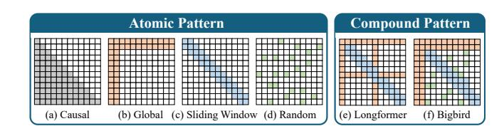
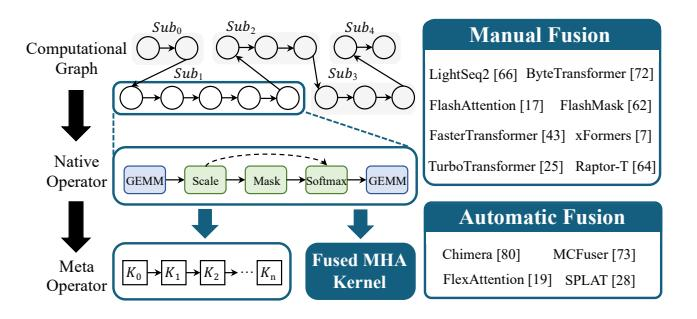

# 1 Introduction

Large language models (LLMs) have attracted widespread attention from industry and academia around the world [\[1,](#page-11-0) [9,](#page-11-1) [27\]](#page-12-0). The massive parameters enable LLMs to capture the subtleties of human language [\[45\]](#page-12-1). In addition to general understanding, Transformer is the foundation of LLMs and the core of its powerful capabilities [\[76\]](#page-13-0). A variety of neural networks [\[18,](#page-12-2) [48,](#page-13-1) [49\]](#page-13-2) have evolved based on Transformer, while still retaining its encoding or decoding structure. The tensor operations involved in Transformer have rich parallelism, making it suitable for execution on many-core processors such as GPUs [\[25\]](#page-12-3). This forces the performance optimization

of Transformer for GPU architectures to become an important issue, which can bring huge economic benefits [3].

Multi-head attention (MHA) is the essential building block in the Transformer model, where the attention module calculates the correlation among tokens in the input sequence [61]. The high-performance implementation of MHA fuses all tensor operations into one kernel, efficiently utilizing the memory hierarchy and function units [17, 72]. The novel MHA variants introduce mask layers to reduce the computational volume while maintaining accuracy [13]. The mask layer introduces sparsity to Transformer, and fragmented computation exacerbates the memory bandwidth bottleneck [64]. Furthermore, the explosive growth of masking patterns [6, 71] makes it impractical to manually optimize each MHA variant separately. Although recent approaches [19, 62] have supported a broader range of masking patterns with sparse representation or score modification, they are limited to continuous element distribution or suboptimal performance.

There are still potential optimization opportunities for downstream operators of MHA. Compilation-based operator fusion is adopted to reduce kernel launches and frequent I/O operations [39, 77]. DL frameworks [4, 82] generally only fuse memory-intensive (MI) operators, while compute-intensive (CI) operators are handled separately using vendor libraries. Other studies [41, 54, 79] have further explored the fusion of CI operator and MI operator to complement resource utilization such as memory bandwidth and streaming processors. The latest works [73, 80] focus on the fusion of CI operators and improve performance in small-scale tensor computation with short sequences. However, the above rule-driven operator fusion schemes cannot adapt to diverse model hyperparameters and sequence lengths.

From the above analysis, sparse Transformer optimization faces the following challenges: 1) efficient kernel implementations with flexible representation of masking patterns; 2) adaptive operator fusion with sustained high performance for various computation scales; 3) fast exploration of hierarchical search space with fusion schemes and kernel parameters. We propose the STOF framework, which optimizes sparse Transformer inference through customized MHA kernels and adaptive operator fusion. STOF first determines the kernel implementation for MHA computation according to mask sparsity and sequence length. Then, STOF uses the encoding representation to specify the fusion scheme and maps it to compilation templates. Finally, STOF gradually expands the fusion range and determines the optimal scheme and its parameter setting via two-stage searching.

To the best of our knowledge, STOF is the first system to enable both flexible masking patterns and diverse operator fusion schemes for sparse Transformer scenarios. Specifically, STOF integrates hand-tuned MHA kernels with generative compilation templates, providing a complete stack that establishes broader optimization opportunities. We have

selected typical networks with encoding or decoding structures including BERT [18], GPT [48], LLaMA [60], ViT [21], and T5 [49] to verify the effectiveness of STOF. This paper makes the following contributions1:

- We comprehensively analyze the impact of different masking patterns and inference configurations to expose potential optimization opportunities.
- We propose a unified MHA module that implements row-wise and block-wise kernels with unique storage formats and optimizations. Besides, an analytical model is designed to determine kernel selection.
- We propose an operator fusion module that converts the fusion scheme into compilation templates via numerical decoding. The search engine processes the encoded numerical representation and expands the fusion range based on performance feedback.
- We develop an inference framework STOF that enables flexible masking patterns and determines the optimal operator fusion setting on GPU. The experimental results show that STOF achieves maximum speedups of 1.6× in MHA computation and 1.4× in end-to-end inference compared to the state-of-the-art work.

## 2 Background

#### 2.1 Sparsity in Transformer Models

**2.1.1** Transformer Structure. Transformer [61] is widely recognized, where each encoder or decoder contains multiple multi-head attention (MHA) layers. The key operation of the MHA layer is scaled dot product attention (SDPA), which calculates the dot product of Q and K, scales the result, optionally applies a mask at this stage, then applies the Softmax function to obtain the probabilities (P) and finally calculates the dot product of P and V. Beyond MHA, Transformer includes downstream components: Add retains non-linear transformation information, Norm mitigates internal covariate shift via mean/variance normalization, and the Feed Forward layer comprises chained general matrix multiply (GEMM) operations with activations like GELU or ReLU. These components enable Transformer to handle complex cross-domain tasks while introducing operator characteristics that facilitate fusion-based optimizations.

**Figure 1.** Atomic and compound sparse attention patterns.

 $^1\mathrm{The}$  artifact for this paper is publicly available on Zenodo under DOI [15].

- **2.1.2 Sparse Attention Patterns.** Atomic sparse attention patterns are the building blocks of current popular sparse attention modules [2, 6, 13, 36, 37, 52, 71]. Figure 1 (a)-(d) depict four most common atomic sparse attention patterns. The details are as follows.
  - Causal Attention. To maintain temporal order, the query can access only preceding information, restricting connections to earlier nodes (the colored triangular).
  - Global Attention. Certain "global" nodes serve as central hubs, which receive information from others (the colored rows) and send it back (the colored columns).
  - Sliding Window Attention. Considering the concept of locality, the query only focuses on the neighboring nodes within a defined window size, with its mask matrix presenting a banded pattern (the colored bands).
  - Random Attention. The query block is randomly associated with the preceding and following information.
    By adjusting the filling rate, it has the possibility to discover accidental correlations (the colored blocks).

#### 2.2 Fused Kernel for MHA Structure

Numerous works [7, 17, 19, 25, 43, 62, 64, 66, 72, 73, 80] have explored fusing MHA on GPU. Figure 2 shows a typical workflow of MHA fusion. The DL framework firstly parses the computational graph and captures the MHA sub-graph composed of coarse-grained native operators. Then, MHA fusion can be achieved manually or automatically. However, if the fusion of MHA with a certain mask layer is not supported, the sub-graph will be split into fine-grained meta operators to discover small-scale fusion opportunities.

Figure 2. Kernel fusion for MHA computation.

Early works focus on the manual fusion of dense attention without the mask layer. ByteTransformer [72] adopts hand-written kernels: short sequences store the intermediate matrix entirely in shared memory (SMEM) and registers; longer sequences employ grouped GEMM to ease resource constraint. The customized kernels limit ByteTransformer to a maximum sequence length of 1,024. FlashAttention (FA) series2 becomes the most typical open source implementation. FA [17] partitions the input into blocks and passes the blocks

to SMEM multiple times, gradually performing Softmax reduction. FA2 [16] further partitions the work between warps within one block of attention computation to reduce the read and write of SMEM. However, FA only supports common masking patterns such as causal and sliding window. FlashMask [62] extends FA with column-wise representation to exploit attention sparsity for skipped computations, integrated into PaddlePaddle [40] but unable to represent discrete distributions such as random attention.

For automatic fusion, the captured MHA sub-graph undergoes multi-level intermediate representation (IR) with hardware-independent (e.g., constant folding) and hardware-dependent (e.g., instruction scheduling) optimizations. MC-Fuser [73] and Chimera [80] accelerate MHA via GEMM chain loop scheduling but ignore hardware details like bank conflicts, performing poorly for long sequences. FlexAttention [19] supports arbitrary masks by combining block masks with expression-based descriptions, but it is still constrained to fixed optimizations and achieves sub-optimal performance. SPLAT [28] focuses on bridging the performance gap of regular sparse kernels (R-SDDMM and R-SpMM) under structured sparsity (10%–50% non-zeros), yet this approach forgoes the opportunity to optimize MHA as a whole kernel.

#### 2.3 Hierarchical Space Exploration

The hierarchical framework introduces a huge optimization space, making manual optimization on a case-by-case basis unrealistic. DL compilers [10, 59, 74] automatically explore opportunities across operator and kernel levels, deploying tensor programs on target hardware via IR conversion.

2.3.1 Operator Fusion Opportunities. DL compilers predefine fusion rules that apply only to specific combinations, severely limiting the optimization space. Researchers further classify tensor operators into MI and CI categories for selective fusion. Early works [4, 82] treat CI operators as non-fusion boundaries, fusing only MI operators to reduce off-chip accesses. Others [41, 54] merge the CI operator with adjacent MI operators to balance hardware resource usage. Recent works [73, 80] explore fusing CI chains by decomposing operators into blocks to break dependencies. However, due to GPU resource constraints, we notice that CI chain fusion only benefits on small scales. Moreover, operator categories may shift with tensor dimensions, making category-based fusion schemes potentially suboptimal.

**2.3.2 Search Space Construction.** When fine-tuning the performance of DL models, the search space can be constructed by loop-based or template-based methods. The loop-based methods [35, 77] represent operators as deeply nested loops and optimize the statement execution via loop scheduling. Although hardware-universal, they lag vendor libraries due to ignoring hardware-specific instructions. The template-based methods [11, 67, 69, 81] evolve as a new trend, which

 $^2\mathrm{FA3}$  [53] is only for GPUs with Hopper architecture and later.

uses template primitives as building blocks to assemble complete DL models. The template primitives can map tensor programs to special function units like tensor cores. With hardware knowledge-driven tuning, they match vendor library performance. Bolt [\[67\]](#page-13-17) derives primitives from CUT-LASS [\[44\]](#page-12-14) to support common fused operators. Due to the complex kernel structure of CUTLASS, further expanding the fusion range is too demanding for programmers.

2.3.3 Auto-tuning Techniques. For loop-based construction, rule-based pruning first suppresses search space explosion, yet still amounts of configurations persist. Machine learning-driven cost models are trained online [\[77\]](#page-13-8) or offline [\[78\]](#page-14-5) to predict performance, integrated into heuristic searches (e.g., genetic algorithms) to speed up convergence. However, they all require sufficient runtime statistics. Aggressive techniques [\[4,](#page-11-6) [50\]](#page-13-19) unfold the computation graph sequentially, reducing search ranges from product to sum of operator spaces. But individual tuning without graph context leads to global suboptimal decisions. In contrast, templatebased construction maintains a constrained space aided by analytical models [\[33,](#page-12-15) [34\]](#page-12-16) considering hardware and program details. Nevertheless, changes in the search space caused by operator fusion expansion remains unsolved.

We summarize comparisons of representative works and STOF in Table [1.](#page-3-0) We implement compilation templates via the hardware abstraction of Triton [\[59\]](#page-13-15) and TileLang [\[12\]](#page-11-13). Both of them offer high-level programming interfaces that facilitate the template derivation for a wider fusion range. Then, the two-stage procedure encapsulating the AutoTune module quickly determines high-performance configurations.

Table 1. Comparison of representative works with STOF.

|              |          | Operator Fusion | Hierarchical Search Space |            |               |  |  |  |
|--------------|----------|-----------------|---------------------------|------------|---------------|--|--|--|
| Name         | Category | Expansion       | Construction              | Pruning    | Searching     |  |  |  |
| AStitch [82] | MI-MI    | Yes             | Rule                      | No         | Breadth-First |  |  |  |
| Welder [54]  | CI-MI    | Yes             | Loop                      | No         | Cost Model    |  |  |  |
| Chimera [80] | CI-CI    | No              | Loop                      | No         | Analytical    |  |  |  |
| MCFuser [73] | CI-CI    | No              | Loop                      | Rule       | Analytical    |  |  |  |
| Bolt [67]    | General  | No              | Template                  | No         | Analytical    |  |  |  |
| STOF (ours)  | General  | Yes             | Template                  | Analytical | Reward-based  |  |  |  |

