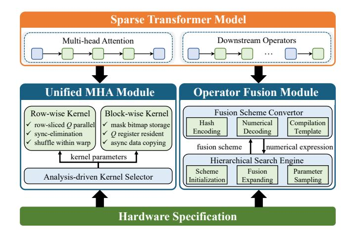
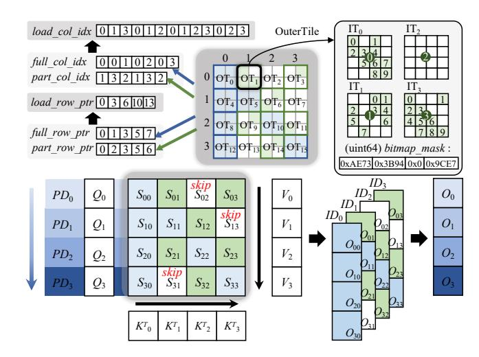
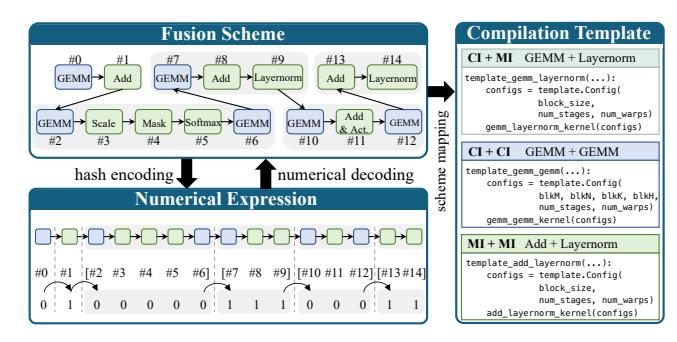
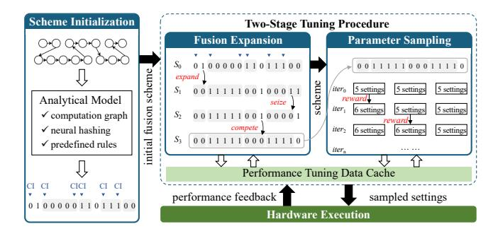
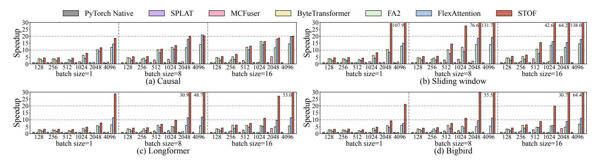
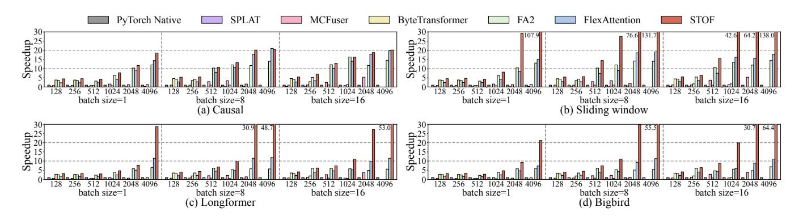
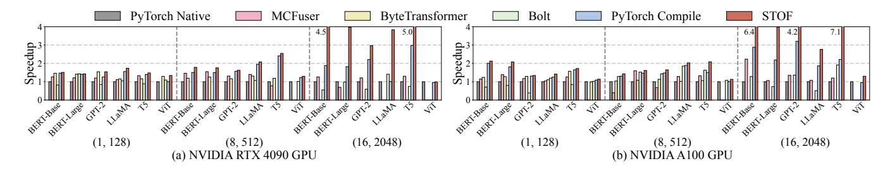

# 4 Methodology

#### 4.1 Design Overview

We propose STOF, accelerating Sparse Transformer inference with flexible masking patterns and operator fusion schemes on GPU. STOF consists of a *unified MHA module* and an *operator fusion module*. The unified MHA module integrates row-wise and block-wise kernels with different storage formats, each with unique optimizations. The operator fusion

module is embodied as the interaction between the fusion scheme converter and the hierarchical search engine.

Figure 5 illustrates the design overview of STOF. STOF divides the sparse Transformer model into MHA structure and downstream operators. This ensures both the customization of MHA and the flexibility of operator fusion. For MHA structure, STOF maps its calculations directly to GPU kernels with fine-grained optimization. The kernel selector determines the MHA kernel by applying an analytical model that takes hardware specifications into account. For downstream operators, the scheme converter expresses the fusion scheme as a binary array through hash coding upwards and maps it to compilation templates through numerical decoding downwards. The search engine initializes scheme, expands fusion, and samples parameters via analytical modeling, performance feedback, and reward algorithm, respectively.

**Figure 5.** The design overview of STOF.

We have implemented two sets of kernels depending on the data partitioning granularity. The row-wise kernel slices Q into rows to achieve high locality. Moreover, the rowwise kernel applies shuffle within a warp and eliminates the synchronization among warps, improving performance at small input sizes. In contrast, the block-wise kernel is more general with fine-grained block partitioning, where Q, K, and V are partitioned into sub-blocks and put into SMEM to utilize the GPU memory hierarchy. Since row partitioning can be regarded as an extreme case of block partitioning, we elaborate on the block-wise optimizations in Section 4.2.

The main takeaway of STOF is a novel co-design that bridges manual kernel implementation for sparse MHA structure and automatic fusion for dense downstream operators. Specifically, the sparsity in STOF is exclusively handled within the MHA module, where mask-based computation is explicitly managed by customized kernels. All subsequent operators after MHA are dense and executed via template-based fusion, ensuring both high performance and compositional flexibility. Beyond the specific optimizations for Transformer architectures, the core methodology of STOF is readily extensible to emerging LLM architectures. For instance, in Mixture-of-Experts (MoE) models [8], we can accelerate activated experts via specialized kernels while optimizing the routing logic through template-based fusion, potentially supporting dynamic computation paths at minimal cost.

#### 4.2 Unified MHA Kernels

**4.2.1 Sparse Storage Format.** Figure 6 shows the blockwise computation with a sparse storage format that can represent arbitrary mask. Inspired by literature [24, 42], we adopt a two-level storage format combining Block Compressed Sparse Row (BSR) and bitmap, preserving sparsity while enabling structured computation. As shown in Figure 6, we abstract two levels as OuterTile (OT) and InnerTile (IT) to reveal globally skipped blocks and intra-block element distribution, respectively. Each OT is composed of 64 8×8 ITs (only 4 are shown in the figure for clarity). An OT is marked as "full" if all of its ITs are not empty, otherwise "part". For the "full" OTs, the difference between full row ptr[i] and  $full\_row\_ptr[i-1]$  indicates the number of "full" OTs in the *i*-th row. The array full col idx specifies the column indices of "full" OTs. For example, as can be inferred from full row ptr and full col idx arrays in the figure, the column indices of "full" OTs in the 2-nd row are 0 and 2.

For the "part" OTs, there are also two similar arrays including <code>part\_row\_ptr</code> and <code>part\_col\_idx</code>. The <code>part\_col\_idx</code> further points to the corresponding IT with sparse element distribution. Since each IT contains exactly 64 elements, it can be efficiently represented by a single <code>uint64</code> value. Consequently, for each "part" OT, the internal mask information is stored as a <code>bitmap\_mask</code> array consisting of 64 <code>uint64</code> elements. During the processing of the innermost loop, each <code>bitmap\_mask[i]</code> is retrieved to obtain the precise masking pattern. By combining the structures of "full" and "part" OTs,

we obtain *load\_row\_ptr* and *load\_col\_idx* arrays that directly specify the location of non-empty OTs in the mask.

Figure 6. MHA computation with two-level storage format.

**Kernel Implementation.** We cut the input tensor Q into sub-blocks of size (OT\_Size\_M, head\_size) along the seq len dimension, as illustrated in Algorithm 1. Each subblock  $Q_i$  (line 2) corresponds to a Row-Parallel Dimension  $(PD_i)$ , where  $i \in [0, \lceil \frac{seq\_len}{OT\_Size\_M} \rceil)$ . To enhance data locality, for each row processed by  $Q_i$ , K and V are divided into sub-blocks  $K_i^T$  and  $V_j$  of size  $(OT\_Size\_N, head\_size)$ (lines 7-9), where  $j \in [0, \lceil \frac{seq\_len}{OT\_Size\_N} \rceil)$ . The workload of OTs per row is determined by the arrays *load\_row\_ptr* and load\_num (lines 4-6). Under the coarse-grained block of size (OT Size M, OT Size N), only valid OTs that require computation are loaded, while others are skipped. This alleviates bandwidth conflicts by greatly reducing global memory access. The asynchronous copy of  $V_i$  (line 9) allows the GEMM (line 10) to proceed without waiting for the completion of  $V_i$ 's transfer. Furthermore, it eliminates the need for data loading stalls in the subsequent GEMM (line 16). After obtaining  $P_{ij}$ , the presence of any "part" OTs in the current row is checked to determine whether ITs' storage information should be loaded from the uint64 array bitmap\_mask and applied to mask  $S_{ij}$  (lines 11-14). Due to the consistency of  $K_i^T$  and  $V_j$  blocks on the Iteration Dimension  $(ID_j)$ , the skip operation on  $K_i^T$  is also applied to  $V_j$ , thus reducing amounts of calculation and storage. After the Softmax operation,  $S_{ij}$ and the scaling factor  $\alpha$  within the OT are obtained to ensure the correctness of reduction operations (lines 15-16). Finally, the results are written back to HBM (line 18).

We further conduct advanced optimizations on the MHA kernel, primarily based on FA2 [16]. For example, the 8×8 size of ITs not only matches the uint64 size but also aligns with the data granularity operable by Tensor Cores. Notably, OTs are stored in row-major order to accommodate the row-wise

16

17

18

19 end

## Algorithm 1: MHA Kernel with Unified Format

**Input:** flattened tensors on HBM *Q HBM*, *K HBM*, *V HBM*; unified

mask storage structures part\_row\_ptr, part\_col\_idx,  $load\_row\_ptr, load\_col\_idx, bitmap\_mask$ Output: MHA result on HBM result\_HBM  $\begin{array}{lll} & \textbf{1} & \textbf{for } i \; in \; [0, \lceil \frac{seq\_len}{OT\_Size\_M} \rceil) \; \textbf{do} \\ & 2 & | Q_i \leftarrow \text{Load\_from\_HBM}(Q\_HBM_i); \end{array}$  $tmp\_part\_col\_idx, O_i \leftarrow 0;$  $load\_num \leftarrow load\_row\_ptr[i+1] - load\_row\_ptr[i];$  $part\_num \leftarrow part\_row\_ptr[i+1] - part\_row\_ptr[i];$ for kv idx in [0, load num) do  $j \leftarrow load\_col\_idx[load\_row\_ptr[i] + kv\_id];$  $K_i^T \leftarrow \text{Load\_from\_HBM}(K\_HBM_i);$  $V_i \leftarrow \_\_async\_memcpy(Load\_from\_HBM(V\_HBM_i));$  $P_{ij} \leftarrow \text{Compute\_GEMM}(Q_i, K_i^T);$ if tmp part col idx < part num and 11  $j == part\_col\_idx[part\_row\_ptr[i] + tmp\_part\_idx]$ Apply\_Mask( $S_{ij}$ ,  $bitmap\_mask[tmp\_part\_col\_idx]$ ); 12  $tmp\_part\_col\_idx \leftarrow tmp\_part\_col\_idx + 1;$ 13 end 14  $S_{ij}, \alpha \leftarrow Softmax(P_{ij});$ 15

 $O_i \leftarrow O_i \times \alpha + \text{Compute\_GEMM}(S_{ij}, V_j);$ 

result  $HBM \leftarrow Write back to <math>HBM(O_i)$ .

iterative computation of Softmax, whereas ITs are stored in col-major order to enable bank conflict-free accesses. The OT size is determined by considering cache capacity and the number of SMs. During each iteration,  $Q_i$  is kept in registers,  $K_j^T$  and  $V_j$  share a single physical portion of shared memory.

4.2.3 **Kernel Selection.** By comprehensively considering the influence of masking patterns and sequence lengths, we decide whether to apply a row-wise or block-wise kernel for MHA computation. As formulated in Equation 1, we empirically set the coefficient  $\tau$  to 1.2 and calculate the *threshold*. We select row-wise kernel if *threshold* is less than 0, indicating that the ratio of valid OTs (i.e., "full" and "part") is sufficiently low. Note that we use log operation to penalize the extremely sparse situation due to the increase of  $sep\_len$  while the mask width remains unchanged. By doing so, we have limited row-wise kernel to cases where the number of valid OTs is small and the  $sep\_len$  is short. In such cases, centralized row-wise computation of mask elements brings excellent data locality. For other general cases, we apply block-wise kernel to maximize performance.

$$threshold = \frac{load\_row\_ptr[\lceil \frac{seq\_len}{16} \rceil]}{(\lceil \frac{seq\_len}{16} \rceil)^2} - \frac{\tau}{(\log_2\lceil \frac{seq\_len}{16} \rceil)^2} \quad (1$$

#### 4.3 Fusion Scheme Conversion

It is essential to express the fusion scheme appropriately, quantifying the dependencies among vertical operators and identifying the fusion boundaries. Inspired by the high-low voltage levels of digital circuits, we use binary hash codes as the numerical expression of fusion schemes. STOF maps the fused operators to compilation templates so that the

compiler can further add kernel-level optimizations. From the perspective of the computational graph, the captured adjacent nodes are replaced with fused nodes.

**Figure 7.** The workflow of fusion scheme converter.

Figure 7 shows the workflow of the fusion scheme converter in STOF. Take the forward propagation of BERT as an example, STOF traverses the computational graph constructed by the DL framework and extracts subgraphs that conform to the patterns of fusion schemes. Each subgraph is mapped to the target compilation template, which is carefully implemented to achieve optimal performance. Specifically, the templates decompose tensor operations into tiles to maximize data reuse, leverage warp-level primitives for efficient reductions, and apply multi-stage pipelining to overlap memory accesses and computation. Although we customize the compilation template according to the functionality of the fused operator, the graph mapping process is highly flexible. For instance, the template that computes a GEMM chain with CI+CI pattern can also incorporate simple MI operations, such as adding bias element by element (i.e., Bias). On the other hand, the compilation template hides the hardware execution details and only exposes key kernel parameters for performance tuning. For the GEMM chain, the sub-block sizes and the launch configuration (e.g., number of stages) constitute the search space, providing the possibility of further optimization targeting at a specified case.

The fusion scheme is quantized by hash encoding, and the native operators are represented as arrays with a length equal to the number of operators according to the vertical fusion situation. In this way, hash encoding translates abstract fusion patterns into a quantifiable space, a process that establishes a bidirectional mapping consistent with the definition of "hash". We assume that in addition to mapping MHA ([#2-#6]) to the fused kernel, the fusion scheme also specifies three other downstream fused operators including [#7-#9], [#10-#12], and [#13,#14]. The numbers representing the operators in the subgraph are the same, which is similar to the high-low voltage levels of the circuit. For example, the numbers corresponding to the subgraph [#7-#9] are all 1. Besides, the different numbers of adjacent operators refer to the boundary of adjacent subgraphs. Note that the numbers are unrelated to the operator characteristics, they are introduced solely to facilitate the subsequent tuning process. The numerical expression is usually in binary, but it can also be converted to hexadecimal format with a higher compression rate. Intuitively, this expression approach constructs a flexible search space that can represent any fusion scheme. On this basis, we propose a two-stage search mechanism to tune the running configuration during inference.

### 4.4 Search Space Exploration

STOF deploys a search engine featuring scalable fusion boundaries and parameter-tuning capabilities. As depicted in Figure [8,](#page-7-0) the search engine first uses neural hashing and predefined rules to derive an initial fusion scheme. Then, the two-stage procedure is conducted to determine the boundaries of the fused operators and their kernel parameters.

Figure 8. The workflow of hierarchical search engine.

4.4.1 Fusion Scheme Initialization. STOF leverages both pattern discovery and expert knowledge to derive the initial fusion scheme. First, STOF adopts a convolutional subgraph analysis method neural hashing to discover representative subgraphs that frequently appear during the inference, formalized as: () = Fhash (Fconv ()). Here, is the input computational graph structure; Fconv is a convolutional feature extractor that extracts local structural features from the graph . Fhash is a hash mapper, which compresses and discretizes the extracted features into a unique hash fingerprint (). By analyzing the frequency distribution of these fingerprints, STOF can rapidly detect classical subgraph structures across Transformer-based models. Second, STOF uses predefined rules to extract potentially high-performance subgraphs from the identified subgraph structures to form the initial scheme. For example, according to the conclusion in Section [3,](#page-3-3) the GEMM chain is preferentially fused into one segment under smaller batch sizes and sequence lengths.

4.4.2 Two-Stage Tuning Procedure. In the first stage, STOF tends to expand the boundaries of the segments until there is no additional benefit after fusion. Since DL frameworks have implemented the fusion of common MI operators, we mark CI operators and adjust the fusion scheme around them for complementarity. We have restricted that there are

at most two CI operators in each segment, and classified the fusion rules into the following three categories.

- expand: merge existing individual or fused operators to form a new segment without disrupting the structure of other segments, such as the transition from 0 to 1.
- seize: a segment with at least one CI operator preempts an operator from a segment consisting of only MI operators, such as the transition from 1 to 2.
- compete: if two segments compete for an individual operator, the segment with only one CI operator will be extended first, such as the transition from 2 to 3.

Based on the above rules, we apply depth-first search (DFS) to gradually expand the fusion range. In this process, STOF randomly samples a fixed number of parameter settings of the pre-fusion and post-fusion operators, then takes the best setting to compare the performance. If there is a performance gain, STOF will keep the new fusion scheme, otherwise roll back. As long as the scheme has appeared and the performance under specific parameter settings is recorded in the cache, the same attempt will not be made later.

In the second stage, STOF conducts parameter sampling for the determined scheme. Specifically, we fix the total number of configurations during each iteration and retrieve performance data. In the first iteration, STOF ensures the number of sampled settings for each segment is the same. When the highest overall gain is achieved when tuning a segment, STOF rewards it by increasing the sampled settings in the next iteration. Similarly, STOF caches performance data to avoid repeated execution of the same parameter setting.

## 4.5 Implementation Details

We have implemented a system prototype of STOF based on PyTorch [\[4\]](#page-11-6), Triton [\[59\]](#page-13-15) and TileLang [\[12\]](#page-11-13), involving approximately 5,000 LOC of Python and 2,500 LOC of C/CUDA. The block-wise kernel is developed based on FA2 [\[16\]](#page-11-10) with the CuTe structure, but introduces an efficient two-level storage format and corresponding optimizations. Subsequently, the customized MHA kernel is loaded into PyTorch through the torch/cpp\_extension interface, which encapsulates the kernel in the form of a native function. When the MHA kernel is first called, it is just-in-time (JIT) compiled into a shared object file (.so) using the ninja tool, enabling dynamic linking at runtime without repeated compilation.

Regarding the operator fusion module, we find that the Triton- and TileLang-based compilation templates demonstrate performance variance under different fused operators, so we select the implementation that achieves superior performance in each case. We enable the graph capture and replacement by manipulating objects of type fx.GraphModule. Since the overall implementation of STOF is compatible with the torch.compile function, its related compilation optimizations can be reused to maximize performance.

Figure 9. The MHA performance of the methods normalized to that of PyTorch Native on NVIDIA RTX 4090 GPU.

Figure 10. The MHA performance of the methods normalized to that of PyTorch Native on NVIDIA A100 GPU.

#### 5 Evaluation

#### 5.1 Experiment Setup

**5.1.1** Hardware and Software Platforms. We evaluate STOF on two generations of GPUs, including NVIDIA RTX 4090 of Ada model and NVIDIA A100 of Ampere model. The experiments are conducted in the software environment configured with Ubuntu 22.04, CUDA v12.6, and PyTorch 2.7.0. We package Docker containers to quickly migrate the software environment between hardware platforms.

**5.1.2** Comparison Configurations and Methods. We conduct evaluation on both atomic and compound masking patterns including causal, sliding window, Longformer [6], and Bigbird [71]. The sequence length ranges from 128 to 4,096 with a stride of 2×, and the batch size ranges from 1 to 16. For MHA computation, we follow the configuration of BERT-Base. For end-to-end inference, the configuration is set to be consistent with the standard models of BERT [18], GPT2 [48], LLaMA [60], T5 [49] and ViT [22]. We compare STOF with PyTorch Native, PyTorch Compile [4], FlashAttention2 (FA2) [16], FlexAttention [19], ByteTransformer [72], Bolt [67], MCFuser [73], and SPLAT [28]. Note that FlexAttention, FA2, and SPLAT are optimized only for MHA, while PyTorch Compile integrates FA2 for MHA computation. In addition, Bolt has no MHA-specific optimizations and only

appears in the end-to-end evaluation. Since SPLAT is not open source, we reproduce it based on the contents in the paper. We adopt the half precision (FP16) for evaluation, which is commonly used for model inference in industry [3], ensuring a unified comparison across all methods. To minimize machine errors, we perform warm-ups for all experiments and run 100 times to record the average performance.

#### 5.2 MHA Performance

Figure 9 and Figure 10 present the MHA performance of the methods normalized to that of PyTorch Native on RTX 4090 and A100 GPUs. The missing bars are attributed to two reasons: 1) ByteTransformer lacks support for sequence lengths greater than 1,024; 2) MCFuser runs out of memory (OOM) when the input scale is large. As seen, STOF shows consistent superior performance on both GPU platforms. Compared to the state-of-the-art FlexAttention implementation, STOF achieves the average speedups of 1.8× and 1.6× on RTX 4090 and A100 GPUs, respectively. STOF achieves superior performance on sliding window mask because its high sparsity and concentration of valid blocks facilitate computation skipping. Even for causal masks, STOF still achieves a certain speedup over FA2 and FlexAttention under most cases. The reason is that the two-level storage format combining BSR and bitmap further improves on-chip memory locality. In contrast, due

Figure 11. The end-to-end performance of the methods normalized to that of PyTorch Native on RTX 4090 and A100 GPUs.

Table 4. Tuning time of STOF, MCFuser, and Bolt for end-to-end inference on A100 GPU in seconds.

| Input Size  | (1, 128) |        |      |       |      | (8, 512) |        |        |       |       | (16, 2048) |       |        |        |       |       |        |        |
|-------------|----------|--------|------|-------|------|----------|--------|--------|-------|-------|------------|-------|--------|--------|-------|-------|--------|--------|
| Name        | BERT-B   | BERT-L | GPT  | LLaMA | T5   | ViT      | BERT-B | BERT-L | GPT   | LLaMA | T5         | ViT   | BERT-B | BERT-L | GPT   | LLaMA | T5     | ViT    |
| MCFuser     | 51.4     | 52.4   | 49.5 | 48.8  | 71.9 | 100.2    | 91.8   | 132.3  | 100.8 | 110.8 | 239.0      | 437.8 | 660.2  | 1049.7 | 664.4 | 820.6 | 1987.6 | 4264.3 |
| Bolt        | 53.3     | 57.3   | 48.8 | 52.1  | 70.7 | 120.7    | 90.8   | 126.1  | 99.8  | 124.6 | 244.7      | 468.8 | 652.2  | 1067.7 | 738.6 | 837.0 | 1860.8 | 3848.6 |
| STOF (ours) | 23.3     | 22.6   | 23.8 | 29.5  | 43.1 | 93.9     | 40.9   | 55.0   | 40.9  | 43.6  | 80.3       | 99.3  | 99.6   | 225.3  | 122.2 | 264.6 | 388.3  | 412.8  |

to the lack of tensor core support, SPLAT achieves decent performance on RTX 4090 GPU with higher CUDA core ratio, achieving a maximum speedup of 3.6× compared to PyTorch Native; but it lags behind on A100 GPU across all cases.

The above figures illustrate the MHA performance at different input scales in detail. At small scales, STOF achieves relatively better performance than FA2 and FlexAttention under most cases. STOF enables the row-wise kernel, where the use of shuffle operations within the warp incurs extremely low synchronization cost. On the other hand, STOF achieves significant speedup compared to other methods at large input scales. For example, when the setting of (batch size, sequence length) is (16, 4,096), STOF achieves 4.8× and 4.9× speedups over FA2 and FlexAttention on A100 GPU, respectively. This is mainly because the block-wise kernel makes full use of the mask sparsity to skip unnecessary calculations. Besides, the optimizations such as asynchronous data copying and Q register resident serve as the foundation for performance improvement. Note that PyTorch Native, MCFuser, and Byte-Transformer do not natively support sparse masks. The basic approach is to subtract the mask matrix, thus missing the opportunity to reduce the amount of calculation.

#### 5.3 End-to-end Performance

We benchmark five models including BERT-Base, BERT-Large, GPT2, LLaMA, T5 and ViT. Among them, BERT and ViT are encoder-only, GPT2 and LLaMA are decoder-only, whereas T5 contains both encoder and decoder. We adopt the Bigbird mask and conduct experiments under three distinct settings of (batch size, sequence length): (1, 128), (8, 512), and (16, 2,048). Figure 11 presents the end-to-end performance of the methods normalized to that of PyTorch Native on RTX 4090 and A100 GPUs. The missing bars indicate OOM for MC-Fuser or unsupported sequence length for ByteTransformer. As seen, STOF consistently delivers the highest speedups

across the majority of models and settings on both GPU platforms. Even compared to the state-of-the-art PyTorch Compile, STOF achieves an average speedup of 1.3× and 1.4× on RTX 4090 and A100 GPUs, respectively. In addition to customizing the MHA kernel, the performance gain of STOF also comes from operator fusion and parameter tuning.

For the setting (16, 2,048), STOF achieves 1.5×, 1.5×, 1.2×, 1.3×, 1.1×, and 1.2× speedups over PyTorch Compile for the six models on RTX 4090 GPU. A similar trend can be observed on A100 GPU. The results indicate that the advantages of STOF are particularly pronounced for larger input scales. The reason is attributed to the significant reduction in the absolute time of the bottleneck MHA computation. This demonstrates that STOF has the potential to be applied to future GPU generations with larger memory capacity.

## 5.4 Tuning Cost

Table 4 lists the tuning time of STOF, MCFuser, and Bolt for end-to-end inference on A100 GPU in seconds, where BERT-B/L is BERT-Base/Large. Note that PyTorch Native, PyTorch Compile, and ByteTransformer are not included due to the lack of tuning support. As seen, the tuning time of STOF is less than that of MCFuser and Bolt in all cases. This advantage becomes more prominent when the input scale is large. Since the tuning process of operator fusion module in STOF is positively correlated with the input tensor, the tuning cost per iteration increases moderately, but it does not grow linearly with respect to the overall tuning time. For the setting (16, 2,048), STOF is on average  $6.7 \times$  and  $6.9 \times$  faster than MCFuser and Bolt. This is mainly because reward-based sampling enables STOF to find high-performance settings in a shorter time. On the other hand, the caching mechanism ensures that the same parameter setting in each fusion scheme will not be executed repeatedly, which particularly saves tuning time in scenarios with large input scales.

#### 5.5 Ablation Study

Figure 12 presents the speedup of STOF with only unified MHA module or only operator fusion module over PyTorch Native and PyTorch Compile on A100 GPU. For reference, the speedup of STOF with both modules is also shown in the figure. For PyTorch Compile, we also break the MHA boundary, transforming the whole computation graph into low-level meta operators for compilation optimization.

As seen, the operator fusion module contributes more to the performance when the input scale is small. Taking the setting of (1, 128) as an example, the speedup achieved by only fusion module is 19.5% higher than that of only MHA module on average. In fact, the low sequence length and batch size lead to a small computational workload, which is particularly friendly to the fusion of CI operators. However, the contribution of the MHA module exceeds that of fusion module as the input scale increases. For the (16, 2,048) setting, the speedup of only MHA module is 2.0× on average, higher than that of only fusion module. Since MHA computation becomes the bottleneck, the high parallelism of the block-wise kernel is reflected in end-to-end inference. Note that STOF with both modules always achieves the highest speedup, indicating that the optimizations can complement each other. On the other hand, we find that breaking the MHA boundary would compromise these tailored kernel optimizations. The results show that such boundary breaking causes up to 1.5× slowdown compared to preserving it.

**Figure 12.** The speedup of STOF with only MHA module or only fusion module over PyTorch Native on A100 GPU.

#### 5.6 Overhead Analysis

The STOF overhead mainly includes the analysis model, scheme conversion (i.e., hash encoding and numerical decoding), and reward algorithm. The analysis model is reflected in MHA kernel selection and fusion scheme initialization. Figure 13 presents the time breakdown of STOF overhead normalized to the tuning process on A100 GPU. As seen, the time proportion of scheme conversion and reward algorithm is relatively smaller when the input scale is large. This is because these overheads are dominated by the model structure, and a larger input scale will lead to a longer tuning time, thus diluting this proportion. In contrast, the proportion of analytical model increases with the input scale. The primary reason

is that the overhead for analyzing mask blocks increases with longer sequence lengths. Nevertheless, the analysis constitutes at most 0.5% of the total time. Overall, STOF accounts for less than 3% of the total tuning time, making it highly acceptable in the context of model fine-tuning.

**Figure 13.** Time breakdown of the STOF overhead normalized to the tuning process on A100 GPU.

#### 5.7 Discussion

5.7.1 Newer GPU Architectures. In addition to NVIDIA Ampere and Ada architectures, we have conducted preliminary tests on newer hopper architecture (i.e., NVIDIA H20 GPU). The results show that STOF consistently outperforms FA2, achieving up to 1.4× speedup for MHA computation. This proves that kernel optimizations of STOF are universal across GPU architectures. We plan to extend this evaluation to include FA3 for future work.

5.7.2 Longer Sequence Lengths. We explore sequence lengths ranging from 4k to 16k and batch size of 1 on NVIDIA A100 GPU. STOF achieves significant speedups over the SOTA PyTorch Compile, reaching 4.1×, 11.1×, and 16.8× at 4k, 8k, and 16k, respectively. In addition, all baselines except STOF encounter Out-of-Memory (OOM) errors at sequence length of 32k, whereas STOF reaches OOM at 64k. The results indicate that STOF exhibits greater performance improvement for ultra-long sequence lengths, as well as significantly saving GPU memory.

**5.7.3 Dynamic Mask Patterns.** STOF is inherently positioned to support dynamic mask patterns due to its flexible design. For example, MInference [32] could serve as a sophisticated frontend to discover dynamic patterns, with STOF as the execution backend. The main challenge lies in efficiently integrating MInference's offline pattern determination and online index generation into STOF's compilation pipeline with minor overhead. For future work, we plan to extend the analytical model to determine optimal configurations at runtime based on input token sequence.

#### 6 Related Work

Hardware Accelerators for Attention. Recent works have considered the inherent parallelism and memory access patterns to design customized accelerators [5, 23, 26, 29–31,

[38,](#page-12-25) [47,](#page-12-26) [63,](#page-13-20) [70,](#page-13-21) [75,](#page-13-22) [83\]](#page-14-6). ELSA [\[30\]](#page-12-27) utilizes an approximate similarity computation scheme to filter out insignificant relations. ViTCoD [\[70\]](#page-13-21) polarizes attention maps into denser and sparser patterns to reduce data movement. He et al. [\[31\]](#page-12-24) propose a PIM-enabled heterogeneous system that accelerates LLM decoding with a dynamic online scheduler. This work focuses on attention optimizations on GPU, but has the potential to be applied to the emerging accelerators.

Auto-tuning for Scientific Applications. Existing works have designed auto-tuning approaches to handle the complexity of scientific applications [\[14,](#page-11-16) [20,](#page-12-28) [46,](#page-12-29) [51,](#page-13-23) [55](#page-13-24)[–58,](#page-13-25) [65,](#page-13-26) [68\]](#page-13-27). Donggarra et al. [\[20\]](#page-12-28) perform batched calculation self-tuning on GPU for a series of numerically dense linear algebra operators. Randall et al. [\[51\]](#page-13-23) propose a generative method that achieves automatic adjustment based on few-shot transferlearning. Plasticine [\[65\]](#page-13-26) introduces multi-level stencil representations and selects the better fusion strategy of stencil operators with a CNN-GNN-based model. The above works provide references for the implementation of this paper.

