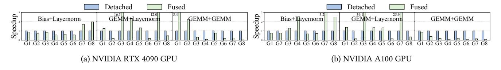
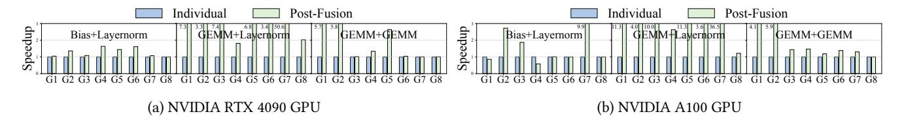

# 3 Motivation

## 3.1 Diverse Features of Masking Patterns

Within the MHA structure, sparse mask blocks part of the data elements, making it easier for the model to "focus" on the critical information. The mask layer is inserted between GEMM and Softmax operations, and the weights of the score matrix corresponding to the mask part are close to 0. Table [2](#page-3-1) lists the features of typical masking patterns with the sequence length (\_) of 1,024. Consistent with previous works [\[13\]](#page-11-4), the band width and global width are set to √︁ \_ (i.e., 32). As seen, all masking patterns except

the causal achieve a sparsity of over 80%, while the sliding window even reaches 93.8%. The above results provide optimization opportunities to skip useless computations.

Table 2. Features of typical masking patterns.

| Masking           | Masking                                                    |            | Element Distribution | Sparsity     |       |  |
|-------------------|------------------------------------------------------------|------------|----------------------|--------------|-------|--|
| Pattern           | Parameters                                                 | Row        | Column               | Type         | Ratio |  |
| Causal            | –                                                          | Continuous | Continuous           | Structured   | 50.0% |  |
| Sliding Window | band width = 32                                            | Continuous | Continuous           | Structured   | 93.8% |  |
| Longformer        | global width = 32 band width = 32                       | Discrete   | Discrete             | Structured   | 88.8% |  |
| Bigbird           | global width = 32 band width = 32 filling rate = 10% | Discrete   | Discrete             | Unstructured | 80.8% |  |

It is difficult for a data structure to represent sparsity features of various masking patterns. To achieve high kernel efficiency, FlashMask [\[62\]](#page-13-7) only supports the cases where the valid elements on the columns are continuous. This is because its data structure consists of four arrays that represent the start and end of two skipped regions. However, the discrete distribution of valid elements involves more skipped regions that cannot be represented. Bigbird integrates random patterns with unstructured sparsity, further complicating the mask representation. For unsupported masking patterns, previous works [\[19,](#page-12-4) [72\]](#page-13-4) fall back to resetting the score matrix by subtraction after GEMM. This approach fails to jointly optimize GEMM and Softmax operations in the fused kernel.

### 3.2 Potential Fusion Opportunities

Transformer structure still remains opportunities for operator fusion unexplored. If we roughly identify the operator types as MI or CI, the operator mixes can be enumerated into three categories. We fuse the operators of Transformer to evaluate the performance, where Bias+Layernorm, GEMM+Layernorm, and GEMM+GEMM represent MI+MI, CI+MI, and CI+CI mixes, respectively. Figure [3](#page-4-0) shows the speedup of the fused operator over the detached operators on NVIDIA RTX 4090 and A100 GPUs, where the x-axis represents the running configurations (detailed in Table [3\)](#page-3-2).

Table 3. The running configurations of fused operators.

| Name  | Batch Size | Sequence Length | Hidden Dimension |  |  |  |
|-------|------------|-----------------|------------------|--|--|--|
| G1/G2 | 1          | 128             | 512/1024         |  |  |  |
| G3/G4 | 1          | 4096            | 512/1024         |  |  |  |
| G5/G6 | 8          | 128             | 512/1024         |  |  |  |
| G7/G8 | 8          | 4096            | 512/1024         |  |  |  |

It can be observed that the effect of operator fusion varies significantly under different cases. For example, the fused GEMM+Layernorm operator achieves a maximum speedup of 16.5× and 39.1× when the hidden dimension is 512. But when the hidden dimension is 1,024, it results in significant

Figure 3. Performance comparison of detached operators and fused operator under different configurations.

Figure 4. Performance comparison of fused operators using parameter settings from individual tuning and post-fusion tuning.

slowdowns in most cases. The fused GEMM+GEMM operator achieves more than 2× speedup on RTX 4090 GPU when batch size and sequence length are 1 and 128, whereas it is inferior to the detached operators under all cases on A100 GPU. The above results indicate that fixed operator fusion schemes cannot adapt to diverse inference scenarios.

#### 3.3 Challenges in Parameter Tuning

The combination of fusion schemes and kernel parameters constructs a hierarchical optimization space, making parameter tuning challenging. This stems from two key insights: 1) the search space of individual operators differs fundamentally from that of the fused operator; 2) the optimal parameter settings for individual and fused operators are inherently distinct. Figure 4 shows the speedup of fused operators using parameter settings from post-fusion tuning over those from individual tuning on NVIDIA RTX 4090 and A100 GPUs. The x-axis represents the experimental configuration consisting of batch size, sequence length and hidden dimension. As seen, directly applying the optimal setting of individual operators to their fused implementation often leads to suboptimal performance. For example, Bias+Layernorm, GEMM+Layernorm, and GEMM+GEMM mixes achieve an average speedup of 2.4×, 10.1×, and 2.2× on A100 GPU, respectively. The results indicate that operator-by-operator sequential tuning is not a viable solution. On the other hand, naive global tuning can be inefficient due to the inconsistent search space.

