# 1 Introduction

The attention mechanism, which computes complex contextual relationships across input sequences, is fundamental to modern deep learning, particularly in large language models (LLMs). However, it incurs significant computational cost with quadratic scaling with respect to the sequence length [\[31\]](#page-13-0). As the sequence length continues to increase for real-life applications [\[3,](#page-11-0) [32,](#page-13-1) [33\]](#page-13-2), the attention mechanism constitutes the primary computational constraint of LLMs.

To accelerate attention computation on commodity hardware like GPUs, fused attention implementations, exemplified by FlashAttention [\[6\]](#page-11-1), have emerged by consolidating the key matrix multiplication (GEMM) and softmax operations into a single kernel, significantly reducing memory access and improving throughput. Subsequent works, FlashAttention-2 [\[5\]](#page-11-2) and FlashAttention-3 [\[26\]](#page-13-3), further enhance this technique by optimizing work partitioning, improving parallelism, and leveraging hardware-specific features. As a result, the FlashAttention series implementations have been widely deployed in various LLM inference frameworks including PyTorch [\[24\]](#page-13-4), vLLM [\[14\]](#page-12-0), and SGLang [\[43\]](#page-14-1).

However, current fused attention implementations such as FlashAttention-2 and FlashAttention-3 are severely constrained by the vector intervals—periods where the highperformance tensor units (Tensor Cores) stay idle while awaiting slower vector units (CUDA cores) to complete, causing underutilization of the tensor units. As shown in Figure [1\(](#page-1-0)a), the vector interval consumes up to 36% of the iteration cycles with an attention head dimension size of 128 used by various well-known LLMs (e.g., Llama2, Llama3, and Qwen3 [\[8,](#page-11-3) [30,](#page-13-5) [36\]](#page-13-6)), and the fraction increases to up to 42% at head dimension size of 64 used by the pioneering model gpt-oss [\[23\]](#page-13-7). This inefficiency stems from computational decoupling of the key GEMM and softmax operations: the GEMM leverages tensor units whereas the softmax executes on vector units. Such performance heterogeneity between these units induces significant tensor unit idleness. Moreover,

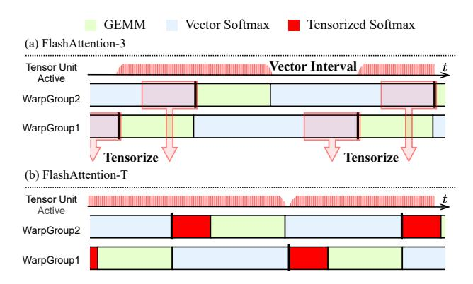

Figure 1. The execution timelines of (a) FlashAttention-3 and (b) FlashAttention-T on Hopper GPUs. FlashAttention-T resolves the vector interval bottleneck by tensorizing key softmax primitives and exploiting thread-level parallelism between the vector and tensorized softmax computations.

ongoing hardware advancements, such as faster tensor units and lower-precision GEMM support [\[13,](#page-12-1) [15\]](#page-12-2), exacerbate this performance bottleneck.

Tensorizing the softmax computation offers a promising solution to utilize the idle tensor units and address this bottleneck, but it poses significant challenges across three dimensions. At the instruction level, the tensor matrix multiply-add (MMA) instructions, originally designed for GEMM operations, must be repurposed to implement critical softmax primitives (i.e., element-wise scaling, fused multiply-add, and row-sum reduction). This requires careful matrix operand preparation and result interpretation under intricate crossthread fragment layouts, while minimizing overhead. At the algorithm level, the repurposed tensor MMA instructions impose algorithmic constraints, complicating the design of a tensorized softmax algorithm with numerical stability guarantees. At the architecture level, the complexity and diversity of modern hardware necessitate architecture-aware scheduling techniques that map the tensorized softmax algorithm to the tensor and vector units in parallel, exploiting tensorvector parallelism for optimal performance.

In this paper, we present FlashAttention-T, a fused attention implementation that advances toward fully tensorized fused attention. FlashAttention-T repurposes tensor MMA instructions to tensorize critical softmax primitives, introduces a tensorized online softmax algorithm with numerical stability guarantees, and implements architecture-aware scheduling to exploit tensor-vector parallelism in the softmax computation. Experimental results show that FlashAttention-T achieves vector interval ratio reductions of 1.17–2.18× on Ampere GPUs and down to 2.7% on Hopper H100, with average speedups of up to 1.17× over FlashAttention-2 and FlashAttention-3, while preserving numerical stability and accuracy. Figure [1\(](#page-1-0)b) shows how we tensorize softmax computation and exploit thread-level tensor-vector parallelism to resolve the vector interval bottleneck on Hopper GPUs.

To the best of our knowledge, this work is *the first trial to fully tensorize the execution of attention operation*. The main contributions are summarized as follows:

- Tensor MMA-based softmax primitives. We propose a series of operand value assignment methods that repurpose GPU tensor MMA instructions to implement critical softmax primitives, enabling these operations to execute on the tensor unit with minimal overhead.
- **Tensorized online softmax algorithm.** We propose a tensorized online softmax algorithm that enables tensorizing all compatible softmax computations within fused attention, while providing numerical stability guarantees.
- Tensor-vector scheduling techniques. We introduce architecture-aware scheduling techniques that parallelize the online softmax computation across the tensor and vector units, exploiting instruction-level and thread-level tensor-vector parallelism to minimize the vector interval while maximizing attention throughput.
- Extensive evaluation. We evaluate FlashAttention-T's performance and accuracy on multiple GPU platforms across diverse attention configurations.

#### 2 Motivation

In this section, we introduce the key insights motivating our work to tensorize softmax computation within fused attention. We begin by examining the algorithmic flow of fused attention, demonstrating that softmax computation constitutes a significant time fraction of the attention computation across sequence lengths. We then analyze the program execution timelines of two state-of-the-art implementations, FlashAttention-2 (optimized for NVIDIA Ampere GPUs) and FlashAttention-3 (optimized for Hopper GPUs). With cyclelevel profiling, our analysis reveals two critical insights: (1) The vector-based softmax in current implementations causes substantial vector intervals, during which the tensor unit remains idle awaiting vector unit completion. (2) Advances in hardware, such as lower-precision GEMM (e.g., FP8) and faster tensor units, exacerbate this inefficiency, underscoring the need for a tensorized softmax tailored to evolving GPU architectures.

#### 2.1 The Algorithmic Flow of Fused Attention

As depicted in Figure 2(b), fused attention parallelizes the computation across warpgroups (or threadblocks) in the GPU kernel, with each warpgroup computing a row block of the attention output matrix O. For each warpgroup, the attention row block is further tiled using safe online softmax [5, 6, 16] to compute and accumulate the attention output row block O in  $s/b_N$  iterations, where s is the sequence length and  $b_N$  is the tile size along the sequence dimension.

Figure 2(a) illustrates the algorithmic flow of each attention output accumulation iteration, which involves the following stages:  $\bullet$  compute an attention logit tile S,  $\bullet$  update

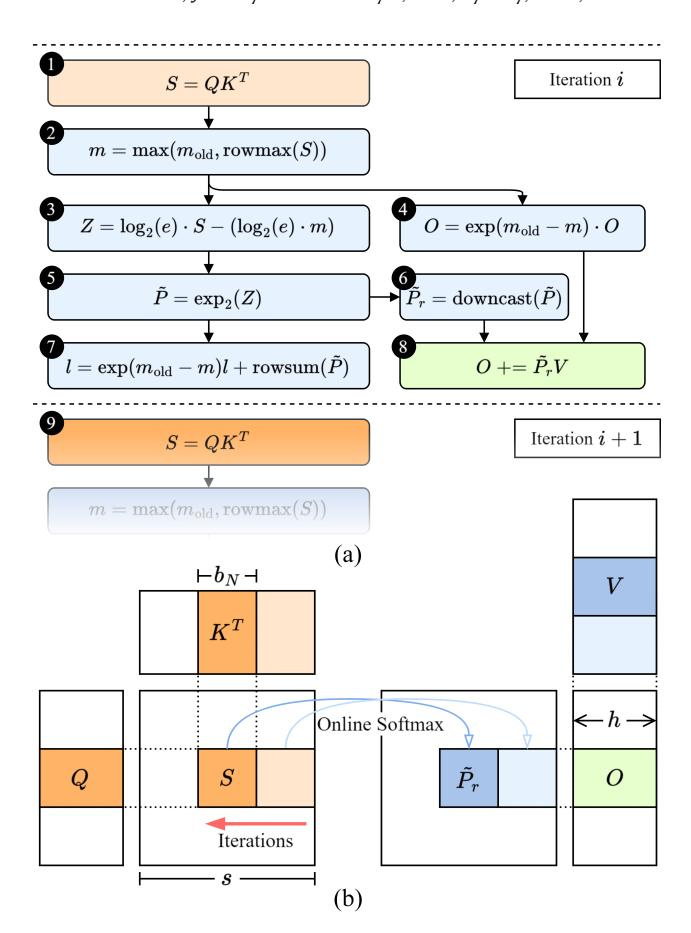

**Figure 2.** (a) The algorithmic flow of fused attention iterations within a warpgroup. (b) The algorithmic flow iterations visualized in the attention computation space.

the row maximum values m of the attention logit row block,  $\mathfrak{GG}$  exponentiate the S tile to produce the attention score tile  $\tilde{P}_r$  based on the updated m and previous row maximum  $m_{\text{old}}$ ,  $\mathfrak{G}$  rescale the attention output O,  $\mathfrak{G}$  update the attention score row sum l, and  $\mathfrak{G}$  accumulate the  $\tilde{P}_rV$  results onto O. A key strength of this tiled scheme is that it ensures all intermediate softmax results reside in registers. This minimizes memory accesses and enables tensorization of softmax primitives using our repurposed tensor MMA instructions that operate directly on register data.

To quantify the aggregated online softmax computational cost over the  $s/b_N$  iterations for the whole attention computation, we analyze the operations in the process: ② max (maximum), ③ fma (fused multiply-add, FMA), ④ mul (multiply), ② add (addition), and ⑤ exp (exponential). For sequence length s and head dimension size h, the primitive operation counts are: max:  $s^2$ , fma+add+mul:  $2s^2 + sb_N^{-1} \cdot sh$ , and exp:  $s^2$ , totaling  $4s^2 + b_N^{-1}s^2h$ , compared to  $2s^2h$  FMAs for GEMM operations. Under the current paradigm, where softmax operations use vector units (with effective throughput k) and GEMM operations use tensor units (with throughput c), the softmax time fraction in this computation, defined as

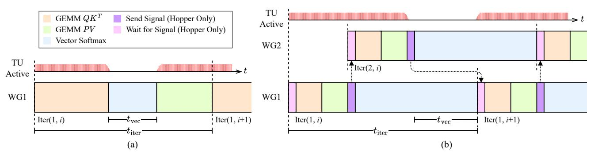

Figure 3. The execution timelines of (a) FlashAttention-2 on Ampere GPUs, and (b) FlashAttention-3 on Hopper GPUs. Both implementations suffer from the vector interval bottleneck due to their exclusive reliance on the vector unit for softmax computation.

 $T_{\text{softmax}}/(T_{\text{softmax}} + T_{\text{GEMM}})$ , where  $T_{\text{softmax}}$  and  $T_{\text{GEMM}}$  denote the execution times of softmax and GEMM operations, is:

$$\frac{T_{\rm softmax}}{T_{\rm softmax} + T_{\rm GEMM}} = \frac{c(4+b_N^{-1}h)}{c(4+b_N^{-1}h) + 2kh}$$

It can be observed that given a constant head dimension size h and a high tensor-vector throughput ratio c/k, the softmax runtime takes a significant fraction of the computation, independent of sequence length s. Moreover, hardware advancements, such as the NVIDIA Hopper H100 GPU's doubled FP16-FP32 GEMM throughput over the Ampere A100 [19, 20] and further doubling with FP8-FP32 precision [20], amplify this fraction as c/k increases. This underscores an urgent need for optimizing softmax computation within fused attention.

## 2.2 Revealing the Vector Interval Bottleneck

To reveal the vector interval bottleneck induced by vectorbased softmax computation, we analyze the execution timelines of state-of-the-art fused attention implementations on their optimized GPU architectures: (a) FlashAttention-2 on Ampere GPUs and (b) FlashAttention-3 on Hopper GPUs.

As depicted in Figure 3(a), FlashAttention-2 employs sequential scheduling. In each iteration, the warpgroup (WG) first executes synchronous tensor MMA instructions for the  $QK^T$  computation on the tensor unit (TU), followed by various vector instructions for softmax computation on the vector unit, and finally another series of tensor MMA instructions for the PV computation. This sequential scheduling creates a vector interval spanning  $t_{\rm vec}$  cycles, where the tensor unit remains idle awaiting the vector unit's completion of softmax computation, delaying the PV computation.

FlashAttention-3 leverages the Hopper GPU's asynchronous warpgroup MMA (WGMMA) feature to enable pipelined scheduling, as shown in Figure 3(b). Let Iter(w, i) denote the i-th iteration of warpgroup w of the program. In a typical two-warpgroup setting, Iter(1, i) begins by committing a batch of asynchronous WGMMA instructions for  $QK^T$ , followed by another batch for the PV computation. This is enabled by shifting the algorithm's iteration boundary from

below **66** to below **66** in Figure 2. After the *PV* WGMMA completion, warpgroup 1 sends signal to warpgroup 2. Upon receiving the signal, warpgroup 2 starts executing its WG-MMA instructions for Iter(2, i) in parallel with the vector instructions for Iter(1, i). This pipelined scheduling enables the warpgroups to partially overlap their GEMM and softmax computations. However, the non-overlapped softmax computation in each iteration still creates a vector interval of  $t_{vec}$  cycles, during which the tensor unit remains idle.

To quantify the vector interval time  $t_{\rm vec}$ , the iteration time  $t_{\rm iter}$ , and the *vector interval ratio*  $t_{\rm vec}/t_{\rm iter}$ , we conduct cycle-level profiling on FlashAttention-2 and FlashAttention-3 using cycle-counting routines under a typical attention configuration (h=128, s=4096). As shown in Table 1, the vector interval occupies an average of 29.8% of the iteration cycles in FlashAttention-2, and rises to 36.3% in FlashAttention-3 with FP8-FP32 GEMM. These results confirm the vector interval bottleneck and its exacerbation on modern hardware, motivating our work to tensorize softmax computation for improved tensor unit utilization and attention throughput.

**Table 1.** Vector interval profiling results for FlashAttention.

| Implementation   | GPU  | Precision | $t_{\rm vec}$ | $t_{\rm iter}$ | $t_{\rm vec}/t_{\rm iter}$ |
|------------------|------|-----------|---------------|----------------|----------------------------|
| FlashAttention-2 | A100 | FP16-FP32 | 924           | 3100           | 29.8%                      |
| FlashAttention-3 | H100 | FP8-FP32  | 1126          | 3106           | 36.3%                      |

### 3 Repurposing Tensor MMA Instructions

To provide a robust foundation for tensorizing the softmax computation in fused attention kernels, we propose novel operand value assignment methods that repurpose tensor MMA instructions for key primitives in the softmax exponentiation and normalization steps. These methods efficiently implement element-wise scaling, fused multiply-add, and row-sum reduction, minimizing permutation-induced overhead caused by repurposing.

Tensor MMA instructions in modern GPUs partition their logical operand matrices into *fragments* distributed across threads, where a fragment is a vector of matrix elements stored in contiguous registers. In this section, we use X[i, j]

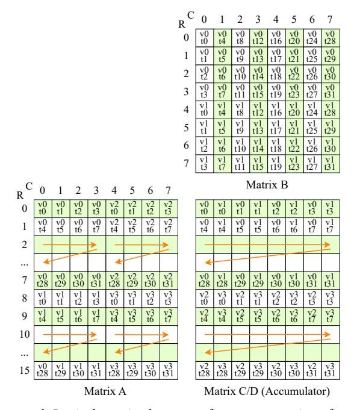

**Figure 4.** Logical matrix element to fragment mapping of tensor MMA instruction HMMA.1688.F32.TF32 found in modern NVIDIA GPUs. Colors in this figure are for illustrative purpose only.

to denote the element at row i and column j of the logical matrix X, and X(v,t) to denote the v-th element in the fragment held by thread t, where  $v \in \{0,1,\ldots,|X|-1\}$  and  $t \in \{0,1,\ldots,T-1\}$ , with T being the number of participating threads and |X| the number of elements per fragment. The mapping function  $\mu_X: X[i,j] \to X(v,t)$  is architecture-specific and varies by operand type (e.g., A, B, C in D = AB + C). An example is shown in Figure 4.

#### 3.1 Element-Wise Scaling and Fused Multiply-Add

We begin by describing the method for repurposing the tensor MMA instruction to implement element-wise scaling with the C fragment set to zero. Given the scaling factor  $\alpha$ , our goal is to determine a value assignment to the fragment B such that the tensor MMA instruction computes an output fragment D that yields a *permuted* element-wise scaling of the input fragment A:

$$D(v,t) = \alpha A(\sigma(v),t)$$

where  $\sigma \in S_{|A|}$  is a permutation in the symmetric group on  $\{0, 1, \ldots, |A| - 1\}$ , and |A| = |D| is the number of elements per fragment. This inevitable permutation arises due to the tensor unit's internal fragment mapping, which may reorder elements within each thread's registers. For example, with |A| = 4, a valid value assignment to fragment B under a permutation  $\sigma = (1\ 2)$  (in cycle notation) yields:

$$D(0,t) = \alpha A(0,t),$$
  $D(1,t) = \alpha A(2,t),$   
 $D(2,t) = \alpha A(1,t),$   $D(3,t) = \alpha A(3,t).$ 

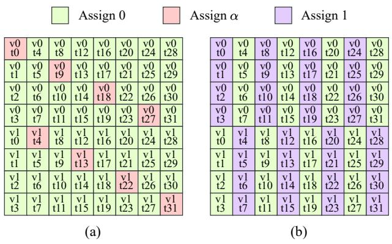

**Figure 5.** Optimal fragment B value assignment methods for repurposing tensor MMA instruction HMMA.1688.F32.TF32 to implement (a) element-wise scaling by factor  $\alpha$  or fused multiply-add, and (b) row-sum reduction.

The form of this permutation is determined by the value assignment to fragment B, and it introduces swap overhead as reordering D(v,t) to achieve the non-permuted output (i.e.,  $D(v,t) = \alpha A(v,t)$ ) requires swap operations within each thread's registers. Each swap increases instruction count and register pressure, causing swap overhead. To quantify this overhead, we use the Cayley distance [25] of  $\sigma$ , defined as the minimum number of arbitrary swaps needed to transform  $\sigma$  into the identity permutation. To achieve a functional value assignment while minimizing this overhead, we formulate the problem as a constrained optimization problem: given  $\lambda(v,t) \in \{0,\alpha\}$  as the value assigned to B(v,t), minimize the Cayley distance  $d_C(\sigma)$  subject to:

$$D(v,t) = \mu_D(D[i,j])$$

$$= \sum_k \mu_A(A[i,k])\mu_B(B[k,j]) = \alpha A(\sigma(v),t)$$

This problem can be solved empirically or with solvers. Figure 5(a) illustrates an optimal fragment B value assignment for  $\sigma=(1\ 2)$ , achieving a Cayley distance  $d_C(\sigma)=1$  with only one swap to recover the non-permuted output. Building on this, the same value assignment to fragment B extends to a fused multiply-add repurposing with a constant scaling factor  $\alpha$  and an arbitrary offset C(v,t):

$$D(v,t) = \alpha A(\sigma(v),t) + C(v,t)$$

This extension is achieved by adding C(v, t) to the MMA output leveraging the tensor unit's accumulator, preserving the permutation  $\sigma$  induced by B.

#### 3.2 Row-Sum Reduction

Beyond scaling and fused multiply-add, we extend our approach to repurpose tensor MMA instructions for row-sum reduction. As shown in Figure 2(a), this operation  $\mathfrak{D}$  involves summing the exponents over rows of the attention score matrix  $\tilde{P}$ , which shares the fragment layout of matrix D as in Figure 4. Our goal is to compute a fragment s(v,t) with two

elements per thread, satisfying:

$$s(0,t) = \sum_{v \in \{0,1\}} \sum_{t \in \kappa_i} D(v,t), \tag{1}$$

$$s(1,t) = \sum_{v \in \{2,3\}} \sum_{t \in \kappa_t} D(v,t). \tag{2}$$

where  $\kappa_i$  denotes quad-pairs of threads in the same row of the matrix *D* (e.g., threads 0–3, 4–7).

Current implementations perform this summation in two steps: (1) intra-thread additions, computing D(0,t) + D(1,t) and D(2,t) + D(3,t), and (2) inter-thread all-reduce operations within each quad-pair  $\kappa_i$ . This approach incurs overhead due to explicit thread synchronization and communication. We propose using the tensor MMA instruction to perform the summation more efficiently. By setting the input fragment A(v,t) = D(v,t) (from matrix  $\tilde{P}$ ), assigning fragment B as shown in Figure 5(b), and setting C(v,t) = 0, the MMA instruction computes an output fragment D'(v,t):

$$D'(v,t) = \sum_{t \in \kappa_i} A(\sigma(v),t) = \sum_{t \in \kappa_i} D(\sigma(v),t)$$

where  $v \in \{0, 1, ..., |A| - 1\}$ , |A| = |D'| = 4, and  $\sigma = (1 2)$ . To obtain s(v, t), we perform two intra-thread additions:

$$s(0,t) = D'(0,t) + D'(2,t), \tag{3}$$

$$s(1,t) = D'(1,t) + D'(3,t).$$
 (4)

These additions yield a result matching Eqs. (1) and (2), with the permutation  $\sigma$  absorbed into the intra-thread additions, incurring no additional swap overhead.

#### 3.3 Discussion

Our methods for repurposing tensor MMA instructions establish a robust foundation for tensorizing the softmax computation in fused attention kernels. We discuss three critical aspects of the repurposing: (1) Algorithmic constraints. The scaling and fused multiply-add repurposing require the scaling factor  $\alpha$  to be uniform across all rows of the input matrix A for the tensor MMA instruction. This necessitates a tensorized softmax algorithm to enable the use of the repurposed instructions, as detailed in Section 4. (2) Architectural availability. Our approach requires |A| = |D|, supporting synchronous MMA instructions like HMMA. 1688. F32. TF32 available in all modern NVIDIA GPU architectures (e.g., Ampere and Hopper). These methods also extend to the Hopper-specific asynchronous WGMMA instructions such as HGMMA. 64x8x8. F32. TF32, with the caveat that fragment B must be in shared memory [21]. (3) No copy overhead. One key advantage of the repurposed tensor MMA instructions is that they operate directly on the GEMM tensor MMA instruction's output fragments, in exactly the same memory space (i.e., the registers on both Ampere and Hopper GPUs). Thus, tensorizing the softmax primitives using our repurposing incurs no extra copy overhead.

## 4 Tensorized Online Softmax Algorithm

The repurposed tensor MMA instructions for scaling, fused multiply-add (FMA), and row-sum reduction build a robust foundation for tensorizing the  $\odot$  attention output rescaling,  $\odot$  attention logits rescaling, and  $\odot$  attention score row summation as illustrated in Figure 2, respectively. However, the original fused attention algorithm's  $\odot$  output rescaling computation,  $O = \exp(m_{\text{old}} - m) \cdot O$ , requires a per-row scaling factor  $\exp(m_{\text{old}} - m)$ . This conflicts with the uniform scaling factor  $\alpha$  constraint of the repurposed tensor MMA scaling instructions. To resolve this conflict, we propose a tensorized online softmax algorithm that ensures numerical stability with high probability. The core of this algorithm is a novel surrogate maximum.

The fused attention algorithm uses safe online softmax to prevent numerical overflow during exponentiation of the attention logit matrix S. As shown in Figure 2, this method maintains a running row maximum m[i] for the i-th row of S, subtracting m[i] from each element in that row before exponentiation to produce the attention score matrix  $\tilde{P}$ . Formally, let S[i,j] denote the element at the i-th row and j-th column of S, and m[i] the maximum value of the i-th row. This ensures that  $\forall i, \forall j, 0 \leq \exp(S[i,j] - m[i]) \leq 1$ , keeping all exponentiated values within a representable range.

Our key insight is that the softmax remains numerically stable by replacing the row maximum m[i] with a surrogate  $\hat{m}[i]$ , provided two failure conditions are avoided:

- **Any-overflow.** For some row i, there exists a column j such that  $\exp(S[i,j] \hat{m}[i]) > F_{\max}$ , where  $F_{\max}$  is the maximum representable floating-point value, resulting in an indeterminate infinity-over-infinity form.
- **All-underflow.** For some row *i*, all  $\exp(S[i, j] \hat{m}[i])$  are effectively zero, leading to a zero-over-zero failure.

To address the uniform scaling factor constraint of the tensor MMA scaling instructions, we propose a surrogate maximum  $\hat{m}[i]$  defined as the maximum value across an X-row tile containing row i of the attention logit matrix S:

$$\hat{m}[i] = \max(\{S[i',j']: j' \in [0,s), i' \in [X \lfloor \frac{i}{X} \rfloor, X \lfloor \frac{i}{X} \rfloor + X)\})$$

where s is the sequence length. This surrogate generalizes to the repurposed HMMA.1688 (X=16) and HGMMA.64x8x8 (X=64) scaling instructions and future tensor MMA instructions. Unlike FlashDecoding++'s static maximum [11], our X-row tile-based  $\hat{m}[i]$  dynamically adapts to local row distributions, ensuring stability for diverse attention patterns with high probability by offering two properties:

- No overflow Since  $\hat{m}[i] \ge m[i]$ , this surrogate maximum ensures  $\exp(S[i,j] \hat{m}[i]) \le \exp(S[i,j] m[i]) \le 1$ , strictly preventing indeterminate forms.
- Negligible all-underflow probability Although a larger  $\hat{m}[i]$  increases the chance of individual exponents underflowing, the joint probability of *all* exponents in a row

underflowing is asymptotically small for typical attention score distributions[9, 11, 12] (e.g., Gaussian).

For extreme attention score distributions triggering all-underflow failure with the proposed surrogate, the implementation can selectively revert attention output rescaling to vectorized computation, bypassing the surrogate  $\hat{m}[i]$  while keeping all other compatible primitives tensorized1. Nevertheless, experimental results in Section 7 confirm that the surrogate  $\hat{m}[i]$  causes no numerical failures and maintains attention accuracy close to the baseline.

#### **Algorithm 1** Tensorized Online Softmax for Fused Attention

**Require:** Attention logit matrix  $S \in \mathbb{R}^{n \times s}$ , attention output matrix  $O \in \mathbb{R}^{n \times d}$ , previous attention logit row maximums  $m_{\text{old}} \in \mathbb{R}^n$ , running attention score row sums  $l \in \mathbb{R}^n$ , and surrogate tile size X.

**Ensure:** Attention score matrix  $\tilde{P} \in \mathbb{R}^{n \times s}$ , updated O, m, and l.

- 1: Compute X-row tile maxima:  $\hat{m} \leftarrow \text{tilemax}(S, X) \qquad \Rightarrow \hat{m} \in \mathbb{R}^{\lceil \frac{n}{X} \rceil}$
- 2: Get old surrogate maximums:  $\hat{m}_{\text{old}} \leftarrow m_{\text{old}}[X \cdot i]$  for  $i \in [0, \lceil n/X \rceil)$
- 3: Rescale attention output with repurposed tensor scaling instructions:  $O \leftarrow \exp(\hat{m}_{\text{old}} \hat{m}) \cdot O \rightarrow X$ -row uniform  $\hat{m}$  enables tensorization
- 4: Assign surrogate maximums:  $m[i] \leftarrow \hat{m}[\lfloor i/X \rfloor]$  for  $i \in [0, n)$
- 5: Rescale attention logits with repurposed tensor FMA instructions:  $Z \leftarrow \log_2(e) \cdot S (\log_2(e) \cdot m)$
- 6: Produce attention score matrix with vector exponentiation:  $\tilde{P} \leftarrow \exp_2(Z)$
- 7: Update attention score row sums with repurposed tensor row-sum reduction instructions:
  - $l \leftarrow \exp(m_{\text{old}} m)l + \operatorname{rowsum}(\tilde{P})$
- 8: return  $\tilde{P}$ , O, m, l

With the proposed surrogate  $\hat{m}$ , we present the tensorized online softmax algorithm for a warpgroup within the fused attention iterations in Algorithm 1. Compared to the original algorithm in Figure 2, it substitutes the true row maximum m with  $\hat{m}$ , and tensorizes all compatible softmax primitives.

#### 5 Scheduling for Tensor-Vector Parallelism

The repurposed tensor MMA instructions and the tensorized softmax algorithm enable tensorizing all compatible softmax computations in fused attention. However, our preliminary results indicate that an all-tensorized scheme, where all compatible softmax computations are tensorized, yields only marginal performance gains. The main reason is that the raw throughput of tensor MMA instructions in current hardware has not reached a turning point. For instance, the HMMA . 1688 . F32 . TF32 instruction on the A100 has a reciprocal throughput of 8 [1], yielding an effective throughput of 16 elements per cycle across all repurposing methods, which exactly matches the vector unit's throughput. This indicates that such all-tensorized scheme is a sub-optimal strategy.

To address this challenge, we develop architecture-aware scheduling techniques that parallelize the softmax computation across tensor and vector units, exploiting instruction-level parallelism (ILP) and thread-level parallelism (TLP)

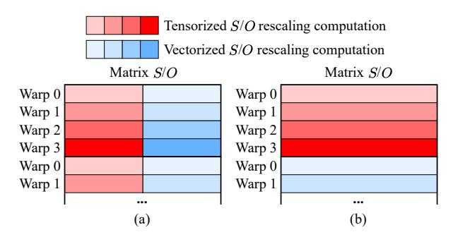

**Figure 6.** FlashAttention-T horizontal and vertical split strategies for ILP scheduling on Ampere GPUs. In (a) the computation on the matrix tiles of a warp are horizontally split into tensorized and vectorized portions, while in (b) the matrix tiles are vertically split.

between the units to maximize tensor unit utilization and attention throughput. Concretely, we propose ILP and TLP scheduling techniques tailored to Ampere and Hopper GPUs, respectively. The common idea of the two strategies is to first split the softmax computation into tensorized and vectorized portions, and then parallelize the two portions using specific techniques suitable for each GPU architecture.

#### 5.1 ILP Scheduling for Ampere GPUs

On Ampere GPUs, FlashAttention-T splits the softmax computation into tensorized and vectorized portions, and schedules ILP interleaving of the tensor and vector softmax instructions within each warp.

**Tensor-vector split strategies.** In the baseline implementation FlashAttention-2, the S and O attention row block handled by each warpgroup (or threadblock) is further tiled into 16-row tiles, with each 16-row tile cyclically assigned to each warp in the warpgroup. Based on this tiled scheme, FlashAttention-T first implements the 16-row maximum surrogate  $\hat{m}$  using warp all-reduce instruction REDUX to enable tensorizing the attention logits S rescaling, attention output O rescaling, and attention score  $\tilde{P}$  row-summation with the repurposed tensor MMA instructions. It then selects the most performant method from the following strategies to split the S and O rescaling operations into tensorized and vectorized portions, based on the attention configuration:

- Horizontal split. As depicted in Figure 6(a), this strategy splits the tensor and vector portions horizontally across the matrix tiles of a warp, with a variable split ratio. Our preliminary experiment results suggest a split ratio around 1:1 yields near-optimal performance.
- **Vertical split.** As shown in Figure 6(b), this strategy splits across multiple matrix tiles assigned to the same warp. Since a warp computes at most two tiles due to register capacity limit in practice, the split ratio is fixed at 1:1.

**Instruction-level parallelism scheduling.** To parallelize the tensorized and vectorized softmax computation, FlashAttention-T evenly interleaves the repurposed tensor instructions and vector instructions executed within each

 $^1{\rm Note}$  that the attention logits rescaling operation only requires a constant scaling factor  $\log_2(e).$ 

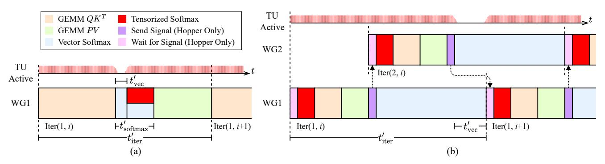

**Figure 7.** The execution timelines of FlashAttention-T on (a) Ampere and (b) Hopper GPUs. FlashAttention-T parallelizes the tensorized and vectorized softmax computations via ILP within warps on Ampere and via TLP across warpgroups on Hopper.

warp, such that the vector instructions run in parallel within the issue bubbles of the tensor instructions. In addition, the common B fragments for all repurposed tensor instructions of the same type are generated in advance and reused to reduce generation overhead and register bank conflicts [35]. We keep all other non-tensorizable softmax primitives such as max and exp vectorized. As shown in Figure 7(a), this scheduling reduces the softmax time from  $t_{\text{vec}}$  in Figure 3(a) to  $t'_{\text{softmax}}$ , in which the vector interval time is shrunk to  $t'_{\text{vec}}$ . By exploiting ILP, FlashAttention-T reduces the iteration time and also significantly improves tensor unit utilization.

### 5.2 TLP Scheduling for Hopper GPUs

Hopper GPUs introduce asynchronous WGMMA instructions, which enable non-blocking GEMM execution and support inter-warpgroup parallelism with vector instructions. Leveraging this, on Hopper GPUs, we aim to split the softmax computation at an algorithmic-stage granularity and parallelize the tensorized and vectorized softmax computation across warpgroups via TLP.

**Tensor-vector split strategy.** There are three algorithmic stages eligible for tensorization in the softmax computation: (1) attention logits S rescaling, (2) attention output O rescaling, and (3) attention score P row-summation. Ideally, each of these stages can be either fully tensorized or fully vectorized, creating a small search space over the algorithm stages for best performance. Unfortunately, currently, NVIDIA's nvcc compiler imposes a restrictive obstacle to this idea. Asynchronous execution of batched WGMMA instructions requires all accumulator operand registers to be free of any dependent access; otherwise, the compiler would serialize these instructions by placing wait barriers after each of the instructions, making them effectively synchronous and severely degrading performance. Specifically in our case, we found that tensorizing either the O rescaling or S rescaling would cause WGMMA serialization due to register access originating in dependent algorithm stages intruding into the tensorized stages, while tensorizing the  $\tilde{P}$  row-summation would not, due to its leaf-stage nature minimizing cross-stage register dependencies.

As a result, we only tensorize the  $\tilde{P}$  row-summation on Hopper GPUs. While this choice limits potential gains from further tensorization, it is strategic for two main reasons: (1) The row-summation contributes a significant portion of the tensorizable softmax operations (as detailed in Section 2.1). Thus, tensorizing this algorithmic stage creates a balanced tensor-vector softmax workload. (2) As discussed in Section 3.2, tensorizing the row-sum reduction primitives eliminates the need for explicit thread synchronization and communication, benefiting performance. In addition, this strategy minimizes register pressure, as the register-based accumulator fragment is reused across all WGMMA row-sum reduction instructions.

Thread-level parallelism scheduling. As shown in Figure 7(b), FlashAttention-T tensorizes the  $\tilde{P}$  row-summation, and schedules the repurposed WGMMA instructions to join the  $QK^T$  and PV WGMMA batch of the warpgroup's next iteration. This scheduling enables the tensorized computation to run in parallel with the vectorized S and O rescaling operations from other warpgroups in a TLP manner, reducing the vector interval time to  $t'_{\text{vec}}$  and improving tensor unit utilization. Note that the surrogate  $\hat{m}$  is not used, as it's only required by the matrix O rescaling. Thus, FlashAttention-T's numerical stability properties remain the same as the baseline implementation on Hopper GPUs.

### **6 Evaluation Methodology**

#### 6.1 Evaluation Platforms

We extensively evaluate FlashAttention-T across diverse NVIDIA GPU platforms, encompassing both server-class and edge-class variants, and spanning various architectures. Specifically, these include: (1) NVIDIA A100 80GB SXM4, a widely deployed server-class GPU utilizing the Ampere architecture (SM80); (2) NVIDIA Jetson AGX Orin 64GB, an edge-class system designed for autonomous applications, integrating a powerful Ampere GPU (SM87); and (3) NVIDIA H100 80GB PCIe, a high-performance server-class GPU featuring the Hopper architecture (SM90A). As discussed in Section 5, FlashAttention-T is architecture-optimized, using the

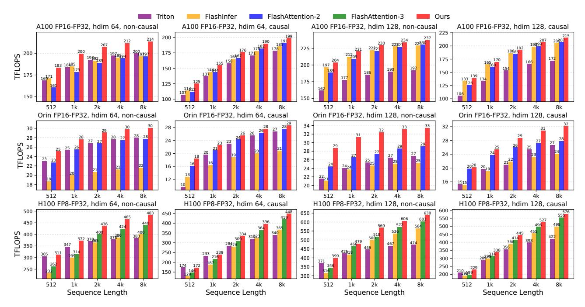

Figure 8. Attention throughput of FlashAttention-T and baselines across different configurations on Ampere and Hopper GPUs.

ILP scheduling for the Ampere GPUs (the A100 and Orin) and the TLP scheduling for the Hopper GPU (the H100).

#### 6.2 Evaluation Design

To fully evaluate the performance of FlashAttention-T and address any potential numerical stability and accuracy concerns, we conduct five evaluations in two categories.

**Performance.** This category of evaluations focuses on quantifying the performance gains of FlashAttention-T. We begin with a comprehensive evaluation on the multi-head attention performance of FlashAttention-T across two data precisions, FP16-FP32 and FP8-FP32, with diverse configurations, measuring the attention throughput to assess whether FlashAttention-T matches or exceeds baseline performances.

We then conduct a cycle-level evaluation to demonstrate that FlashAttention-T enhances attention throughput by reducing the tensor unit idle time. Specifically, we calculate the vector interval ratio  $t'_{\rm vec}/t'_{\rm iter}$  for various attention configurations and compare the results against baseline values.

Finally, we conduct an ablation study to isolate and quantify the performance contributions of the proposed techniques. This study evaluates the performance of the following ablation variants: the baseline FlashAttention-2 (FA2), the baseline FlashAttention-2 with the 16-row surrogate maximum  $\hat{m}$  integrated (FA2+Max16), an all-tensorized variant of FlashAttention-T (AllTensor), and the complete ILP FlashAttention-T (FA-T). Note that this ablation study is conducted only on the Ampere GPUs, as the all-tensorized variant of FlashAttention-T is currently impossible to efficiently implement on the H100, due to the compiler-imposed limitation detailed in Section 5.

**Numerical stability and accuracy.** This category of evaluations examines the impacts of FlashAttention-T on numerical stability and accuracy. We first conduct a synthetic test on FlashAttention-T's attention accuracy using random inputs Q, K, V sampled from distributions designed to simulate real-world attention input scenarios. We calculate the root-mean-square error (RMSE) between the attention output O and the FP64 reference output, then compare the RMSE values against ablation variants to assess accuracy and detect numerical failures (e.g. the all-underflow failure).

Additionally, to evaluate the real-world applicability of FlashAttention-T, we replace the PyTorch attention kernels with FlashAttention-T implementations and test them on full generative benchmarks using various LLMs. We report functional correctness metrics against the baselines and also detect any numerical failures.

#### 6.3 Comparison Baselines

We compare FlashAttention-T against various baselines, consisting of both highly optimized libraries and a representative deep learning compiler. This selection aims to contextualize the performance against state-of-the-art practices and compiler-generated solutions. Specifically, our baselines include: (1) **FlashAttention-2** and **FlashAttention-3**: These are the most prominent fused attention implementations and represent the strongest baselines on Ampere and Hopper GPUs, respectively [5, 26]. (2) **FlashInfer**: An emerging highly optimized library, designed specifically for efficient LLM inference [37]. (3) **Triton**: We use the reference Triton fused attention kernel [22] to assess FlashAttention-T's performance against this deep learning compiler solution [29].

## 7 Experimental Results

### 7.1 Main Results

In this evaluation, we measure the attention throughput of FlashAttention-T and compare it against the baselines across various configurations. Following FlashAttention-3, we fix the total token count to 16384 and total hidden dimension to 2048, and vary the sequence length and head dimension2. Results in Figure 8 show that FlashAttention-T outperforms all baselines in nearly all configurations. Against the strongest baselines FlashAttention-2 and FlashAttention-3, FlashAttention-T achieves speedups ranging from 1.02× to 1.19×, with mean speedups of 1.05–1.17× averaged over sequence lengths per configuration. Against FlashInfer and Triton, FlashAttention-T achieves average speedups of 1.03-1.39×. We observe the following across configurations: (1) Causal masking. FlashAttention-T mostly achieves higher speedups in non-causal configurations, as causal attention introduces masking overhead. (2) **Head dimension**. Speedups of FlashAttention-T are greater for smaller head dimensions, as larger head dimensions increase the GEMM FLOP count, except on AGX Orin, where the baselines are less efficient. (3) Sequence length. FlashAttention-T's throughput gains remain mostly stable across different sequence lengths, as the repurposed tensor MMA instructions operate on register data and consistently reach peak throughput despite varying memory pressure impacting baseline GEMM throughputs.

### 7.2 Vector Interval Ratio Evaluation

To quantify how FlashAttention-T improves performance by reducing tensor unit idle time, we calculate the vector interval ratio  $t'_{\text{vec}}/t'_{\text{iter}}$  of FlashAttention-T relative to the baseline across all evaluation platforms under various noncausal attention configurations. On the Ampere GPUs, where compiler optimizations in an ILP scheduling complicate direct measurement of  $t'_{\text{vec}}$ , we estimate the vector interval ratio using the formula  $(t'_{\text{softmax}} - (t_{\text{vec}} - t'_{\text{softmax}}))/t'_{\text{iter}}$ . Here,  $t'_{\text{softmax}}$  and  $t'_{\text{iter}}$  are FlashAttention-T's measured softmax and iteration times, respectively, while  $t_{\rm vec}$  is the baseline's vector interval time. The saved softmax time  $t_{\text{vec}} - t'_{\text{softmax}}$ reflects tensor unit utilization via repurposed tensor MMA instructions using ILP, thus, the remaining softmax time represents the vector interval time  $t'_{\text{vec}}$ . On the Hopper GPU,  $t'_{\rm vec}$  is directly measured. Results in Figure 9 show that the ILP FlashAttention-T's vector interval ratios are 1.17-2.18× lower than the baseline on Ampere GPUs, while the TLP FlashAttention-T shows an even stronger reduction down to 2.7% on the Hopper GPU. The TLP scheduling shows better efficiency, due to its more flexible dynamic tensor-vector overlapping unconstrained by static instruction ordering and reduced register pressure with the WGMMA instructions.

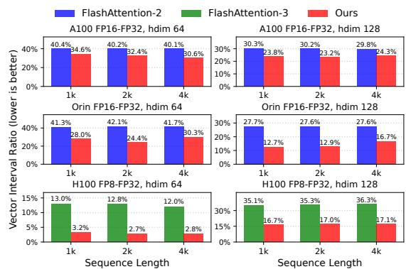

**Figure 9.** Vector interval ratio comparison between the baselines and FlashAttention-T. Note that the vector interval ratio results on Ampere GPU are estimated based on measured clock values.

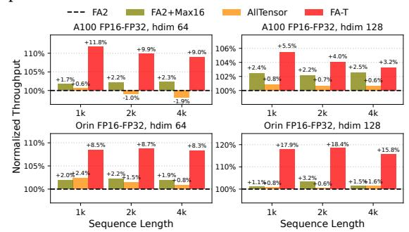

**Figure 10.** Attention throughput of FlashAttention-T and its ablation variants. The results are normalized to FlashAttention-2.

#### 7.3 Ablation Study

To quantify the contributions of each proposed technique, we conduct an ablation study on the implementation variants using non-causal attention configurations shown in Figure 10. Results across the four experiment settings show similar trends: (1) FA2+Max16 achieves around 1% to 3% performance gains over FA2, as the surrogate  $\hat{m}$  requires only two warp all-reduce REDUX instructions instead of multiple synchronous warp shuffle SHFL instructions. (2) AllTensor slightly degrades performance compared to FA2+Max16. This is because the repurposed tensor MMA instructions introduce swap overhead, while providing no increase in effective throughput compared to the vector instructions. (3) The ILP FA-T achieves a maximum performance gain of 18.4% over FlashAttention-2, demonstrating the effectiveness of our ILP scheduling technique.

#### 7.4 Synthetic Attention Accuracy Evaluation

In this evaluation, we sample synthetic attention inputs Q, K, and V from the distribution  $\mathcal{N}(0,1)+\mathcal{N}(0,\tau^2)$ ·Bernoulli( $\frac{1}{1000}$ ), and calculate output root-mean-square error (RMSE) between the ablation variants and the reference FP64 attention implementation, with h=128 and s=4096. This setting follows FlashAttention-3 [26], where the two terms represent the base distribution and an outlier distribution with variance  $\tau^2$  [28], respectively. Note the outliers are introduced sparsely via the Bernoulli component.

 $^2\mathrm{E.g.},$  a sequence length s of 4096 and head dimension h of 64 yield a batch size of 4 and 32 heads.

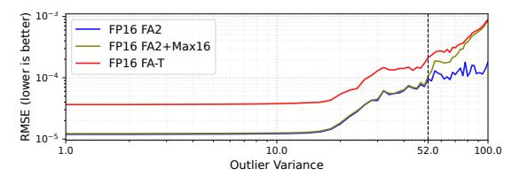

**Figure 11.** The RMSE for various ablation variants compared to the reference FP64 attention implementation on the A100 GPU.

Results in Figure 11 show that across all tested  $\tau^2$  values, the ILP FA-T achieves an RMSE less than 10-3 and is in the same order of magnitude as FA2, with no observed numerical failure. By comparing FA-T with FA2+Max16, we make two observations: (1) At  $\tau^2$  < 52, FA-T's RMSE is dominated by the numerical precision loss induced by the TF32 computation within the repurposed tensor MMA operations. (2) At  $\tau^2 \geq 52$ , the RMSE values of both FA2+Max16 and FA-T are dominated by the large numerical range of the attention scores incurred by large outlier values. Nevertheless, the results in the following evaluation confirm that our method does not affect real-world application accuracy. In addition, experimental results on H100 show that the TLP FlashAttention-T achieves RMSE values with a mean difference of  $1.61 \times 10^{-7}$  compared to the baseline FlashAttention-3 in FP8-FP32 attention configurations. This deviation is minimal since the surrogate maximum  $\hat{m}$  is not used in our TLP implementation, and the TF32 attention score rowsummation does not constitute a precision bottleneck for FP8-FP32 attention.

**Table 2.** Generative benchmark accuracy comparison

| Benchmark                           | Model                        | FlashAttention-2    | Ours                | Ratio  |
|-------------------------------------|------------------------------|---------------------|---------------------|--------|
| HumanEval [4] Pass@10 | Llama3.1 8B [8]   | $0.6889 \pm 0.0286$ | $0.6889 \pm 0.0289$ | 0.9999 |
|                                     | Ministral 8B [17] | $0.8321 \pm 0.0228$ | $0.8383 \pm 0.0217$ | 1.0073 |
|                                     | Qwen3 8B [36]     | $0.8166 \pm 0.0238$ | $0.8177 \pm 0.0239$ | 1.0013 |
| MMLU [10] Score       | LLama2 13B [30]   | $0.5207 \pm 0.0040$ | $0.5212 \pm 0.0040$ | 1.0009 |
|                                     | Mistral NeMo [18] | $0.6566 \pm 0.0037$ | $0.6566 \pm 0.0037$ | 1.0000 |
|                                     | Qwen3 14B [36]    | $0.7799 \pm 0.0033$ | $0.7804 \pm 0.0032$ | 1.0006 |

### 7.5 Generative Benchmark Accuracy Evaluation

To evaluate the real-world applicability of FlashAttention-T, we replace the PyTorch attention kernels with FlashAttention-T implementations and test them on two generative benchmarks using six LLMs listed in Table 2. Results show that FlashAttention-T achieves functional correctness metrics nearly identical to the baseline, with no numerical failures detected. This also suggests that large outlier attention values are rare in modern LLMs with the ubiquitous use [42] of normalization techniques such as RMSNorm [38].

#### 8 Related Work

**GPU tensor-vector parallelism.** There is increasing research interest in exploiting tensor-vector parallelism on modern GPUs. Plasticine [41] leverages intra-SM parallelism

to utilize the tensor and vector units concurrently, but is limited to multi-task scenarios. FlashAttention-3 [26] leverages TLP for GEMM-softmax overlapping within attention computation, but leaves a vector interval bottleneck that FlashAttention-T addresses. Mosaic [35] exploits ILP between the tensor and vector units for efficient GEMM.

Attention variants. Attention mechanisms beyond Multi-Head Attention (MHA) [31] include Multi-Query Attention (MQA), Grouped Query Attention (GQA), and Multi-Latent Attention (MLA), which optimize attention structures for efficiency [2, 7, 27]. Instead, FlashAttention-T focuses on tensorizing softmax computation, making it orthogonal and applicable to all variants. Preliminary results indicate that FlashAttention-T achieves similar speedups on GQA as observed in our MHA evaluation, demonstrating its versatility. Quantized attention. Recent works, such as SageAttention, advance low-precision attention by developing novel quantization techniques and utilizing FP8 GEMM in fused attention [39, 40]. In contrast, FlashAttention-T accelerates FP8-FP32 attention by tensorizing softmax computation, a complementary approach to the quantization efforts, aligning with the trend toward low-precision deep learning computation on modern GPUs.

#### 9 Conclusion

This paper introduces FlashAttention-T, a novel fused attention implementation that advances toward fully tensorized attention. FlashAttention-T enables tensorizing critical softmax primitives within the fused attention algorithm with novel operand value assignment methods to repurpose GPU tensor MMA instructions and a tensorized online softmax algorithm. Building upon these, we propose architecture-aware scheduling techniques to parallelize the softmax computation across the tensor and vector units, exploiting tensor-vector parallelism for optimal performance. Experimental results show that FlashAttention-T outperforms the state-of-the-art FlashAttention-2 and FlashAttention-3 with average attention throughput speedups of 1.05–1.17× across diverse attention configurations on Ampere and Hopper GPUs, while preserving numerical stability and accuracy.

### **Data-Availability Statement**

**Artifact availability.** The artifact for reproducing the main results in this paper is archived on Zenodo (version v1) [34].

### Acknowledgements

We would like to extend our gratitude to our reviewers for their feedback and suggestions. This work is partially supported by the NSF of China (Grants No.U22A2028, 62302483), Strategic Priority Research Program of the Chinese Academy of Sciences (Grants No.XDB0660300, XDB0660302), CAS Project for Young Scientists in Basic Research (YSBR-029) and Youth Innovation Promotion Association CAS.

