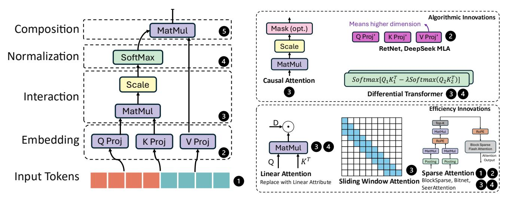
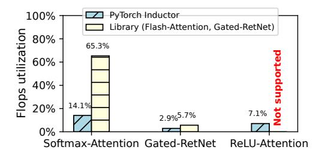
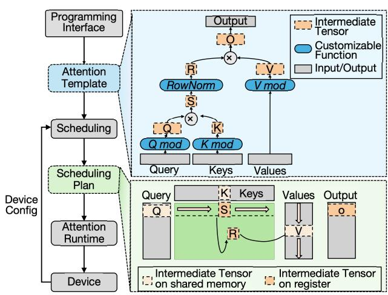
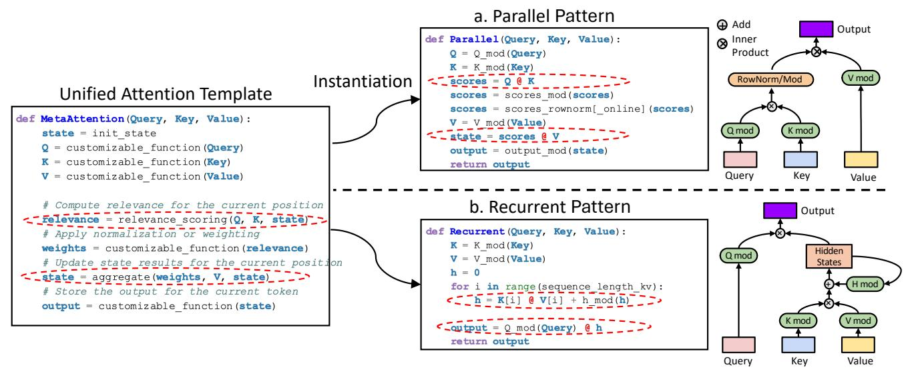
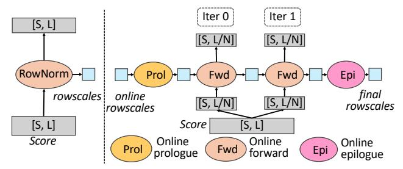

# 2 Attention in the Wild

#### 2.1 Attention Mechanisms

The attention mechanism enables LLMs to selectively focus on relevant parts of an input sequence by computing pairwise attention scores between tokens. As shown in the left side of Fig. [1,](#page-2-1) it takes Queries (Q), Keys (K), and Values (V)—projected from input tokens—and follows four stages:

• Embedding: Tokens are mapped to Q, K, V tensors via linear projections.

<span id="page-2-1"></span>

**Fig. 1.** The foundational attention mechanism and its variants: Attention mechanisms are divided into stages such as embedding, interaction, normalization, and composition(left). Attention variants make various changes to these stages(right). For example, Causal Attention modified the interaction stage to apply a mask, which makes the computation flow different. MetaAttention unifies the three stages—Interaction, Normalization, and Composition—and provides a unified framework for customizing attention mechanisms.

- **Interaction:** Pairwise scores are computed via dot products of Q and K.
- Normalization: Scores are normalized using functions like softmax.
- **Composition:** Outputs are generated by combining scores with V, integrating information from relevant tokens into a single output for each token.

The standard attention [26] can be formulated as:

$$Attention(Q, K, V) = softmax(\frac{QK^{T}}{\sqrt{d_{k}}})V$$
 (1)

where  $d_k$  is the last dimension of Q and K.

#### 2.2 Diversity in Attention Mechanisms

Building on the foundational design of attention mechanisms, researchers have introduced numerous variants aimed at improving performance, addressing task-specific requirements, and enhancing computational efficiency. As illustrated on the right side of Fig. 1, these innovations fall into two categories.

**Algorithmic Innovations** enhance accuracy or capabilities. Examples include DiffTransformer [34] (refined interaction/normalization), DeepSeek-MLA [11]/RetNet [23] (higher-dimensional embeddings), and Causal attention [26] (restricted interaction).

Efficiency Innovations reduce the computation/memory of attention. Compact representations (e.g., Mamba [10], RetNet-recurrent [23], Sliding Window Attention [4]) compress past KV states with modified interaction and normalization. Sparse methods (e.g., BigBird [36], SeerAttention [14]) introduce sparsity in the interaction stage to reduce computational and memory demands.

<span id="page-2-0"></span>
 Table 1. Attention proportion in Llama-3.2-3B inference

| Seqlen       | 2K  | 4K  | 6K  | 8K  |
|--------------|-----|-----|-----|-----|
| Llama-3.2-3B | 55% | 70% | 78% | 82% |

#### 2.3 Performance Disparity of Attention Variants

The attention mechanism dominates LLM computation. As shown in Table 1, it accounts for a major portion of Llama-3.2-3B inference.

Handcrafted attention library. High-performance attention mechanisms frequently rely on handcrafted kernel implementations optimized for specific patterns. For example, FlashAttention [21] provides a highly optimized kernel for standard softmax attention by fusing softmax computation and using memory-efficient pipelining. Flash-Linear-Attention [33], a library of hand-written Triton kernel, offers kernels for a variety of linear attention variants.

However, such libraries are inflexible—minor deviations in attention patterns (e.g., DeepSeek V2 and RetNet's atypical input dimensions) break their optimizations. Fig. 2 illustrates the performance disparity across different attention variants. For standard Softmax-Attention, the handcrafted library FlashAttention3 [21] significantly outperforms the native Py-Torch implementation, achieving over 60% FLOPS utilization. In contrast, for less common variants like Gated-RetNet and ReLU-Attention, these libraries exhibit poor performance or provide no support at all.

Additionally, due to limited development resources, these libraries predominantly target top-tier hardware, such as

<span id="page-3-0"></span>

**Fig. 2.** Performance disparity of attention variants.

NVIDIA's H100 and A100 GPUs, and are not easily transferable to alternative platforms like AMD GPUs.

Compiler optimization. To simplify kernel development, automated compilers, such as Torch Inductor [3], TVM [6], FlashTensor [38], Ansor-AF [17], Welder [22], Alcop [15], and TensorRT [1], have emerged. While these tools reduce development effort and adopt techniques like operator fusion to improve efficiency, they struggle to match the performance of handcrafted kernels for attention variants. This limitation arises from their inability to fully understand the semantics of attention computation, as they often treat it as a sequence of discrete and opaque operations. Advanced optimizations, such as transforming softmax into an online softmax [9], are beyond the scope of current compiler capabilities, resulting in suboptimal performance.

Approaches for productivity. To balance performance and development productivity, most-recent approaches (e.g., FlexAttention [12], FlashInfer [35]) predefines the majority of the computation and expose a limited set of parameters for user code injection. Yet, such approaches only offer limited flexibility and remain tied to specific computational patterns, which thus fail to generalize across attention variants such as linear attention or attention with non-conventional shapes.

MetaAttention overcomes these limitations by providing a unified framework for designing and optimizing attention. It provides a programming interface designed for attention that supports both parallel and recurrent attention. It incorporates a structured scheduling approach and targets multiple backends, including NVIDIA and AMD GPUs, ensuring high performance and scalability.

#### 3 Programming with MetaAttention

MetaAttention provides a unified framework for programming diverse attention mechanisms. We first propose a unified attention abstraction. Then we define our programming interface on this abstraction.

#### <span id="page-3-2"></span>3.1 Unifying Attention Abstraction

By examining the native implementation of attention as relevance computing between tokens, we identify two fundamental components common to all attention mechanisms:

• *Relevance Scoring:* This operation forms the core of attention mechanisms, capturing pairwise similarities or

<span id="page-3-1"></span>

**Fig. 3.** MetaAttention overview: The framework begins with attention abstraction and uses the Programming Interface to define Attention Templates. It then generates an optimized scheduling plan, which is forwarded to the attention runtime to produce executable code tailored for the target device.

interactions between input tokens. It is typically realized through inner products or other similarity measures to determine token relationships.

 Aggregation: Using the relevance scores, this operation consolidates contextual information into a representation for each token.

Building on these two fundamental operations, we propose a unified template that encapsulates the diverse spectrum of attention variants shown in Fig. 4. This template consists of relevance scoring and aggregation with customizable functions between them, striking a balance between broad applicability and development flexibility.

#### 3.2 MetaAttention Overview

Based on our attention abstraction, we introduce MetaAttention, a unified framework designed to streamline the design, optimization, and execution of diverse attention mechanisms across hardware platforms. As shown in Fig. 3, MetaAttention begins with attention templates defined by the Programming Interface. These templates retain the core abstractions of attention—relevance scoring and aggregation, outlined in §3.1, while providing customizable functions that allow users to design their own attention variants.

Once customized, MetaAttention generates a scheduling plan for the attention mechanisms based on the scheduling space defined by IntermediateTensor and DeviceConfig. Within this space, MetaAttention applies a two-layer scheduling policy to determine the optimal execution plan, balancing performance and resource utilization. The resulting scheduling plan is then passed to the attention runtime, which instantiates and executes optimized kernels across hardware backends, ensuring efficiency and scalability for diverse configurations.

The following sections delve into the components of this framework, demonstrating how MetaAttention integrates abstraction, optimization, and execution to unify and extend the implementation of attention mechanisms.

#### 3.3 Programming Interface

Defining an attention mechanism using our programming interface involves three components: input tensor shapes, the attention pattern, and customizable functions.

**Attention template and patterns.** As depicted in Fig. 4, the unified template takes Queries(Q), Keys(K), and Values(V) after projection as inputs, maintaining an intermediate variable state and retaining two fixed computations:  $relevance = relevance\_scoring(Q[i], K, state)$  for relevance scoring and state = aggregate(relevance, V, state) for aggregation.

Depending on whether the contextual information from K and V can be compressed into a fixed-size state, we identify two distinct computation patterns in attention: one that computes relevance in parallel over the global KV context, and another that recurrently updates a compressed state and computes relevance based on it.

Accordingly, this unified attention template is instantiated in two computational patterns—parallel and recurrent:

- Parallel Pattern: Attention mechanism requires global context information over the sequence. Thus, relevance scoring and aggregation are implemented as parallel matrix multiplications over the context sequence, with scores = matmul(Query, Key)(where "matmul" denotes matrix multiplication) representing the relevance scoring and state = matmul(scores, Value) representing the aggregation.
- Recurrent Pattern: Attention mechanism iteratively traverses the sequence, storing the context information in a fixed-sized hidden state. Thus, relevance scoring and aggregation are sequentially computed over the hidden state h, with output = matmul(Query, h) and h = h + matmul(Key[i], Value[i]) together capturing the relevance scoring and aggregation, iteratively maintaining compressed states.

By integrating the two instantiated patterns, this unified attention template empowers users to design high-level attention mechanisms while MetaAttention seamlessly handles low-level implementation and hardware-specific optimization, ensuring both efficiency and scalability.

Customizable functions and flexibility. While attention patterns define the structural aspects of attention mechanisms, numerical transformations of intermediate tensors—such as masking operations [26], custom normalization schemes [23], or task-specific adaptations—are equally crucial. These operations typically involve either elementwise transformations or global tensor adjustments.

<span id="page-4-0"></span>**Table 2.** Customizable functions and their functionalities

| Type    | Name                                     | Functionality                              |
|---------|------------------------------------------|--------------------------------------------|
| Mod     | Q_mod, K_mod,<br>V_mod, output_mod       | Scale the input and output tensors         |
| Mod     | scores_mod                               | Apply scale or masking on attention scores |
| RowNorm | scores_rownorm,<br>scores_rownorm_online | Apply normalization on attention scores    |
| Mod     | h_mod                                    | Scaling on compressed hidden state         |

To facilitate such transformations, MetaAttention introduces the *customizable function*, which is defined as a function applied to a tensor and composed of a set of arithmetic operations. These operations include element-wise computations and reductions over the last dimension of the tensor.

As shown in Table 2, customizable functions can be applied to designated intermediate tensors, enabling users to tailor attention variants to specific requirements. For instance, in the parallel pattern, customizable functions can transform attention scores (to compute weights) and states (to produce final outputs). In the recurrent pattern, these weight and state transformations are unified into a single customizable function operating on the hidden state h.

Based on whether they include a reduction operation, customizable functions are divided into two types: modification and row-wise normalization.

The modification function (Mod) supports fine-grained elementwise transformations, including scaling and masking. For example, scaling the query tensor by  $1/\sqrt{d}$  (where d is the last dimension of the query tensor) in standard softmax attention [26] can be achieved using this function. Masking operations, such as applying a sparse mask in sparse attention [14][36][28], can also be implemented by multiplying a bool tensor using this interface.

The row-wise normalization function (RowNorm) enables global adjustments across tensor rows, accommodating a combination of elementwise and row-reduce computations. Examples include applying a row-wise softmax [26] for normalizing attention scores or implementing other numerical stabilization techniques [23].

**Examples.** Our interfaces support a wide range of attention mechanisms shown in Table 3, demonstrating their flexibility and generality.

As shown in Fig. 5, taking attention in RetNet [23] as an example, we first select the Parallel pattern for global context information. Next, we define the input shapes of the queries, keys, and values. Then, we define the customizable functions inserted in the parallel template: score modification for scaling and row-wise score normalization.

**RowNorm online interface.** To enhance performance, the row-wise normalization function can be defined

<span id="page-5-0"></span>

**Fig. 4.** Left: MetaAttention's unified attention template. By instantiating this template, two distinct patterns are produced (Parallel Pattern and Recurrent Pattern). The dashed circle box highlights the operations corresponding to the core components of the attention mechanism in the unified attention template: relevance\_scoring and aggregate. The customizable\_function is user-defined. The customizable\_function encompasses both modification function and row-wise normalization function.

```
pattern: Parallel\ninputs: {Query: Tensor[batch, head, seq_len, 256];
   Key: Tensor[batch, head, seq_len_kv, 256];
   Value: Tensor[batch, head, seq_len_kv, 512]}
customizable_function:
   def scores_Mod(scores):
        return scores * mask
   def scores_RowNorm(scores):
        t = scores.reduceAbssum()
        t = max(t, 1)
        return scores / t
```

**Fig. 5.** Example attention in RetNet [23]. It uses parallel pattern with the customized *Mod* function on scores and RowNorm on scores.

<span id="page-5-2"></span>

**Fig. 6.** Illustration of the RowNorm online interface. The left panel shows the standard row-wise normalization function, while the right panel demonstrates how MetaAttention enables users to implement the same functionality as an online function using the RowNorm online interface.

as an online function, where computations are processed sequentially in blocks along the rows. The term "online" refers to performing row-wise normalization entirely within

```
class scores_RowNorm_Online:
    def online_prologue():
        row_sum_wo_clamp = 0
        row_sum = 0
        return row_sum_wo_clamp, row_sum
    def online_forward(scores, row_sum_wo_clamp_prev,
```

**Fig. 7.** Example of scores\_rownorm in RetNet attention implemented by RowNorm online interface.

on-chip memory, avoiding intermediate writes to global memory [18].

MetaAttention proposes the RowNorm online interface to support general online row-wise normalization, such as online softmax used in FlashAttention [9]. As shown in Fig. 6, this interface includes three main components:

- online\_prologue, which initializes the state variables before entering the online loop.
- online\_forward, which defines computations within each block of rows, updating state variables like row maxima or sums and the scale over the previous block.
- online\_epilogue, which finalizes the computation after the loop.

```
class IntermediateTensor{
    TileShape tile;
    MemoryLocation mem;
    int pipelineStage;
};
```

Fig. 8. IntermediateTensor component

```
class DeviceConfig{
    BaseTileShape basetile;
    List<MemoryCapacity> memoryInfo;
};
```

Fig. 9. DeviceConfig component

Users can leverage this online interface to define online functions like online softmax, broadening the scope of attention mechanisms supported by MetaAttention. Fig. [7](#page-5-3) illustrates the retnet attention RowNorm implementation example employing the online interface.

