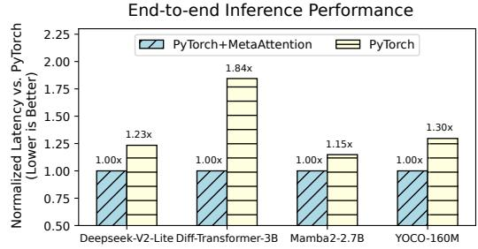

# 6.1 Experimental Setup

Hardware platforms. We evaluate MetaAttention on NVIDIA H100 SXM5 (CUDA 12.4, Triton 2.3.1) and AMD Instinct MI250 (ROCm 6.2.4, Triton 3.1.0) GPUs.

Attention workload. We evaluate ten attention mechanisms under realistic configurations: batch sizes of 1 and 8,

Table 3. The set of attention mechanisms in our microbenchmark. Operators with configuration "seqlen=1" mean the query sequence length is 1, which is often used in LLM inference.

| Operator                       | Configuration                                         | Model                                             |
|--------------------------------|-------------------------------------------------------|---------------------------------------------------|
| Softmax Attention              | head=32, dimqk=128, dimv=128                          | LLAMA-3.1-8B [13]                                 |
| Softmax Attention              | head=16, dimqk=192, dimv=128                          | DeepSeek-V2-lite [11]                             |
| Softmax Attention              | head=12, dimqk=128, dimv=256                          | DiffTransformer 3B [34]                        |
| Softmax Attention              | seqlen=1, head=16, dimqk=192, dimv=128             | DeepSeek-V2-lite [11]                             |
| Sigmoid Attention              | head=32, dimqk=128, dimv=128                          | LLAMA-3.1-8B with Attention Sigmoid [20] |
| Relu Attention                 | head=6, dimqk=64, dimv=64                             | ViT-s/16 with Relu At tention [31]             |
| Retention Parallel             | head=32, dimqk=256, dimv=512                          | RetNet-6.7B [23]                                  |
| Mamba2 SSM                     | headv=80, dimqk=128, dimv=64                          | Mamba2-2.7B [10]                                  |
| Retention Recurrent         | head=32, dimqk=256, dimv=512                          | RetNet-6.7B [23]                                  |
| Gated Retention                | head=40, dimqk=256, dimv=256                          | YOCO-13B [24]                                     |
| Gated Retention                | head=16, dimqk=64, dimv=64                            | RFA-Big [19]                                      |
| Multi-head Latent Attention | seqlen=1, head=128, head_kv=1, dimqk=576, dimv=512 | DeepSeek-V3 [16]                                  |
| Sparse GQA                     | seqlen=1, head=32, head_kv=8, dimqk=128, dimv=128  | LLAMA-3.1-8B with SeerAttention [14]           |

and sequence lengths of 2k, 4k, and 8k. Details are listed in Table [3.](#page-8-0)

Baselines. We compare MetaAttention with manually implemented attention libraries, such as FlashAttention2 v2.7.4 [\[8\]](#page-11-6) and FlashAttention3 [\[21\]](#page-12-4) for Softmax attention, FlashSigmoid [\[20\]](#page-11-2) for Sigmoid attention, FLashMLA [\[16\]](#page-11-5) with blockSize=64 for Multi-head Latent Attention, Mamba2 chunk kernel [\[10\]](#page-11-1) for Mamba2 SSM and Flash-Linear-Attention Triton library v0.2.0 [\[33\]](#page-12-8) for gated retention. We also compare with state-of-the-art template-based approaches, such as FlexAttention [\[12\]](#page-11-13) and FlashInfer [\[35\]](#page-12-11) for parallel attention. We use PyTorch [\[2\]](#page-11-18) as a default baseline for attention that does not have a manually-implemented library, such as Retention Parallel [\[23\]](#page-12-3) and ReLUAttention [\[31\]](#page-12-15).

#### 6.2 Attention Performance on NVIDIA H100

Fig. [11](#page-9-0) shows normalized latency relative to MetaAttention across various attention configurations.

Softmax attention. Fig. [11](#page-9-0) (a)(b)(d) shows the performance of MetaAttention and other baselines on Softmax attention from Deepseek-V2-Lite, LLAMA-3.1-8B, and Diff-Transformer-3B. Compared with highly optimized libraries FlashAttention-3, MetaAttention achieves an average speedup of 1.61× on Diff-Transformers-3B forward and achieves comparable performance on LLAMA-3.1-8B and DeepSeek-V2-Lite forward and backward. This improvement stems from MetaAttention's flexible scheduling and attention runtime to support different headdim\_qk and headdim\_v,

**Fig. 11.** Performance of attention operators on H100 GPUs. We evaluate across different batch sizes (BS), sequence lengths (S), and key-value cache sequence lengths (KV). "FWD" denotes forward pass, while "BWD" denotes backward pass. Empty columns indicate that the baseline is either unsupported or encountered errors.

instead of padding them to the same dimension. MetaAttention also outperforms other programming-model-based approaches such as FlexAttention and FlashInfer, due to our scheduling over different shapes.

**Customized parallel attention.** Fig. 11 (c)(e)(f) shows the performance of MetaAttention and other baselines on customized parallel attention. Current expert-optimized libraries lack support for them. For example, no fused attention kernel is implemented for ReLU attention, and the fused Sigmoid attention kernel is not optimized for the latest hardware like NVIDIA H100. MetaAttention can obtain significant speedup on these operations, achieving  $3.6\times(1.1\times\sim10.4\times)$  over FlashSigmoid, PyTorch ReLU attention, and PyTorch

retention parallel. In addition, compared with programming-model-based approaches, MetaAttention can support all three customized attention mechanisms, which demonstrates MetaAttention's expressive ability and scalability.

**Recurrent pattern attention.** Fig. 11 (g)(h)(i)(j) represents the recurrent attention operation of Mamba2, RetNet-6.7B, YOCO-13B and RFA-Big. MetaAttention achieves average speedups of 1.66× and 1.78× for forward and backward respectively compared with Flash-Linear-Attention [33], which is an expert-optimized linear attention library.

**Multi-head latent attention.** Fig. 11 (k) shows the performance of MLA. MetaAttention achieves performance comparable to the manually optimized FlashMLA library and a  $4.6\times$  speedup over Triton.

**Table 4.** Compilation time on NVIDIA H100 GPU and AMD MI250 GPU with batch=1 and seqlen=2048.

| Operator          | Configuration                   | Device | Scheduling Time |
|-------------------|---------------------------------|--------|-----------------|
| Softmax Attention | head=32, dimqk=128, dimv=128 | H100   | 46 seconds      |
| Mamba2 SSM        | headv=80, dimqk=128, dimv=64 | H100   | 82 seconds      |
| Softmax Attention | head=32, dimqk=128, dimv=128 | MI250  | 64 seconds      |
| Mamba2 SSM        | headv=80, dimqk=128, dimv=64 | MI250  | 89 seconds      |

Table 5. Lines of code of attention mechanism.

| Operator                    | MetaAttention | Handcrafted Library       |
|-----------------------------|---------------|---------------------------|
| Softmax Attention           | 87 LoC        | 2.7k lines of CUDA [21]   |
| Sigmoid Attention           | 54 LoC        | 1.9k lines of CUDA [20]   |
| Mamba2 SSM                  | 27 LoC        | 3k lines of Triton [10]   |
| Retention Recurrent         | 25 LoC        | 0.4k lines of Triton [33] |
| Gated Retention             | 22 LoC        | 0.4k lines of Triton [33] |
| Multi-head Latent Attention | 90 LoC        | 1.7k lines of CUDA [16]   |

Fig. 12. End-to-end inference performance on H100.

**Sparse group query attention.** Fig. 11 (l) represents the sparse group query attention of SeerAttention [14]. We compare MetaAttention with the manually implemented Triton kernel in SeerAttention. The result shows that MetaAttention achieves an average speedup of 1.71×.

#### 6.3 Evaluation on the Compilation Time

As shown in Table 4, benefiting from our efficient scheduling policy, the compilation time of our framework is limited to the minute level, which is significantly shorter than that of traditional deep learning compilers such as Ansor [37].

#### 6.4 Evaluation on Development Effort

As shown in Table 5, users can efficiently implement various attention mechanisms using MetaAttention with significantly reduced development effort compared to handcrafted libraries.

#### 6.5 End-to-end Inference on NVIDIA H100

We evaluate the inference latency of large language models using one NVIDIA H100 GPU. Models are implemented

#### **End-to-end Training Performance**

**Fig. 13.** End-to-end training performance on H100.

in Transformers [30] with their attention operators replaced by MetaAttention. We test two parallel-pattern models (Deepseek-V2-Lite and Diff-Transformer-3B) and two recurrent-pattern models (Mamba2-2.7B and YOCO-160M) with 16k input length.

As shown in Fig. 12, MetaAttention achieves an average FP16 speedup of 1.4 $\times$ , attributed to more efficient attention computation. For instance, in Deepseek-V2-Lite, where attention consumes 85% of inference time, our optimized operator reaches 2.2 $\times$  faster speed, leading to an end-to-end improvement of 1.85 $\times$ .

#### 6.6 End-to-end Training on NVIDIA H100

We evaluate MetaAttention in end-to-end training with a sequence length of 8k using TRL [27] on Diff-Transformer-3B, YOCO-160M, and ViT-S/16 with ReLU attention.

Fig. 13 shows an average training speedup of 1.4×. Notably, ViT-S/16 with ReLU attention gains a 1.7× speedup due to the lack of optimized libraries for this attention variant.

#### 6.7 Evaluation on AMD ROCm GPUs

We benchmark a subset of operators on the AMD MI250 GPU, including Softmax Attention, ReLU Attention, Mamba2, and RetNet Recurrent.

As shown in Fig. 14, MetaAttention achieves average speedups of 3.3× (forward) and 2.0× (backward) over baselines, demonstrating its capability for multi-backend support.

#### 7 Conclusion

This paper presented MetaAttention, which addressed the programmability and performance of attention variants by abstracting attention into two core operations, i.e., relevance scoring and aggregation, and introducing customizable templates that combine flexibility with efficiency. With a crossbackend scheduling framework, MetaAttention automated kernel optimizations, achieving up to 10.4× speedups for unsupported configurations.

**Fig. 14.** Attention operator performance on MI250 GPUs. We evaluate across different BS(batch size), S(sequence length) and KV(kv cache sequence length). FWD means forward, BWD means backward.

